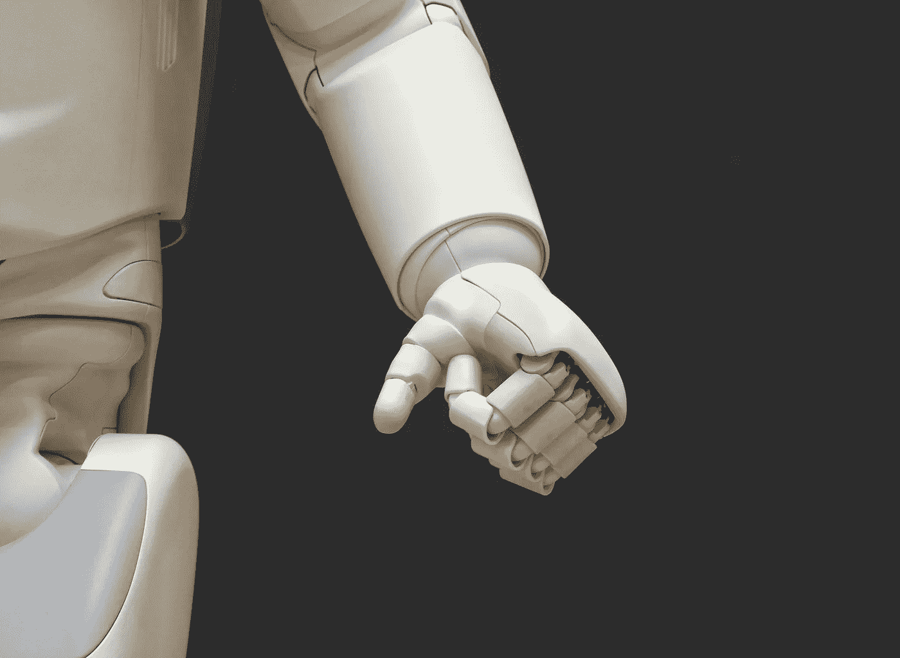

# 技术是有偏见的，因为人类是。

> 原文：<https://medium.com/analytics-vidhya/tech-is-biased-because-humans-are-dc811114af94?source=collection_archive---------9----------------------->

## 坏消息:偏见减缓了社会创新。好消息是:我们可以修复它。

照片由 Michael Dziedzic 在 Unsplash 上拍摄

P **ART 1 —** 不久前，在女性历史月期间，在 Aticco Coworking 主办的“*增强职场女性权能”*活动之际，我饶有兴趣地听取了各种关于女性在科技领域的地位的演讲。

all women 的首席执行官兼联合创始人 Laura Ferná ndez 做了一个引人入胜的演讲，题为“T10 科技女性运动是社会变革的加速器 T11”，我有机会总结了一些想法，并与她就此话题进行了交谈。在这篇由两部分组成的文章中，你会发现一些对这次演讲的印象，以及当前的技术状态(*第一部分*)和即将发布的对劳拉的特别采访(*第二部分*)。敬请期待！

# 反思技术多样性的现状

戴安娜·沃克尔在 1984 年写的《史蒂夫·乔布斯和麦金塔电脑》

让我们做一个小练习。闭上眼睛，想象一个在科技领域工作的人。你想到了什么？很有可能是你的大脑让你想到了一个白人中年男人。我说的对吗？

AllWomen 的首席执行官劳拉费尔南德斯认为，这种行为有一个简单的解释:我们生活的世界完全是有偏见的。

> 偏见是支持或反对一个想法或事物的不相称的力量，通常是以一种封闭的、偏见的或不公平的方式。—维基百科

我们生活的现实充满了刻板印象，以至于我们甚至没有意识到我们已经被它们完全包围了——在某些情况下，是无意的。

# 性别偏见始于游戏时间

Raj Rana 在 Unsplash 上拍摄的照片

刻板印象是人们经常错误地认为的“标准”。这种消极行为的一个影响是，通过这样做，我们无意中强化了它们，助长了现状。一个例子？**有些工作是“*男*”，有些是“*女*”。**

这助长了一种心态，即职业选择应该以你的性别为条件。这些限制和标准化的倾向早已被社会接受，不管它们有多肤浅——如果你认为自己是女性，这对你来说可能不是什么新闻。

男性职业和所谓的性别化工作不仅对当代人是危险的，对未来的人也是危险的。

儿童可能从很小的时候就错误地认识到，金融专业人员是男性，而保健专业人员是女性。

工程师是男性，而教师是女性。警察是男性，而人力资源专业人员是女性，等等。此外，根据[美国的一项研究](https://science.sciencemag.org/content/355/6323/389)，到 6 岁时，女孩认为男孩比同性别的孩子聪明。

这项研究认为，这种定型观念在很小的时候就被吸收了，最终阻碍了成年女性进入需要特殊智力的职业。因此，女性在物理、科学或哲学等领域的代表性不足。

如果我们考虑 STEM 领域，那么很少有知名的女性榜样。这样的结果就是，女生成长过程中没有一个灵感可以跟随，无疑很难变成你没见过的样子。

让我们谈谈数字:

*   不到 25%的全球 STEM 毕业生是女性。
*   女性只占所有技术工作的 1/4。
*   女性拥有的科技初创企业占 5%。
*   硅谷公司中只有 11%的高管职位由女性担任。
*   在科技行业工作中，女性的离职率是男性的两倍多，分别为 41%和 17%。科技行业 56%的女性会在职业生涯中期离开她们的雇主。
*   男性薪酬中位数比女性薪酬中位数高出 61%。

统计数据令人震惊，清楚地表明我们还没有达到这一步。

# 人工智能反映了我们生活的不公平世界

Unsplash 机器人中的人工智能

在技术领域，焦点通常是创造能够解决问题并满足最终消费者需求的产品。然而，没有合适的环境，没有多样性，没有包容性，就很难创造出大规模有效的解决方案。结果，**产品无法满足用户的需求**，我们强化了一个没有包容性替代方案的不适当环境。

甚至像谷歌这样的科技巨头也面临一些批评。有几个众所周知的带有偏见和歧视性的谷歌图片搜索结果的例子:当搜索一个医生的照片时，几乎所有的白人男性都出现了。用“ *CEO* ”这个词，结果是一样的——大多是男性和白人——而如果我们键入“*秘书*”，算法主要返回白人女性的图像。这反映了以前说过的话:男人是领导者、企业家。女人是助手，照顾者。这只是反映我们时代的社会问题的一面镜子。

让我们尝试一个不同的查询— [好莱坞演员](https://www.wired.co.uk/article/google-image-search-sexist-suggestions)。事情并没有变好，相反，谷歌的算法变得更加偏颇。如果我们搜索一个男演员，算法将主要关注他的职业生涯。如果我们搜索一名女演员，谷歌的算法将关注她的身体——从而强化性别歧视的陈词滥调。

谷歌声称自己不偏不倚。但是如果没有人监督它的算法是如何工作的，**这种公正性是很难把握的**。

# 种族主义被编码到科技产品中

照片由 Rolande PG 在 Unsplash 上拍摄

当我们谈论多样性时，我们不仅仅指性别问题。对非白人和 BIPOC 社区的种族歧视和偏见在技术领域非常普遍。

一个简单而可悲的众所周知的例子，也是劳拉在她的演讲中提到的，就是自动[皂液机](https://www.mic.com/articles/124899/the-reason-this-racist-soap-dispenser-doesn-t-work-on-black-skin)无法检测到黑人顾客的手。乍一看，这似乎很滑稽，但它清楚地证明了许多科技公司存在的一个重大而普遍的问题:**缺乏多样性**。

如果一家公司的大多数人是白人，那么这家公司开发的产品很可能会呈现出某种固有的歧视。工作环境呈现的多样性越少，设计缺陷就越有可能对少数族裔不利。

另一个常见的例子是[面部识别](https://www.theatlantic.com/technology/archive/2016/04/the-underlying-bias-of-facial-recognition-systems/476991/) [系统](https://www.theatlantic.com/technology/archive/2016/04/the-underlying-bias-of-facial-recognition-systems/476991/)，在美国，这些系统比白人更有可能错误识别或无法识别非裔美国人。

这表明创建算法的条件会强烈影响其结果的准确性。

# 如果是中性的，那就不是技术

卢卡·布拉沃在 Unsplash 上的照片

总而言之，值得记住的是，技术本身既不是性别歧视，也不是种族歧视。技术只是一种工具，因此它没有自己的意志。

然而，不可能认为技术是中性的东西。任何技术都是由个人设计的:生活在社会中的人类，以及他们所有的文化框架、现实和观点。和偏见。

技术发展离不开背景——由个人和他们的*环境构成——它产生于其中。因此，当创造者团队中没有多样化的声音和观点时，技术就变得具有歧视性。*

解决办法？我们需要为我们的偏见负责，并采取相应的行动。

# 教育有助于创造更美好的未来

Christina Morillo 在 Unsplash 上拍摄的照片

在她演讲的最后，劳拉告诉我们 [AllWomen](https://www.allwomen.tech/) academy 背后的使命:改善当前的技术状态，并最终为所有认为自己是女性并在技术相关领域工作(或渴望这样做)的人提供一个更好、更平衡和公平的未来。

AllWomen 的使命是改变现实，因为事情可以变得不同，变得更好，科技的未来也可以是女性的。引用劳拉的话来说，这个学院是一个学生可以实现和发展他们潜力的地方，总是具有全球性和包容性的观点。

社会变革包括社会秩序的改变。令人鼓舞的是，AllWomen 的愿景是创建一个能够设计包容性技术的社区——并且**解决社会问题，而不是加剧这些问题**。

在演讲结束时，合上笔记本电脑几秒钟后，我被沮丧、愤怒和希望的复杂感觉淹没了。不过，有一件事是肯定的。

如果我闭上眼睛，想象一个在科技领域工作的人，那个人是一个强大、聪明、有才华的女人。