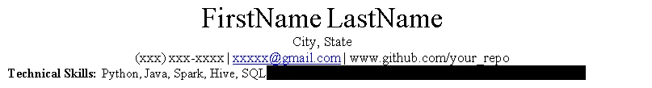
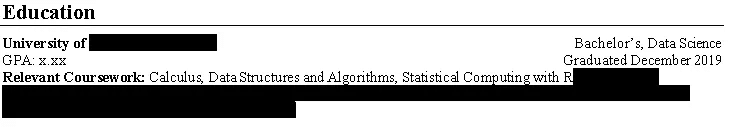
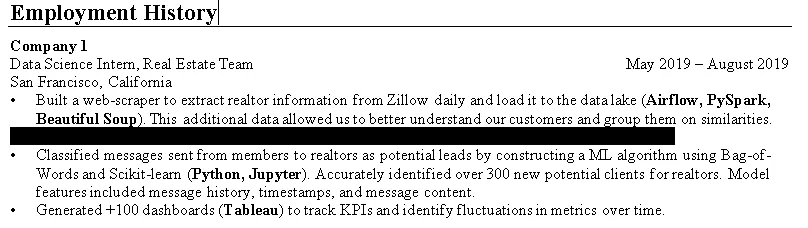
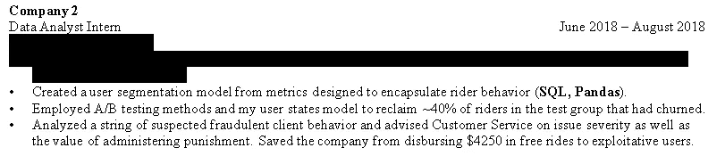
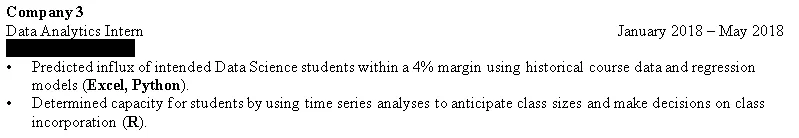
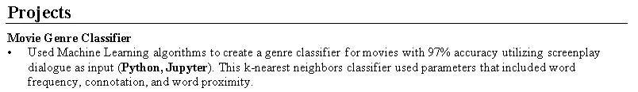
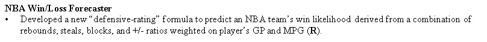
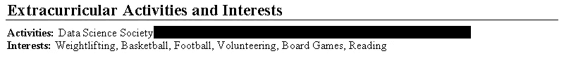
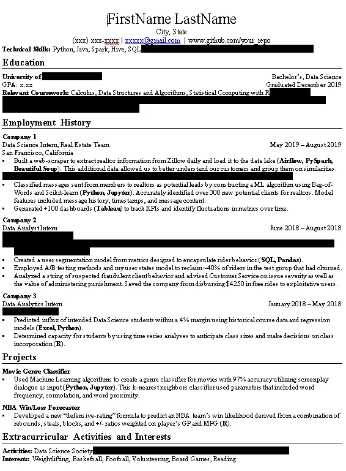

# 技术简历模板

> 原文：<https://medium.com/analytics-vidhya/tech-resume-template-e3b70eaa67d7?source=collection_archive---------23----------------------->

## 帮助你建立第一份技术简历的模板(实习/新毕业生)

在 [Unsplash](https://unsplash.com?utm_source=medium&utm_medium=referral) 上由 [Helloquence](https://unsplash.com/@helloquence?utm_source=medium&utm_medium=referral) 拍摄的照片

## 给我发邮件到 dsinterviewprep@gmail.com[的](https://mail.google.com/a/?view=cm&fs=1&to=dsinterviewprep@gmail.com)，安排模拟面试、简历回顾和职业指导！

# 向前

你好！

这个指南将帮助你用我的一份旧简历作为模板，建立你的第一份可靠的简历。该模板旨在帮助那些在数据科学、计算机科学、工程等领域寻找工作的人。

我会把我简历的每一个部分一点一点的分解，然后在指南的末尾附上一个链接，你可以在那里下载模板。

这种简历结构让我获得了谷歌、脸书、贝莱德、高盛、微软等公司的面试机会。

# 关于我

我刚刚从加州大学伯克利分校毕业，获得了数据科学学士学位。我现在是脸书大学的数据科学家。我只能通过导师和其他人的指导才能达到这一步。我想分享我的采访过程和笔记，以帮助学生，主要是在技术领域代表性不足的社区中促进数据科学。在我的空闲时间，我打篮球，因为球就是生命。

# 姓名和联系信息

简历的第一部分！

简短而甜蜜，只包含相关信息。招聘人员需要一种联系你的方式，他们想知道你在哪里，他们可能想看看你的工作样本。包含一个到你的 GitHub 库的链接，并用你已经完成的工作更新它，这是一个很好的实践(学校作业在这里也很好！如果你做了一个项目或一门课的作业，上传它们！).

这里要补充的重要一点是你的技术技能，招聘人员只在每份简历上花很少的时间(因为他们会收到数百份简历)，通过在一开始就给出他们想要的东西并展示你拥有成功所需的技能来脱颖而出。

# 教育

简历的第二部分

作为一个正在寻找实习机会或新职位的人，你的学历应该是招聘人员首先考虑的事情之一。你应该确保包括你的**学校名称**、 **GPA** (不需要精确)、**当你毕业的时候(d)** 、**你的学位**，以及你参加过的与角色相关的**课程。**

# 工作经历

简历的第三部分

这是你简历的重要部分，在这里你应该突出你的经历，从最近的开始。你想要包括**公司**、**角色**、**地点**，以及你在那里工作的**日期**。

当谈到分享你所做的细节时，你要在表达你的观点和描述性以及过于冗长之间找到平衡点。

一个好的结构是“**行动-反应**”陈述。你做了某事，采取了**行动**，结果你以某种方式影响了公司(**反应**)。你永远不应该让面试官想到“那又怎样”，所以确保你的要点清晰简洁。不要东拉西扯。

工作经验的另一个例子

这是另一个可能进入工作经验的例子，注意我是如何尽可能尝试和**量化我的成就的**，这不仅增加了你所说的可信度，也更容易让外面的人明白你做出了具体的改变，而不是模棱两可的改变。

工作经历的最后一个例子

这里是工作经验的最后一个例子。请注意我是如何在一些语句中添加我使用的技术(Excel、Python 等)的。这取决于你，根据我的经验，面试官喜欢这样，因为这样可以让他们很快看到我在工作中使用的各种工具。

最后一点，如果你没有任何技术经验，包括领导经验！没有人在出生时或开始职业生涯时就有丰富的技术经验，但是无论你在哪个领域，你在工作中获得的一些技能都是重要和相关的。如果你是一家餐馆的收银员，你可以这样说“…服务了 3000 多名顾客，并与顾客保持了良好的关系。”如果你真的不想包括非技术经验，考虑把你的项目放在你的工作经历之前。

# 项目

简历的第四部分

项目是传递技术能力和知识的另一种方式。如果你没有丰富的工作经验，在简历中写上你做过的项目是展示你对这个领域感兴趣、你有令人向往的技能、你喜欢在空闲时间解决问题和挑战自我的好方法。

另一个项目的例子

这里的结构应该和你的工作经历差不多:**行动-反应**。

# 课外活动和兴趣

你简历的结尾

是否包含这一部分再次取决于你，有些人认为这是多余的，面试官不在乎，我个人不同意。我觉得这给了你一个机会突出你背景中人性的一面，展示你在工作之外感兴趣的东西。有几次，它给了我一个与面试官更深层次交流的机会，不仅仅是作为一个候选人，而是作为一个拥有相似价值观和兴趣的人。

如果你决定把它包括在内，那就保持简洁明了，把它放在最后。

# 全套服务

这里是所有的东西放在一起！

一些最后注意事项:

*   利用你的空白，让你的简历看起来充实
*   保持字体和大小的一致性
*   不要添加不必要的图形或颜色，你的简历不应该让你分心。此外，大多数公司使用软件根据关键词或短语自动筛选简历，添加额外的图片只会分散简历的内容。
*   写简历的时候看看职位描述，你也许能收集到他们想要的东西

祝你好运！

# 链接到模板:

 [## 技术-资源-模板. docx

### 编辑描述

drive.google.com](https://drive.google.com/file/d/1HEiFoisGPO0jimMBXJhkjW4y8SXuH3Sl/view?usp=sharing) 

# 特别感谢

特别感谢我的朋友 Jacob A .和 Soumithri B .，没有他们的帮助，我的简历仍然是垃圾。