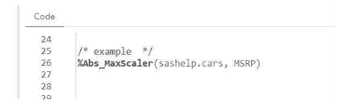
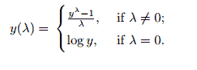

# 使用自定义 SAS 宏进行功能缩放和转换的技术 Suraj Saini

> 原文：<https://medium.com/analytics-vidhya/techniques-for-feature-scaling-and-transformations-with-custom-sas-macros-by-suraj-saini-9b8814f7b730?source=collection_archive---------19----------------------->

第二部分

在之前的[博客文章](https://seleritysas.com/blog/2020/12/18/techniques-of-feature-scaling-with-sas-custom-macro/)中，我们讨论了特性扩展技术，并使用 SAS 宏在基本 SAS 中实现了这一技术。然而，在这篇博文中，我们将重点关注使用 SAS 宏的特性缩放和转换技术。在这里，我将解释它们是什么以及它们最适用的场景。

## 5.绝对最大缩放器

绝对最大缩放器(Abs_MaxScaler)是一种特征缩放技术，其中数据点除以最大数据值。然后，它将在-1 和 1 之间重新调整值。

虽然 Abs_MaxScaler 有其优点，但也有一些缺点。Abs_MaxScaler 最大的缺点就是数据值会受到离群值的影响。数学公式在这里:

*5.1 如何在 SAS 中使用 Abs_MaxScaler？*

*5.2 Abs_MaxScaler SAS 宏定义*

*Abs _ max scaler SAS 宏在幕后做什么？*

Abs_MaxScaler 获取您想要缩放的变量，并用缩放后的值创建一个新变量“AMVariableName”。它还创建了一个单变量报告，您可以在其中看到实际变量和新缩放变量的直方图。

# 第 2 部分—特征转换

我将讨论遵循正态分布(也称为高斯分布)的特征变换技术。随着讨论的进行，我还将使用一些高级 SAS 宏编程来实现基础 SAS 中的特性转换。

它是在统计和数学函数的帮助下，将数据从一种表示形式转换为另一种表示形式，同时保留数据中的信息的过程。将数据分布转换成正态分布有许多不同的转换，但我将主要使用五种基本转换:对数、倒数、平方根、指数和 Box-Cox。

## 为什么我们需要功能转换？

**什么是特征转换？**

特征变换很重要，因为它使机器学习和统计模型更容易理解你的数据并做出准确的预测。此外，用户需要更少的学习和培训时间来获得所需的结果；然而，这并不适用于每个 ML、DL 和统计算法。
存在假设数据正态分布的统计算法和模型。例如，在回归分析过程中，特征变换必须遵循正态分布，否则会得出错误的结果。

## 特征变换的类型

1.**对数转换:**当数据有偏差或存在影响分布的异常值时，这种转换是最佳解决方案。它将使用对数函数转换数据。
2。**倒易变换:**与其他变换相比，这种变换不是很有效，因为它对分布的形状几乎没有影响。它将数据转换为其值的倒数。比如 3 会转化成 1/3。它仅用于非零数据值。
3。**指数变换:**用大多数编程语言中给出的 exp()函数将数据转换成“e 的 x 次方”
4。**平方根变换:**顾名思义，它将数据值变换为其值的平方根，这意味着我们可以将其应用于零值数据。应当注意，平方根变换不如对数变换有效。这是因为与**对数转换**相比，它对分布的影响较小。
5。 **Box-Cox 转换:**对于 Box-Cox 转换，数据值必须为正。它适用于具有均匀性质的数据，是统计领域中最常用的转换。在变换公式中，如果λ为零，则取对数，λ的值在-5 到 5 之间变化。

## 在 SAS 中应用特征转换技术

*1。SAS 中的 Box-Cox 变换*

可以用 **%BoxCox (dataset，variable)** 调用这个宏。
数据集=你的数据集名，带有库实例 **sashelp.cars** 。
变量=变量的名称

*% BoxCox()在幕后做什么？*

%BoxCox 仅在数据值为正值时接受变量，否则，它会给出一条错误消息——“您的数据有负值，因此您不能应用 BoxCox 变换。”如果数据为非负，它将创建一个新的临时数据集，包含“您的变量的名称”和转换变量“您的变量的名称”。它还将生成转换变量的单变量报告，您可以在其中检查正态分布。

*SAS %BoxCox()宏定义代码*

## 2.对数、平方根、倒数和指数转换一体化 SAS 宏

%Transform () SAS 宏在幕后做什么？

可以用 **%Transform (dataset，variable，type)** 调用这个宏。
数据集=带有库的数据集名称，例如 sashelp.cars
变量=变量名称
类型=您只能选择一种转换类型(**对数、平方根、倒数和指数**)

%Transform 宏将接受一个变量，并根据您在“type”参数中的选择将其转换为一个转换。然后，它生成一个单变量报告，解释转换后变量的分布。

*SAS %Transform()宏定义代码*

/* SAS 宏定义*/

GitHub 上的代码可从这里获得:[https://GitHub . com/Suraj-617/Blogs/blob/master/Techniques % 20 of % 20 feature % 20 scaling % 20 with % 20 SAS % 20 custom % 20 macro-b . SAS](https://github.com/Suraj-617/Blogs/blob/master/Techniques%20of%20Feature%20Scaling%20with%20SAS%20Custom%20Macro-B.sas)

*原载于 2021 年 1 月 14 日 https://seleritysas.com***。**