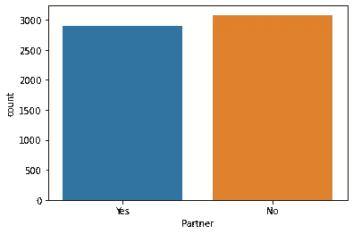
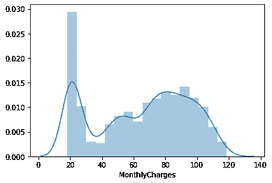
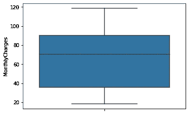

# 电信客户流失率

> 原文：<https://medium.com/analytics-vidhya/telecom-customer-churn-rate-63c22e7de962?source=collection_archive---------6----------------------->

# 介绍

对于每一个企业来说，客户就像灵魂。没有顾客，企业无法生存。这个数据集取自 [Kaggle。](https://www.kaggle.com/radmirzosimov/telecom-users-dataset)对于每一个公司来说，留住他们的客户对于留住他们的客户是非常必要的。留住客户比给公司带来新客户在财务上更有效率。唯一的诀窍是知道当时留住客户的因素是什么，并尝试对其他人也这样做。由 **22 列**和 **5986 行**组成。

所以，让我们从导入库开始这篇博客。

# 导入库

1 Pandas 用于数据读取、处理
2 Seaborn 和 Matplotlib 用于可视化

# 读取数据

从 CSV 文件中读取数据。我们的 CSV 文件包含 1 个没有命名的列，这是没有用的。因此，在导入数据集并显示数据集的前 5 行后立即删除它。


我们电信数据集的前 5 行

描述数据集以了解其数值数据的静态值

```
data.describe()
```


# 电子设计自动化(Electronic Design Automation)

**客户 Id**

客户 Id 是每个客户的唯一标识符。这有助于我们跟踪客户的活动。让我们看看它是如何影响我们的目标变量的。

```
array(['7010-BRBUU', '9688-YGXVR', '9286-DOJGF', ..., '8044-BGWPI',
       '7450-NWRTR', '4795-UXVCJ'], dtype=object)
```

让我们看看独立客户的数量。

```
data[‘customerID’].nunique()
--> 5986
```

数据集中唯一客户的数量和总行数是 5986，这意味着每条记录都是唯一的。所以，它不会对目标变量有任何影响。

**性别**

这个属性告诉我们哪个客户是男的还是女的。在这个属性的帮助下，我们可以看到性别是否影响我们的目标变量。

```
array(['Male', 'Female'], dtype=object)
```

```
Values in each gender 
 Male      3050
Female    2936
Name: gender, dtype: int64
```


性别计数


性别明智的情节

正如我们在上面的图中所看到的，流失率在性别上没有太大的差异。男女员工流失率几乎相等。

**老年公民**

这个属性告诉我们客户是否是老年人。让我们看看是否成为老年人会对流失率产生显著影响。

```
array([0, 1], dtype=int64)  # Checking unique value ## value counts
Senior Citizen 
 0    5020
1     966
```


老年人


老年公民明智的

由于老年人的数量明显低于其他人口，他们的流动率都很接近。意味着老年人没有那么多的意义。

**合作伙伴**

该属性表明客户是否有任何合作伙伴。让我们看看它如何影响我们的流失率

```
Unique Values
array(['Yes', 'No'], dtype=object)Value Counts
Partner 
 No     3082
Yes    2904
```



伙伴


合作伙伴智能流失率

有一个合作伙伴确实会影响客户流失率。正如我们所看到的，有合作伙伴和没有合作伙伴的客户有微小的差异。还有拥有合作伙伴的客户流失率低。
**合作伙伴影响流失率**

**家眷**

该属性表明客户是否有家属。让我们看看它如何影响我们的流失率

```
Unique Count
array(['Yes', 'No'], dtype=object)
Value Count
Dependents
 No     4195
Yes    1791
```


受赡养者


依赖型客户流失率

尽管差别很大，但在有受抚养人的情况下，流失率的比例很低。

**任期**

任期显示了客户在公司工作的时间长短。让我们试着找出任期是否影响流失率。

```
Unique values
73
```


任期


保有权盒图


任期明智的流失率

有流失率的客户通常是那些与订户合作时间少于 30 个月的客户。客户的任期可能超过 30 个月，但这是非常罕见的，或者我们可以说很少的情况。

**电话服务**

电话服务是一个属性，表示客户是否启用了电话服务。看看对流失率有没有一些影响。

```
Unique Values
array(['Yes', 'No'], dtype=object)Value Count
Phone Service 
Yes    5396
No      590
```


电话服务


电话服务智能流失率

**多条线**

多线是一个属性，它告诉用户是否订阅了多线。让我们看看它对流失率的影响。

```
Unique Values
array(['Yes', 'No', 'No phone service'], dtype=object)
Value Count
Multiple Lines 
 No                  2848
Yes                 2548
No phone service     590
```


多行


多线方式流失率

正如我们所看到的，是与否之间没有太大的区别，但对于没有电话服务的客户来说有很大的区别，但流失率在比例上大致相同。

**互联网服务**

互联网服务告诉我们客户是否选择了互联网服务。让我们看看拥有互联网服务的客户是否对流失率有影响。

```
Unique Values
array(['No', 'Fiber optic', 'DSL'], dtype=object)
Value Counts
Internet Service
 Fiber optic    2627
DSL            2068
No             1291
```


互联网服务


互联网服务方面

互联网服务有三种价值，其中光纤连接具有最高流失率。

**网络安全**

在线安全表明其服务是否在线安全。让我们看看它是否会影响流失率

```
Unique Value
array(['No internet service', 'No', 'Yes'], dtype=object)
Value Count
Online Security
 No                     2982
Yes                    1713
No internet service    1291
```


网络安全


在线安全明智

没有网上安全感的人往往流失率更高。

**在线备份**

此属性告知哪个客户激活了在线备份服务。让我们看看它是如何影响流失率的。

```
Unique Value
array(['No internet service', 'Yes', 'No'], dtype=object)
Value Count
Online Backup
 No                     2605
Yes                    2090
No internet service    1291
```


在线备份


在线备份明智流失率

其中，没有在线备份的客户流失率最高

**装置保护**

设备保护告知客户是否为其设备投保。让我们看看它是否会影响客户流失。

```
Unique Value
array(['No internet service', 'Yes', 'No'], dtype=object)
Value Count
Device Protection
 No                     2640
Yes                    2055
No internet service    1291
```


设备保护


设备保护方面的流失率

在所有价值中，没有设备保护的客户流失率更高。

**技术支持**

它表明客户是否与技术支持活动有关。让我们看看它对流失率的影响

```
Unique Value
array(['No internet service', 'No', 'Yes'], dtype=object)
Value Counts
Tech Support
 No                     2960
Yes                    1735
No internet service    1291
```


技术支持


技术支持明智的流失率

没有技术支持的客户往往流失率更高。

**流媒体电视**

此属性说明客户是否启用了电视流功能。让我们看看它是如何影响流失率的。

```
Unique Values
array(['No internet service', 'Yes', 'No'], dtype=object)
Value Counts
Streaming TV 
 No                     2389
Yes                    2306
No internet service    1291
```


流媒体电视用户流失率

拥有流媒体电视服务的客户的流失率略有不同。只要他们能上网

**流媒体电影**

它告诉哪个客户已经选择了在线电影流选项。让我们看看它对流失率的影响

```
Unique Value
array(['No internet service', 'No', 'Yes'], dtype=object)
Value Count
Streaming Movie
 No                     2356
Yes                    2339
No internet service    1291
```


流媒体电影


流媒体电影智能流失率

如果客户拥有主动网络计划，流媒体电影不会有太大差异，但没有订阅流媒体电影的客户往往会有更高的流失率。

**合同**

它规定了客户与公司的合同类型(计费周期)。让我们观察它是否对流失率有影响。

```
Unique Value
array(['Two year', 'Month-to-month', 'One year'], dtype=object)
Value Count
Contract
 Month-to-month    3269
Two year          1441
One year          1276
```


合同


合同方式流失率

由于大多数客户都是按月订购，他们的流失率往往比其他人高，因为他们可以在获得服务的任何一个月后停止服务。

**无纸票据**

这表明客户是以打印形式还是通过消息或其他途径收到账单。让我们看看它对流失率的影响。

```
Unique Value
array(['No', 'Yes'], dtype=object)
Value Count
Paperless Billing
 Yes    3528
No     2458
```


无纸化账单


无纸化账单智能流失率

拥有无纸化账单的客户流失率更高。

**付款方式**

这个属性告诉我们客户选择哪种付款方式。看看对流失率有没有影响。

```
Unique Values
array(['Credit card (automatic)', 'Bank transfer (automatic)',
       'Electronic check', 'Mailed check'], dtype=object)
Value Array
Payment Method 
 Electronic check             2006
Mailed check                 1369
Bank transfer (automatic)    1308
Credit card (automatic)      1303
```


支付


支付方式流失率

使用电子支票作为支付方式的客户流失率更高。

**月费**

该属性告诉客户每月收取多少费用。让我们看看每月费用如何影响流失率

```
Number of Unique Values
1526
```



每月费用的分配



每月费用


每月因流失而收费

与没有流失率的客户相比，有流失率的客户每月收费更高

**总费用**

客户年费。让我们看看它对流失率的影响。

```
Unique Values
5611
```


总费用分配


总费用


流失与总费用

客户流失率通常较低的年费。

**流失率**

这是我们的目标属性。流失意味着订阅的中止。

```
Unique Value
array(['No', 'Yes'], dtype=object)
Value Count
Churn 
 No     4399
Yes    1587
```


搅拌

我们的数据集有点不平衡，有流失率的客户比没有流失率的人少。

# 数据清理

看到上面的 EDA，只有一件事要处理。这是客户流失值为“是”时的总费用。

**异常值**

该函数迭代直到 len1 不等于 len2。
总费用值相对于流失率值为是。
然后，我发现了下限和上限。然后通过使用内部分位数范围，我找到了下限和上限，然后相应地存储值。从而从数据集中移除离群值。

# **功能选择**

Where Encoder 是一个空字典，我们将在其中存储数据。
遍历列，其中临时字典存储临时值，然后使用 __setitem__ 将其附加到编码器字典

```
Output:
{'gender': {'Female': 0, 'Male': 1},
 'Partner': {'No': 0, 'Yes': 1},
 'Dependents': {'No': 0, 'Yes': 1},
 'PhoneService': {'No': 0, 'Yes': 1},
 'MultipleLines': {'No': 0, 'No phone service': 1, 'Yes': 2},
 'InternetService': {'DSL': 0, 'Fiber optic': 1, 'No': 2},
 'OnlineSecurity': {'No': 0, 'No internet service': 1, 'Yes': 2},
 'OnlineBackup': {'No': 0, 'No internet service': 1, 'Yes': 2},
 'DeviceProtection': {'No': 0, 'No internet service': 1, 'Yes': 2},
 'TechSupport': {'No': 0, 'No internet service': 1, 'Yes': 2},
 'StreamingTV': {'No': 0, 'No internet service': 1, 'Yes': 2},
 'StreamingMovies': {'No': 0, 'No internet service': 1, 'Yes': 2},
 'Contract': {'Month-to-month': 0, 'One year': 1, 'Two year': 2},
 'PaperlessBilling': {'No': 0, 'Yes': 1},
 'PaymentMethod': {'Bank transfer (automatic)': 0,
  'Credit card (automatic)': 1,
  'Electronic check': 2,
  'Mailed check': 3},
 'Churn': {'No': 0, 'Yes': 1}}
```

这样做的原因是，在部署模型时，我想要我的应用程序的确切值，因此这样做我将获得在培训中使用的确切值。


编码数据

在这样做的时候，我忽略了客户 ID，这是没有用的。因此，将放弃它。

```
data=data[data.columns[1:]]
```

**相关矩阵**


通过查看这个关联矩阵，我们可以看到任期、在线安全、在线备份、技术支持、合同、总费用与流失率呈负相关。

**选择测试**

只是为了确认一下，我们的功能是否足够好。让我们用 SelectKBest 和 f_classif 来验证一下。

让我们看看特点和分数。


特征

让我们选择得分> 500 的特性

```
cols=fscores[fscores[“Score”]>500][“Attribute”].values
data=data[cols]
```


选定的功能

# 模型创建

**逻辑回归**

```
Accuracy Score  85.19701810436635
Confusion Matrix
 [[699  89]
 [ 50 101]]
Classification Report
               precision    recall  f1-score   support

           0       0.93      0.89      0.91       788
           1       0.53      0.67      0.59       151

    accuracy                           0.85       939
   macro avg       0.73      0.78      0.75       939
weighted avg       0.87      0.85      0.86       939

ROC AUC Curve  0.7779650048744412
```

**随机森林分类器**

```
Accuracy Score  84.98402555910543
Confusion Matrix
 [[680  72]
 [ 69 118]]
Classification Report
               precision    recall  f1-score   support

           0       0.91      0.90      0.91       752
           1       0.62      0.63      0.63       187

    accuracy                           0.85       939
   macro avg       0.76      0.77      0.77       939
weighted avg       0.85      0.85      0.85       939

ROC AUC Curve  0.7676356809648424
```

**XGBoost 分类器**

```
Accuracy Score  85.19701810436635
Confusion Matrix
 [[686  76]
 [ 63 114]]
Classification Report
               precision    recall  f1-score   support

           0       0.92      0.90      0.91       762
           1       0.60      0.64      0.62       177

    accuracy                           0.85       939
   macro avg       0.76      0.77      0.76       939
weighted avg       0.86      0.85      0.85       939

ROC AUC Curve  0.7721651319008853
```

**KNN**


精确度地图

这里我们可以看到，K=4 具有最高的精度。

用 kneighbor as 4 训练我们的 KNN，重新训练。

```
Accuracy Score  83.8125665601704
Confusion Matrix
 [[695  98]
 [ 54  92]]
Classification Report
               precision    recall  f1-score   support

           0       0.93      0.88      0.90       793
           1       0.48      0.63      0.55       146

    accuracy                           0.84       939
   macro avg       0.71      0.75      0.72       939
weighted avg       0.86      0.84      0.85       939

ROC AUC Curve  0.7532778248026394
```

# 最终确定模型

请记住，我们的业务目标是确定客户是否会流失。这使得我们的假阳性成为非常重要的因素。因此，我选择精度作为衡量模型性能的标准。
随机森林有更高的精度。所以选择随机森林分类器作为我的最终模型。

**保存模型**

**保存编码字典**

```
pickle.dump(encoder,open(“encoding.pkl”,”wb”))
```

# 关闭

我希望这个博客对你有所帮助，并让你学到一些新东西。你可以把这个问题的笔记本[点击这里](https://github.com/ParthNipunDave/Telecom-Churn)。你可以在这里查看它的演示[。
喜欢这个帖子表示支持。你可以把你在这里发现的任何问题或者任何需要改进的地方写下来。我很乐意从中学习一两件事。在那之前，再见。](https://telecom-churn-rate.herokuapp.com/)