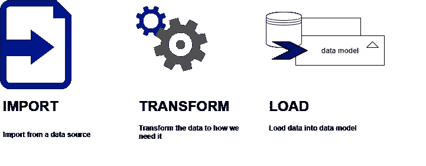
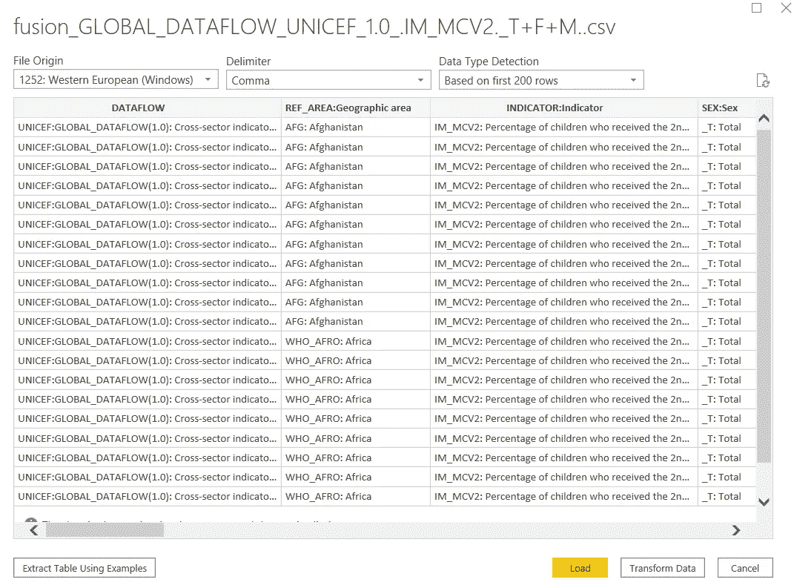
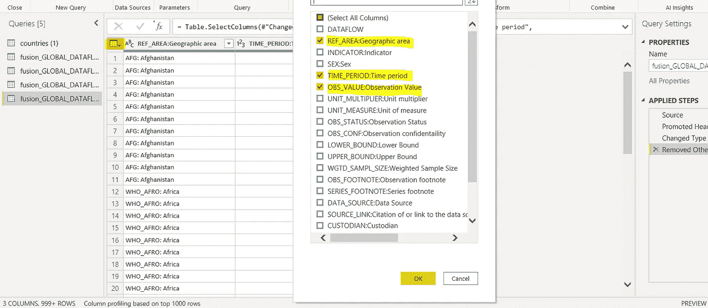
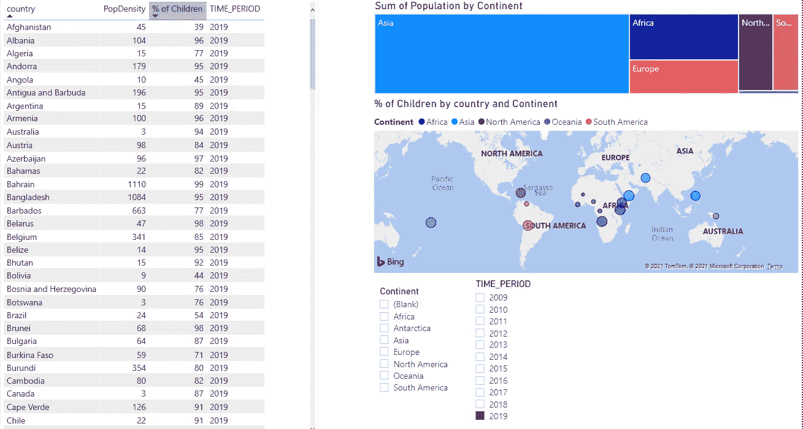
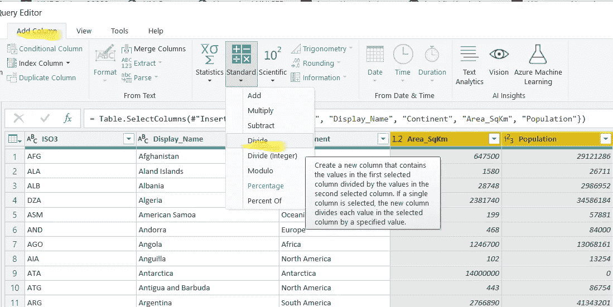
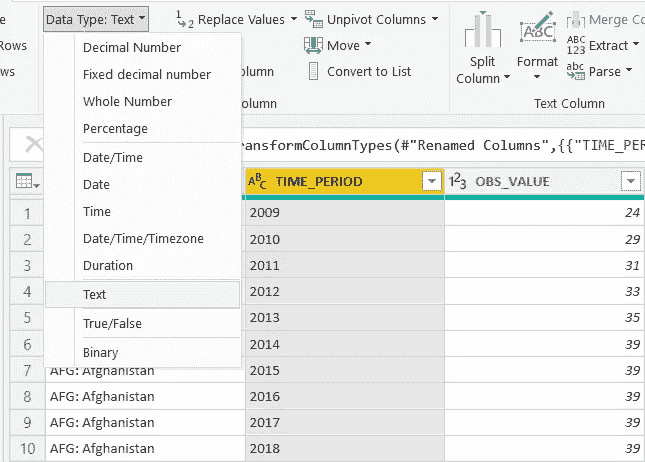
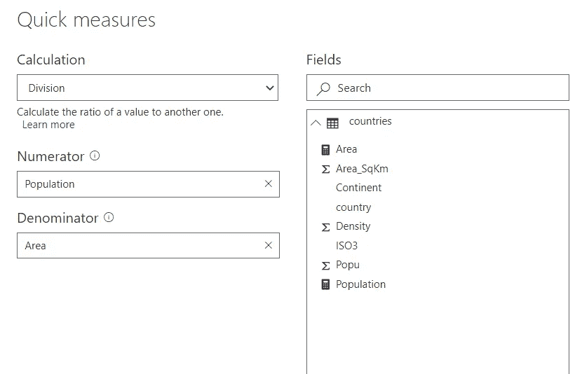
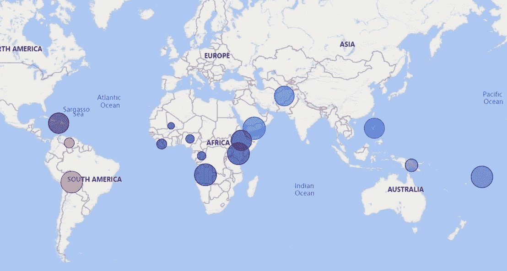

# 使用 Power BI 讲述您的数据故事

> 原文：<https://medium.com/analytics-vidhya/tell-story-of-your-data-using-power-bi-8a90db2bacc3?source=collection_archive---------26----------------------->

***学习如何发展自己的技能，在 Power BI desktop*** : **初学者指南—第 1 部分**

*在本文中，包含接受第二剂含麻疹疫苗的儿童百分比的数据集(UNICEF 数据仓库数据)与从 EdX 课程获得的国家数据集相结合，用于简单的数据分析…*

图片来源:Comfreak，[https://pixabay.com/](https://pixabay.com/)

在许多数据分析工作中，我们可以看到如下所述的某种需求:

> "了解统计软件和**数据可视化软件(Power BI)** 者优先."

所以，让我们言归正传…

W 什么是权力 BI？它只是一个软件吗？不， ***这是一个庞大的服务集合，用于对您拥有的数据进行建模、分析和可视化*** 。此外，BI 是“商业智能”的首字母缩略词，包括收集、存储、处理和分析的方法。任何需要执行决策的领域都可以利用 BI 的“能力”将原始数据转换为知识，然后通知和支持决策。

那里做什么样的数据建模？我们需要注意的一个主要任务是，我们的数据必须尽可能地一致和准确，以避免我们在以后分析数据时得到错误的结果。为此，我们可能需要删除一些非信息数据或改变数据的结构。

**Power BI** 通过从**数据源**获取数据，然后将数据加载到数据模型中。然后，该模型使您能够讲述数据的故事，即构建数据可视化。这些报告可以保存为 PBIX 文件。

Power BI Desktop 是微软的免费应用，你可以在这里下载。

> “借助 **Power BI Desktop** ，从数据到洞察再到行动。免费创建丰富的交互式报告，可视化分析唾手可得”——微软

**导入整形数据**呢？有没有同样的工具？是的， **Power Query** 启用到一个或多个数据源的连接，并为构建数据模型做所有的数据准备步骤。

让我们看看它是如何工作的…

**Power Query***import*the data， *shape* it 利用你的数据准备阶段，加载到最终的数据模型中。该数据模型保存在 **x 速度内存分析引擎**内的 Power BI 中。它是一个数据库，作为 Power BI 内部的一个工具。 **x-velocity 内存分析引擎**，不仅存储您的数据模型，还帮助进行大量数据压缩。因此，它对于处理大数据模型以及保证良好的性能非常有用。

在我们构建了数据模型之后，为了构建安全存储的压缩数据的可视化，使用了 Power BI Desktop 中的**报告编辑器**。

为什么数据建模很重要？

演职员表:z0man，[https://pixabay.com/](https://pixabay.com/)

正如我之前所说的，“不要低估 Power BI 的力量”…数据可视化功能(如诱人的宝石和蛋糕上的糖衣)仅占 Power BI“力量”的 25%..！下面的部分是真正的蛋糕，我们可以看到原料的组合，各层之间的联系和蛋糕的结构。只有数据分析师才能看到下面的部分(蛋糕的结构)，这就是**数据模型**。

**Power BI 中数据建模的三步流程:**

数据建模，图像由我创建

*步骤 1:* Power BI 有许多连接器(如 Power Query ),允许您连接到数据源

*步骤 2:* 通过数据清理、将任何数据源连接在一起、聚合和重组数据，数据的转换是可能的。

*第三步:*将数据加载到 Power BI 模型中，然后我们创建可视化效果。

现在让我们构建一个基本报告…

我在演示中使用的数据集是我从联合国儿童基金会数据仓库中提取的数据，用于指标:“按照国家时间表接种第二剂含麻疹疫苗的儿童百分比”。

从儿童基金会数据仓库提取的数据集预览

从数据源获取数据，您可以先睹为快。此时，您可以加载、转换或取消数据。如果您不希望进行任何转换，可以立即加载数据。但是大多数情况下，我们需要对我们的数据做一些数据清理和其他预处理…所以你需要在获取数据时选择**转换**选项。

点击转换选项后，**功率查询**将被打开。现在，我们刚刚执行了连接到数据源的第一个查询。您可以在 Power Query 中看到用于转换数据的工具。您可以选择使用 Python 或 r 操作数据集。对数据集进行变换后，您还可以查看变换前数据集的外观。

选择要保留在数据集中的列

您可以使用左上角的菜单*(以黄色突出显示)*删除不需要的列。如果需要最小化数据模型的大小，可以取消选择所有列，并且可以选择要在数据集中保留的所有列。为了提高报告的性能，您应该尽可能缩小数据。在窗口的右侧，您可以看到**应用的步骤**，如果您需要撤消，这是可能的。假设您认为以后需要添加更多列，您也可以通过单击应用步骤附近的*齿轮图标*来完成。

编辑数据集的另一种方法是使用*公式栏(查看选项卡>检查公式栏)。*您可以在公式栏中查看每个*应用步骤*的代码(M 语言)。

我还分析了从 EdX 平台获得的另一个国家数据集，这是一个非常有趣的课程的一部分，该课程是关于使用 Power BI 分析和可视化数据的**。**如果您是 Power BI 的初学者，本课程对您成为数据分析师非常有用。

**DavidsonX** 的*用 Power BI 分析和可视化数据*EdX 的第一周课程详细解释了如何获得类似于我创建的报告，如下图所示。

在 Power BI 桌面中创建的报告

*D* 使用 **Power BI** *中的**【管理关系】**选项，可以合并不同来源的数据。更多详情可在* [*这里*](https://docs.microsoft.com/en-us/power-bi/transform-model/desktop-create-and-manage-relationships#:~:text=On%20the%20Home%20tab%2C%20select%20Manage%20Relationships%20%3E%20New.,you%20want%20in%20the%20relationship.) *。*

对两列执行除法运算后添加新列

我们可以在 Power Query 中重命名列名，只需单击列名并替换那里的文本。要添加带有一些派生值的新列，Power Query 中有一个选项。在这里，要划分两列，选择列的顺序很重要。因此，首先选择人口列，然后选择 Area_SqKm。之后，选择分割选项。然后使用执行除法运算后获得的值创建新列(不建议使用这种方式(**隐式度量**)，这里提到它只是为了熟悉幂查询的功能)。

我们可以使用 POWER BI 中的**度量**(报告中的动态计算字段)选项或**计算列**，而不是在这里计算这种结果，这是首选和推荐的方法，这样做可以避免向模型中添加更多数据，并尽可能保持数据集的大小。

执行转换后，您可以点击**关闭并应用电源查询**主页**中的**选项。然后我们将在**报告编辑器**的 Power BI 桌面。当稍后分析复杂模型时，如果您想返回到 Power Query，要转换数据，可以通过点击 Power BI 功能区中的**转换数据**选项卡。

转换:在超级查询中更改数据类型

**建模**选项卡扩展了向数据集中添加新的*测量和参数*的选项。可以使用**视图**选项卡中的选项调整报告的主题。

我们在报告页面上可视化数据的空白区域是**报告画布。**可以使用**可视化窗格**修改现有的可视化。在**字段窗格中可以看到所有的表、列和度量。**使用 **DAX(数据分析表达式)**语言创建测量。这些灵活的代码不仅有助于数据分析，也有助于快速计算。

将字段从字段窗格拖放到报告画布的中央，或者您可以通过单击字段来选择要在报告中显示的字段。您可以确定一个轴，并使其他轴成为图例。如果有更多的主题，您可以通过从可视化效果窗格中选择图表类型来更改图表类型，从而使用堆积条形图。可以通过拉伸可视部分的角来增加图表可视区域的大小。

在 Power BI 中，默认情况下，许多可视化可以是交互式的，不需要额外的努力。如果您已经选择了一个图表，并试图添加一个新的图表，它会将已经选择的图表更改为您单击的新图表。为了防止这种情况，在向报告画布添加新图表之前，取消选择您已经选择的图表是非常重要的。

我将人口列重命名为 Pop 并添加新的度量，您可以在字段窗格中选择相应的表，并从**度量工具**中单击 ***新度量*** 选项。您现在可以在公式栏中编写 DAX 公式:

*人口=总和(国家[Pop])*

其中*国家*是表名。同样的，

*面积=总和(国家[面积 _ 平方公里])*

然后，通过单击测量工具中的快速测量选项(通过编写 DAX 而不是在公式栏中手动编写代码来生成测量值的向导)，可以计算人口密度，如下图所示。

快速测量—功率 BI

假设出现被零除的情况，可以通过使用公式栏中的可选参数(在本例中为 0)进行调整。因此，通过在公式栏中编写 DAX 公式创建的**显式度量**总是首选。

如果您想过滤掉离群值，可以使用 Filters 窗格中的过滤选项，它有两种类型:**页面级过滤器**(控制页面上的所有内容)和**报表级过滤器**(控制整个报表)。另一种滤镜是**视觉等级滤镜**(只控制一个视觉)。选项**前 N 名过滤器**用于根据特定标准过滤排名靠前或靠后的数值(例如:人口最少的 50 个国家)。

Power BI 中的另一个强大工具是一个**切片器**，它将一个过滤器直接放在报告页面上，而不是利用过滤器窗格，在那里您可以配置它们，以便它们只对页面上的一些视觉效果产生影响。

# 我现在要告诉你这个故事的一部分:

当我研究数据时，我刚刚发现，2019 年，马里(非洲大陆)只有 4 %的儿童接种了第二剂含麻疹成分的疫苗。

2019 年数据:各地区只有不到 50 %的儿童接种了第二剂含麻疹疫苗

在这篇[文章](https://mbio.asm.org/content/11/6/e02628-20)中，作者证明了麻疹-腮腺炎-风疹(MMR)滴度与新冠肺炎严重程度之间存在显著关系(负相关)。所以作为下一步，我计划在未来通过在数据分析中考虑这些区域来分析这种关系。敬请期待…暂时再见:)