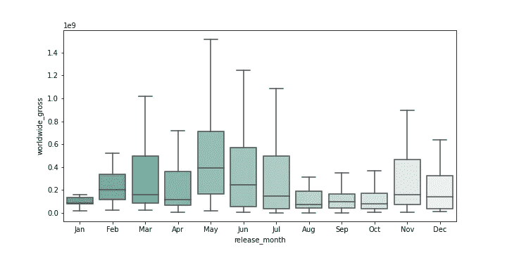

# 在锡伯恩讲故事:技巧和诀窍

> 原文：<https://medium.com/analytics-vidhya/telling-a-story-in-seaborn-tips-and-tricks-f0158451c790?source=collection_archive---------8----------------------->

*为什么可视化很重要，以及一位新数据科学家的一些见解*

It 自从我在熨斗学校开始我的数据科学之旅以来，已经有大约一个月了，在过去的几周里，我意识到了数据科学家做出令人信服的可视化是多么重要。你可能有世界上最好的分析，但如果你不能用清晰易懂的视觉化方式讲述背后的故事，你会很快失去你的听众。这就是为什么当我们负责数据科学项目的第一个项目时，我想确保我有明确的可视化效果，这些效果是专门为我的受众设计的。

该项目提出了一个假设的商业问题，微软想通过建立自己的电影工作室来涉足电影业。为了能够在这个新领域竞争并取得成功，他们聘请我们通过分析在线数据库(如《IMDb》和《数字》)中的电影数据，为他们提供可行的见解，以便在新的努力中实施。我要向微软董事会，而不是一屋子的数据科学家或统计学家展示我的信息，所以我必须尽可能让一切都非技术性。

在花了许多小时清理数据并为绘图做好一切准备后，我必须决定使用哪个可视化库。我是保持一切简单，使用 matplotlib 的 pyplot，还是使用 seaborn(它构建在 matplotlib 之上)，或者像 plotly 这样完全不同的东西？我最终决定选择 seaborn，因为它的一切都是可定制的，并且提供了视觉上吸引人的选项。

我想看的第一个关系是电影上映月份和总收入之间的关系。我想传达的信息是，在特定月份上映的电影收入中值更高。我选择了一个箱线图，因为我想显示数据的分布以及特定月份的平均收入，所以我只是将它们插入 seaborn 的箱线图，瞧，这是一个完美的可视化！嗯……不尽然。一切都是彩色的，但图表有点乱。仅举几个问题:轴标签不清楚，月份都是无序的，异常值出现了，列表还在继续…为了让这个可视化来讲述一个故事，我需要解决这些问题。以下是我在做这些改变时的思考过程，以及我对 seaborn 的建议和技巧。让我们开始吧！

```
fig, ax = plt.subplots(figsize=(10,5))
sns.boxplot(x=imdb_tn_filtered[‘release_month’],
y=imdb_tn_filtered[‘worldwide_gross’], ax=ax)
```


首先，我们可以去掉离群值，因为它们并没有给我们试图展示的关系增加任何东西，而是让我们很难看到它们。Seaborn 的 boxplot 方法中有一个名为 showfliers 的参数，允许您从图表中排除异常值。

```
sns.boxplot(x=imdb_tn_filtered[‘release_month’], y=imdb_tn_filtered[‘worldwide_gross’], ax=ax, showfliers=False)
```


好多了，但是仍然很难看出收入和发布月份之间的关系，因为所有的月份都是无序的。要解决这个问题，我们需要创建一个列表，告诉 seaborn 我们希望在 x 轴上的确切顺序，并将其传递给名为…你猜对了:“顺序。”

```
order = [‘Jan’, ‘Feb’, ‘Mar’, ‘Apr’, ‘May’, ‘Jun’, ‘Jul’, ‘Aug’, ‘Sep’, ‘Oct’, ‘Nov’, ‘Dec’]sns.boxplot(x=imdb_tn_filtered[‘release_month’], y=imdb_tn_filtered[‘worldwide_gross’], ax=ax, showfliers=False, order=order)
```


现在我们有进展了！看看夏季的几个月。他们的中位数明显高于其余月份。这对微软和他们未来工作室的成功绝对是一个重要的收获。他们将要制作的电影应该在夏季上映——尤其是 5 月份，然后是 6 月份——因为从历史上看，这些月份是成功电影收入中值最高的月份。

因为我们将把这个展示给微软董事会，在我看来，彩虹色有点让人不知所措。当我第一次看这个图表时，我可能认为不同的颜色代表不同的变量，但事实并非如此。因此，没有理由让每个箱线图有不同的颜色。也就是说，我们仍然希望图形有视觉吸引力，所以我们可以使用渐变。在这里，我选择了一种我认为看起来专业的颜色，并从“亮”到该颜色(#5A9)进行渐变，然后用“_r”反转，使一月最暗，十二月最亮。

```
sns.boxplot(x=imdb_tn_filtered[‘release_month’], y=imdb_tn_filtered[‘worldwide_gross’], ax=ax, showfliers=False, order=order, palette=”light:#5A9_r”)
```



我们很接近了，但仍然有一个问题:对于一个非技术人员来说，仍然很难分辨出箱线图中间的线是中值。我们需要以某种方式突出这些线条。我们可以通过截取每个月的中间值，并在图形所在的同一图形和轴上绘制一个点状图来轻松实现这一点。

```
medians = imdb_tn_filtered.groupby('release_month')['worldwide_gross'].median().reset_index()medians.sort_values(by='worldwide_gross', ascending=False)sns.boxplot(x=imdb_tn_filtered[‘release_month’], y=imdb_tn_filtered[‘worldwide_gross’], ax=ax, showfliers=False, order=order, palette=”light:#5A9_r”)sns.pointplot(data=medians, x=’release_month’, y=’worldwide_gross’, order=order, ax=ax, color=’black’)
```


不错！现在可以更容易地看到不同月份之间的收入中位数与背景价差的实际关系，以供参考。但是我们还没有完成。我们仍然需要修改我们的轴标签，并给图形起一个标题，这样观众就能理解他们在看什么。我们可以通过使用图表所在的轴(ax)来做到这一点，如下所示:

```
ax.set_xlabel(‘Release Month’)ax.set_ylabel(‘Total Revenue ($)’)ax.set_title(‘Release Month vs. Total Revenue for Movies Released Between 2009–2019’)
```


通过这种调整，我们的标签变得有意义，任何人都可以很容易地理解图表应该显示什么。“但是等等！我们的 y 轴数字呢？?"你可能会问。你完全正确。目前，我们电影的收入中值似乎在 10 美分至 40 美分之间。当然，事实并非如此:0.1 实际上表示 1 亿美元。我们应该使用 FuncFormatter 来调整 y 轴数字的格式。以下是方法(要了解更多信息，请查看此[链接](https://stackoverflow.com/questions/61330427/set-y-axis-in-millions) [)](https://stackoverflow.com/questions/61330427/set-y-axis-in-millions)) :

```
from matplotlib.ticker import FuncFormatterdef millions(x, pos): return ‘%1.0fM’ % (x * 1e-6)formatter = FuncFormatter(millions)
```

最后，我们可以为我们的图表选择一个吸引人的样式。如果您已经知道您想要使用哪种样式，您可以简单地调用 with plt.style.context 行并传入您选择的样式的名称。然而，如果你不知道你想使用哪种风格，这里有一个俏皮的窍门。通过从 ipywidgets 导入 interact 并定义一个名为 plot_style 的函数，您可以从可用样式的下拉菜单中进行选择，并实时更改您的图形。在这种情况下，我认为我们可以使用 ggplot，因为水平网格线有助于查看相应的 y 轴值，并且较暗的背景会使我们的图弹出。这是我们的最终产品:

```
#setting up an order list for x-axis ticks.
order = ['Jan', 'Feb', 'Mar', 'Apr', 'May', 'Jun', 'Jul', 'Aug', 'Sep', 'Oct', 'Nov', 'Dec']#setting up a function to format y-axis values.
from matplotlib.ticker import FuncFormatterdef millions(x, pos):
    return '%1.0fM' % (x * 1e-6)formatter = FuncFormatter(millions)#slicing out the median values for the point plot
medians = imdb_tn_filtered.groupby('release_month')['worldwide_gross'].median().reset_index()medians.sort_values(by='worldwide_gross', ascending=False)#plots
with plt.style.context('ggplot'):
      fig, ax = plt.subplots(figsize=(10,5)) sns.boxplot(x=imdb_tn_filtered['release_month'],
                  y=imdb_tn_filtered['worldwide_gross'], ax=ax,
                  showfliers=False, order=order,
                  palette="light:#5A9_r")

      sns.pointplot(data=medians, x='release_month',
                    y='worldwide_gross', order=order, ax=ax,
                    color='black') ax.set_xlabel('Release Month')
      ax.set_ylabel('Total Revenue ($)')
      ax.set_title('Release Month vs. Total Revenue for Movies
                   Released Between 2009-2019')
      ax.yaxis.set_major_formatter(formatter)
```


总之，数据可视化讲述一个故事是至关重要的。如果这些数字是根据目标受众量身定制的，它们就能更容易地反映调查结果，并产生更大的影响。虽然这不是一个详尽的指南，但确保为正在探索的关系选择最佳类型的图形，以及相关的轴标签、清晰的标题、图例(如果适用)和视觉上吸引人的风格将有助于创建引人注目的视觉效果。哦，别忘了，如果你碰巧开了一家电影工作室，确保你的电影在五月或六月上映！

**更多信息:**

点击[这里](https://github.com/ebtezcan/dsc-phase-1-project)，查看我在 GitHub 上的完整笔记本和分析。