# Tensordot —多维点积—解释

> 原文：<https://medium.com/analytics-vidhya/tensordot-explained-6673cfa5697f?source=collection_archive---------0----------------------->


# 从标量到多维张量

tensordot 是多维运算符、轴线破坏者和维度转换器，它在超级有用的多维矩阵运算符竞技场中赢得了应有的地位。对于张量(多维矩阵)来说，Tensordot 是一个强大的工具，但它也可能有点难以捉摸，似乎有点不可思议。为张量获得一个强有力的直觉是很困难的，这主要是因为如果你需要一个张量运算，你的大脑很可能已经对记录一个张量的所有维度感到迷惑了。为了完全掌握 tensordots，从简单的矩阵开始，然后慢慢地建立一种直觉，一直到多维操作，这是有帮助的。

以下是掌握 tensordot 的几个理由:

1.  Tensordot 是一个非常有用的张量运算工具，适用于优化、工程、机器学习…或者任何你需要执行多维运算的地方。
2.  对于多维点积，您可以使用 tensordot 而不是嵌套循环来加速代码。
3.  它将帮助你建立一个多维操作的直觉，并给你张量的经验。
4.  一旦你完全理解 tensordot，它往往会坚持。如果你已经有了一些矩阵的经验，这个操作在理论上并不严格，它更多的是你已经知道的视觉/感知的扩展。
5.  我们将特别关注 numpy tensor dot，然而直觉也适用于许多使用 tensor 的库(tensorflow，pytorch…)。

在我们深入研究张量之前，让我们回顾一些基本知识，然后从那里开始更复杂的张量运算。虽然张量背后有一些数学理论，但对我们来说，张量只是二维以上的矩阵。事实上，我们把所有矩阵都称为张量，甚至 2D 矩阵也是如此。以下是我们将涉及内容的快速总结:

1.  **轴和轴名称**
2.  **2D 点积**
3.  **带向量的 Tensordot】**
4.  **2D 张量的张量点**

(一)。参数轴= 0 的 Tensordot

㈡。参数轴= 1 的 Tensordot

㈢。参数轴=2 的 Tensordot

**5。多维十进制和元组表示法**

**6。外卖**

7.**参考文献**

# **轴和轴名称**

2D 矩阵有两个轴，惯例是先沿行再沿列给每个轴编号，如下所示。这可能会引起混淆，因为轴 0 的每个实例都是一列，而轴 1 的每个实例都是一行。我之所以使用“沿着”轴 0 或 1 这个词，是为了说明我们沿着特定的轴行进，以提取该轴的实例或记录。在元组形式中，我们可以说这个矩阵是(2，3)。元组中的第一个数字表示轴 0 的大小，第二个数字表示轴 1 的大小。换句话说，axis 0 的单个实例是一行，在我们的矩阵中有两行。axis 1 的单个实例是一列，在我们的矩阵中有三列。

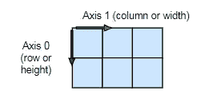

同样的原理适用于 2 维以上，所以我们可以扩展我们的符号和可视化表示，如下所示。现在我们的矩阵是(2，3，深度，…N)。和以前一样，沿轴 0 的长度是 2，沿轴 1 的长度是 3，沿轴 2 的长度是深度…我停止指定实际长度，以将理解抽象到轴 n 的任何维度。

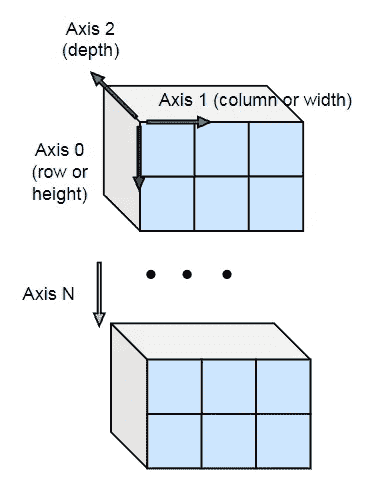

# **2D 点积**

现在让我们回顾一个简单的二维矩阵的点积。正如您在下面看到的，我们从 X 中取出每一行(沿轴 1 的每个实例)和从 Y 中取出每一列(沿轴 0 的每个实例)，将行和列元素相乘，然后将输出相加。输出矩阵中的每个元素都由来自 X 的行和来自 y 的列的所有可能组合组成。

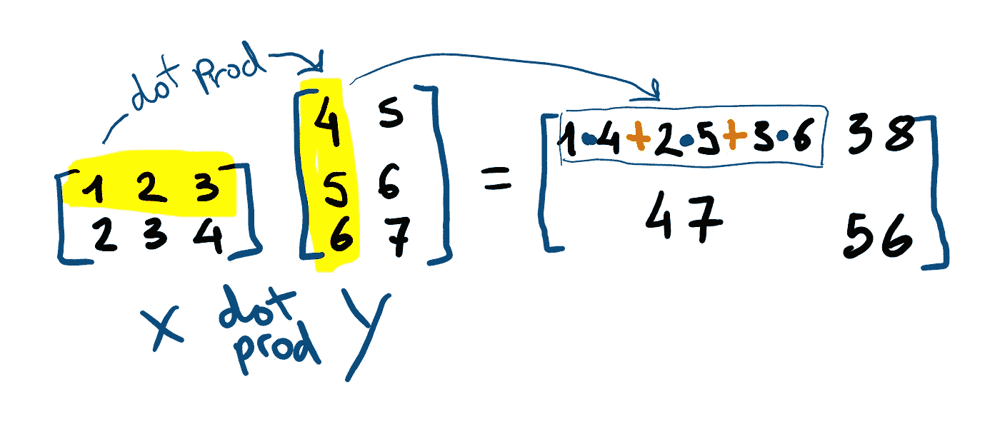

这是 np.tensordot 的一个秘密峰值。注意轴符号，这是理解多维 tensordot 操作的关键部分。axes 参数中的第一个嵌套元组指的是 x 轴，而第二个嵌套元组指的是 y 轴。

```
x
array([[1, 2, 3],
       [2, 3, 4]])
y
array([[4, 5],
       [5, 6],
       [6, 7]])np.dot(x,y)same asnp.tensordot(x,y, axes = ((1),(0)))Out:
array([[32, 38],
       [47, 56]])
```

在 2D，一个简单的 np.dot(x，y)点积自动为我们指定了轴，对于多维运算，我们需要指定乘法/求和发生在哪个轴上。

# **带向量的 Tensordot】**

让我们从矩阵点积后退几步，从零开始，用向量来画 tensordot。带向量的 Tensordot 有助于建立强大的直觉。它遵循与矩阵点积相同的模式，唯一的区别是我们将沿着我们指定的轴来看点积。

首先，让我们创建两个向量。

```
x = np.array([1,2,3])
y = np.array([4,5,6])
```

根据 numpy 文档，轴参数接受以下输入:

[**np.tensordot(x，y，坐标轴)**](https://numpy.org/doc/stable/reference/generated/numpy.tensordot.html)

**坐标轴** *int 或(2，)array_like*

*   integer_like 如果一个 int N，依次对 *a* 的最后 N 个轴和 *b* 的前 N 个轴求和。相应轴的大小必须匹配。当*轴*为 integer_like 时，求值顺序为:首先是 *a* 中的第-n 轴和 *b* 中的第 0 轴，最后是 *a* 中的第-1 轴和 *b* 中的第 n 轴
*   (2)array _ like 或要求和的轴列表，第一个序列应用于 *a* ，第二个序列应用于 *b* 。两个元素 array_like 的长度必须相同

就我个人而言，我并不觉得这个解释很有帮助，尽管它是一个很好的起点。为了充分研究 axes 参数的输入，我们将练习两种类型的输入:整数和嵌套元组。两者是相关的，整数输入是点积的更常见情况的简化，这也可以通过指定轴来执行，沿着该轴与嵌套元组相乘/求和。

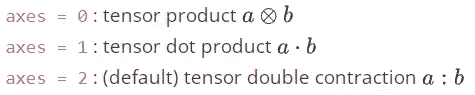

对于 axes = 0 的 tensordot，取 x 的最后一个零轴，x 的每个实例，然后用 y 乘以/求和。这里的措辞看起来很笨拙，因为不清楚 x 的最后一个零轴是什么，但随着我们的深入，它会变得更加清楚。我试图使用与 numpy 文档相同的措辞来建立理解。x 的最后一个零轴只是 x 的标量元素。

维数变化如下(3)*(3) => 3x3 因为 x 和 y 总共有 9 个唯一的组合，x 的每个实例都是一个标量，我们最后只将 x[i]乘以 y。

```
np.tensordot(x,y, axes = 0)
array([[ 4,  5,  6],
       [ 8, 10, 12],
       [12, 15, 18]])
```

下图显示了两个长度为 3 的向量如何转换成一个 3x3 的矩阵。

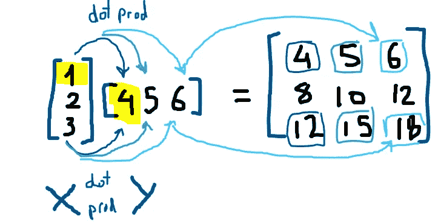

当 axes 参数为 1 时，x 轴的点积沿 0 轴的完整实例，y 轴的点积为 0，然后执行点积(乘加)。奇怪的措辞如下，取 x 的最后一个轴，用 y 的最后一个轴做点积。

```
x = np.array([1,2,3])
y = np.array([4,5,6]) np.tensordot(x,y, axes = 1)
array(32)we can also use the tuple notation np.tensordot(x,y, axes = (0,0))
Out[77]: array(32)
```

下图显示了两个向量之间简单的点-prod。这种符号在学校里很常见，因为你可以用权重和变量(x+2y+3z)来表示一个方程。该符号可以结合到 2D 和代表一个方程组。

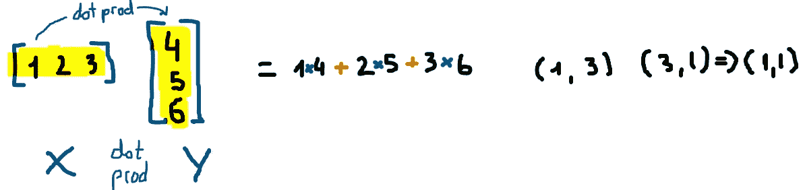

对于向量，当 axes 参数= 2 时，我们不能进一步探索 np.tensordot(x，y，axes = 2)做什么，因为向量是一维的。如果我们试图将轴添加到轴的元组符号中，我们将得到 IndexError 或 ValueError。现在让我们到二维张量，继续探索张量。

```
np.tensordot(x,y)
IndexError: tuple index out of rangenp.tensordot(x,y, axes = (0,1))
IndexError: tuple index out of rangenp.tensordot(x,y, axes = (0,1))
ValueError: shape-mismatch for sum  (in this case we are trying to dot prod (1,3)(1,3) and the size of inner values don't match. )
```

# **2D 张量的张量点**

记住，就我们而言，张量只是一个二维以上的矩阵。我将继续把例子中的矩阵称为张量。

让我们修改 numpy 关于轴参数和输入类型 INT (N)的文档。这就是奇怪的措辞的来源。

> 按顺序对 a 的最后 N 个轴和 b 的前 N 个轴求和。
> 当*轴*为 integer_like 时，求值顺序为:首先是 *a* 中的第-n 轴和 *b* 中的第 0 轴，最后是 *a* 中的第-1 轴和 *b* 中的第 n 轴

如果我们用一个元组来表示张量的形状，下图解释了 numpy 的定义，并且可以扩展到 N 个轴。

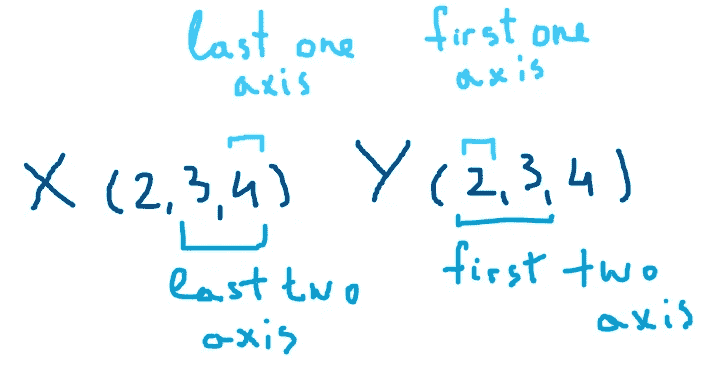

## 参数轴= 0 的 Tensordot

当 N = 0 时，我们不在轴上操作，而是在 x 的每个标量值上操作。操作可以用以下方式表述:对 x 的每个实例和 y 的每个实例执行点积。

这是我解释 axes = 0 的 numpy 定义的方法。取 x 的最后一个 0 轴，如果 x 的最后一个轴是矢量，那么取最后一个 0 轴就是取比矢量更低/更简单的东西，是标量。y 的第一个 0 轴，是越过一个矩阵向量。

这种情况下 x 的单个实例是 x 的每个标量值，y 的单个实例是整个 y 矩阵。为了解开“洋葱”,我们将在 x 上移动 0 轴，然后是 1 轴，或者一个嵌套循环，并将 x(i，j)的每个实例乘以 y，然后对结果求和。因为在我们的例子中 x(i，j)是一个标量，所以不需要求和。对于轴=0，不进行轴缩减，但输出矩阵会发生变换。最终的形状是 x 轴和 y 轴的组合。

```
(2,3) tensordot (2,3) => (2,3,2,3)x
array([[1, 2, 3],
       [2, 3, 4]])
y
array([[4, 5, 6],
       [5, 6, 7]])np.tensordot(x,y, axes = 0)
Out: 
array([[[[ 4,  5,  6],
         [ 5,  6,  7]],
        [[ 8, 10, 12],
         [10, 12, 14]],
        [[12, 15, 18],
         [15, 18, 21]]],
       [[[ 8, 10, 12],
         [10, 12, 14]],
        [[12, 15, 18],
         [15, 18, 21]],
        [[16, 20, 24],
         [20, 24, 28]]]])
```

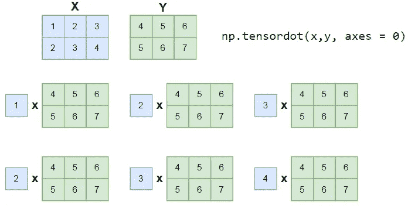

## 参数轴= 1 的 Tensordot

当 N = 1 时，我们将沿最后一个轴取 x (2，3)的每个实例，这样将得到两个长度为 3 的向量，并沿第一个轴对 y (2，3)的每个实例执行点积…

等等，这不行，因为对于 x，我们有 2 个长度为 3 的向量，对于 y，我们有 3 个长度为 2 的向量。如果我们在 x 和 y 上尝试 dotproduct，我们将得到一个 ValueError，如下面的代码所示。

我们可以转置 y 以获得(3，2)的形状，转置 x 以获得(3，2)的形状，或者使用 tensordot 元组表示法来指定哪个轴用于点积。这就是元组符号的强大之处，你可以简单地指定沿着哪个轴执行点积，而不是改变张量的形状。遵循下面的 python 代码，并尝试自己使用代码。让我们先看看 x 和 y 沿 1 的原始轴的 tensordot，以得到 2x2 的最终张量形状。我说原始轴，因为我们需要转换 y 轴，这样 y 轴 1 就不同了。

```
(2,3) tensordot (3,2) => (2,2)x = np.array([[1, 2, 3],
              [2, 3, 4]])y = np.array([[4, 5, 6],
              [5, 6, 7]])np.tensordot(x,y, axes = 1) 
ValueError: shape-mismatch for sumy.transpose()
array([[4, 5],
       [5, 6],
       [6, 7]])np.tensordot(x,y.transpose(), axes = 1)or simply use tuple notation without transpose np.tensordot(x,y, axes = ((1),(1)))which can also be used when y is transposednp.tensordot(x,y.transpose(), axes = ((1),(0)))Out: 
array([[32, 38],
       [47, 56]])
```

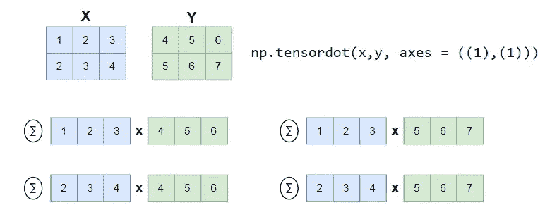

我们还可以对 x 和 y 执行沿原始轴 0 的 tensordot，(轴参数仍然是 1)，这将返回一个 3x3 张量。当我们转置 x 时，我们翻转轴的名称，所以轴 0 变成 1，轴 1 变成 0。

```
(3,2) tensordot (2,3) => (3,3)np.tensordot(x.transpose(),y, axes = 1)or simply use the tuple notation to specify axesnp.tensordot(x,y, axes = ((0),(0)))Out: 
array([[14, 17, 20],
       [23, 28, 33],
       [32, 39, 46]])
```

## 参数轴= 2 的 Tensordot

当轴参数为 2 时，我们采用 x 的最后两个轴，y 的前两个轴。为了遵循之前使用的相同措辞，我们对 x 的每个实例和 y 的每个实例执行点积。对于 2D 张量，我们最终采用 x 的整个张量和 y 的整个张量，逐元素相乘，并将所有结果元素相加以返回标量。

```
(2,3) tensordot (2,3) => scalarnp.tensordot(x,y, axes = 2)same asnp.tensordot(x,y, axes = ((1,0),(1,0)))same asnp.tensordot(x,y.transpose(), axes = ((1,0),(0,1)))same asnp.dot(x.ravel(), y.ravel())Out: 
array(88)
```

x 的实例由 axes 参数指定。你可以把它理解为“x 的每一个单位将与 y 的每一个单位一起分享点积”。对于上述所有示例，当 axes =0 时，每个实例都是一个标量。对于 axes =1 或((1)，(1))，每个实例都是一个向量。对于 axes = 2 或((1，0)，(1，0))，每个实例都是完整的 2D 特斯诺。不管每个实例的维数是多少，它都被简化为一个标量。因此，对轴指定的另一种理解是“沿着哪些轴执行归约(乘法/加法)”。对于 axes = 2 的情况，我们可以通过将张量展平为向量并执行点积来说明将两个矩阵简化为标量。

这就是我说的展平张量的意思。

```
Tensor X
X = np.array([[1, 2, 3],
              [2, 3, 4]])Vector (flatten) xx = np.array([1, 2, 3, 2, 3, 4])Matrix y Y = np.array([[4, 5, 6],
              [5, 6, 7]])Vector (flatten) yy = np.array([4, 5, 6, 5, 6, 7]) np.dot(x,y)or np.tensordot(x,y, axes = 1) 
# axis = 1 since we flattened the 2D tensor to 1DOut: 
array(88)
```

这是 2D 张量的 axes = 2 的视觉效果。

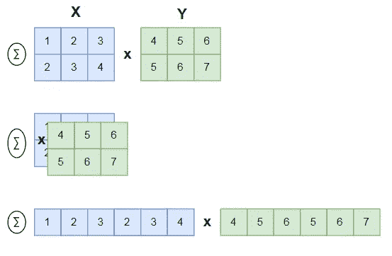

对于一个 3D 张量，如果我们设置 axes 参数= 3，那么我们将遵循与上面类似的过程，将 x 和 y 元素相乘，然后将所有值相加，得到一个标量结果。当轴= N 时，此模式适用于 N 维。

# **多维十进制数和元组符号**

使用点积，您可以将一个实例中的所有维度展平(或分解)到一个向量中，并使用另一个向量执行点积。这是我自己的术语，仅用于说明目的。

从某种意义上来说，每个实例都是经过整形张量的向量。例如，当 x 的形状为(2，4)，y 的形状为(4，2)，并且 axes = ((1)，(0))时，用 x 行(而不是列)填充向量 a_i，用 y 列(而不是行)填充向量 b_j。

```
a_0 = x[0,:] 
a_1 = x[1,:]b_0 = y[:,0]
b_1 = y[:,1]

out_(0,0) = np.dot(a_0,b_0)
out_(0,1) = np.dot(a_0,b_1)
...
out_(1,1) = np.dot(a_1,b_1)
```

另一个将张量分解成实例的例子，当 x 的形状为(2，4)，y 的形状为(4，2)，轴= ((1，0)，(0，1))

```
a = x[:,1], x[:,0] = [x1, ...x8]
b = y[1,:], y[0,:] = [y1, ...y8]out = np.dot(a,b)
```

到目前为止，我的希望是上面的例子已经建立了一些关于元组符号的直觉，以及每个轴指定如何形成结果张量。

仔细看这个例子，试着理解它。

```
x shape => (2,3,5)
y shape => (2,3,5)x = array([[[1, 2, 3, 4, 5],
            [1, 2, 3, 4, 5],
            [3, 4, 5, 6, 7]],
            [[4, 5, 6, 7, 8],
            [5, 6, 7, 8, 9],
            [6, 7, 8, 9, 1]]])y = array([[[2, 3, 4, 5, 6],
            [2, 3, 4, 5, 6],
            [3, 4, 5, 6, 8]],
           [[4, 5, 6, 7, 9],
            [5, 6, 7, 8, 1],
            [6, 7, 8, 9, 2]]])np.tensordot(x,y, axes = 3)same as np.tensordot(x,y, axes = ((2,1,0),(2,1,0)))Out[49]: array(895)
```

以下是其他几个例子。

```
np.tensordot(x,y, axes = ((0),(0))).shape
Out[53]: (3, 5, 3, 5)x(2,3,5) y(2,3,5) =>(3, 5, 3, 5)
reduce on axis 0 for x, and axis 0 for y

np.tensordot(x,y, axes = ((1),(1))).shape
Out[55]: (2, 5, 2, 5)x(2,3,5) y(2,3,5) =>(2, 5, 2, 5)
reduce on axis 1 for x, and axis 1 for ynp.tensordot(x,y, axes = ((1,0),(1,0))).shape
Out[56]: (5, 5)x(2,3,5) y(2,3,5) =>(5, 5)
reduce on axis 1 and 0 for x, and axis 1 and 0 for y
```

回顾下面的笔记(用我的鼠标:D 书写的星形笔迹)来更好地观察在操作过程中张量轴是如何在输出张量中减少的。

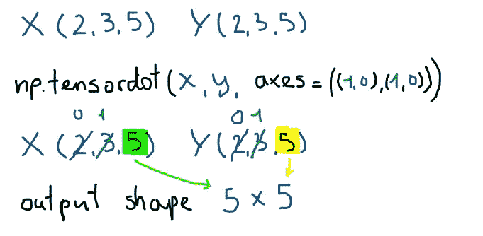

axes 参数并不要求每个轴都是有序的，就像上面 axes = ((2，1，0)，(2，1，0))的例子一样。给定一个形状的张量 x(a，b，c)和形状的张量 y(d，e，f)，只要轴长匹配，就可以按任意轴的顺序执行张量点，或者可以广播轴。例如，当我们执行轴= 0 的点积时，标量值被传播到每个向量或张量。一个形状匹配的例子，如果我们要做一个长度为 2 的第一个向量的张量点，第二个向量也必须是长度为 2 的。这是它看起来的样子。

```
x.shape = (a,c,b)y.shape = (f,d,e)np.tensordot(x,y, axes = ((a,b,c)),(d,e,f)))len(a) = len(d)
len(b) = len(e)
len(c) = len(f)
```

我在下面附上了一些笔记和一些额外的例子。reduce 阶段显示了两个张量/矩阵形状，这两个形状按元素相乘，然后求和以减少为单个标量。对于形状为(2，3，6)的 x 和形状为(2，6，3)的 y，如果我们沿着轴((2，0)，(1，0))应用张量积，那么我们对形状为 x(6，2)和 y(6，2)的许多张量(准确地说是 9 个)执行点积。结果是我们有一个 3×3 张量，其中(I，j)上的每个值是 x(i，6，2)和 y(j，6，2)上的单个张量点。

```
np.tensordot(np.random.rand(2,3,6),
             np.random.rand(2,6,3), 
             axes = ((2,0),(1,0))).shape
Out: (3, 3)
```

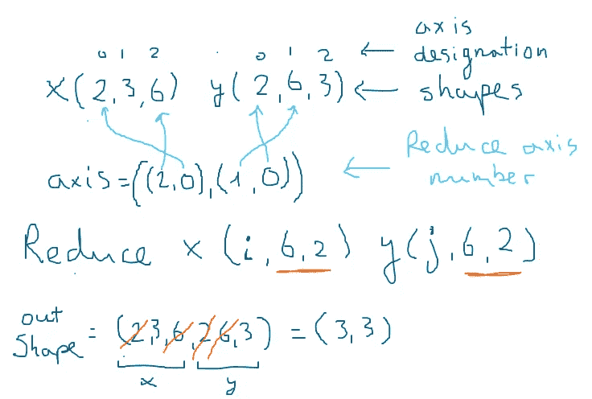

```
np.tensordot(np.random.rand(2,3,6),
             np.random.rand(2,6,3), 
             axes = ((1,0),(2,0))).shape
Out: (6, 6)
```

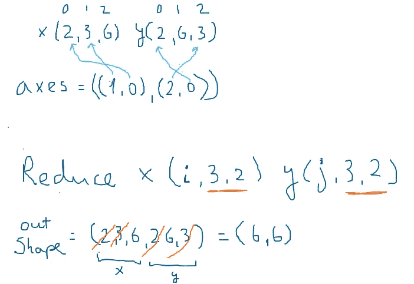

```
np.tensordot(np.random.rand(2,4,4,2,3,4),
             np.random.rand(3,2,4), 
             axes = ((4,3),(0,1))).shape
Out: (2, 4, 4, 4, 4)
```

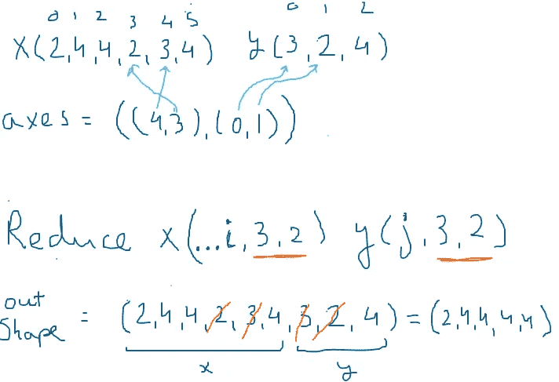

# 外卖食品

Tensordot 沿 axes 参数定义的轴执行点积(元素式乘法，然后是加法)。

Axes 参数可以接受整数输入来捕获一些更常见的 tensordot 情况，也可以接受元组输入来定义在哪个轴上执行点积:

**轴= 0** :

来自 x 的每个标量乘以满 y 张量。没有轴缩减，输出张量形状是 x 形状和 y 形状的组合。

**axes = 1** :

这是一个常见的点积，经常在学校和早期矩阵代数中使用。通过矢量点积减少输出(“矢量减少”)。

```
np.tensordot(x,y.transpose(), axes = 1)
np.tensordot(x,y, axes = ((1),(1)))
np.tensordot(x,y.transpose(), axes = ((1),(0)))
```

**axes = 2** :

x 轴的最后两个轴与 y 轴的前两个轴的逐元素乘法/完全加法。输出通过矩阵点积减少(“矩阵减少”)。

对于 2D 张量，输出将是一个标量。你可以扩展到 N 维，对于 N 维张量，如果 axes =N，输出将是一个标量。

以下所有这些操作都是等效的。

```
np.tensordot(x,y, axes = 2)
np.tensordot(x,y, axes = ((1,0),(1,0)))
np.tensordot(x,y.transpose(), axes = ((1,0),(0,1)))
np.dot(x.ravel(), y.ravel())
```

**坐标轴=元组**:

一种想象的方法是按照元组表示的轴顺序分解 x 和 y，然后执行矢量点积。该操作通过元组中定义的轴来缩小输出形状，这些轴被缩小为标量值。

我希望你觉得这很有价值，请随时留下反馈并提出任何更新，因为我是根据自己的学习匆忙整理的。

# 参考

 [## NumPy . tensordot-NumPy 1.21 版手册

### 计算沿指定轴的张量点积。给定两个张量 a 和 b，以及一个类似 array _ 的对象包含两个…

numpy.org](https://numpy.org/doc/stable/reference/generated/numpy.tensordot.html)  [## torch.tensordot - PyTorch 1.9.1 文档

### 加入 PyTorch 开发人员社区，贡献、学习并获得您的问题的答案。

pytorch.org](https://pytorch.org/docs/stable/generated/torch.tensordot.html)  [## 如何乘矩阵

### 一个矩阵是一个数字的数组:一个矩阵(这个有 2 行 3 列)乘以一个单一的数字…

mathsisfun.com](https://mathsisfun.com/algebra/matrix-multiplying.html) [](https://stackoverflow.com/questions/44763910/multiply-2d-numpy-arrays-element-wise-and-sum) [## 将 2D 数个数组按元素相乘并求和

### 我想知道是否有更快的方法/专用的 NumPy 函数来执行 2D NumPy 的元素级乘法…

stackoverflow.com](https://stackoverflow.com/questions/44763910/multiply-2d-numpy-arrays-element-wise-and-sum)