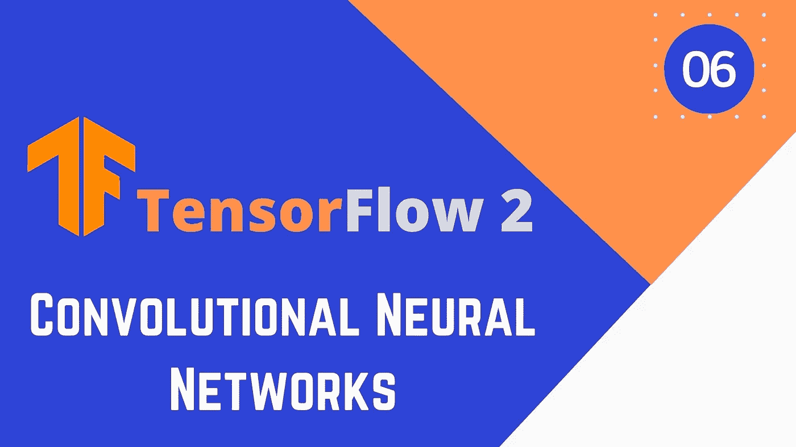
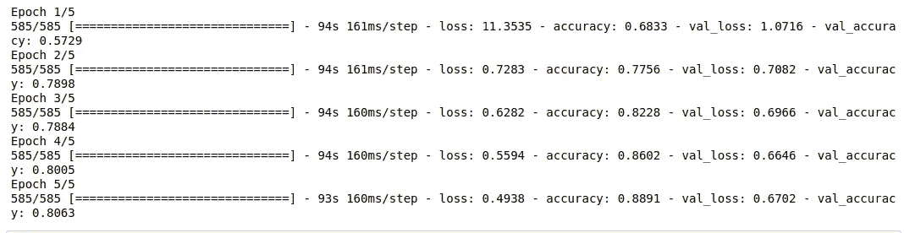
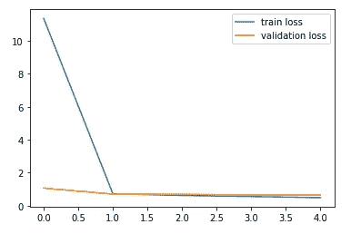
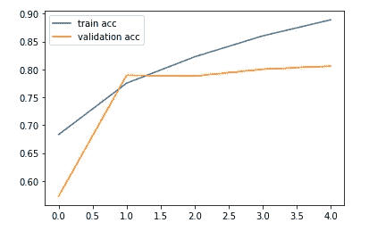
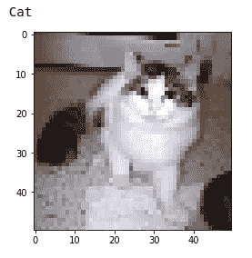

# 用于深度学习的 TensorFlow 2.0 卷积神经网络

> 原文：<https://medium.com/analytics-vidhya/tensorflow-2-0-for-deep-learning-convolutional-neural-networks-26153b2d078?source=collection_archive---------14----------------------->



# 什么是卷积神经网络？

卷积神经网络是一种主要用于图像数据集的神经网络，卷积网络的共享参数特征减少了模型的参数数量，这也使其在模式**边缘检测中有效。**这篇博文包含了用 tensorflow 2.0 在猫和狗的数据集上实现卷积神经网络

# 关于数据集

猫对狗数据集是机器学习领域最著名的数据集之一，由 pathfinder.com 的**和微软的**合作开发。****

*数据集位于:**[*https://www.microsoft.com/en-us/download/details.aspx?id = 54765*](https://www.microsoft.com/en-us/download/details.aspx?id=54765)*

**在我们开始创建神经网络之前，先看看我的* [*“如何准备图像数据集”*](/analytics-vidhya/create-your-own-real-image-dataset-with-python-deep-learning-b2576b63da1e) *博客，进行图像预处理。**

# *Tensorflow 2 卷积神经网络*

1.  ***导入数据集***

```
*#importing the libraries
import tensorflow as tf
import numpy as np
import matplotlib.pyplot as plt
import cv2#importing the data
dataset = np.load('dogsvscats.npy')
labels = np.load('targets.npy')
print("shape of the data is : ",dataset.shape)*
```

*我们在这里所做的就是导入所需的库和数据集。
*查看我的* [*【如何准备图像数据集】*](/analytics-vidhya/create-your-own-real-image-dataset-with-python-deep-learning-b2576b63da1e) *博客进行图像预处理，了解图像数据是如何存储的。**

*我们将图像和标签存储在。npy 文件*

***2。列车试运行***

```
*#shuffling the dataset
seed = np.random.randint(0,1000)
np.random.seed(seed)
np.random.shuffle(dataset)
np.random.seed(seed)
np.random.shuffle(labels)
plt.imshow(dataset[0])
print(labels[0])#training and test set split
from sklearn.model_selection import train_test_split
x_train, x_test, y_train, y_test = train_test_split(dataset,labels)*
```

*只需将数据集打乱并分成训练集和测试集*

***3。缩放图像***

```
*#scaling the images
x_train = x_train/255.
x_test = x_test/255.*
```

*这听起来可能很简单，但是对于算法的工作非常重要。*

***4。神经网络***

*在你的机器或 Google Colab 的 GPU 上运行下面的代码*

```
*#creating a model
i = tf.keras.layers.Input(shape=(50,50,3))

#first layer
conv1 = tf.keras.layers.Conv2D(filters=10,kernel_size=(5,5),strides=(1,1),padding='same',activation=tf.keras.activations.relu)(i)
pool1 = tf.keras.layers.MaxPool2D((2,2))(conv1)
batch1 = tf.keras.layers.BatchNormalization()(pool1)

#second layer
conv2 = tf.keras.layers.Conv2D(filters=28,kernel_size=(3,3),strides=(1,1),padding='same',activation=tf.keras.activations.relu)(batch1)
pool2 = tf.keras.layers.MaxPool2D((2,2))(conv2)
batch2 = tf.keras.layers.BatchNormalization()(pool2)

#third layer
conv3 = tf.keras.layers.Conv2D(filters=50,kernel_size=(5,5),strides=(1,1),padding='same',activation=tf.keras.activations.relu)(batch2)
pool3 = tf.keras.layers.MaxPool2D((2,2))(conv3)
batch3 = tf.keras.layers.BatchNormalization()(pool3)

#fourth layer
conv4 = tf.keras.layers.Conv2D(filters=100,kernel_size=(3,3),strides=(1,1),padding='same',activation=tf.keras.activations.relu)(batch3)
pool4 = tf.keras.layers.MaxPool2D((2,2))(conv4)
batch4 = tf.keras.layers.BatchNormalization()(pool4)

#fifth layer
conv5 = tf.keras.layers.Conv2D(filters=180,kernel_size=(3,3),strides=(1,1),padding='same',activation=tf.keras.activations.relu)(batch4)
pool5 = tf.keras.layers.MaxPool2D((2,2))(conv5)
batch5 = tf.keras.layers.BatchNormalization()(pool5)

#sixth layer
flatten1 = tf.keras.layers.Flatten()(batch5)
fc1 = tf.keras.layers.Dense(512,activation=tf.keras.activations.relu)(flatten1)
fc2 = tf.keras.layers.Dense(700,activation=tf.keras.activations.relu,kernel_regularizer=tf.keras.regularizers.l1(l1=0.01))(fc1)

#final layer
output = tf.keras.layers.Dense(1,activation=tf.keras.activations.sigmoid)(fc2)

model = tf.keras.models.Model(i,output)#optimizer and loss
model.compile(optimizer=tf.keras.optimizers.Adam(learning_rate=0.0005),loss=tf.keras.losses.binary_crossentropy,metrics=['accuracy'])#train the model
train = model.fit(x_train,y_train,validation_data=(x_test,y_test),epochs=5)*
```

*这类似于我们在之前的博客文章中创建的模型。但是，我们在这里使用卷积层 **( Conv2D )** ，它允许您指定滤波器的数量、内核大小和其他东西，如步长等。
然后我们还使用**汇集**和**批量规格化**层。使用的损失函数是二元交叉熵，因为这是一个二元分类问题。然后我们训练这个模型*

***输出:***

**

***5。模型性能分析***

```
*#plotting accuracy
plt.plot(train.history['accuracy'],label='train acc')
plt.plot(train.history['val_accuracy'],label='validation acc')
plt.legend()#plotting loss
plt.plot(train.history['loss'],label='train loss')
plt.plot(train.history['val_loss'],label='validation loss')
plt.legend()*
```

***输出:***

****

***6。保存模型***

```
*#saving the model
model.save('catsvsdogs1.h5')*
```

*不要忘记保存模型，因为卷积神经网络需要很长时间来训练*

***7。从测试集**中进行随机预测*

```
*#making a random prediction
import random 
ran = random.randint(0,5000)
y_pred = model.predict(x_test[ran].reshape(-1,50,50,3))
plt.imshow(x_test[ran])
y_pred.round()
if y_pred == 1:
    print("Dog")
else:
    print("Cat")*
```

***输出:***

**

# *结论*

*这就是创建卷积神经网络的方法。对于图像预处理步骤，如果你正在使用 google colab，请参考我在上面分享的链接。*

## *谢谢你*