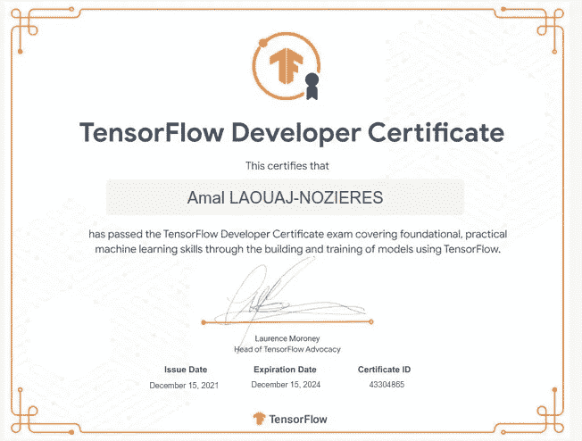
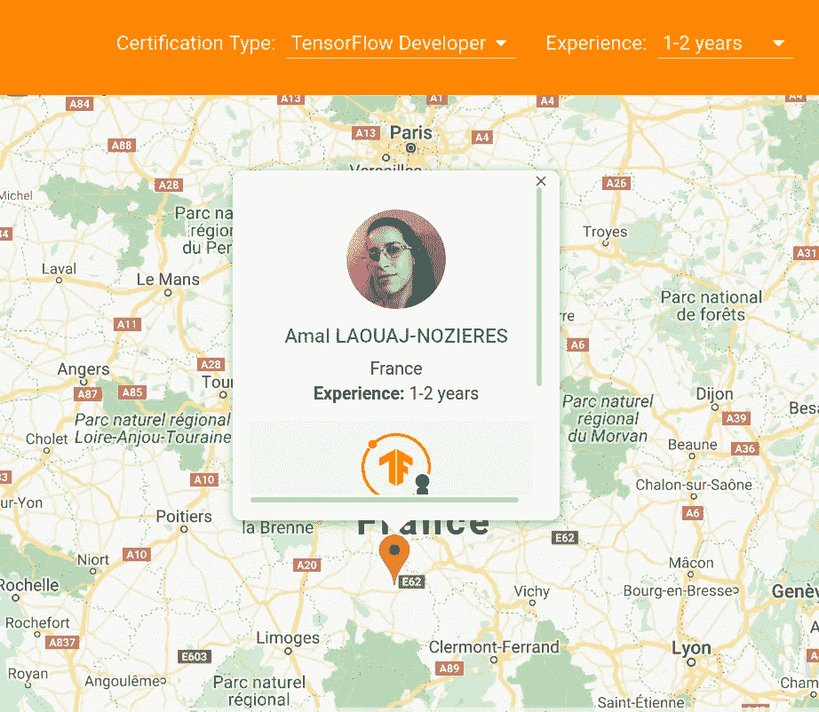

# TensorFlow 开发者证书:通过！

> 原文：<https://medium.com/analytics-vidhya/tensorflow-developer-certificate-passed-6db056d7371?source=collection_archive---------0----------------------->

今天，我自豪地成为了一名 TensorFlow 开发人员！这是我的旅程。愿它激励并帮助你也这样做！

一个机器学习新闻的热心读者，偶然看到了这个 TensorFlow 开发者证书。Google Tensorflow 团队开发了一种考试来授予您访问证书网络的权限。所以你可以在谷歌地图上找到全世界的 TensorFlow 专家。在这里检查一下[。](https://developers.google.com/certification/directory/tensorflow?hl=fr)

你和我一样吗？你会因为自己的名字出现在地图上而兴奋吗？是的，这有点幼稚，但只要能让你前进，就是好的！

如果你问自己什么是张量流，首先？你来对地方了。

我们开始吧！

什么是张量流？

Tensorflow 是 Google 为机器学习开发的开源框架。他们的网站是有据可查的，很容易从他们的教程中学习。TensorFlow 还将 Keras 整合到其框架中。Keras 是一个令人惊叹的库，最初由才华横溢的 Franç ois Chollet 用 python 开发，用于深度学习模型。

考试测试你的张量流知识。对我来说，TensorFlow 已经是我最喜欢的图书馆了，所以它激起了我的好奇心，想看看我是否能去。我能向自己证明我可以属于这个 TensorFlow 伙伴社区吗？

所以首先，你要有动力。任何对你有用的东西:认可，在谷歌地图应用上有你的名字的乐趣，测试你的知识。如果你有动力，你已经完成了一半的挑战:)

现在，让我们获得实现它的工具！

我是怎么准备的？

看了那么多关于人考的文章。这有助于我整理待办事项清单。我会给你我所有阅读的结论，以及你如何整理你自己的路线图。

**评估你的起点:你的处境！**

先决条件:

所以这里就看你的情况了。就我而言，我已经有了数学背景，并获得了吴恩达的[深度学习专业](https://www.coursera.org/specializations/deep-learning)认证。

如果你还没有，你可以和吴恩达一起参加 Coursera 的课程，或者学习吴恩达的 youtube 播放列表，然后自己练习。

我们开始吧！

拿到基础之后，就可以考劳伦斯·莫罗尼教授的 [Coursera Tensorflow 开发者证书](https://www.coursera.org/professional-certificates/tensorflow-in-practice)了。你会看到考试需要的 95%。我读到有人参加了 7 天的免费课程试用，并以最快的速度观看视频。这些练习和他们的答案都在 google Colab 上。找到适合你的方法。

劳伦斯·莫罗尼是有史以来最好的老师…仅次于吴恩达(对不起劳伦斯！吴恩达是第一个向我解释如何将线性代数转化为神经网络的人，太神奇了！).我已经在 Youtube 上看过他的很多视频，所以我知道这会很有趣。

当我完成了 Coursera 的课程后，因为个人原因无法直接参加考试。所以我等了好几个月才能够参加考试。为了更新我的知识，我找到了[乔治·佐托](https://www.youtube.com/channel/UClQOufBFGnnvJd-_X8TTS6A)的视频。他创建了一个为考试做准备的社区。他分享了课程的幻灯片以及许多工具和技巧。他甚至为 Tensorflow 认证制作了琐事游戏。太有趣了！谢谢乔治·佐托！

此时你已经准备好了！

考什么机？

如果你有一个图形处理器，这将节省你这么多时间的培训。如果没有，就得用免费 GPU 的 google Colab。确保在 Colab 上使用正确的版本。你也可以在云上按小时付费。想看看你的机器能做什么，试试本地的 TensorFlow 教程，看看是不是太长了。

考试是在 Pycharm 上进行的，所以你必须按照考试的安装指南进行安装。确保拥有所需的版本。试着和 Pycharm 玩。就我而言，我尝试在 Tensorflow 网站上编译教程，在考试前解决了我遇到的任何问题。

结论:

这是路线图:

1-获得动力

2-看视频，读文章，了解深度学习

3-参加 Coursera Tensorflow 开发者认证，或者只观看 Youtube 上的视频，或者免费作为听众提供帮助。

4-安装 Pycharm 并测试您的本地机器

5-在本地测试 Tensorflow 教程

就是这样！希望你有动力自己尝试一下。如果你需要任何帮助，不要犹豫，在评论中问我你的问题。

**资源**

*   Coursera

 [## 深度学习。AI TensorFlow 开发者

### TensorFlow 是当今最受欢迎的开源深度学习框架之一。的…

www.coursera.org](https://www.coursera.org/professional-certificates/tensorflow-in-practice) 

*   Tensorflow 的播放列表

[https://www.youtube.com/playlist?list = plou 2 xlyxmsi 9 mzq-xxug 4 l 2 o 04 jbr klv](https://www.youtube.com/playlist?list=PLOU2XLYxmsII9mzQ-Xxug4l2o04JBrkLV)

*   乔治·佐托视频

和他的 git hub 库:

[https://github.com/georgezoto/TensorFlow-in-Practice](https://github.com/georgezoto/TensorFlow-in-Practice)

*   微不足道的游戏

[https://quizizz . com/join/quiz/5e 87 bdbc 07 fa 7 f 001 b 120404/start？referrer = 5d 921444 d0fa 99001 a 135336](https://quizizz.com/join/quiz/5e87bdbc07fa7f001b120404/start?referrer=5d921444d0fa99001a135336)