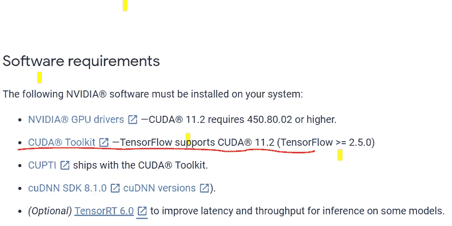
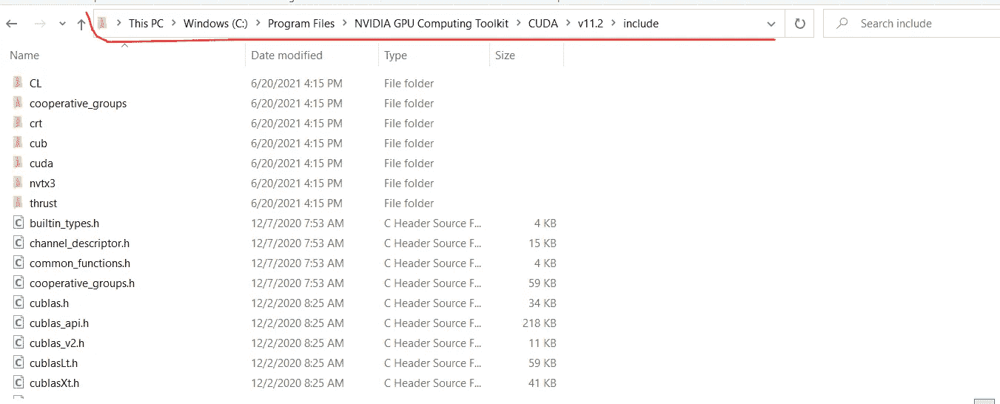
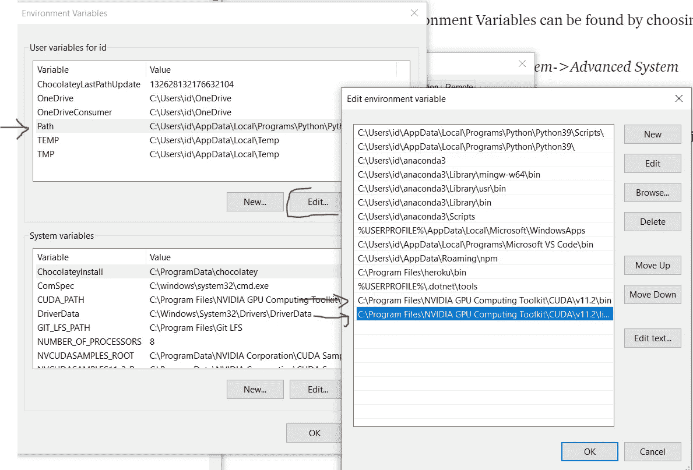

# Tensorflow-GPU:如何在 Windows 上安装支持 NVIDIA CUDA、cuDNN 和 GPU 的 Tensorflow

> 原文：<https://medium.com/analytics-vidhya/tensorflow-gpu-how-to-install-tensorflow-with-nvidia-cuda-cudnn-and-gpu-support-on-windows-6158cffc1c29?source=collection_archive---------0----------------------->

[来源](https://www.bbc.com/news/technology-56114508)

本文将指导您在系统上安装 TensorFlow 并使其与 NVIDIA GPU 兼容。在我们深入安装过程之前，让我回顾一下这篇文章背后的动机。

**动机**

我最近买了一台新电脑(大约在 4 月份)，这台笔记本电脑配备了 NVIDIA GEFORCE GTX 1650 GPU (4GB 内存)。这是为了加快我的机器学习和深度学习项目。笔记本电脑对于基本的深度学习和机器学习任务来说非常快，但对于计算成本高昂的训练来说却非常慢(当训练在 CPU 上进行时，你还能指望什么呢)。

这种挫败感让我开始寻找利用系统 GPU 的方法。我偶然看到一篇很棒的 medium 文章，[在 Windows 10](https://towardsdatascience.com/installing-tensorflow-with-cuda-cudnn-and-gpu-support-on-windows-10-60693e46e781) 上安装支持 CUDA、cuDNN 和 GPU 的 Tensorflow，不幸的是在一丝不苟地按照文章中的说明操作之后。我仍然无法让我的 GPU 与 Tensorflow 兼容。在网上研究了几类之后，我成功的让我的 GPU 兼容了 Tensorflow。我希望这篇文章能对你有所帮助，帮助你避免我遇到的错误。好了，故事讲完了，让我们深入安装程序。在我们深入了解安装程序之前，了解一下 NVIDIA CUDA、cuDNN 和 Tensorflow 是什么会很酷？？

**张量流**

“TensorFlow 是机器学习/深度学习的端到端开源平台。它有一个全面、灵活的工具、库和社区资源的生态系统，让研究人员推动 ML 的最新发展，开发人员轻松构建和部署 ML 驱动的应用程序。”[来源](https://www.tensorflow.org/)

**英伟达 CUDA**

[’“CUDA](https://developer.nvidia.com/about-cuda)是 Nvidia 为通用计算在自己的 GPU(图形处理单元)上开发的并行计算平台和编程模型。CUDA 使开发人员能够利用 GPU 的计算并行化能力，加快计算密集型应用的速度。”[来源](https://www.infoworld.com/article/3299703/what-is-cuda-parallel-programming-for-gpus.html)。CUDA 通过利用所谓的并行计算(即，它不是只在单个计算实例上进行训练，而是划分任务，在不同的计算实例上进行训练)来加快机器学习和深度学习的训练时间。CPU 在单个实例上计算，而 GPU 在多个实例上计算，这使得 GPU 上的操作比 CPU 更快。CUDA 使你的 GPU 能够工作，还有其他 CUDA 替代工具包，如 OpenCL，但目前 Tensorflow 与 NVIDIA 更兼容(这是我购买 NVIDIA 驱动的笔记本电脑的原因之一)。

**cuDNN**

“NVIDIA CUDA 深度神经网络库(cuDNN)是用于[深度神经网络](https://developer.nvidia.com/deep-learning)的 GPU 加速原语库。cuDNN 为标准例程提供了高度优化的实现，例如前向和后向卷积、池化、规范化和激活层。全球深度学习研究人员和框架开发人员依赖 cuDNN 实现高性能 GPU 加速。”[来源](https://developer.nvidia.com/cudnn)

**安装步骤**

请注意，我将从乔安妮·麦显杰博士的这篇[伟大文章](https://towardsdatascience.com/installing-tensorflow-with-cuda-cudnn-and-gpu-support-on-windows-10-60693e46e781)中摘录一些内容，这篇文章对我很有帮助。唯一的问题是，这篇文章是旧的，你会遇到最新版本的 NVIDIA CUDA 的错误。

**第一步:将要安装的软件**

要安装该软件，你必须在你的电脑上安装一个兼容 NVIDIA CUDA 的 GPU(这一点非常重要)。[您可以使用此链接了解您的系统上安装了什么 GPU。](https://www.pcmag.com/how-to/what-graphics-card-do-i-have#:~:text=Open%20the%20Start%20menu%20on,of%20your%20GPU%20right%20there.)

*   Microsoft Visual Studio
*   NVIDIA CUDA 工具包
*   NVIDIA cuDNN
*   Python(如果没有安装)
*   张量流

**第二步:下载 Visual Studio 速成版**

**Visual Studio 是 CUDA 工具包的先决条件**

根据 NVIDIA 的说法，在您可以使用 NVIDIA CUDA Toolkit 之前，必须在您的系统上安装 visual studio([您可以使用此链接访问先决条件](https://docs.nvidia.com/cuda/cuda-installation-guide-microsoft-windows/index.html))。

[来源](https://docs.nvidia.com/cuda/cuda-installation-guide-microsoft-windows/index.html)

如果您试图在没有安装 Visual Studio 的情况下下载并安装 CUDA Toolkit for Windows。此错误通知将弹出“找不到 Visual Studio 的支持版本。CUDA 工具包的一些组件将无法正常工作”。有 Visual Studio 代码和 Visual Studio(请注意区别)

**选择并下载 Visual Studio Express**

Visual Studio 的最新版本(免费)是 Visual Studio Express 社区版 2019。你可以用这个[链接](https://visualstudio.microsoft.com/vs/express/)访问软件。

Visual Studio 速成版的图示概述(图片由作者提供)

请点击下载社区 2019 链接，您的下载将开始。下载完成后，您可以像安装其他软件一样安装它。一旦你点击安装/打开，你将看到这个图像

Visual Studio 社区 2019 的安装窗口。(图片由作者提供)

请点击可用并安装 Visual Studio 社区 2019(我已经安装了 Visual Studio 社区 2017)。在安装过程中，Visual Studio 会提示您在没有工作负荷的情况下继续安装，或者添加工作负荷。请点击“继续”

[来源](https://towardsdatascience.com/installing-tensorflow-with-cuda-cudnn-and-gpu-support-on-windows-10-60693e46e781)

安装 Visual Studio 后，请重新启动/重启您的电脑，这将防止 *Visual Studio 仍在运行，并防止安装 CUDA 工具包的错误。*

**第三步:下载适用于 Windows 10 的 CUDA 工具包**

作者图片

Tensorflow ≥2.5.0 需要 CUDA Toolkit 11.2 版本，可以通过此[链接](https://developer.nvidia.com/cuda-toolkit-archive)访问该软件

作者图片

点击 CUDA 工具包 11.2.0，下载 CUDA 工具包 11.2.0)。

作者图片

选择您的目标平台，点击上面的红色圆圈符号，然后点击下载。

作者图片

运行已经下载的基本安装程序将产生 CUDA 安装窗口，如下所示

CUDA 基础安装程序的 CUDA 安装包。作者图片

点击 ok(不要改变目录)，CUDA 安装程序将被解压到你的电脑上。NVIDIA CUDA Toolkit 安装将开始，并显示一条确认消息。安装程序将检查您的系统是否满足要求，您将看到下面的屏幕。

单击快速安装选项，然后单击下一步按钮。[来源](https://towardsdatascience.com/installing-tensorflow-with-cuda-cudnn-and-gpu-support-on-windows-10-60693e46e781)

继续点击“下一步”按钮，直到进入最后一步(完成)，然后点击“启动样品”。

**第五步:下载并安装 cuDNN**

现在已经安装了 CUDA 11.2，下一步就是找到 cuDNN 的兼容版本。Tensorflow ≥ 2.5.0 需要 cuDNN SDK 8.1.0 版本。使用此链接访问 [NVIDIA cuDNN](https://developer.nvidia.com/cudnn) 。

点击下载 cuDNN。作者图片

您需要成为 NVIDIA 开发者计划的成员才能下载 cuDNN(它是免费加入的)。

作者图片

点击立即加入并填写注册表格。完成后，您将被自动带到下载页面，如下所示。

作者图片

点击链接并下载文件。下载文件后，请解压缩文件(请注意路径)。

由于 CUDA 依赖于 cuDNN，所以您需要将一些文件从 cuDNN 复制到 CUDA 中。

他们是

*   cudnn64_8.dll
*   cudnn.h
*   cudnn.lib

**5.1 cudnn64_8.dll**

如何定位 cudnn64_8.dll 文件？作者图片

您需要直接从 bin 子文件夹路径中复制 cudnn64_8.dll。bin 子文件夹位于 cuda 中，cuda 是 cuDNN 中的一个子文件夹。

复制文件后，您需要将文件粘贴到 CUDA 文件夹下的 bin 子文件夹中。CUDA 文件夹位于 NVIDIA 计算工具包内。

将文件粘贴到该目录中(无需创建任何文件夹)。作者图片

## **5.2 cudnn.h**

像上面所做的一样，您需要从位于 cuda 文件夹中的 include 子文件夹中复制 cudnn.h。cuda 文件夹位于 cuDNN 内部。

复制 cudnn.h 文件。作者图片

您需要将 cudnn.h 复制到 CUDA 中的 include 子文件夹中。CUDA 文件夹位于 NVIDIA GPU 计算工具包文件夹中。

将复制的 cudnn.h 文件粘贴到该文件夹中。作者图片

**5.3 cudnn.lib**

您需要从位于 lib 子文件夹中的 x64 子文件夹中复制 cudnn.lib。lib 子文件夹位于 cuDNN 内部。

按作者复制 cudnn.lib. Image

将复制的 cudnn.lib 粘贴到 CUDA 内的 lib 子文件夹中。作者图片

**重命名 cursolver64_11.dll**

您需要将 cusolver64_11.dll 重命名为 cusolver64_10.dll，否则将出现此错误*“无法加载动态库‘Cu solver 64 _ 10 . dll’；当您尝试利用您的 GPU 进行 Tensorflow 培训*时，出现 d error:Cu solver 64 _ 10 . dll not found '*。*

我已经将 cursolver64_11.dll 重命名为 cursolver64_10.dll(需要这样做)。作者图片

**步骤 5.3:确认在 Windows 中设置了 CUDA 环境变量**

为了使 CUDA 正常工作，你需要确保 CUDA 环境变量设置在你的 PC 路径中。要确认这一点，您需要检查环境变量。这可以通过以下步骤找到

控制面板->系统和安全->系统->高级系统设置。

这将打开一个窗口，单击高级选项卡。如下图所示

作者图片

> 这些路径是自动添加的，但以防您找不到它们。只需输入 C:\Program Files\NVIDIA GPU 计算工具包\CUDA\v11.2\bin 和 C:\Program Files\NVIDIA GPU 计算工具包\CUDA\V11.2\libnvvp。

第 6 步:安装 Python(以防你以前没有这样做过)

我推荐用 anaconda 下载 python，你可以用这个[链接](https://www.anaconda.com/products/individual)访问 Anaconda。

作者图片

安装 anaconda 非常容易，一旦你点击 install，就会显示简单安装的说明。

**步骤 7:安装 Tensorflow(如果未安装)**

打开您的终端，激活 conda 和 pip 安装 TensorFlow。作者图片

**步骤 8:测试 TensorFlow 的安装及其对 GPU 的访问**

打开终端(命令提示符)，键入 conda activate，然后键入 python(进入 python 交互模式)

> #导入 tensorflow 包
> 
> 将张量流作为 tf 导入

运行此代码来测试您的 Tensorflow 安装对 CUDA 的支持，

> TF . test . is _ build _ with _ cuda()

要确认 Tensorflow 可以访问系统上的 GPU，可以使用以下代码进行测试

> TF . test . is _ GPU _ available(cuda _ only = False，min _ cuda _ compute _ capability = None

几分钟后它将返回 ***真*** 。

作者图片

**可选步骤**

您可能会遇到此错误“未创建 XLA 设备，未设置 tf_xla_enable_xla_devices”。XLA 有助于加快对 GPU 的训练，以设置 tf_xla_enable_xla_devices 你可以按照这个步骤

作者图片

导航到环境变量，导航到系统变量，然后单击新建按钮。如上所示填写变量名和变量值。

**结论**

这篇文章旨在建立在乔安妮·麦显杰博士的这篇旧文章的基础上，并提供在 windows 上正确安装支持 NVIDIA CUDA、cuDNN 和 GPU 的 TensorFlow 的更新说明。我可能会在下一篇文章中写如何在 Linux Ubuntu 发行版上安装 CUDA、cuDNN 和 GPU。感谢阅读到这一点，请订阅我的通讯，以尽早获得我的文章。

**参考文献**

*   [https://towards data science . com/installing-tensorflow-with-cuda-cud nn-and-GPU-support-on-windows-10-60693 e46e 781](https://towardsdatascience.com/installing-tensorflow-with-cuda-cudnn-and-gpu-support-on-windows-10-60693e46e781)(启发了这篇文章，并作为安装 tensor flow 的指南)
*   [Python — Tensorflow GPU 无法加载动态库“Cu solver 64 _ 10 . dll”；dlerror:找不到 Cu solver 64 _ 10 . dll—堆栈溢出](https://stackoverflow.com/questions/65608713/tensorflow-gpu-could-not-load-dynamic-library-cusolver64-10-dll-dlerror-cuso)
*   [cuda _ 安装](https://github.com/tensorflow/tensorflow/issues/44683)