# 恐怖分析第二部分:巴基斯坦危机和对 TLP 的战争

> 原文：<https://medium.com/analytics-vidhya/terror-analysis-part-2-pakistan-crisis-and-war-against-tlp-f5964816d728?source=collection_archive---------13----------------------->

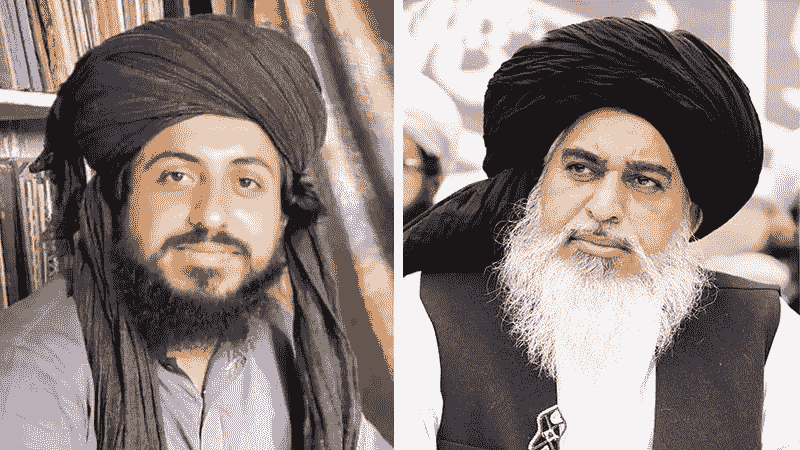

昨天印度推特上最热门的话题是*#巴基斯坦内战*。然后我读到法国通过电子邮件警告其公民立即离开巴基斯坦。当我们被电晕第二波占领的时候，巴基斯坦已经有 13 人死亡，1 名警察，12 名 TLP 工人。巴基斯坦政府正在考虑取缔激进党的决定。

# 法国的伊斯兰恐惧症

几个月前，世界震惊地获悉学校老师萨姆·帕蒂被斩首的消息。法国对此反应强烈，决定坚定地支持这位老师和亵渎神明的行为，认为言论自由是法国民主的核心价值。多个国家对法国政府的立场感到愤怒，巴基斯坦首当其冲。巴基斯坦总理发表了一份反对全球伊斯兰恐惧症的长篇声明。

# 哈迪姆·里兹维

当巴基斯坦政府尽力召唤法国政府时，他们的公众想要更多；从抵制所有产品到驱逐所有法国大使，对法国使用核武器，斩首伊曼纽尔·马克龙。站在最前沿的是一个名叫哈迪姆·侯赛因·里兹维的人，他是去年参加选举的激进右翼政党 TLP 的领导人。他通过激怒巴基斯坦激进的伊斯兰民众，感觉到了一个崛起的机会。他向巴基斯坦政府提出了一些几乎不可能被政府接受的要求。

紧接着，Khadim Hussain Rizvi 在拉瓦尔品第市的 Murree 路上开始了抗议游行。

防暴警察不得不对投掷石块的 TLP 抗议者使用催泪弹，这些抗议者成功到达了连接**拉瓦尔品第和伊斯兰堡**的法扎巴德交汇处，并在那里发起了静坐示威。

两天后，执政党介入并书面接受了他们的所有要求，要求他们解除封锁。

仅仅两周之后，哈迪姆·里兹维就非自然死亡，人们对他的死因知之甚少(有消息称三军情报局除掉了他，因为他的要求巴基斯坦不可能接受)。我们不能忽视巴基斯坦对法国的依赖，从使用海市蜃楼中队到从法国获得货币援助，以及作为优惠贸易伙伴帮助他们的农民很多。巴基斯坦不能失去他们从富裕的西方国家得到的所有这些帮助。

我们以为哈定死后 TLP 会沉寂下来，但是在过去的几天里，我们看到了 TLP 在萨阿德·里兹维的领导下重新崛起。现在的抗议比以前更加暴力，也比以往更加强烈。禁止它们不会解决危机

# 哈迪姆·里兹维是什么时候在巴基斯坦政坛崭露头角的？

巴尔维人占巴基斯坦人口的近 50 %,但他们没有德奥班迪人和哈迪人的政治影响力。巴勒维学派曾试图被描绘成伊斯兰教更温和的一面，但这一计划在前旁遮普省省长萨尔曼·塔西尔(Salman Taseer)遇刺后于 2011 年土崩瓦解。

杀害萨尔曼·塔西尔的凶手 Mumtaz Qadri 是一名巴雷维人，他声称他杀害了塔西尔，因为他曾公开支持因涉嫌亵渎而被监禁的基督教妇女 Asia Bibi。

Qadri 是 Khadim Rizvi 的追随者，kha dim Rizvi 一直公开反对对巴基斯坦亵渎法的任何改革，并将任何这样做的企图视为对神圣先知荣誉的攻击。

> 这不是 TLP 第一次呼吁抗议，当 Asia Bibi 被判无罪时，他领导了该国的暴力抗议活动，使整个国家陷入瘫痪。直到 Asia Bibi 离开这个国家，他才被释放。

# 巴基斯坦恐怖主义分析

既然这是一个新兴的激进组织，可以动摇巴基斯坦的政治，我想研究巴基斯坦的恐怖主义趋势。

我们将从从 Kaggle 下载全球恐怖 [**数据开始。**](https://www.kaggle.com/START-UMD/gtd)

下载后，我们可以打开笔记本开始，

```
import pyforest
terror=pd.read_csv("terror.csv")
pak_=terror[terror["country_txt"]=="Pakistan"]
pak.head()
```

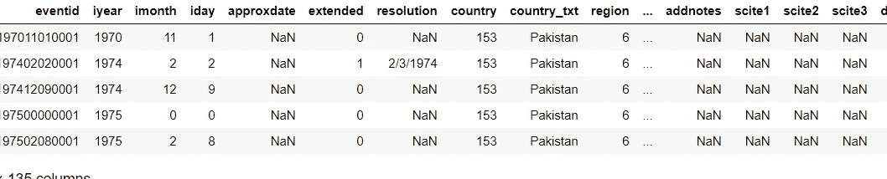

## 巴基斯坦每年的袭击事件

```
import math
import numpy as np 
import matplotlib.pyplot as plt
import seaborn as snsimport plotly.express as px
import plotly.graph_objs as gofrom matplotlib.ticker import FuncFormatter,ScalarFormatter
import matplotlib.animation as animation
from IPython.display import HTMLfrom plotly.offline import plot, iplot, init_notebook_mode
init_notebook_mode(connected=True)
%matplotlib inline
pd.options.mode.chained_assignment = None
sns.set(style="darkgrid")plt.figure(figsize=(24,12))
sns.countplot(x = "iyear", data = pak)
plt.title("Attacks per Year")
```

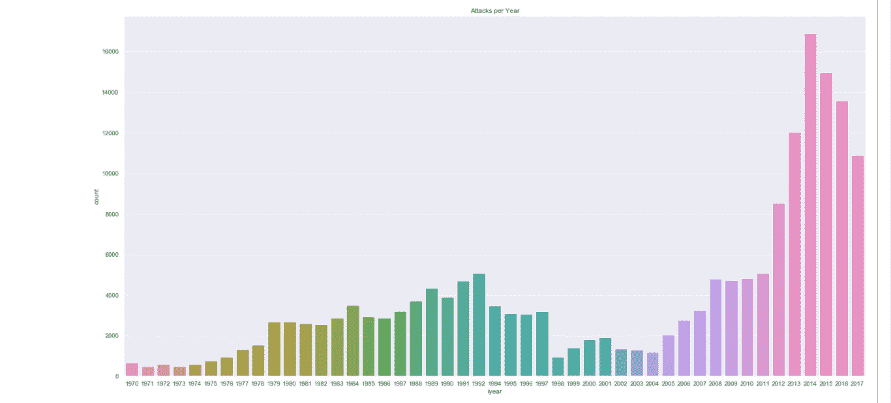

## 巴基斯坦的袭击模式

```
pak["city"].fillna("Unknown", inplace = True)
pak["nkill"].fillna(0, inplace = True) figure = px.scatter(pak, x="iyear", y="provstate", color="attacktype1_txt",size="nkill", hover_name="provstate", log_x=True, size_max=80, title = "Attack in pakistan each Year")figure.show()
```

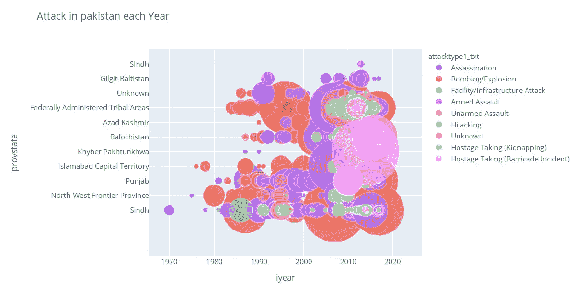

## 世界上被武器杀死的人

```
px.pie(terror, names = "attacktype1_txt", values = "nkill", title = "Percentage of Kills with specific Weapon")
```

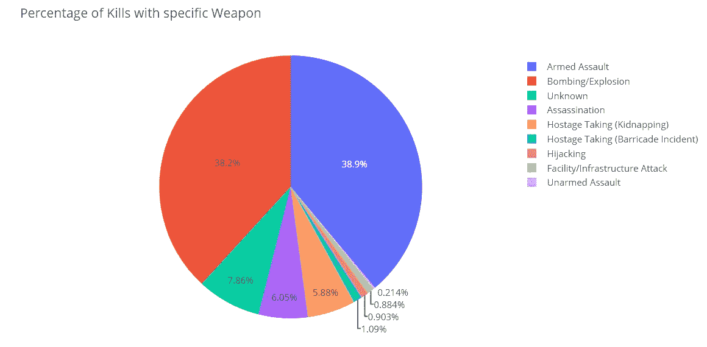

## 在巴基斯坦被不同武器杀死的人

```
px.pie(pak, names = "attacktype1_txt", values = "nkill", title = "Percentage of Kills with specific Weapon")
```

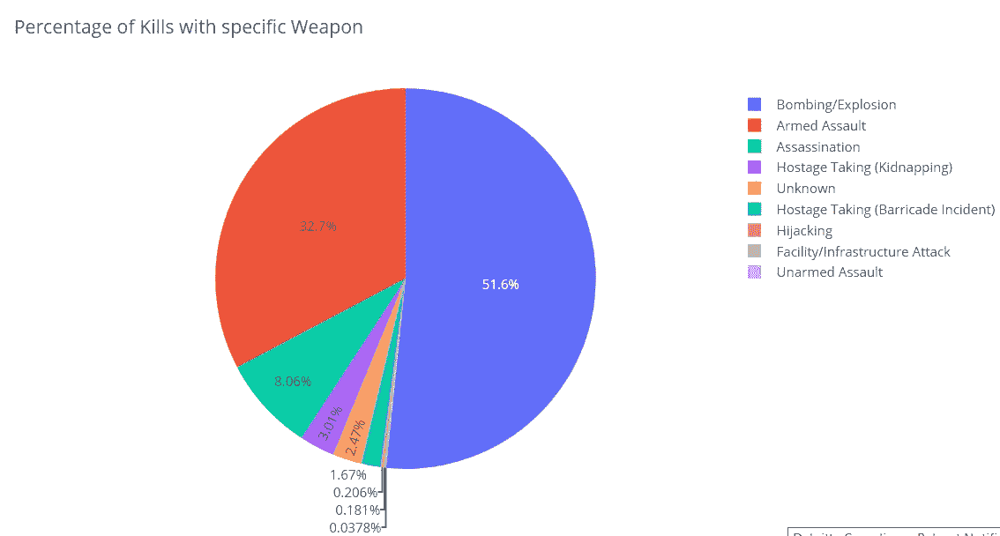

> 巴基斯坦的爆炸案件较多，因为恐怖组织大多选择炸弹袭击，而武装袭击在西方世界更为常见。

# 过去 40 年的恐怖主义

## 1.80 年代的巴基斯坦恐怖袭击

```
pak_80 = pak[(pak['iyear'] == 1980) | (pak['iyear'] == 1981) | (pak['iyear'] == 1982)|(pak['iyear'] == 1983)|(pak['iyear'] == 1984)|(pak['iyear'] == 1985)|(pak['iyear'] == 1986)|(pak['iyear'] == 1987)|(pak['iyear'] == 1988) |(pak['iyear'] == 1989)]
```

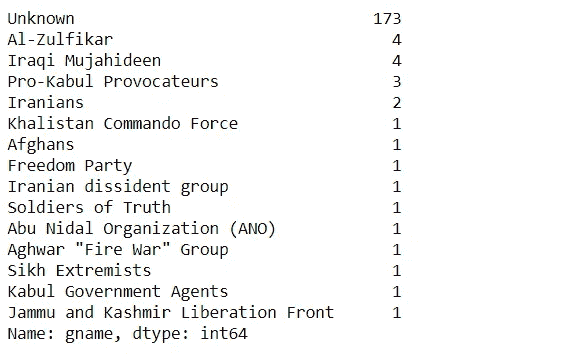

佐勒菲卡尔是佐勒菲卡尔·布托在齐亚·哈克的军事政变中被暗杀后，由他的儿子们成立的一个左翼军事组织。

## 2.90 年代的巴基斯坦恐怖袭击

```
pak_90 = pak[(pak['iyear'] == 1990) | (pak['iyear'] == 1991) | (pak['iyear'] == 1992)|(pak['iyear'] == 1993)|(pak['iyear'] == 1994)|(pak['iyear'] == 1995)|(pak['iyear'] == 1996)|(pak['iyear'] == 1997)|(pak['iyear'] == 1998) |(pak['iyear'] == 1999)]
```

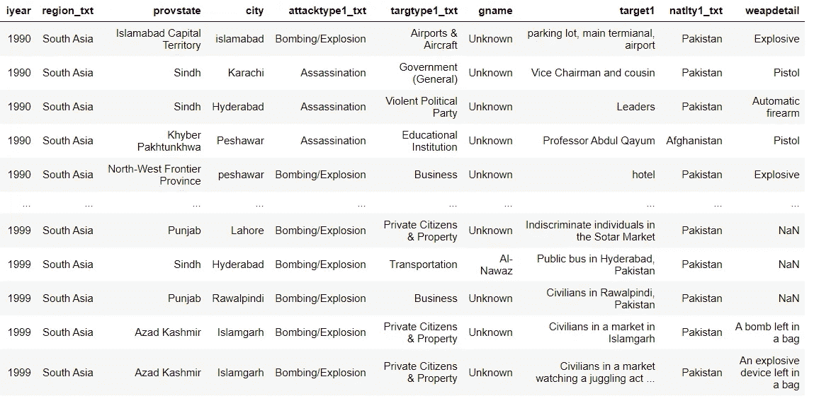

```
pak_90["gname"].value_counts()
```

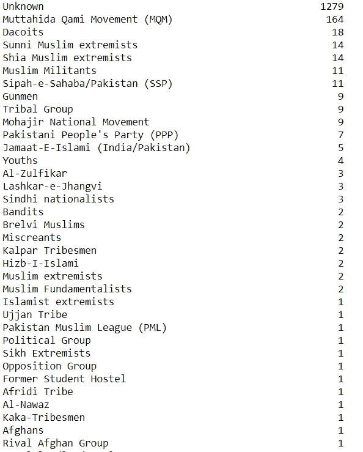

**武器细节**

```
pak_90["weapdetail"].value_counts()
```

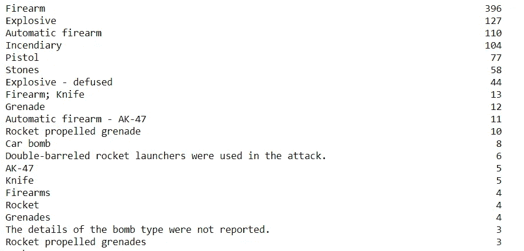

MQM 是阿尔塔夫·侯赛因在 1984 年为圣战者组织成立的一个政党。Mujahir 是一个术语，指的是分治后从印度迁移到巴基斯坦的穆斯林。该党在信德省有一个据点。

**省明智数**

```
pak_90["provstate"].value_counts()
```

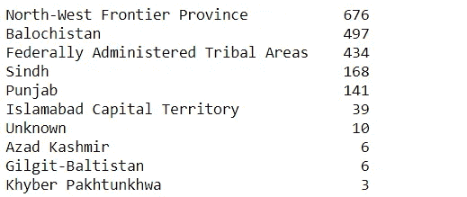

## 3.20 年代的巴基斯坦恐怖袭击

```
pak_20 = pak[(pak['iyear'] == 2000) | (pak['iyear'] == 2001) | (pak['iyear'] == 2002)|(pak['iyear'] == 2003)|(pak['iyear'] == 2004)|(pak['iyear'] == 2005)|(pak['iyear'] == 2006)|(pak['iyear'] == 2007)|(pak['iyear'] == 2008) |(pak['iyear'] == 2009)]
```

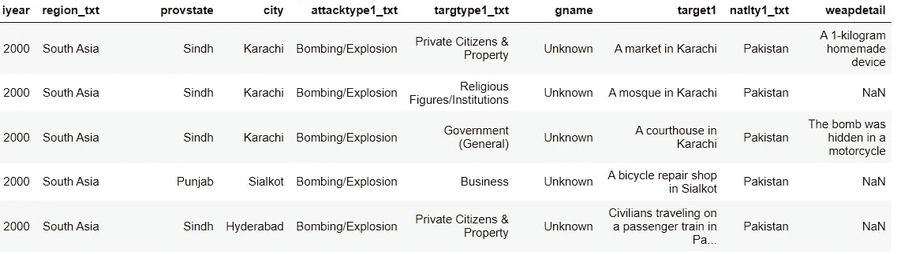

```
pak_20["gname"].value_counts()
```

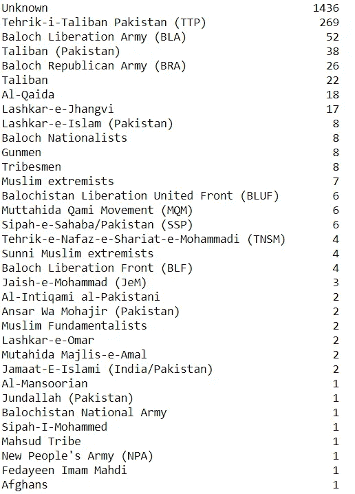

**武器细节**

```
pak_20["weapdetail"].value_counts()
```

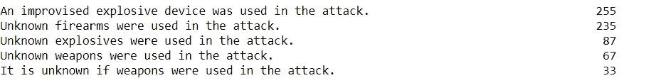

## 省份详细信息

```
pak_20["provstate"].value_counts()
```

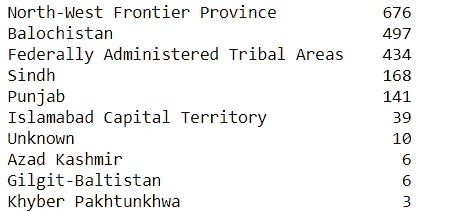

## 4.21 世纪的巴基斯坦恐怖袭击

```
pak_21 = pak[(pak['iyear'] == 2010) | (pak['iyear'] == 2011) | (pak['iyear'] == 2012)|(pak['iyear'] == 2013)|(pak['iyear'] == 2014)|(pak['iyear'] == 2015)|(pak['iyear'] == 2016)|(pak['iyear'] == 2017)]pak_21["gname"].value_counts()
```

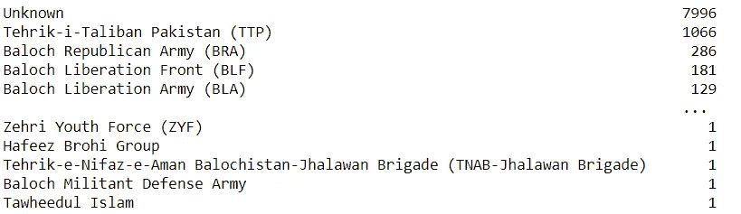

**武器细节**

```
weapon=pak_21["weapdetail"].value_counts()
weapon.head(60)
```

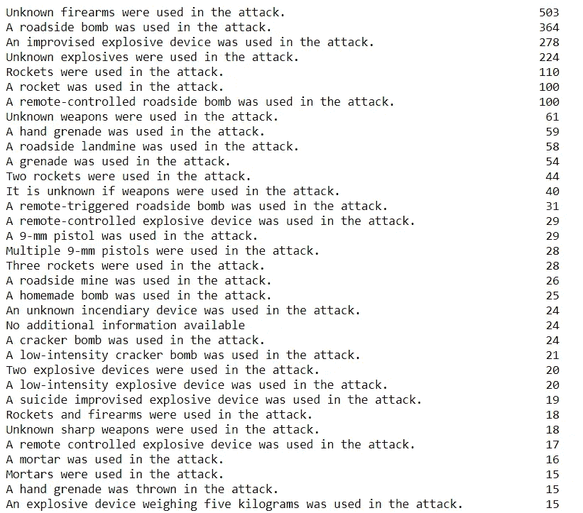

**省份明细**

```
pak_21["provstate"].value_counts()
```

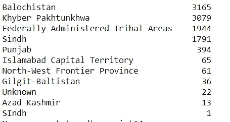