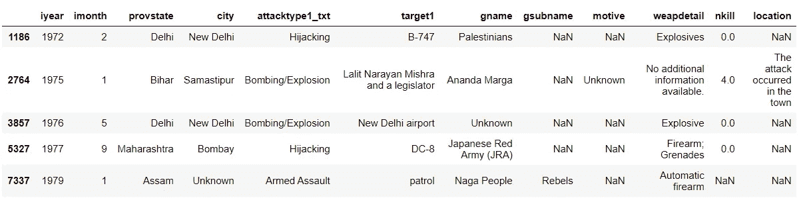
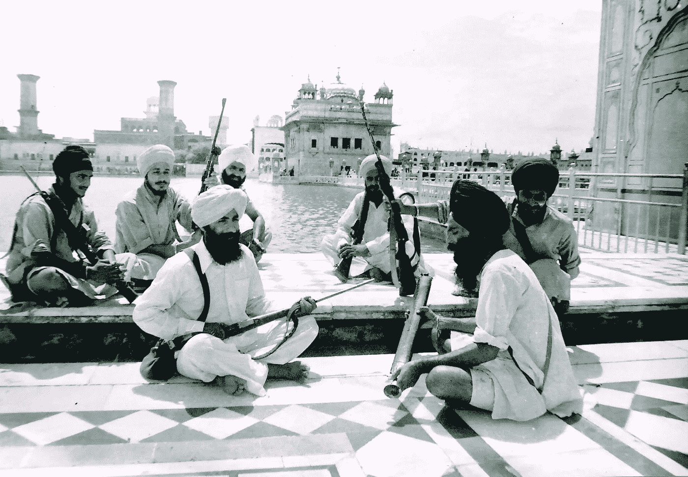

# 恐怖主义数据分析:印度的纳萨尔恐怖主义

> 原文：<https://medium.com/analytics-vidhya/terrorism-data-analysis-red-terror-in-india-e026fd0e3a41?source=collection_archive---------17----------------------->


在查蒂斯格尔邦的苏克马区，22 名印度士兵遭到 PLGA 的伏击。据报道，毛派分子试图破坏 Sukma 区 Silger-Jagargunda 附近的一项道路建设。这条路危及他们的生存。这次袭击是由 PLGA 酋长马德维·希德马领导的。

我想分析印度过去 50 年的恐怖主义趋势。所以我从[](https://www.kaggle.com/START-UMD/gtd)**下载了全球恐怖主义数据(1972–2017)。**

# **数据分析**

**让我们从将 CSV 数据导入数据框并显示前 5 条记录开始。**

```
import pyforest
terror_data=pd.read_csv("terror.csv")
terror_data.head()
```

****

**我们创建了一个数据框。现在我将搜索印度的数据，只保留相关的列用于我的分析。CSV 文件中共有 135 列。**

```
india=terror_data[terror_data["country_txt"]== "India"]india_terrorism=india[["iyear", "imonth","provstate", "city", "attacktype1_txt","target1", "gname","gsubname","motive",  "weapdetail", "nkill","location"]]
```

****

**我们将统计从 1972 年到 2017 年间印度发生的恐怖袭击次数。**

```
india_terrorism["iyear"].value_counts()
```

****

**就恐怖袭击而言，2016 年是印度最致命的一年，而 1981 年是最和平的一年。**

## **70 年代的恐怖袭击(1972 -1980)**

****

**70 年代是印度处理米佐拉姆致命叛乱的时期。我在我的缅甸文章中提到，米佐拉姆刚刚走出暴力，这就是为什么缅甸问题应该非常谨慎地处理。**

```
terror_70 = india_terrorism[(india_terrorism['iyear'] == 1972) | (india_terrorism['iyear'] == 1973) | (india_terrorism['iyear'] == 1974)|(india_terrorism['iyear'] == 1975)|(india_terrorism['iyear'] == 1976)|(india_terrorism['iyear'] == 1977)|(india_terrorism['iyear'] == 1978)|(india_terrorism['iyear'] == 1979) ]
terror_70
```

************

****被恐怖组织杀害的人(gname)****

```
terror_70["nkill"].sum()
```

****

```
terror_70=terror_70.groupby("gname").sum()
terror_70["nkill"]
```

********

> **纳萨尔派和毛派在 70 世纪杀害了 35 人中的 7 人。占所有恐怖袭击的 20%。**

## **80 年代(1980-89)的恐怖袭击**

****

**这十年旁遮普发生了致命的叛乱。在这十年里发生了许多不幸的事件。**

```
terror_80 = india_terrorism[(india_terrorism['iyear'] == 1981) | (india_terrorism['iyear'] == 1982) | (india_terrorism['iyear'] == 1983)|(india_terrorism['iyear'] == 1984)|(india_terrorism['iyear'] == 1985)|(india_terrorism['iyear'] == 1986)|(india_terrorism['iyear'] == 1987)|(india_terrorism['iyear'] == 1988)|(india_terrorism['iyear'] == 1989) ]terror_80
```

********

****被恐怖组织杀害的人(gname)****

```
Total people killed by Terror attacks.terror_80=terror_80.groupby("gname").sum().sort_values(by="nkill", ascending=False)
terror_80["nkill"]
```

********

```
terror_80["nkill"].sum()
```

****

> **80 世纪共有 3079 人死于恐怖袭击。纳萨尔派杀死 41 人，解放军杀死 20 人，毛派杀死 11 人。PWG 杀死了 9 人，部落分裂分子杀死了 5 人，共产党杀死了 1 人。共有 87 人被左翼分子杀害，占总伤亡人数的 2%。**

## **90 年代的恐怖袭击(1990 年至 1999 年)**

****

**这是克什米尔交战的十年。大多数袭击发生在克什米尔和旁遮普。旁遮普的叛乱在 90 年代末结束。**

```
terror_90 = india_terrorism[(india_terrorism['iyear'] == 1990) | (india_terrorism['iyear'] == 1991) | (india_terrorism['iyear'] == 1992)|(india_terrorism['iyear'] == 1993)|(india_terrorism['iyear'] == 1994)|(india_terrorism['iyear'] == 1995)|(india_terrorism['iyear'] == 1996)|(india_terrorism['iyear'] == 1997)|(india_terrorism['iyear'] == 1998) |(india_terrorism['iyear'] == 1999)]
terror_90
```

****

```
terror_90_count=terror_90["gname"].value_counts()
terror_90_count.head(60)
```

****

****被恐怖组织杀害的人(gname)****

```
terror_90=terror_90.groupby("gname").sum().sort_values(by="nkill", ascending=False)
terror_90["nkill"].head(50)
```

********

> **我想在这里提到的重要一点是， **Ranbir Sena** 我们可以在上面的列表中看到，是一个**反纳萨尔派**激进组织，主要由上层种姓男子创建，旨在结束纳萨尔派恐怖主义。**

```
terror_90["nkill"].sum()
```

****

> **PWG、MCC、纳萨尔派、解放军、毛派、部落游击队、毛派农场工人都是左翼极端主义的形式。他们杀死了 6211 人中的 500 人，占总数的 8%。**

## **20 世纪的恐怖袭击(2000-09)**

****

**这十年见证了 2004 年 ***CPI-毛派*** 组织的形成，该组织开始了针对印度政府的致命叛乱，导致数千名毛派分子、警察、平民被杀。**

```
terror_20 = india_terrorism[(india_terrorism['iyear'] == 2000) | (india_terrorism['iyear'] == 2001) | (india_terrorism['iyear'] == 2002)|(india_terrorism['iyear'] == 2003)|(india_terrorism['iyear'] == 2004)|(india_terrorism['iyear'] == 2005)|(india_terrorism['iyear'] == 2006)|(india_terrorism['iyear'] == 2007)|(india_terrorism['iyear'] == 2008) |(india_terrorism['iyear'] == 2009)]terror_20
```

****

```
terror_20_count=terror_20["gname"].value_counts()
terror_20_count.head(60)
```

****

****被恐怖组织杀害的人(gname)****

```
terror_20=terror_20.groupby("gname").sum().sort_values(by="nkill", ascending=False)
terror_20["nkill"].head(50)
```

********

```
terror_20["nkill"].sum()
```

****

> **总共 6148 人中有 1451 人被左翼极端组织杀害。占所有恐怖相关死亡的 23 %。它甚至可能更高，因为“未知”的攻击者也有很多左翼极端组织，但为了简单起见，我不做任何假设。**

## **21 世纪的恐怖袭击(2010-17)**

```
terror_21 = india_terrorism[(india_terrorism['iyear'] == 2010) | (india_terrorism['iyear'] == 2011) | (india_terrorism['iyear'] == 2012)|(india_terrorism['iyear'] == 2013)|(india_terrorism['iyear'] == 2014)|(india_terrorism['iyear'] == 2015)|(india_terrorism['iyear'] == 2016)|(india_terrorism['iyear'] == 2017)]terror_21
```

****

```
terror_21_count=terror_21["gname"].value_counts()
terror_21_count.head(60)
```

****

****被恐怖组织杀害的人(gname)****

```
terror_21=terror_21.groupby("gname").sum().sort_values(by="nkill", ascending=False)
terror_21["nkill"].head(50)
```

********

```
terror_21["nkill"].sum()
```

****

> **印度共产党-毛派(CPI-Maoist)，毛派，印度人民解放阵线，人民解放军，CPI 马克思主义者，贾坎德邦解放猛虎组织，贾坎德邦普拉斯图蒂委员会(JPC)是具有**左派意识形态的恐怖组织，**他们杀害了总数为 3851 人(2010 年至 2017 年)中的 2349 人，占压倒性的 60%。**

# **受毛派影响的国家**

**尽管有太多的毛派组织，但是，为了简单起见，我只考虑其母组织(CPI-Maoist)。**

```
naxal=india_terrorism[india_terrorism["gname"]=="Communist Party of India - Maoist (CPI-Maoist)"]
naxal["provstate"].value_counts()
```

****

# **毛派攻击的动机**

```
naxal["motive"].value_counts()
```

****

**大多数时候，村民因为向警方告密而被毛派杀害。**