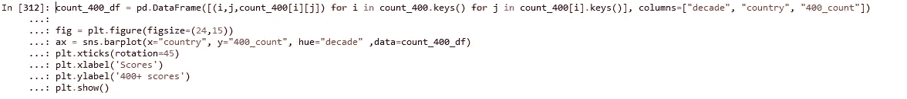

# 测试板球趋势:Python 数据概述

> 原文：<https://medium.com/analytics-vidhya/test-cricket-trends-a-data-overview-with-python-6e33e9393033?source=collection_archive---------5----------------------->

板球运动是由英国人带到印度的，今天它是次大陆上最受欢迎的运动。板球运动已经有 150 年的历史了，和其他运动一样，它已经发展成为当今最受欢迎的现代运动之一。

这项运动以前是精英的运动，因此被称为绅士的游戏。今天，我们有像 Dhoni 女士这样的板球运动员的迷人故事，她是一名来自兰契这样的二线城市的板球队长，T.Natarajan 从更加卑微的背景上升到地平线上，还有无数关于小镇男孩进入中心舞台并吸引板球疯狂国家的注意并成为超级明星的故事。

即使有如此多的变化，板球仍然是一项在 22 码球场上进行的游戏，每队 11 名球员组成两个队，在游戏的各个方面，即击球，保龄球和防守方面竞争胜过对方。

毫无疑问，板球测试被全世界的玩家和评论家认为是最纯粹和最具挑战性的比赛形式。

这项运动的历史可以追溯到 1877 年，当时英国和澳大利亚在著名的墨尔本板球场举行了第一场测试赛。

俗话说:“数字不会说谎”。一场板球比赛的记分卡提供了对任何比赛的一瞥。因此，我从 ESPNCricinfo 中删除了数据，ESPNCricinfo 恰好是到目前为止所有比赛记分卡的一站式资源。

我创建了一个比赛细节主数据集，包括过去 150 年板球比赛中超过 2400 场比赛的数据。

我们将探索这个多学科游戏的各个方面的趋势。

测试赛:最具挑战性的游戏形式

从 ESPNCricinfo 网站的 Web 报废开始:

我编写了 Python 函数，主要在 3 个层次上废弃数据:

1.  获取所有测试匹配的 CricInfo 匹配 id
2.  获取每个测试匹配的相关记分卡数据特征
3.  转换提取的特征以构建有意义的特征

# **要在数据集中探索的主题:**

**游戏在印度次大陆的传播**

当板球在 19 世纪诞生时，次大陆还处于外国统治之下，尽管加尔各答最古老的体育场“伊甸园花园”建于 1864 年，但第一场比赛直到 1934 年才在这里举行。

直到 20 世纪初，只有英格兰、澳大利亚和南非是职业板球运动处于最高水平的突出国家。大约在 20 世纪中叶，英国在亚洲的殖民地获得了独立，也在世界舞台上找到了自己的身份，无论是在政治领域还是体育领域。

次大陆的狂热粉丝

今天，这项运动在次大陆非常受欢迎，世界上任何其他地方的板球爱好者的热情和热情都无法与之相比。难怪，今天世界板球的很大一部分是在次大陆进行的。

为此创建的 Python Pandas 数据帧是 match_stats_df。运行东道国大陆信息的可视化:

让我们也来看看几十年来各个国家的数据:

从图表中一瞥世界大事:

1.  主办的比赛总数的下降可以在第二次世界大战期间的 1910 年代和 1940 年代看到。
2.  南非的线图(粉色线)在 20 世纪 60 年代左右突然停止，并在 20 世纪 90 年代再次出现在图上。种族隔离的年代使南非在全球范围内失去了作用，只有在反种族隔离运动在比勒陀利亚取得成功之后，南非才被允许回归。
3.  孟加拉线图(橙色线)在 20 世纪 50 年代和 60 年代出现过小波动，但直到 20 世纪 90 年代才停止活动。这显然是由于 50 年代和 60 年代在昔日的巴基斯坦举行的比赛。孟加拉国作为一个独立的国家在 20 世纪 90 年代末才首次亮相。
4.  巴基斯坦图表显示，在 20 世纪 90 年代左右以及 2000 年代前后，那里举办的比赛数量有所下降。这可以归因于叛乱，减少了愿意访问巴基斯坦的团队数量，最后，2009 年对斯里兰卡团队的恐怖袭击是棺材上的最后一颗钉子。这一转变带来了阿联酋作为全球板球地图上突出的板球测试场地的崛起
5.  总而言之，英格兰和澳大利亚的麦加仍然是全球板球对抗赛的举办地。

**I.B .测试蟋蟀的热点**

让我们来看看板球测试赛 Meccas，该场地至少有 50 场测试赛。

上图没有任何印度场馆。其主要原因可能是二线城市作为测试场地的快速发展，导致今天该国超过 15 个测试场地。相比之下，像英国，澳大利亚，南非这样的国家只有 4-5 个测试场地，导致他们每个国家举办更多的比赛。

**二世。测试赛的趋势。**

**A .测试赛中得分率的稳步上升。**

20 世纪下半叶，接近 2-2.2 的运行率被视为一个主要特征。但就在 1970 年前后，转变似乎朝着 2.5 RPO 的方向发展。除了更好的球棒制造，唯一的原因是 1971 年引入了更短的比赛形式(一日国际赛)。

随着 21 世纪第一个十年最短形式的比赛的到来，击球跑垒率的下一次升级将会发生。

在 2000 年和 2010 年的十年中，可以清楚地看到运行率越来越接近 3.5 RPO 标志的平均值，这确实确保了现代越来越多的测试赛能够实现胜负结果，更少的平局比赛和更多的体育迷兴奋。

**B .测试局中个人得分:幂律分布**

每一个踏上板球场的击球手的目标是至少有一个测试世纪，如果不是贪婪更多的话。这些年来，考虑到平均每场比赛有 30 名击球手有机会击球(迄今为止有 2400+场比赛)，大约 70000+次击球手必须有机会展示他们的击球技能，但正如前面所观察到的，几个世纪以来很少出现，平均每场比赛只有 1-2 名击球手达到神奇的 3 位数。让我们看看其他人都经历了什么。

奇怪的是，几十年来，第三个四分位数不到 40。换句话说，在测试局中得分超过 40 分会让你排名前 25 %。粉丝们很贪婪，不愿意满足于他们最喜欢的击球手少于一个世纪的成绩，这难道不奇怪吗？

**C .逐渐成为击球手的游戏？**

随着球棒越来越擅长用力击球，某些规则据称对击球手比对投球手更有利。虽然第一局的安全分数取决于很多因素，但在任何情况下 400+的分数都可以被认为是一个安全的赌注。

让我们找出这个假设的数据证据:

A.从 19 世纪 80 年代到 2000 年代，所有球队的总成绩稳步上升到 400+分。

B.澳大利亚在 2000 年代的统治地位可以被视为 70+总计 400+的巨大高塔。

C.与 2000-2010 年相比，所有团队在 2010-2020 年的总数减少了 400 多个。这些主要归因于:

1.随着 T20 板球作为更可接受的形式的出现，较少的测试板球正在进行。

2.击球手变得越来越不耐烦，冒险投篮，更少地努力，更快得分的欲望可能会导致像澳大利亚和英格兰这样的球队。

3.在过去十年中，只有新西兰和孟加拉国的得分超过 400+分，这两个国家都是世界板球的新兴力量。

**D .下级对团队总成绩的贡献**

不管你有多少专业击球手，他们总是说，“尾巴应该摇”。较低级别的击球手(7 号击球手—11 号击球手)通常由所有击球手/投球手组成，他们碰巧不太擅长击球。

通常，当前 6 名击球手未能为他们的球队增加实质性的得分时，所有的眼睛都盯着尾巴，期待着:“尾巴应该摇摆”。

Tail 从来都不可靠，它交付的运行次数比预期的要少。让我们量化他们的贡献。

南非、孟加拉国和津巴布韦的第三季度数据最高。从而显示出与其他团队的较低顺序相比，他们的较低顺序对他们各自团队总数的贡献更大。

*   跳过爱尔兰，因为该国在 2019 年才进行了首次测试。

我将会在接下来的文章中发布更多关于这个数据集的分析，这些文章将会集中在我们都喜欢的游戏的其他方面。敬请关注..

感谢阅读！分享给板球爱好者…

Github 回购:【https://github.com/Sarrae1406/cricket_analytics】