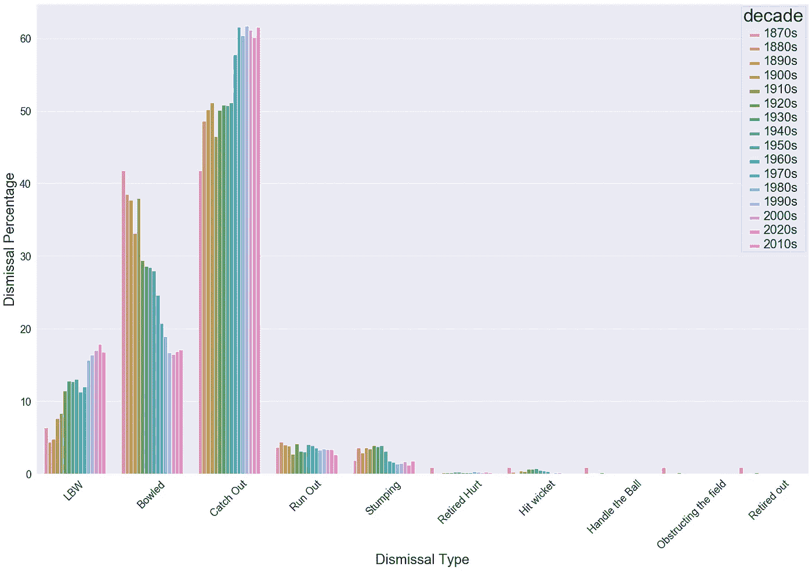
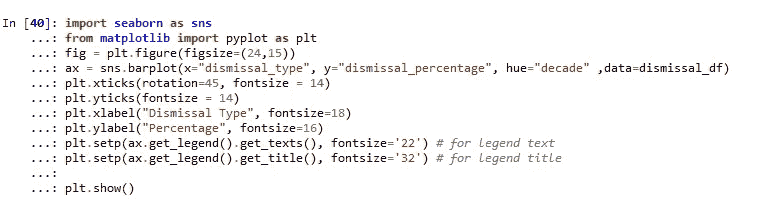
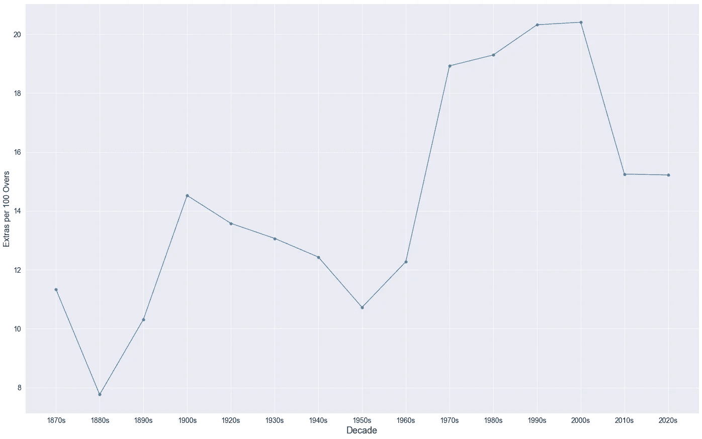
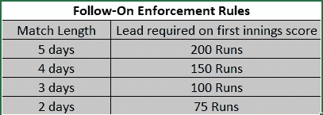
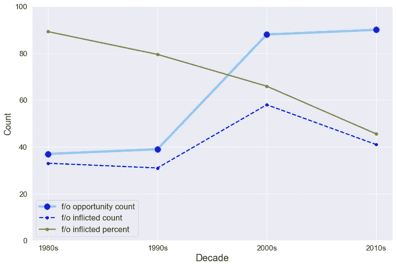
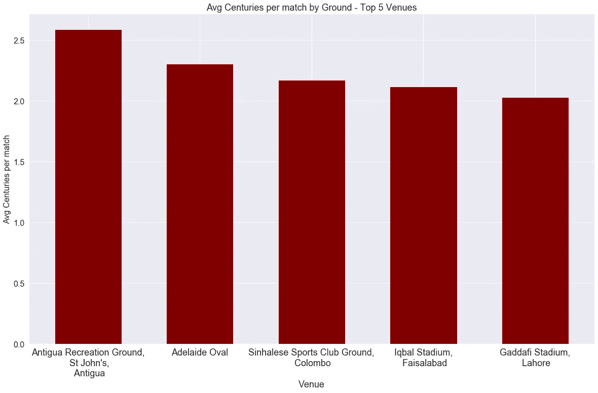
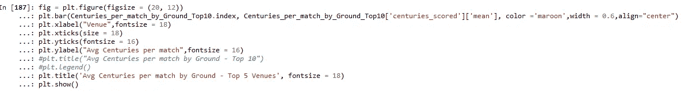
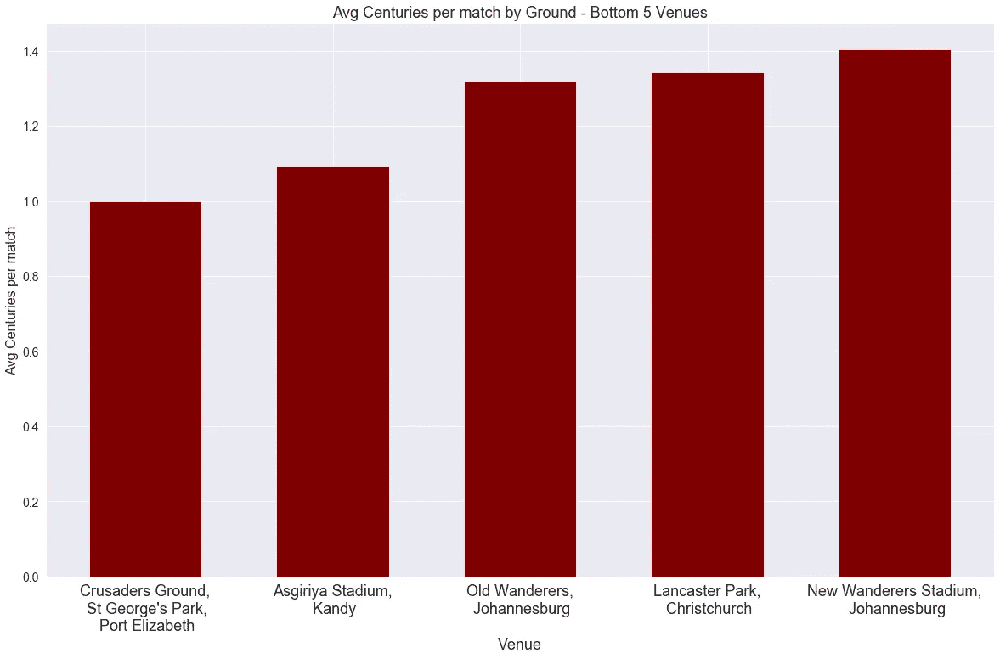
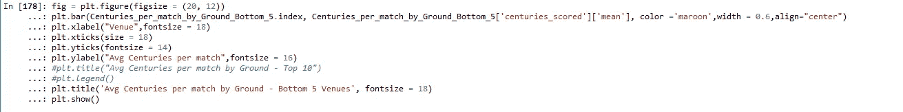

# 测试板球趋势:Python 数据概述:第 2 部分

> 原文：<https://medium.com/analytics-vidhya/test-cricket-trends-a-data-overview-with-python-part-2-eb7e764187cf?source=collection_archive---------3----------------------->

继续我之前的博客“测试板球趋势:Python 数据概述”，通过数据棱镜展示了过去 150 年测试板球中击球技术的演变，在这篇博客中，我将分享对这项美丽游戏的另一个方面——“保龄球”的见解。

如果你喜欢阅读更早的博客，其中包含了关于板球运动逐渐传播到次大陆的见解，以及它如何据称已经成为击球手的游戏和更多这样的见解。

 [## 测试板球趋势:Python 数据概述

### 板球运动是由英国人带到印度的，今天它是次大陆上最受欢迎的运动。游戏…

medium.com](/analytics-vidhya/test-cricket-trends-a-data-overview-with-python-6e33e9393033) 

当一个人想到板球比赛中的保龄球时，一系列保龄球传奇闪现在眼前，从我这一代的格伦·麦格拉思、唐纳德到安德森，而肯定是从罗伯茨到上一代的麦克德莫特和威利斯，以及更多多年来为国家穿上白色球衣的人。

跨越板球测试时代的保龄球传奇。

# 1.解雇类型及其分布:

今天，在板球比赛中，投球手有 10 多种方法来打发击球手。作为一个保龄球手，木材的声音(“保龄球出来”)是最悦耳的东西。

即使手头没有任何数据，人们也可以很容易地告诉 LBW，Bowled 和 Catchout 将是板球比赛中最有可能的出局方式。

让数据潜水。

这里的数据集包含了过去 145 年中所有的测试赛，网页是从 ESPNCricInfo 上搜集来的。

# **数据洞察:**

**A.** *这些年来，被抓出来的遗骸最有可能的出路。*

在过去的三四十年里，高达 60%的击球手被抓出局。

这些年来,“突然解雇”的比例稳步下降。

早在 19 世纪，保龄球也同样可能(40-42%)是一种出局的方式。但是今天只有接近 16-17%的击球手被击倒。这一下降似乎很容易归因于这些年来低出生体重儿解雇率的上升。

**C.** *低出生体重者的解雇:低出生体重者稳步上升，在当今时代相当于“被解雇”。*

从 19 世纪的 5-6%上升到 1980 年的 17-18%。各种重要的变化是造成低出生体重儿解雇率上升的原因。

**LBW 规则重要变化:**
1935 年——击球手可以被判 LBW 出局，即使球投出了界外球。

1972 年——在某些情况下，如果击球手没有试图用球棒击球，他们将被判为低体重出局。

1990 年——电视回放的可用性，以及后来帮助裁判的球跟踪技术，增加了 LBW 的百分比。

可以看到，伐桩解雇率从前一个时代的 4%下降到了 2%。

由于 stumping 是一种解雇类型，只有旋转投球手，这可能很好地表明，在过去的几十年里，全球旋转的三柱门份额较小。改天的事..

或者这可能是一个迹象，表明击球手要么更多地从折痕打球，要么太舒服地对抗旋转而被淘汰出局。

***撞三柱门、妨碍场地、处理球和退赛伤所占比重不到 1%。***

# **保龄球每 100 回合的额外失分。**

**保龄球队的额外让步对击球方来说是一种恩惠。虽然额外失分的绝对数字是一局投球数的函数，但我已经将其标准化为“每 100 次投球数的额外失分”，只是为了使它们可以与投球数相比。**

**让我们深入研究数据。**

****

**额外让步与保龄球队的纪律成反比。**

## **数据趋势:**

**额外让步与保龄球队的纪律成反比。**

**图表显示，在前 ODI 时代(1870 年至 1960 年)，保龄球员更加稳定，因为我们看到在后来的几年中线性上升，然后在过去的二十年中显示出改善的迹象。
这种最新的进步是否可以归因于 T20 板球的出现，以及像“自由击球”这样严厉惩罚投球手的规则？**

*** 1910 年是个例外，因为第一次世界大战只举办了几场比赛。**

# **强制执行后续措施现在已经是过去的事情了..**

**在早期的板球运动中，由于规则规定的跑垒差，跟进曾经是一件强制性的事情，不像今天保龄球队可以决定是否要执行跟进。**

****

**在 1980 年，法律被修改，决定实施后续行动是可选的，是保龄球队队长的特权。**

**从历史上看，在巨大的压力下，对对方球队施加后续影响的球队通常会在心理上巩固他们对比赛的控制，这就像一条不成文的规则一样，通常会通过将对方的击球手逼入困境来赢得比赛。**

**像 2001 年著名的加尔各答奇迹这样的比赛一定也在某种程度上改变了世界各地板球队长的精神。现在，随着击球手变得越来越勇敢，球队在一段时间内变得更加强大，是时候进行数据潜水了。**

****

**后续执行的下降趋势**

**可以观察到十年间急剧下降的趋势。**

# **击球手和投球手最喜欢的场地:**

**一个球场角色在很多方面代表了一个板球场地。它决定了表面上的比赛类型，实质上决定了击球手是否会在比赛中统治投球手，或者相反。**

**不用说，击球手喜欢良好的击球条件和场地，可以看到许多世纪的得分。另一方面，在一个非常友好的球场上，击球手几乎不可能达到 3 位数。**

**让我们来看看它们最喜欢的猎场。**

****

**亚洲:击球手的天堂**

****

****再次值得注意的一点是:**
1**。** 3/5“每场比赛得分最高的世纪”位于印度次大陆。**

****2。** 2。只有 1/5 的“每场比赛得分最低的世纪”entrie 拥有亚洲场地。**

****

**南非:保龄球员的天堂。**

****

**不用说，亚洲板球场是“击球手的天堂”，而南非/新西兰证明是“优势投球手”！！**

***希望您对这篇文章有所反馈，也希望您对板球统计数据有更多的分析。***

**感谢阅读！分享给所有的板球爱好者…**