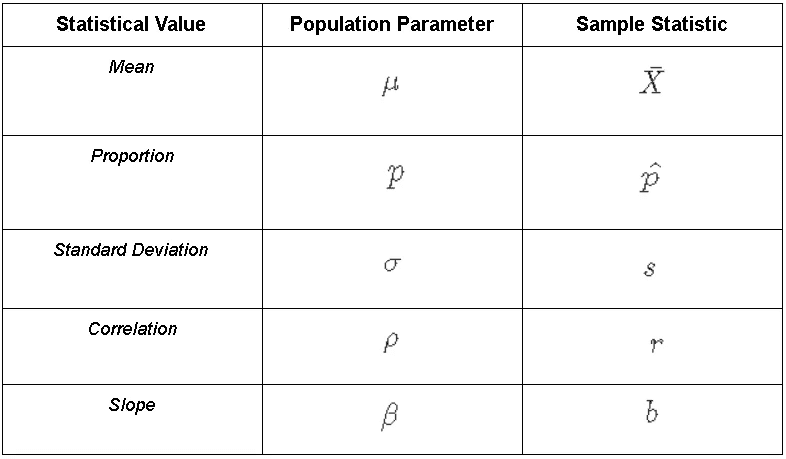
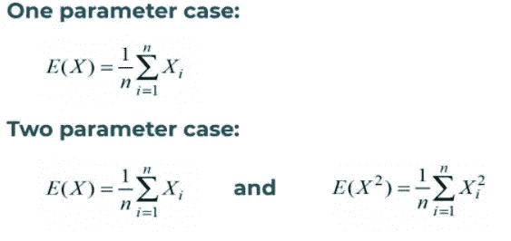
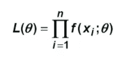
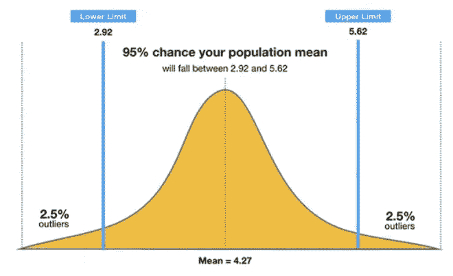
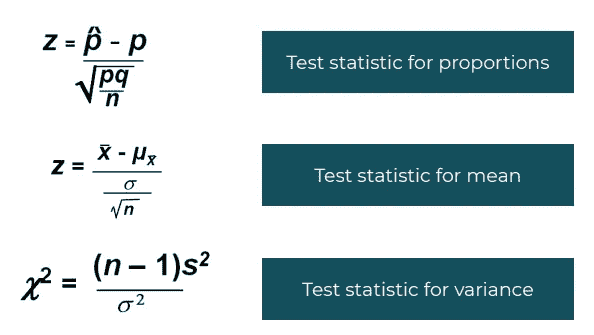
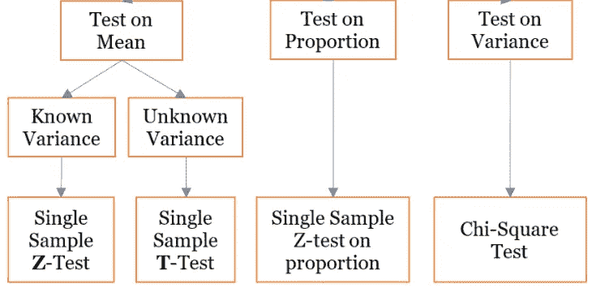
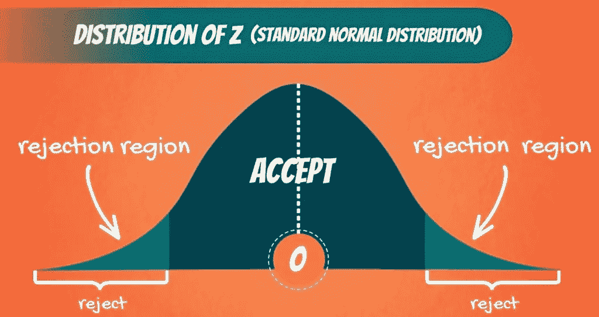
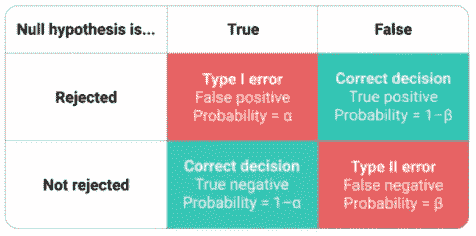

# 使用假设检验声明

> 原文：<https://medium.com/analytics-vidhya/testing-claims-using-hypothesis-bb6262fc8627?source=collection_archive---------7----------------------->

盘子里的玉米。

你有没有想过玉米的玉米芽总数是多少？大概不会！这是因为玉米对我们来说并不重要。它们不是我们开支的主要部分。

然而，对凯洛格来说，计算玉米中玉米芽的数量是一件大事。著名的凯洛格玉米片就是通过加工这些玉米芽制成的。由于玉米芽是最终产品的主要组成部分，因此了解玉米芽的数量对他们来说非常重要，这样他们就可以预测玉米片的数量。

让我们假设一个玉米芽平均包含大约 70 个芽，每个玉米的价格都是 10 卢比。此外，玉米芽与玉米片的比例(投入产出比)为 1:1，70 单位玉米片的价格为 40 卢比。因此，假设公司没有其他成本，平均而言，公司从每粒玉米中产生的利润约为 30 卢比。

所以在这里你可以看到玉米芽的数量是如何影响一个数十亿美元公司的盈利能力的。我们使用假设检验，通过使用统计数据来寻找这种说法的答案(一个玉米芽平均包含大约 70 个芽)。这种测试有助于我们根据输入的样本来理解该断言为真或不为真的可能性。让我们了解一些有助于假设检验的基本概念。

# 什么是假设？

通俗地说，假说就是对某一现象的一种假设或提出的解释。每当我们不能确定一个总体参数的真实值时，我们就提出假设。因此，我们假设人口参数有一个特定的值来检验对它的断言。下面是一些假设的例子

1.  一个人对鞋子的偏好与其颜色无关。
2.  M&M 盒子里的糖果数量相等。
3.  员工每月休假的天数等于 5 天。
4.  一个家庭中宠物的数量与住在其中的人数无关。

# **假设检验的基本组成部分**

1.  **统计:**统计是我们用来汇总样本数据的中心值。所以你可以说，从样本中得到的任何有代表性的值都叫做统计量。例如，我们从样本中找到平均值、方差和比例值，这些值用于找到测试统计数据。
2.  **参数:**正如统计量是用来概括样本的，参数是用来概括总体的性质。我们也用参数来代表整个人口。与统计值的情况类似，我们从样本中计算均值、方差和比例值，用于假设分析。

**用于表示群体和样本不同统计值的符号**

3.**点估计**:点估计包括代表未知总体参数的单个最佳值的计算。我们使用点估计来寻找一个值，该值作为总体参数的集中趋势。有两种常用方法来计算点估计值:-

*   **矩方法:**在这种方法中，我们基本上将总体矩等同于各自的样本矩，以便得到估计值。

**参数个数不同时点估计的计算**

*   **极大似然法:**在这种方法中，我们通过使用总体的总体密度函数或概率函数[f(x，0)]来寻找样本统计的似然性。我们对总体参数的似然函数求微分，以得到每个特定参数的最大似然估计量。

**从总体概率函数导出的似然函数。**

4.**置信区间**:我们使用置信区间来寻找基于样本分析的总体参数的估计值范围。与点估计不同，我们不希望找到未知总体参数的精确值，相反，我们希望知道参数在一定概率水平下的取值范围。因此，置信区间被设计为包含基于指定概率的参数值。

对 95%置信区间(左侧极限，右侧极限)的解释意味着有 95%的机会群体参数将位于左侧极限和右侧极限之间。置信区间的极限值也被称为**临界值**。

**95%置信水平的区间。**

5.**稀有事件规则:**这个规则是一个典型的属性，它允许我们通过使用样本数据对总体进行推断。罕见事件规则简单地说，如果我们对一个事件做出假设，发现观察到的事件的概率非常小，那么我们的假设是错误的。

> 如果在一个给定的假设下，一个特定的观察事件的概率非常小，我们得出结论，这个假设可能是不正确的

这里的基本思想是，我们通过对比两种不同的事物来检验假设:

*   很容易偶然发生的事件。*(零假设)*
*   极不可能偶然发生的事件。*(替代假设)*

因此，在进行假设检验时，我们使用来自罕见事件规则的知识来接受或拒绝原始假设。这条规则构成了显著性检验的基础。

6.**显著性检验:**这是一个正式程序，用于检查观察到的数据是否与我们的假设值或声称值一致。我们使用 p 值，通过与从样本数据得出的检验统计量进行比较，来检验我们是否可以拒绝零假设。在这个测试中，我们在开始时采用了某个显著性水平，并且只针对这个特定的显著性水平来测试我们的声明。

7.**检验统计量**:检验统计量是从样本统计量中得出的值。我们将样本统计值转换为分布分数，如 Z 分数(正态分布)、T 分数(T 分布)或卡方分布。如果分数值位于样本分布的置信区间内，那么我们不能拒绝零假设，否则我们拒绝零假设。

**计算检验统计量的公式**

8. **P 值:**该值中的 P 代表概率值。P 值是在假设零假设为真的情况下，获得与代表样本数据的值一样极端的检验统计值的概率。如果 P 值足够小，那么我们说结果在统计学上是显著的。计算 p 值的方法根据样本的分布而变化。但是，您可以使用下面提到的链接快速计算所有 p 值。

 [## 快速 P 值计算器

### 这是一套非常简单的计算器，可以从各种测试分数中生成 p 值(例如，t 检验、卡方检验…

www.socscistatistics.com](https://www.socscistatistics.com/pvalues/) 

# **测试中使用的两个假设**

我们都同意生活是艰难的。有些人必须真正非凡才能被社会所接受，而有些人仅仅是运气好而已。嗯，当我们谈论假设时，情况也是如此。为了被统计学家所接受，零假设总是被认为是有益的，而另一个假设必须展示出真正异常的结果。我不禁想知道如果假设是一个真实的人，另一个假设会如何看待零假设。

**零假设掩盖了所有四个备选假设**

既然我们熟悉零假设和替代假设之间关系的动力学，让我们正式理解它们。

1.  **无效假设:**无效假设是关于总体的一个最初的主张或普遍接受的事实。零假设基本上是这样一种陈述，即总体参数的值等于某个假定值。在假设检验中，我们直接检验零假设的主张。我们要么不能拒绝零假设，要么拒绝零假设。让我们通过下面视频中的一个例子来理解无法拒绝零假设的含义。

未能拒绝零假设。

**2。备选假设:**备选假设是我们想要根据总体参数的一般信息进行检验的实际主张。替代假设是一种陈述，表明参数值不同于零假设中指定的值。在统计学的世界里，拒绝零假设总是意味着接受另一个假设。让我们通过下面视频中的一个例子来理解拒绝零假设的含义。

## 假设检验涉及的步骤:-

为了进行假设检验，我们将采用以下步骤

**第一步:**阅读问题，了解哪些参数用于分析。它可以是平均值(μ)、方差(σ)或比例(p^).)

**步骤 2:** 根据问题中要研究的目标参数，公式化原假设。

**第三步:**在形成备选假设的同时，找出测试中要研究的尾部类型。

**假设检验中不同类型的尾部**

**步骤 4:** 从下表中进行检查，根据要测试的目标参数确定使用哪种测试。

**用于测试各种总体参数的不同测试**

**第 5 步:**现在，选择测试后，您还必须决定测试的显著性水平(α)和置信度水平(1- α)。

**步骤 6:** 现在检查下面提到的公式，根据参数的可用值计算检验统计量。

第七步:计算完测试统计值后，你可以用两种方法来分析你的结果。

*   **P 值分析**:在这种形式的分析中，我们将检验统计的 P 值与我们的 alpha 值进行比较，只有当 alpha 值小于 P 值时，我们才会拒绝零假设。

**基于 P 值的结论**

*   **接受区间分析**:在此分析中，我们将检验统计值与分布的置信区间进行比较。如果检验统计值位于置信区间内，则接受零假设，否则拒绝零假设。

**接受和拒绝区域的图形表示**

# **错误类型**

就像任何其他人类活动一样，假设检验也涉及到由显著性检验引起的一定程度的误差。假设检验中主要有两种最普遍的错误。

1.  **第一类错误:**当原假设为真，但我们错误地拒绝了原假设时，就会出现第一类错误。符号 **α (Alpha)** 用于表示 1 类误差。
2.  **第二类错误:**当零假设为假，但我们错误地未能拒绝零假设时，就会出现第二类错误。符号 **β (Beta)** 用于表示 1 类错误。

**展示第一类和第二类错误的表格**

这就是今天对假设检验理论的简要介绍。我们将根据凯洛格的玉米假说来处理一个例题，这是我们在下一篇博客讨论开始时讨论过的。敬请关注下一篇博客，保重！

# 参考

1.  [https://www.simplypsychology.org/confidence-interval.html](https://www.simplypsychology.org/confidence-interval.html)
2.  Alma 更好的课程材料
3.  [https://www.thoughtco.com/examples-of-a-hypothesis-609090](https://www.thoughtco.com/examples-of-a-hypothesis-609090)
4.  从 A 到 Z 的统计数据——混乱的概念澄清了 Youtube 频道。
5.  来自 https://www.socscistatistics.com/pvalues/的 p 值计算器
6.  [https://365 data science . com/tutorials/statistics-tutorials/significance-level-reject-region/](https://365datascience.com/tutorials/statistics-tutorials/significance-level-reject-region/)
7.  [https://www . scribbr . com/statistics/type-I-and-type-ii-errors/](https://www.scribbr.com/statistics/type-i-and-type-ii-errors/)