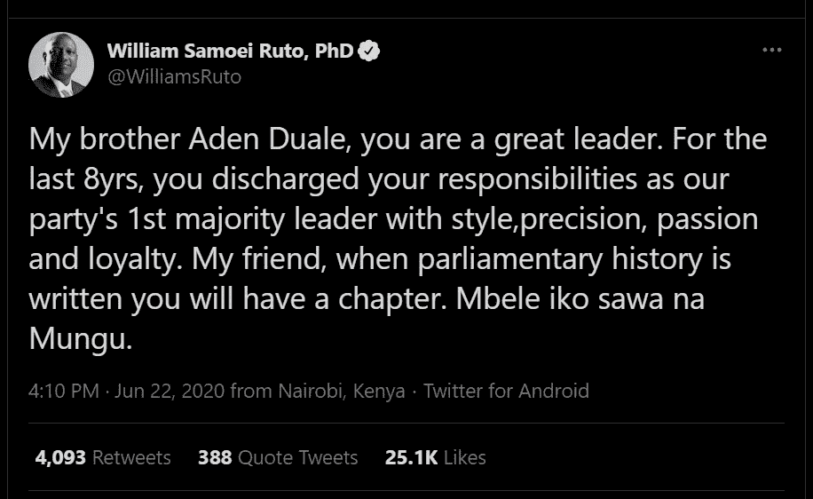

# 基于 R 的威廉·鲁托微博文本分析

> 原文：<https://medium.com/analytics-vidhya/text-analysis-on-william-rutos-tweets-with-r-196d30aaadbd?source=collection_archive---------10----------------------->

随着肯尼亚临近 2022 年大选和公投，这几个月的政治气候一直很糟糕。

肯尼亚副总统威廉·鲁托似乎吸引了越来越多的人参与他 2022 年的总统竞选。他与穷人产生共鸣，因为他也出生在贫困的环境中，通过努力工作，他成为了第二号人物。

一个显著的特征是他是一个多么伟大的演说家，这使他能够吸引大量的群众。今天，他实际上是肯尼亚 Twitter 上关注最多的人，拥有 3712958 人。我试图探索他的推文，以深入了解他在 Twitter 上的公关，并回答以下问题:

1.  他最被转发和喜欢的帖子有哪些？
2.  他的帖子中使用频率最高的词是什么？
3.  当使用最频繁的词时，他主要指的是什么？
4.  他的帖子有哪些感悟和情绪？
5.  他的帖子极性(正/负)程度如何？

通过使用 rtweet 包的 Twitter API，我只能按照 Twitter 的指导方针提取 3200 条 tweet。用户生成的数据日期为 2018 年 11 月 24 日至 2021 年 2 月 13 日。我也删除了这些转发，因为它们不会作为 ***用户生成的文本。*** 该数据有 90 个变量和 3200 个观测值。

在平台上分享帖子后，收藏夹和转发是参与度洞察的一部分，可以用来衡量帖子的传播程度。因此，我查看了他最受欢迎和转发的推文。

最受欢迎的推文显然是当 Adan Duale 被剥夺议会多数党领袖的职责时的同情行为。尽管这位领导人在工作中很勤奋，也很有帮助，但他的被解雇震惊了许多人，但这归功于他对副总统的大力支持。

正如你所看到的，最受欢迎和转发的推文之间有很高的相关性，这就是算法的工作原理。转发量最大的推文是当科罗纳·疫情的腐败案件在他缺席的情况下激增时，尽管他被称为腐败，但他决定讽刺地解决他的复仇女神。同样值得注意的是，他的参与度在 2020 年达到顶峰，这表明在积累追随者方面出现了积极的回归。

# 文本分析

创建了一个语料库，然后通过自定义函数 ***clean.corpus*** 对其进行清理，并创建了一个**术语文档矩阵**一个数学矩阵来描述术语在文档集合中出现的频率。

这张图显示了他的推文中使用频率最高的 20 个词。

可以定量地说，发展、赋权、教育和经济是他所关注的一些主要问题。“教会”和“上帝”显然是他所信奉的信仰。

当单词“county”被用作最常用词时，我查看了单词关联。每当他谈到一个县 0.4 可能他指的是内罗毕和 0.37 他的卡伦办公室。从统计数据来看，这种可能性很低，但当涉及到那个特定的单词时，可能性很大。

**情绪评分**

情感分析旨在从文本中检测积极、中性或消极的情感，而情感分析旨在通过文本的表达检测并识别情感类型**、**，如愤怒、厌恶、恐惧、快乐、悲伤和惊讶。我试图了解他的推文是什么样的情绪，在 3200 条推文中，大多数都是快乐的情绪。

为了检测用户的情绪，可以使用传统的机器学习算法和深度学习技术，并且比较每个模型的分类性能。

公平地说，副总统在推特上发布的 59%是正面信息，33%是中性的，正面和负面的词语数量相互抵消。负面推文总计只有 8%，正面和负面推文的比例为 7:1，这意味着每条负面推文，他就发 7 条正面推文。

**能做什么**

有了支持向量机学习，我可以建立一个模型来检测副总统发微博时的情绪和极性。

推文分类器:如果我有不同人的推文，建立一个模型训练，并用推文进行测试，以分类哪些推文属于谁，哪些不属于谁。

心理学中的约束可以针对推文推导出来吗？

好奇心满足！

在下一篇博客中，我将使用即将到来的 2022 年总统竞选中前线领导人的 twitter 数据来了解肯尼亚的政治温度。

连接 Linkedln @ [antonymaina](https://www.linkedin.com/in/antony-maina-b93b921b1/)

关注 twitter [@antonymaina](https://twitter.com/nito_kushite)

insta gram @[Antony . k . maina](https://www.instagram.com/antony.k.maina/)