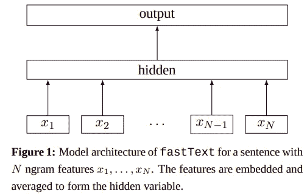
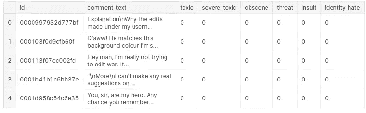
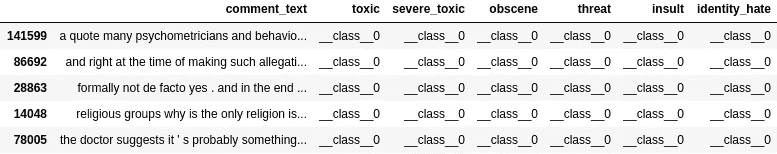

# 文本分类—从词袋到 BERT —第 3 部分(快速文本)

> 原文：<https://medium.com/analytics-vidhya/text-classification-from-bag-of-words-to-bert-part-3-fasttext-8313e7a14fce?source=collection_archive---------3----------------------->


格伦·惠勒在 [Unsplash](https://unsplash.com?utm_source=medium&utm_medium=referral) 拍摄的照片

这个故事是一系列文本分类的一部分——从词袋到 BERT 在 Kaggle 竞赛上实施多种方法，由 Jigsaw(Alphabet 的子公司) ***命名为“ [*【有毒评论分类挑战】*](https://www.kaggle.com/c/jigsaw-toxic-comment-classification-challenge) ”。*** 在这场比赛中，我们面临的挑战是建立一个多头模型，能够检测不同类型的毒性，如*威胁、淫秽、侮辱和基于身份的仇恨。如果你还没有查看之前的故事，一定要查看一下，因为这将有助于理解未来的事情。*

[第一部分(BagOfWords)](https://anirbansen3027.medium.com/text-classification-from-bag-of-words-to-bert-1e628a2dd4c9)

[第二部分(Word2Vec)](https://anirbansen3027.medium.com/text-classification-from-bag-of-words-to-bert-part-2-word2vec-35c8c3b34ee3)

在早期的故事中([第 2 部分(Word2Vec)](https://anirbansen3027.medium.com/text-classification-from-bag-of-words-to-bert-part-2-word2vec-35c8c3b34ee3) )，我们使用 Gensim 为句子中使用的单词获得预训练的 Word2Vec 模型/嵌入向量，将它们映射到输出变量 toxic、severe_toxic、淫秽、威胁、侮辱、identity_hate，并使用 sklearn 的多输出逻辑回归分类器包装器为所有 6 个输出变量创建逻辑回归模型。

在这个例子中，我们将使用 fastText 库来生成句子的嵌入和文本分类。事实上，这给了我们一个一气呵成的选择。直觉部分将比其他方法简短，因为快速文本的文档/阅读材料有限。

***什么是 fastText？***


2016 年，脸书人工智能研究院(FAIR)开源了 fastText，这是一个旨在帮助构建文本表示和分类的可扩展解决方案的库。fastText 将 Word2Vec 中单词嵌入的思想向前推进了一步，学习了字符 n 元语法的表示，并将单词表示为 n 元语法向量的总和。以单词“where”和 n = 3 为例，用字符 n-grams 表示:<wh whe="" her="" ere="" re="">。除了子词嵌入形式的文本表示之外，它还提供了现成的分类模型，该模型被优化以与这些嵌入一起工作并给出快速结果。</wh>

***为什么需要 fastText？***

与常规的 word2vec 嵌入相比，fastText 有两个主要优点:

1.  ***Word2Vec 面临词汇量不足的问题(OOV)*** 假设我们从零开始训练一个 Word2Vec 模型，我们建立一个包含训练数据中所有单词的词汇表。现在，如果我们在测试数据中有一个可能需要嵌入的新单词，新的缺失单词将是 OOV。在 word2vec 中我们完全忽略了这样的词。通过在 fastText 中使用子单词嵌入，我们试图为一个也是 OOV 的单词获得嵌入
2.  ***通过对每个单词使用不同的向量表示，Word2Vec 模型忽略了单词的内部结构:*** 在 word2vec 中，每个单词都是基于它出现的上下文唯一学习的。例如，boxer 和 boxing 在不同的上下文中使用，我们无法捕捉潜在的相似性。将其分解为字符 n-gram 会有所帮助

***fast text 有什么额外的好处？***

虽然 fastText 超越了单词级别，达到了字符-n-gram 级别，但是它非常快(因此得名)。实验表明，fastText 在准确性方面通常与深度学习分类器不相上下，并且在训练和评估方面快了许多数量级。我们可以使用标准的多核 CPU 在不到十分钟的时间内对超过 10 亿个单词进行 fastText 训练，并在不到一分钟的时间内对 312K 个类别中的 50 万个句子进行分类。

此外，fastText 提供了在维基百科和 Crawl 上训练的 157 种语言的词向量(这太令人惊讶了)。

***fast text 是如何工作的？***

1.  ***创建单词嵌入:*** 子单词模型基于来自 Word2Vec 的 skip-gram 模型，并且不使用单词的矢量表示，而是使用字符 n 元语法的矢量表示的平均值。其他一切都与跳格模型非常相似。
2.  ***文本分类:*** 下图摘自实际论文《高效文本分类锦囊》，其中介绍了用于分类的 fastText。fastText 使用类似于 Word2Vec 网络的浅层神经网络。



我们使用 softmax 函数 f 来计算预定义类别的概率分布。事实上，它使用了一种基于霍夫曼编码树的称为分层 softmax 的东西(简而言之，最常见的单词/字母被赋予最小的代码)。因此，在层次 softmax 中，节点的概率总是低于其父节点的概率。当我们有大量的类时，以及在我们搜索最可能的类时，这都是有帮助的。


例如，如果旅行、食物和印度美食是 3 个类别，如果旅行的概率更高，我们甚至不需要计算食物和印度美食的概率。这降低了复杂性。

此外，它还使用单词 n 元语法作为除嵌入之外的附加特征来捕获关于局部词序的一些部分信息，否则在正常的 BagOfWords 中捕获这些信息在计算上是非常昂贵的。

对于对完整代码感兴趣的人，你可以在这里找到它[。那么让我们深入研究代码👨‍💻](https://www.kaggle.com/anirbansen3027/jtcc-fasttext-supervised)

> **实现**

1.  ***读取数据集***



提醒一下，这是训练数据的样子

***4。基本预处理***

就预处理而言，我们正在执行以下步骤:

1.  我们为一些标点符号引入了空格，比如？, ., ), (, !并删除了一些只是为了使文字更清晰
2.  我们已经删除了“\n ”,因为我们已经可以在文本中看到很多
3.  我们做了一些 Unicode 标准化来处理一些可能出现的 Unicode 问题
4.  这个是最重要的，将所有输出变量的二进制标签从 0 和 1 转换为 _ _ class _ _ 0 和 __class__1，因为 fastText 分类器需要这样做。我们只需要对 training_data 这样做，因为分类器不会查看验证数据/测试数据的真实标签
5.  打乱数据集以引入一些随机性并消除有序性(如果存在的话)

```
# Lets do some cleaning of this text
def clean_it(text,normalize=True):
    # Replacing possible issues with data. We can add or reduce the replacemtent in this chain
    s = str(text).replace(',',' ').replace('"','').replace('\'',' \' ').replace('.',' . ').replace('(',' ( ').\
            replace(')',' ) ').replace('!',' ! ').replace('?',' ? ').replace(':',' ').replace(';',' ').lower()
    s = s.replace("\n"," ")

    # normalizing / encoding the text
    if normalize:
        s = s.normalize('NFKD').str.encode('ascii','ignore').str.decode('utf-8')
    return s# Now lets define a small function where we can use above cleaning on datasets
def clean_df(data, cleanit= False, shuffleit=False, encodeit=False, label_prefix='__class__'):
    # Defining the new data
    df = data[['comment_text']].copy(deep=True)
    for col in y_cols:
        df[col] = label_prefix + data[col].astype(str) + ' '
    # cleaning it
    if cleanit:
        df['comment_text'] = df['comment_text'].apply(lambda x: clean_it(x,encodeit))
    # shuffling it
    if shuffleit:
        df.sample(frac=1).reset_index(drop=True)
    return df# Transform the datasets using the above clean functions
df_train_cleaned = clean_df(train, True, True)
df_val_cleaned = clean_df(val, True, True, label_prefix='')
```



因此，如前所述，我们已经更改了训练数据集的标签类，但没有更改验证集的标签类，因为 fastText 分类器不会查看它们

***5。训练和验证快速文本分类器***

*   由于 fastText 分类器输入一个带有文本数据和类标签的 CSV 文件，所以我们不能使用在早期笔记本中使用的多输出分类器包装器。因此，我们必须运行 for 循环来为每个输出变量训练单独的模型，并将每个输出变量的预测存储在验证集中。
*   train_supervised 是用于快速文本分类的函数。我们可以调整学习参数来改进模型。
*   到目前为止，还没有 API 可以接受一个验证集，并给出肯定情况的概率。我们一次只能得到一个句子的概率。因此，我们对每个验证语句运行一个 for 循环，并将概率存储在一个列表中。我们需要概率，因为性能指标是 ROC-AUC

```
#Will contain all the predictions for validation set for all the output variables
all_preds = []
#Iterating over all output variables to create separate models
for col in tqdm(y_cols):
    #Path for saving the training dataset
    train_file = '/kaggle/working/final_train.csv'
    #Saving the Output Variable and the text data to a csv
    df_train_cleaned[[col, "comment_text"]].to_csv(train_file, header=None, index=False, columns=[col, "comment_text"]) 
    #Training the model
    model = train_supervised(input=train_file, label="__class__", lr=1.0, epoch=2, loss='ova', wordNgrams=2, dim=200, thread=2, verbose=100)
    #Predictions for validation sets for that ouput variable
    col_preds = []
    #Iterating over each sentence in the validation set
    for text in df_val_cleaned["comment_text"].values:
        #Get the prediction for class 1
        pred = model.predict(text, k = 2)[1][1]
        #Append the prediction to the list of predictions for that output variable
        col_preds.append(pred)
    #Append the list of predictions for a output variable to the overall set of predictions for all columns
    all_preds.append(col_preds)
```

现在，我们已经从验证集的模型中获得了预测，让我们看看结果/性能。由于竞争使用平均 ROC-AUC 作为评估指标，我们将在笔记本中使用相同的指标。

```
#Function for calculating roc auc with given actual binary values across target variables and the probability score made by the model
def accuracy(y_test, y_pred):
    aucs = []
    #Calculate the ROC-AUC for each of the target column
    for col in range(y_test.shape[1]):
        aucs.append(roc_auc_score(y_test[:,col],y_pred[:,col]))
    return aucs#Actual Labels
y_val_actuals = df_val_cleaned[y_cols].astype("int").to_numpy()
#Prediction probability - minor ordering
all_preds_array = np.transpose(np.array(all_preds))
#Calculate the mean of the ROC-AUC for each of the ouput variable
mean_auc = mean(accuracy(y_val_actuals,all_preds_array))
```

验证集上的 ROC-AUC 趋向于 0.77 左右，这比 Word2Vec 模型好得多。此外，这些只是 2 个时期和未调整参数的早期结果。我认为通过更好的调整，我们可以获得更好的结果。学习和预测也非常快。

7 .**。改进的结果和范围**


Kaggle 排行榜分数

*托多斯:*

1.  可以做更好的文本预处理、打字错误纠正等来进一步改进模型
2.  尝试调整超参数以获得更好的结果

这是关于快速文本的。下一个将是关于卷积神经网络(CNN)。细胞神经网络通常用于计算机视觉，然而，它们已经应用于各种 NLP 任务有一段时间了，结果是有希望的。在那之前保持安全。同样，整个代码呈现在[(这里)](https://www.kaggle.com/anirbansen3027/jtcc-fasttext-supervised)。请以回答和鼓掌的形式提供您的反馈:)