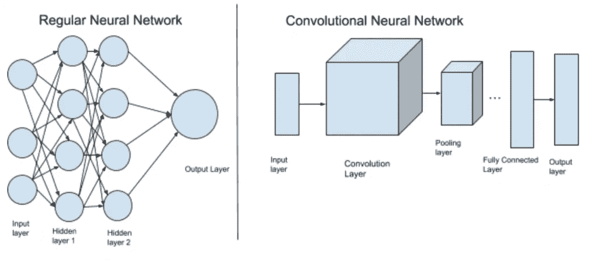
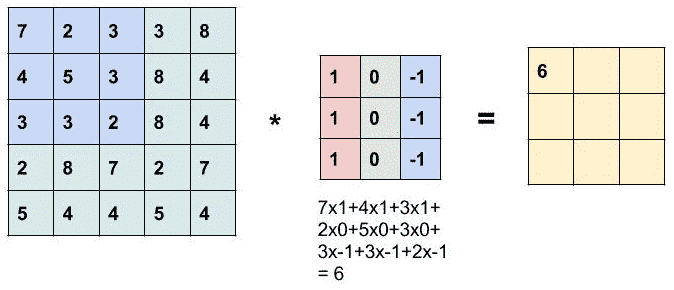
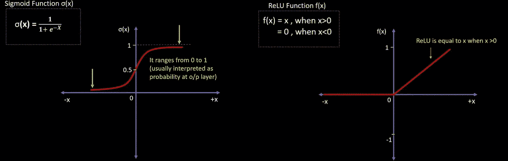
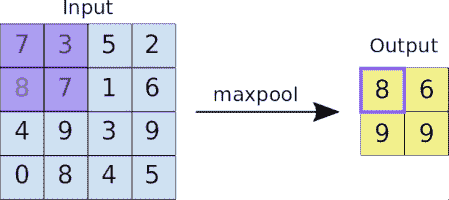
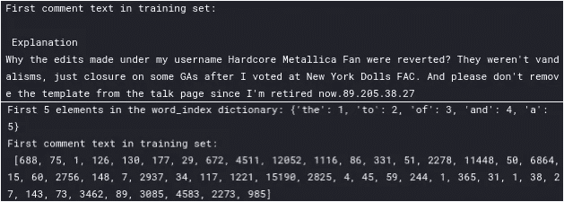
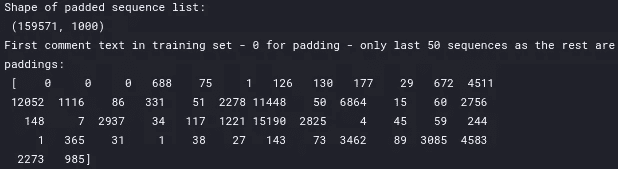
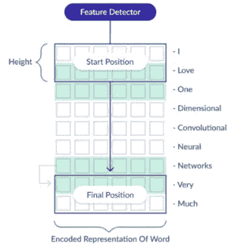
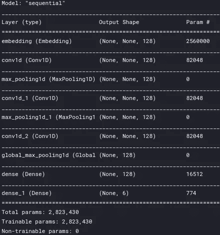
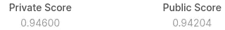

# 文本分类—从词袋到 BERT —第 4 部分(卷积神经网络)

> 原文：<https://medium.com/analytics-vidhya/text-classification-from-bag-of-words-to-bert-part-4-convolutional-neural-network-53aa63941ade?source=collection_archive---------7----------------------->


在 [Unsplash](https://unsplash.com?utm_source=medium&utm_medium=referral) 上拍摄的 [ThisisEngineering RAEng](https://unsplash.com/@thisisengineering?utm_source=medium&utm_medium=referral)

这个故事是一系列文本分类的一部分——从词袋到 BERT 在名为“ [*有毒评论分类挑战”*](https://www.kaggle.com/c/jigsaw-toxic-comment-classification-challenge) ***的 Kaggle 比赛上实施多种方法。*** 在这场比赛中，我们面临的挑战是建立一个多头模型，能够检测不同类型的毒性，如*威胁、淫秽、侮辱和基于身份的仇恨。如果你还没看过之前的报道，那就去看看吧*

[第一部分(BagOfWords)](https://anirbansen3027.medium.com/text-classification-from-bag-of-words-to-bert-1e628a2dd4c9)

[第二部分(Word2Vec)](https://anirbansen3027.medium.com/text-classification-from-bag-of-words-to-bert-part-2-word2vec-35c8c3b34ee3)

[第三部分(快速文本)](https://anirbansen3027.medium.com/text-classification-from-bag-of-words-to-bert-part-3-fasttext-8313e7a14fce)

在之前的故事中([第三部分(fastText)](https://anirbansen3027.medium.com/text-classification-from-bag-of-words-to-bert-part-3-fasttext-8313e7a14fce) )，我们使用了 fastText 库来生成句子的嵌入以及输出变量的多标签文本分类。

在这个项目中，我们将使用 Keras 库(TensorFlow 上的一个包装器)为多标签文本分类创建一维卷积神经网络(CNN)。我们还将看看模型的一些背景工作。

# ***直觉***

***怎么开始的？***CNN 最早是由 Yann LeCun 在 20 世纪 80 年代提出的，用来识别手写数字。但 ConvNets 仍然处于观望状态，因为他们面临着一个严重的问题，即需要大量的数据和计算资源来有效地处理大型图像。

2012 年，AlexNet 表明，也许是时候重新审视深度学习了，因为它已经赢得了各种比赛。大型数据集和大量计算资源的可用性使研究人员能够创建复杂的 CNN，可以执行以前不可能完成的计算机视觉任务。

***什么是 CNN？***



[http://www.jetir.org/papers/JETIR2004207.pdf](http://www.jetir.org/papers/JETIR2004207.pdf)

在上图所示的 ConvNet 中有四种主要操作:

***1。卷积***



[https://miro . medium . com/max/1920/1 * D6iRfzDkz-sezyjyovz 73w . gif](https://miro.medium.com/max/1920/1*D6iRfzDkz-sEzyjYoVZ73w.gif)

这一层是 CNN 的心脏。CNN 使用特征映射/核来学习输入的特征。例如，图像中的核[[1，0，-1]，[1，0，-1]，[1，0，-1]]检测图像中的垂直线。神奇的是我们不需要指定内核。我们只需要提到内核的数量，模型就会自己学习内核，就像普通人工神经网络中的权重一样。总体思路是，随着 Conv 和池图层数量的不断增加，模型能够检测的复杂要素也越多。第一层识别简单的东西，如线条/颜色，随后的层识别更复杂的图案。

***2。非线性***



[https://machine learning knowledge . ai/Activation-Functions-Neural-Network/# Why _ we _ needle _ Activation _ Functions _ in _ Neural _ Network](https://machinelearningknowledge.ai/activation-functions-neural-network/#Why_we_need_Activation_Functions_in_Neural_Network)

没有激活函数的 ANN 层将只产生所有输入及其权重之间的点积之和。通过使用合适的非线性激活函数，我们可以帮助神经网络理解这种非线性关系。这是一篇关于[创新功能](https://machinelearningknowledge.ai/activation-functions-neural-network/#Why_we_need_Activation_Functions_in_Neural_Network)的深度博客。

在二进制分类问题的情况下，在输出神经元中使用 *sigmoid* 函数，将输入信号转换为 0 到 1 的范围，以便将其解释为概率。

在隐藏层中，ReLU 通常比其他函数更受欢迎，因为它训练神经网络的速度比其他函数快几倍，而且不会显著降低泛化精度。ReLU 或整流线性单元，应用非饱和激活函数 f(x)=max(0，x)。它也不会遭受消失的类似梯度的 Sigmoid 和 Tanh 激活函数的现象

***3。*** 混合抽样或次级抽样



[https://miro.medium.com/max/700/0*5xJdbktSufBcH7n5.gif](https://miro.medium.com/max/700/0*5xJdbktSufBcH7n5.gif)

池图层用于减少要素地图的维度。因此，它减少了要学习的参数数量和网络中执行的计算量。汇集图层汇总了由卷积图层生成的要素地图区域中的要素。

这里有一个关于层类型的深度博客[池](https://www.machinecurve.com/index.php/2020/01/30/what-are-max-pooling-average-pooling-global-max-pooling-and-global-average-pooling/)层

**4*。*分类(全连接层)**

最后，在几个卷积和最大池层之后，NN 中的高级推理通过完全连接的层来完成。FC 层根据前几层提取的特征进行分类。通常，这一层是传统的人工神经网络，它将权重与输入和传递激活相乘，以给出输出

对完整代码感兴趣的人，可以在这里找到[。那么让我们深入研究代码👨‍💻](https://www.kaggle.com/anirbansen3027/jtcc-cnn)

# **实施**

## ***1。读取数据集***


提醒一下，这是训练数据的样子

## **②*。文本预处理***

文本数据必须编码为数字，才能用作 ML/DL 模型的输入或输出。Keras 库提供了一些基本工具来帮助我们准备文本数据。我们将使用 Tokenizer 类，这是一个实用程序类，允许对文本语料库进行矢量化，方法是将每个文本转换为整数序列或向量，其中每个标记的系数可以是二进制的，基于字数，基于 tf-idf。这将是一个 3 步流程:

**1。初始化记号赋予器类**

*   默认情况下，所有标点符号都被删除，将文本转换为空格分隔的单词序列(单词可能包含'字符)。然后，这些序列被分割成记号列表。然后它们将被索引或矢量化。0 是用于填充的保留索引。
*   我们将 num_words 设置为 MAX_NUM_WORDS (20000 ),这是基于词频要保留的最大字数。只会保留最常见的 num_words-1 个单词。

**2。调用 fit_on_texts 函数** —根据文本列表更新内部词汇

该方法基于词频创建词汇索引。所以如果你给它这样的话，“猫坐在垫子上。”它将创建一个字典 s . t . word _ index[" the "]= 1；word_index["cat"] = 2 它是 word -> index 字典，所以每个单词都有一个唯一的整数值。所以较小的整数意味着更频繁的单词(通常前几个是停用词)。

**3。调用 texts_to_sequences 函数** —将文本中的每个文本转换为一个整数序列

所以它基本上是将文本中的每个单词替换为 word_index 字典中相应的整数值。

*注意:* *在 fit_on_texts 之后，实质上是为词汇表创建一个 word_index 矩阵，我们可以做两件事情中的任何一件*

*   *使用嵌入层时使用的文本序列*
*   *text_to_matrix 将文本转换成一个单词包*

```
#Initializing the class
tokenizer = Tokenizer(num_words = MAX_NUM_WORDS)
#Updates internal vocabulary based on a list of texts.
tokenizer.fit_on_texts(train_texts)
#Transforms each text in texts to a sequence of integers.
train_sequences = tokenizer.texts_to_sequences(train_texts)
test_sequences = tokenizer.texts_to_sequences(test_texts)
word_index = tokenizer.word_index
print(“Length of word Index:”, len(word_index))
print(“First 5 elements in the word_index dictionary:”, dict(list(word_index.items())[0: 5]) )
print(“First comment text in training set:\n”, train_sequences[0])
```



既然我们已经标记了注释文本，我们需要填充句子以使所有的句子长度相等。

**为什么会这样？**深度学习库假设你的数据是矢量化的表示。在可变长度序列预测问题的情况下，这要求您的数据被转换为每个序列具有相同的长度。这种矢量化允许代码针对您选择的深度学习算法高效地批量执行矩阵运算。

这也是在计算机视觉中完成的，在计算机视觉中，我们通常倾向于将所有图像的大小调整到固定的大小，这将是神经网络的输入大小

```
#Pad tokenized sequences
trainvalid_data = pad_sequences(train_sequences, maxlen=MAX_SEQUENCE_LENGTH)
test_data = pad_sequences(test_sequences, maxlen=MAX_SEQUENCE_LENGTH)
print(“Shape of padded sequence list:\n”, trainvalid_data.shape)
print(“First comment text in training set — 0 for padding — only last 50 sequences as the rest are paddings:\n”, trainvalid_data[0][-50:])
```



## *3。定义 1D CNN 模型*

在 Keras 中，定义模型最简单的方法是启动一个顺序模型类，并不断添加所需的层。序列模型是一个简单的层堆栈，其中每一层都有一个输入张量和一个输出张量。

文档分类的标准模型是使用嵌入层作为输入，接着是 1D 卷积神经网络、池层，然后是预测输出层。我们使用了 1 个嵌入层、3 组卷积和池化层以及 2 组密集层。我们可以使用预先训练的嵌入(如 Word2Vec)来生成大小为词汇*嵌入维度的嵌入矩阵，或者训练新的嵌入，将其作为输入层与其他权重一起使用。



**Conv1D**:CNN 是为图像分类开发的，其中模型接受表示图像像素和颜色通道的二维输入。同样的过程可以应用于 1D 数据序列。该模型从序列数据中提取特征，并映射序列的内部特征。CNN 考虑单词的接近度来创建可训练的模式。卷积层中的内核大小/高度定义了当卷积通过输入文本文档时要考虑的单词数，提供了分组参数。在我们的例子中，它将一次考虑 5 个单词，而在图像中，它将一次考虑 2 个单词

最大池层将合并卷积层的输出。

我们在输出层使用 sigmoid 激活。sigmoid 函数为我们提供了每个输出节点的 0 到 1 之间的概率得分。如果我们使用 softmax，它会给出跨输出节点的概率分布，加 1。

总的来说，

*   对于二进制分类，我们可以有 1 个输出单元，在输出层使用 sigmoid 激活，并使用二进制交叉熵损失
*   对于多类分类，我们可以有 N 个输出单元，在输出层使用 softmax 激活，并使用分类交叉熵损失
*   对于多标签分类，我们可以有 N 个输出单元，在输出层使用 sigmoid 激活，并使用二进制交叉熵损失



cnn _ model.summar 的结果

```
cnn_model = Sequential()
cnn_model.add(Embedding(MAX_NUM_WORDS, 128))
cnn_model.add(Conv1D(filters = 128, kernel_size = 5, activation = “relu”))
cnn_model.add(MaxPooling1D(pool_size = 5))
cnn_model.add(Conv1D(filters = 128, kernel_size = 5, activation = “relu”))
cnn_model.add(MaxPooling1D(pool_size = 5))
cnn_model.add(Conv1D(filters = 128, kernel_size = 5, activation = “relu”))
cnn_model.add(GlobalMaxPool1D())
cnn_model.add(Dense(units = 128, activation = ‘relu’))
cnn_model.add(Dense(units = 6, activation = ‘sigmoid’))
print(cnn_model.summary())
```

## 4.编译并拟合 CNN 模型

在开始训练模型之前，我们需要对其进行配置。我们需要提到*损失函数*，它将用于计算每次迭代的误差，*优化器*，它将指定如何更新权重，以及*指标*，它将由模型在训练和测试期间进行评估

在拟合/训练模型时，除了训练集，我们还传递以下参数:

*   batch_size =一次通过网络的样本数量。
*   epochs =整个训练样本集通过网络的次数
*   validation_data =将用于在每个时期结束时评估损失和任何模型指标的数据集。这套不会用于训练。

```
#Configures the model for training
cnn_model.compile(loss **=** "binary_crossentropy", optimizer **=** "adam", metrics **=** ["AUC"])
#Split the dataset into train and validation set for training and evaludating the model
X_train, X_val, y_train, y_val **=** train_test_split(trainvalid_data, train_labels, shuffle **=** **True**, random_state **=** 123)
print(X_train.shape, y_train.shape, X_val.shape, y_val.shape)
#Trains the model for a fixed number of epochs (iterations on a dataset)
history **=** cnn_model.fit(X_train, y_train, batch_size **=** 128, epochs **=** 1, validation_data **=** (X_val, y_val)
```


## 5.**改进的结果和范围**



Kaggle 排行榜分数(相当惊人的一个时代吧？)

*   使用一个多频道 CNN，它可以同时查看不同长度的句子(例如，内核大小为 3、5 和 7)
*   调整模型层和超参数以提高性能

这是关于 CNN 的。下一个将是关于**长** - **短时记忆** ( **LSTM** )，这是对自然语言处理中自然使用的 rnn 的改进。在那之前保持安全。同样，整个代码出现在[(这里)](https://www.kaggle.com/anirbansen3027/jtcc-cnn)。请以回答和鼓掌的形式提供您的反馈:)