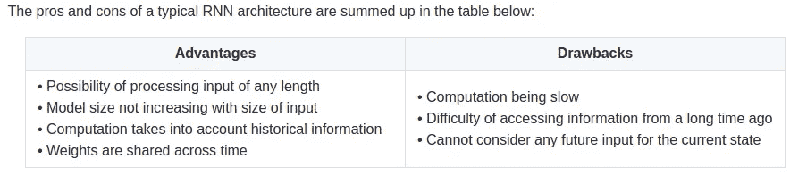
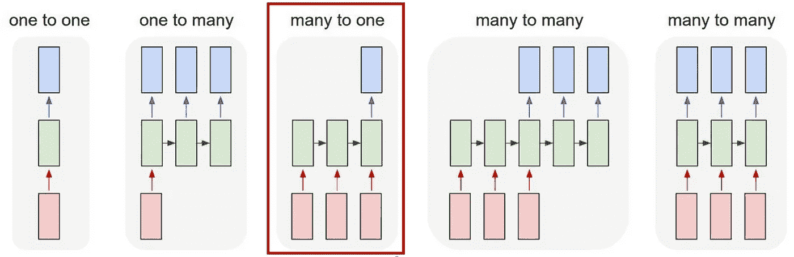
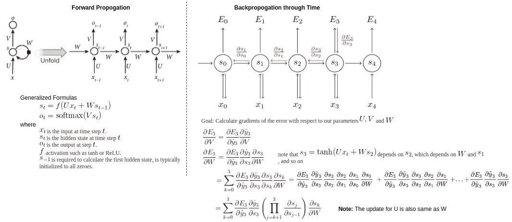
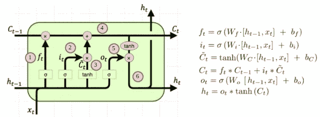
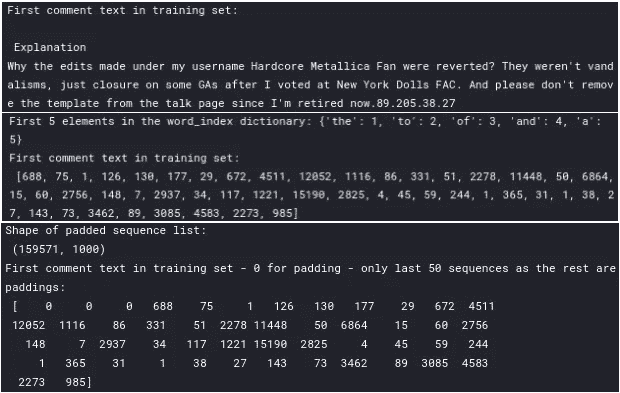
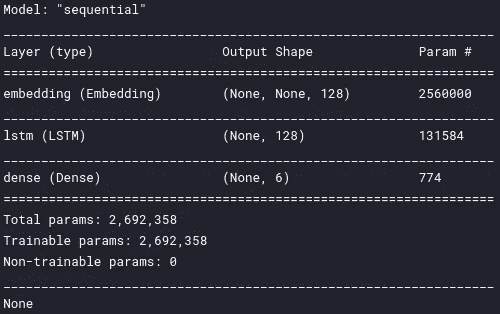
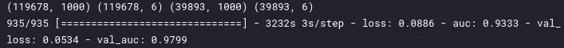
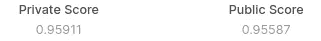

# 文本分类—从词袋到 BERT —第五部分(递归神经网络)

> 原文：<https://medium.com/analytics-vidhya/text-classification-from-bag-of-words-to-bert-part-5-recurrent-neural-network-b825ffc8cb26?source=collection_archive---------5----------------------->


在 [Unsplash](https://unsplash.com?utm_source=medium&utm_medium=referral) 上由[Tine ivani](https://unsplash.com/@tine999?utm_source=medium&utm_medium=referral)拍摄的照片

这个故事是一系列文本分类的一部分——从词袋到 BERT 在名为“ [*有毒评论分类挑战”*](https://www.kaggle.com/c/jigsaw-toxic-comment-classification-challenge) ***的 Kaggle 比赛上实施多种方法。*** 在这场比赛中，我们面临的挑战是建立一个多头模型，能够检测不同类型的毒性，如*威胁、淫秽、侮辱和基于身份的仇恨。如果你还没看过之前的报道，那就去看看吧*

[第一部分(BagOfWords)](https://anirbansen3027.medium.com/text-classification-from-bag-of-words-to-bert-1e628a2dd4c9)

[第二部分(Word2Vec)](https://anirbansen3027.medium.com/text-classification-from-bag-of-words-to-bert-part-2-word2vec-35c8c3b34ee3)

[第三部分(快速文本)](https://anirbansen3027.medium.com/text-classification-from-bag-of-words-to-bert-part-3-fasttext-8313e7a14fce)

[第四部分(卷积神经网络)](https://anirbansen3027.medium.com/text-classification-from-bag-of-words-to-bert-part-4-convolutional-neural-network-53aa63941ade)

在更早的故事中([第 4 部分(卷积神经网络)](https://anirbansen3027.medium.com/text-classification-from-bag-of-words-to-bert-part-4-convolutional-neural-network-53aa63941ade))，我们使用 Keras 库(TensorFlow 上的一个包装器)为输出变量——有毒、严重有毒、淫秽、威胁、侮辱、身份仇恨——的多标签文本分类创建一维 CNN。

在这一次，我们将使用相同的 Keras 库来创建长短期记忆(LSTM ),这是对用于多标签文本分类的常规 rnn 的改进。我们将首先通过对 RNNs 和 LSTM 如何工作的一点直觉，然后使用用于多标签分类的最小化单输出层(具有 6 个神经元)来实现它(而不是为每种类型的毒性创建 6 个单独的网络或创建具有 6 个输出层的多输出层网络)。我们将只使用一个 LSTM 层，在一个时期内，它在排行榜上给出了大约 96 AUC

# 直觉

## 我们为什么需要注册护士？

在传统的神经网络中，我们假设所有的输入(和输出)都是相互独立的。它们不共享在文本的不同位置学到的特征。对于序列信息(如文本数据或时序数据)来说，这可能是一个问题，因为每个实例都依赖于前一个实例。rnn 被称为递归的，因为它们对序列的每个元素执行相同的任务，输出依赖于先前的计算。另一种思考 rnn 的方式是，它们有一个“记忆”，可以捕获到目前为止已经计算过的信息。



[https://Stanford . edu/~ shervine/teaching/cs-230/cheat sheet-recurrent-neural-networks](https://stanford.edu/~shervine/teaching/cs-230/cheatsheet-recurrent-neural-networks)

## **无线网络的架构是什么？**

RNN 的整体架构取决于手头的任务。对于这个分类任务，我们将使用第三种方法:多对一。但是出于直觉的目的，让我们看看第五个，它是 RNNs 的一个更一般化的符号。如果我们知道第五记谱法是如何工作的，那么只需改变一小部分就可以了。



[https://www . di . ens . fr/~ le large/dldiy/slides/lecture _ 8/images/rnn _ variants _ 4 . png](https://www.di.ens.fr/~lelarge/dldiy/slides/lecture_8/images/rnn_variants_4.png)

输入向量用红色表示，输出向量用蓝色表示，绿色向量表示 RNN 状态。从左到右:(1)没有 RNN 的普通处理模式(例如图像分类)(2)序列输出(例如图像字幕)(3)序列输入(例如情感分析)(4)序列输入和序列输出(例如机器翻译)(5)同步序列输入和输出(例如视频分类——标记视频的每一帧)



RNNs 中的前向和反向传播([http://www . wild ml . com/2015/09/recurrent-neural-networks-tutorial-part-1-introduction-to-RNNs/](http://www.wildml.com/2015/09/recurrent-neural-networks-tutorial-part-1-introduction-to-rnns/))

## 什么是消失渐变？

消失梯度问题出现在非常深的神经网络中，通常是 rnn，其使用梯度趋于小(在 0-1 的范围内)的激活函数。因为这些小梯度在反向传播过程中会成倍增加，所以它们往往会在所有层中“消失”或减少到 0，从而阻止网络学习长程相关性。随着序列变长，传递到先前状态的梯度/导数变得越来越小。这个问题有很多解决方法。其中之一是使用一种叫做 LSTMs 的变种。

## 什么是 LSTM？

长短期记忆网络——通常简称为“lstm”——是一种特殊的 RNN，能够学习长期依赖性。所有的 rnn 都具有神经网络重复模块链的形式。LSTM 也有这种链状结构，但我们没有隐藏层，而是有一种叫做 LSTM 单元的东西，我们还有另一种连接，它贯穿所有时间步骤和隐藏状态。这就是所谓的“单元状态”向量，可以根据需要从其中检索和删除信息。



[http://colah.github.io/posts/2015-08-Understanding-LSTMs/](http://colah.github.io/posts/2015-08-Understanding-LSTMs/)

让我们看看这 6 个步骤:

1.  这是**遗忘门**，它负责遗忘多少，由于它通过一个 sigmoid 函数，它将给出 0 到 1 的值，这是从先前单元状态保留的存储量
2.  这是**输入门**，它负责向单元状态添加多少新信息。类似于遗忘门，这也将给出 0 到 1 的值，这是要添加的新内存量
3.  这是新的候选向量/单元状态的创建
4.  这是更新单元状态的地方，该单元状态是先前单元状态和当前单元状态的组合，分别使用**遗忘门**和**输入门**控制每个单元状态的贡献。
5.  这是**输出门**,其负责在具有 0 和 1 之间的值的隐藏状态中记忆更新的单元状态的哪一部分
6.  这是更新后的隐藏状态，将作为下一个单元的输入，并基于由**输出门**控制的当前单元状态

## LSTM 如何解决消失梯度？

*   LSTM 架构使得 RNN 更容易在多个时间步长上保存信息，例如，如果遗忘门被设置为在每个时间步长上记住所有内容，则单元中的信息被无限期保存。相比之下，香草 RNN 更难学习一个递归的权重矩阵，以隐藏状态保存信息
*   LSTM 并不保证没有消失/爆炸梯度，但它确实为模型学习长距离依赖性提供了一种更简单的方法

在变形金刚诞生之前，LSTMs 统治着 NLP 的世界。即使在今天，它仍被广泛使用

2015 年，谷歌在谷歌语音中使用了 LSTM，这将转录错误减少了 49%。

2016 年，谷歌使用 LSTM 在 Allo conversation 应用程序中建议消息。谷歌使用 LSTMs 进行谷歌翻译，减少了 60%的翻译错误。苹果宣布，将开始在 iPhone 和 Siri 中使用 quick type LSTM。亚马逊发布了波利，Alexa 背后的声音，使用双向 LSTM。

2017 年，脸书每天使用 LSTMs 进行约 45 亿次自动翻译

足够的上下文，让我们深入代码👨‍💻对于对完整代码感兴趣的人来说，这里是它现在的

# 履行

## 1.读取数据集


提醒一下，这是训练数据的样子

## 2.文本预处理

LSTM 模型的预处理与 CNN 非常相似。

```
*#Initializing the class*
tokenizer = Tokenizer(num_words = MAX_NUM_WORDS)
*#Updates internal vocabulary based on a list of texts.*
tokenizer.fit_on_texts(train_texts)
*#Transforms each text in texts to a sequence of integers.*
train_sequences = tokenizer.texts_to_sequences(train_texts)
test_sequences = tokenizer.texts_to_sequences(test_texts)
word_index = tokenizer.word_index
print("Length of word Index:", len(word_index))
print("First 5 elements in the word_index dictionary:", dict(list(word_index.items())[0: 5]) )
print("First comment text in training set:**\n**", train_sequences[0])*#Pad tokenized sequences*
trainvalid_data = pad_sequences(train_sequences, maxlen=MAX_SEQUENCE_LENGTH)
test_data = pad_sequences(test_sequences, maxlen=MAX_SEQUENCE_LENGTH)
print("Shape of padded sequence list:**\n**", trainvalid_data.shape)
print("First comment text in training set - 0 for padding - only last 50 sequences as the rest are paddings:**\n**", trainvalid_data[0][-50:])
```



**顶部**:原字符串**中间**:标记文本**底部**:填充文本

我们使用 Keras 中的 Tokenizer 类，通过基于频率将每个单词映射到一个数字，将字符串标记为一个数字序列。我们还使用 Keras 中的 pad_sequences 填充标记化的整数序列，使所有序列的大小相同，以便进行矢量化计算。我建议仔细阅读[笔记本](https://www.kaggle.com/anirbansen3027/jtcc-cnn#3.-Text-Preprocessing)。

*我们将按照这些步骤使用 LSTM 进行多标签文本分类:* **输入字符串- >标记化- >填充- >嵌入- > LSTM - >分类器**

## 3.定义多标签 LSTM 模型

在 Keras 中，定义模型最简单的方法是启动一个顺序模型类，并不断添加所需的层。在这个神经网络模型中，使用了一个称为“下降”的新参数:

**剔除:**剔除是一种解决过度拟合问题的技术。关键思想是在训练期间从神经网络中随机丢弃单元(连同它们的连接)。这可以防止单位之间过度的相互适应。引入该超参数是为了指定该层的输出被丢弃的概率。

**循环丢失**屏蔽(或“丢弃”)循环单元之间的连接。

**重要提示:一般情况下，**

对于**二进制**分类，我们可以有 1 个输出单元，在输出层使用 sigmoid 激活并使用二进制交叉熵损失

对于**多类**分类，我们可以有 N 个输出单元，在输出层使用 softmax 激活，并使用分类交叉熵损失

对于**多标签**分类，我们可以有 N 个输出单元，在输出层使用 sigmoid 激活并使用二进制交叉熵损失



```
rnn_model = Sequential()
rnn_model.add(Embedding(MAX_NUM_WORDS, 128))
rnn_model.add(LSTM(units = 128, dropout = 0.2, recurrent_dropout = 0.2))
rnn_model.add(Dense(units = 6, activation = 'sigmoid'))
print(rnn_model.summary()
```

## 5.编译和训练 LSTM 模型

编译和训练/拟合代码也与 CNN 模型非常相似。在开始训练模型之前，我们需要对其进行配置。我们需要提到损失函数，它将用于计算每次迭代的误差，优化器将指定如何更新权重，以及模型在训练和测试期间评估的指标。我在之前的博客([第四部分(卷积神经网络)](https://anirbansen3027.medium.com/text-classification-from-bag-of-words-to-bert-part-4-convolutional-neural-network-53aa63941ade))中已经深入讨论了训练参数

```
*#Configures the model for training.*
rnn_model.compile(loss = "binary_crossentropy", optimizer = "adam", metrics = ["AUC"])
*#Split the dataset into train and validation set for training and evaludating the model*
X_train, X_val, y_train, y_val = train_test_split(trainvalid_data, train_labels, shuffle = True, random_state = 123)
print(X_train.shape, y_train.shape, X_val.shape, y_val.shape)
*#Trains the model for a fixed number of epochs (iterations on a dataset)*
history = rnn_model.fit(X_train, y_train, batch_size = 128, epochs = 1, validation_data = (X_val, y_val))
```



Val_AUC 仅在一个时期内为 0.98，具有单个 LSTM 层并且几乎没有调谐

## 5.改进的结果和范围



Kaggle 排行榜分数(相当惊人的一个时代吧？)

*   堆叠 1 个以上的 LSTM 层
*   时期、学习率、批量大小、提前停止的超参数调整

这是关于 LSTMs 的。下一个将是关于强大的 BERT，它是建立在变压器网络上的，目前正统治着 NLP 的世界。同样，这个博客的全部代码都在这里[(这里)](https://www.kaggle.com/anirbansen3027/jtcc-multilabel-lstm-keras)。请以回答和鼓掌的形式提供您的反馈:)