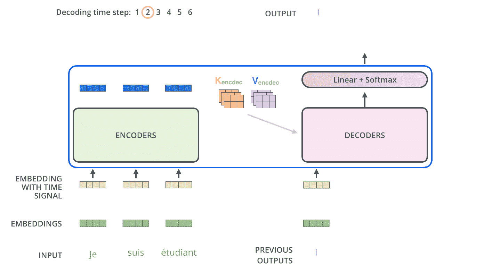
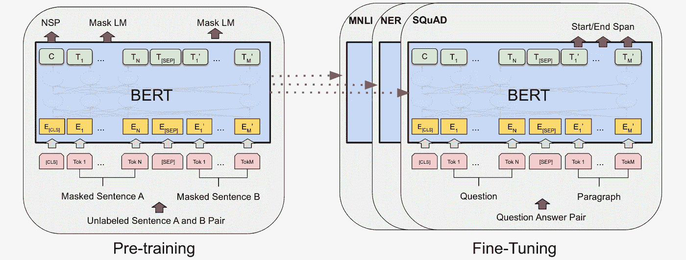
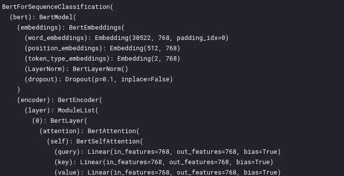

# 文本分类—从词袋到 BERT —第六部分(BERT)

> 原文：<https://medium.com/analytics-vidhya/text-classification-from-bag-of-words-to-bert-part-6-bert-2c3a5821ed16?source=collection_archive---------8----------------------->


[Samule 孙](https://unsplash.com/@samule?utm_source=medium&utm_medium=referral)在 [Unsplash](https://unsplash.com?utm_source=medium&utm_medium=referral) 上的照片

这个故事是一系列文本分类的一部分——从词袋到 BERT 在名为“ [*有毒评论分类挑战”*](https://www.kaggle.com/c/jigsaw-toxic-comment-classification-challenge) ***的 Kaggle 比赛上实施多种方法。*** 在这场比赛中，我们面临的挑战是建立一个多头模型，能够检测不同类型的毒性，如*威胁、淫秽、侮辱和基于身份的仇恨。如果你还没看过之前的报道，那就去看看吧*

[第一部分(BagOfWords)](https://anirbansen3027.medium.com/text-classification-from-bag-of-words-to-bert-1e628a2dd4c9)

[第二部分(Word2Vec)](https://anirbansen3027.medium.com/text-classification-from-bag-of-words-to-bert-part-2-word2vec-35c8c3b34ee3)

[第三部分(快速文本)](https://anirbansen3027.medium.com/text-classification-from-bag-of-words-to-bert-part-3-fasttext-8313e7a14fce)

[第四部分(卷积神经网络)](https://anirbansen3027.medium.com/text-classification-from-bag-of-words-to-bert-part-4-convolutional-neural-network-53aa63941ade)

[第五部分(递归神经网络)](/analytics-vidhya/text-classification-from-bag-of-words-to-bert-part-5-recurrent-neural-network-b825ffc8cb26)

在前面的故事中([第 5 部分(递归神经网络)](/analytics-vidhya/text-classification-from-bag-of-words-to-bert-part-5-recurrent-neural-network-b825ffc8cb26))，我们将使用相同的 Keras 库来创建 LSTMs，这是对用于多标签文本分类的常规 RNNs 的改进。

在这一次，我们将使用预训练的 BERT 模型，并使用迁移学习在我们的数据集上对其进行微调。我们将首先通过对变压器和 BERT 如何工作的一点直觉，然后使用最小化的单输出层(具有 6 个神经元)来实现多标签分类。在仅仅一个时期的微调中，它在排行榜上给出了大约 98 个 AUC。这一次会比平时长，但请耐心等待，因为这是值得的。

# 直觉

## 变形金刚(电影名)

在引入变压器之前，大多数最先进的 NLP 系统都依赖门控 rnn，如 LSTMs 和 GRUs，这一点引起了更多关注。Transformer 建立在这种注意力的基础上，没有使用 RNN 结构，突出了这样一个事实，即没有重复的顺序处理，注意力本身就足以实现带注意力的 RNNs 的性能，并且更具并行性，需要的训练时间也少得多。


变压器整体架构

在机器翻译应用程序中，它会将一种语言的句子转换成另一种语言输出。在里面，我们看到一个编码组件，一个解码组件，以及它们之间的联系。编码组件由 N = 6 个相同层的堆叠组成。解码组件是相同数量的解码器的堆栈。

编码器的输入首先流经自我关注层，该层帮助编码器在编码特定单词时查看输入句子中的其他单词。自我注意层的输出被馈送到一个前馈神经网络。完全相同的前馈网络独立地应用于每个位置。解码器有这两层，但在它们之间有一个注意力层，帮助解码器关注输入句子的相关部分

就像 NLP 中的一般情况一样，我们使用嵌入算法将每个输入单词转换成一个向量。嵌入只发生在最底层的编码器中。但是在其他编码器中，它是直接在下面的编码器的输出。

**N.B.** :每个位置的字在编码器中流经自己的路径。在自我关注层，这些路径之间存在依赖关系。前馈层没有这些依赖性，因此各种路径可以在流经 FF 层时并行执行。

***自我关注:*** 自我关注是变形者用来把对其他相关词汇的“理解”烘焙到我们当前正在处理的一个中的方法。我们遵循以下步骤:

1.从编码器的每个输入向量中创建 3 个向量。因此，对于每个单词，我们创建一个查询向量、一个键向量和一个维数为 64 的值向量。这些向量是通过将输入乘以我们在训练过程中训练的三个矩阵而创建的。

2.算一个分数。假设我们在计算第一个单词的自我关注度。我们需要将输入句子中的每个单词与这个单词进行比较。分数决定了当我们在某个位置对一个单词进行编码时，对输入句子的其他部分的关注程度。分数是通过查询向量与我们正在评分的相应单词的关键向量的点积来计算的。因此，如果我们正在处理位置#1 的单词的自我注意，第一个分数将是 q1 和 k1 的点积。第二个分数是 q1 和 k2 的点积。

3.& 4.将分数除以 8(所用关键向量维数的平方根— 64。这导致具有更稳定的梯度。然后通过 softmax 操作传递结果。Softmax 将分数标准化，因此它们都是正数，加起来等于 1。

5.将每个值向量乘以 softmax 分数。这里的直觉是保持我们想要关注的词的价值不变，淹没无关的词

6.对加权值向量求和。这就在这个位置产生了自我关注层的输出。

***多头自我关注:*** 论文通过增加“多头”关注，进一步细化了自我关注层。这从两个方面提高了注意力层的性能:


多头自我关注摘要

1.  它扩展了模型关注不同位置的能力。
2.  它给了注意力层多个“表示子空间”

我们连接多个矩阵，然后将它们乘以附加的权重矩阵 WO，以便它们可以被发送到前馈网络。

**位置编码:**转换器为每个输入嵌入添加一个向量，以说明单词在输入序列中的顺序。这里的直觉是，将这些值添加到嵌入中提供了嵌入向量之间有意义的距离，一旦它们被投影到 Q/K/V 向量中和在点积注意力期间。左半部分的值由正弦函数生成，右半部分的值由余弦函数生成。然后将它们连接起来，形成每个位置编码向量。

**残差:**每个编码器中的每个子层(自关注，ffnn)周围都有一个残差连接，然后是层归一化步骤。例如，将输入矩阵 X (2 * 4)与输出矩阵 Z (2 * 4)相加，并按行进行归一化。

**解码器端**



编码器从处理输入序列开始。顶部编码器的输出然后通过乘以权重向量被转换成一组注意力向量 K 和 V。这些将由每个解码器在其“编码器-解码器关注”层中使用，这有助于解码器关注输入序列中的适当位置。以下步骤重复该过程，直到到达指示变压器解码器已经完成其输出的特殊符号。每一步的输出在下一个时间步被馈送到底部的解码器，解码器像编码器一样冒泡它们的解码结果。就像我们对编码器输入所做的一样，我们将位置编码嵌入并添加到这些解码器输入中，以指示每个单词的位置。

解码器中的自我关注层的工作方式与编码器中的略有不同:在解码器中，自我关注层只被允许关注输出序列中较早的位置。这是通过在自我关注计算中的 softmax 步骤之前屏蔽未来位置(将它们设置为-inf)来实现的。“编码器-解码器关注”层的工作方式类似于多头自我关注，只是它从其下一层创建查询矩阵，并从编码器堆栈的输出中获取键和值矩阵。

**最终的线性和 Softmax 层**线性层是一个简单的全连接神经网络，它将解码器堆栈产生的向量投影到一个非常非常大的向量中，称为 logits 向量，其中每个单元都是词汇表中的一个单词。然后 softmax 层将这些分数转化为概率。选择概率最高的像元，并产生与之相关的单词作为该时间步长的输出。

**训练**通过使用交叉熵损失将预测值与实际值进行比较来完成。因为，模型一次输出一个单词，我们可以使用束搜索来找到最佳的输出字符串

## 来自变压器的双向编码器表示

BERT 基本上是一个训练有素的变压器编码器堆栈。我们预先训练伯特理解语言，并微调伯特学习特定的任务。



**预训练:**这是通过同时做两件事来完成的:

1.  屏蔽语言建模(MLM):MLM 从输入中随机屏蔽一些标记，目标是仅根据上下文预测屏蔽单词的原始词汇 id。这只棕色的狐狸跳过了那只戴面具的狗。MLM 目标使得表示能够融合左和右上下文，这允许我们预先训练深度双向转换器。训练数据生成器随机选择 15%的标记位置进行预测。如果选择了第 I 个令牌，我们用(1)80%时间的[掩码]令牌(2)10%时间的随机令牌(3)10%时间的未改变的第 I 个令牌来替换第 I 个令牌。
2.  下一个句子预测(NSP):在这个任务中，取两个句子，如果这两个句子是一个接一个的或者不是，则进行二元分类。阿杰是个很酷的人，他住在俄亥俄州。

**输入:**


我们为输入向量传入嵌入向量。这个嵌入向量是通过将相应的标记、段和位置嵌入相加而从输入向量中计算出来的。分段和位置编码用于模型以理解时间定位，因为这些输入是同时给出的，而不是像 LSTMs 中那样在一个时间步长给出的。对于令牌嵌入，我们使用具有 30，000 个令牌词汇的单词块嵌入。具体来说，在为每个预训练示例选择句子 A 和 B 时，B 有 50%的时间是跟随 A 的实际下一个句子(标记为 IsNext)，有 50%的时间是来自语料库的随机句子(标记为 NotNext)。

**输出:**MLM 的输出是语句向量的形式，其中屏蔽的记号填充有预测的记号。然后，对词汇表中的所有单词进行软最大化，并根据实际值计算交叉熵损失。这样做是为了屏蔽文字。

NSP 的输出是输出中[CLS]令牌的结果。

**微调:**


对于每个任务，我们只需将特定于任务的输入和输出插入到 BERT 中，并对所有参数进行端到端的微调。相比于预训练，微调相对便宜且快速。该论文给出了 BERT 的两种模型尺寸(对于，层数(即，变换器块)为 L，隐藏尺寸为 H，自关注头的数量为 A):

BERTBASE (L=12，H=768，A=12，总参数=110M)

伯特拉奇(L=24，H=1024，A=16，总参数=340M)。

对于预训练语料库，我们使用了图书语料库(800M 单词)和英语维基百科(2,500M 单词)。

这些文本主要取自以下资源:【http://jalammar.github.io/illustrated-transformer/[https://www.youtube.com/watch?v=xI0HHN5XKDo](https://www.youtube.com/watch?v=xI0HHN5XKDo)T4

# 履行

你可以在这里找到完整的代码

## 1.读取数据集


提醒一下，这是训练数据的样子

## **2。文本预处理**

首先，我们来清理一下数据:1。使用 BeautifulSoup 和 2 清理 HTML 标签。删除非字母数字数据

```
def strip(text):
 soup = BeautifulSoup(text, ‘html.parser’)
 text = re.sub(‘\[[^]]*\]’, ‘’, soup.get_text())
 pattern=r”[^a-zA-z0–9\s,’]”
 text=re.sub(pattern,’’,text)
 return text
df_train[“comment_text”] = df_train[“comment_text”].apply(strip)
df_test[“comment_text”] = df_test[“comment_text”].apply(strip)
```

BERT 输入的预处理:

```
#Adding [CLS] and [SEP] for each sentence
train_sentences = df_train[“comment_text”]
test_sentences = df_test[“comment_text”]
train_sentences = [“[CLS] “+ i + “ [SEP]”for i in train_sentences]
test_sentences = [“[CLS] “+ i + “ [SEP]”for i in test_sentences]
print(train_sentences[0])
#Tokenizing the input sequence
tokenizer = BertTokenizer.from_pretrained('bert-base-uncased', do_lower_case = True)
train_tokenizer_texts = list(map(lambda t: tokenizer.tokenize(t)[:510], tqdm(train_sentences)))
test_tokenizer_texts = list(map(lambda t: tokenizer.tokenize(t)[:510], tqdm(test_sentences)))
print(np.array(train_tokenizer_texts[0]))
#Converting Input words to corresponding ids
input_ids = [tokenizer.convert_tokens_to_ids(x) for x **in** tqdm(train_tokenizer_texts)]
input_ids = pad_sequences(sequences = input_ids, maxlen = MAX_LEN, dtype = 'long', padding='post', truncating='post')
test_input_ids = [tokenizer.convert_tokens_to_ids(x) for x **in** 
tqdm(test_tokenizer_texts)]
#Padding the input sequences to a fixed length
MAX_LEN = 128
test_input_ids = pad_sequences(sequences = test_input_ids, maxlen = MAX_LEN, dtype = 'long', padding='post', truncating='post')
*#Creating an attention mask - For actual tokens its set to 1, for padding tokens its set to 0*
def create_attention_masks(input_ids):
    attention_masks = []
    for seq **in** tqdm(input_ids):
        seq_mask = [float(i>0) for i **in** seq]
        attention_masks.append(seq_mask)
    return np.array(attention_masks)

attention_masks = create_attention_masks(input_ids)
test_attention_masks = create_attention_masks(test_input_ids)
attention_masks[0], test_attention_masks[0]
```


预处理的结果

1.  每个序列的第一个标记总是一个特殊的分类标记([CLS])，我们用一个特殊的标记([SEP])来分隔句子
2.  输入必须被分割成标记，然后这些标记必须被映射到它们在标记化器词汇表中的索引。
3.  填充输入的符号化索引序列
4.  创建一个注意力面具

## 3.创建训练和验证数据加载器

首先，我们将预训练数据集分为训练和验证两部分。然后，我们将所有数据集转换为 torch 类型，以便 PyTorch 可以使用它。最后，我们将创建训练和验证数据加载器，它们可用于在训练/预测时生成批量数据

```
*# Use train_test_split to split our data and attention masks into train and validation sets for training*
X_train, X_val, y_train, y_val = train_test_split(input_ids, labels, random_state = 123, test_size = 0.20)
attention_masks_train, attention_masks_val = train_test_split(attention_masks, random_state = 123, test_size = 0.20)*# Convert all inputs and labels into torch tensors, the required datatype* 
X_train = torch.tensor(X_train)
X_val = torch.tensor(X_val)
y_train = torch.tensor(y_train) 
y_val = torch.tensor(y_val)
attention_masks_train = torch.tensor(attention_masks_train)
attention_masks_val = torch.tensor(attention_masks_val)
test_input_ids = torch.tensor(test_input_ids)
test_attention_masks = torch.tensor(test_attention_masks)BATCH_SIZE = 32
*#Dataset wrapping tensors.*
train_data = TensorDataset(X_train, attention_masks_train, y_train)
val_data = TensorDataset(X_val, attention_masks_val, y_val)
test_data = TensorDataset(test_input_ids, test_attention_masks)
*#Samples elements randomly. If without replacement(default), then sample from a shuffled dataset.*
train_sampler = RandomSampler(train_data)
val_sampler = SequentialSampler(val_data)
test_sampler = SequentialSampler(test_data)
*#represents a Python iterable over a dataset*
train_dataloader = DataLoader(train_data, sampler = train_sampler, batch_size = BATCH_SIZE)
val_dataloader = DataLoader(val_data, sampler = val_sampler, batch_size = BATCH_SIZE)
test_dataloader = DataLoader(test_data, sampler = test_sampler, batch_size = BATCH_SIZE)
```

## 4.加载预训练的 BERT 并设置微调参数

首先，我们加载用于序列分类的 BERT 模型。我们将输出神经元设置为 6，因为我们有 6 种毒性类型要预测为是或否。

接下来，我们获得不同层的权重，并将它们放入一个列表中。完成后，我们将权重参数(需要更新)与偏差、伽玛和贝塔参数(不需要更新)分开。

```
*#Inititaing a BERT model*
model = BertForSequenceClassification.from_pretrained('bert-base-uncased', num_labels = 6)
model.cuda()
*#Dividing the params into those which needs to be updated and rest*
param_optimizer = list(model.named_parameters())
no_decay = ['bias', 'gamma', 'beta']
optimizer_grouped_parameters = [{
        'params': [p for n, p **in** param_optimizer if **not** any(nd **in** n for nd **in** no_decay)],
        'weight_decay_rate': 0.01 },
{       'params': [p for n, p **in** param_optimizer if any(nd **in** n for nd **in** no_decay)],
        'weight_decay_rate': 0.0 }]
optimizer = BertAdam(optimizer_grouped_parameters, lr = 2e-5, warmup = .1)
```



伯特模型

## 5.调整 BERT 模型

在这个阶段，我们根据需要对数据集上的 BERT 模型进行多次微调，并根据验证数据验证模型性能。我们将使用 BCEWithLogitLoss 函数来计算预测值和实际值之间的多标签损失。这类似于在网络末端添加一个 sigmoid 函数，并计算二元交叉熵损失，就像我们在 Keras 为 LSTM 和 CNN 所做的那样。

```
*#Empty the GPU memory as it might be memory and CPU intensive while training*
torch.cuda.empty_cache()
*#Number of times the whole dataset will run through the network and model is fine-tuned*
epochs = 2
*#Iterate over number of epochs*
for _ **in** trange(epochs, desc = "Epoch"):
    *#Switch model to train phase where it will update gradients*
    model.train()
    *#Initaite train and validation loss, number of rows passed and number of batches passed*
    tr_loss = 0
    nb_tr_examples, nb_tr_steps = 0, 0
    val_loss = 0
    nb_val_examples, nb_val_steps = 0, 0
    *#Iterate over batches within the same epoch*
    for batch **in** tqdm(train_dataloader):
        *#Shift the batch to GPU for computation*
        batch = tuple(t.to(device) for t **in** batch)
        *#Load the input ids and masks from the batch*
        b_input_ids, b_input_mask, b_labels = batch
        *#Initiate gradients to 0 as they tend to add up*
        optimizer.zero_grad()
        *#Forward pass the input data*
        logits = model(b_input_ids, token_type_ids = None, attention_mask = b_input_mask)
        *#We will be using the Binary Cross entropy loss with added sigmoid function after that in BCEWithLogitsLoss*
        loss_func = BCEWithLogitsLoss()
        *#Calculate the loss between multilabel predicted outputs and actuals*
        loss = loss_func(logits, b_labels.type_as(logits))
        *#Backpropogate the loss and calculate the gradients*
        loss.backward()
        *#Update the weights with the calculated gradients*
        optimizer.step()
        *#Add the loss of the batch to the final loss, number of rows and batches*
        tr_loss += loss.item()
        nb_tr_examples += b_input_ids.size(0)
        nb_tr_steps += 1
    *#Print the current training loss* 
    print("Train Loss: **{}**".format(tr_loss/nb_tr_examples))
    *#Switch the model to evaluate stage at which the gradients wont be updated*
    model.eval()
    *#Iterate over the validation data*
    for step, batch **in** enumerate(val_dataloader):
        *#Shift the validation data to GPUs for computation*
        batch = tuple(t.to(device) for t **in** batch)
        *#We dont want to update the gradients*
        with torch.no_grad():
            *#Load the input ids and masks from the batch*
            b_input_ids, b_input_mask, b_labels = batch
            *#Forward pass the input data*
            logits = model(b_input_ids, token_type_ids = None, attention_mask = b_input_mask)
            *#We will be using the Binary Cross entropy loss with added sigmoid function after that in BCEWithLogitsLoss*
            loss_func = BCEWithLogitsLoss()
            *#Calculate the loss between multilabel predicted outputs and actuals*
            loss = loss_func(logits, b_labels.type_as(logits))
            *#Add the loss of the batch to the final loss, number of rows and batches*
            val_loss += loss.item()
            nb_val_examples += b_input_ids.size(0)
            nb_val_steps += 1
    *#Print the current validation loss* 
    print("Valid Loss: **{}**".format(val_loss/nb_val_examples))
```


第一时段的平均损失

## 6.改进的结果和范围


Kaggle 排行榜分数(相当惊人的一个时代吧？)

*   尝试不同版本的 BERT — RoBERTa、DistilBERT 和 ALBERT
*   时期、学习率、批量大小、提前停止的超参数调整

同样，这个博客的全部代码呈现在[(这里)](https://www.kaggle.com/anirbansen3027/jtcc-multilabel-bert-pytorch)。请以回答和鼓掌的形式提供您的反馈:)