# YouTube 的文本数据分析

> 原文：<https://medium.com/analytics-vidhya/text-data-analysis-of-youtube-917f0823294f?source=collection_archive---------14----------------------->

在这篇文章中，我将让你知道基于评论、喜欢和不喜欢对 YouTube 的分析。简单地说，我们必须根据数据集来分析用户的情绪。

现在，首先让我告诉你什么是情绪或者你所说的情绪是什么意思。情绪就是一个人的情感或想法，或者我们可以说它是一个人表达的观点。消极情绪意味着一些不好的情绪、不好的想法或不好的观点。比如:-假设你说一个男生长得丑，意味着你对那个人有负面情绪。同样，积极的情绪是一些好的想法、好的情感或好的观点。现在让我们来看一个积极情绪的例子，假设你遇到了一个看起来很漂亮的人，你告诉他/她你看起来很好，所以这是一个积极情绪。

来源:-谷歌

我希望你明白到这一点，什么是积极的情绪，什么是消极的情绪。现在让我们开始使用数据集。我正在为这个项目使用 Jupyter 笔记本，你也可以使用它，否则你可以使用谷歌 Colab 为同一个项目。所以首先，你必须导入并加载所有必要的库。

# 导入所有必需的库

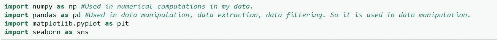

导入必要的库

# 导入数据集

现在，在加载完所有库之后，您需要加载数据集。因为我已经从 Kaggle 获取了数据集，所以你也可以从这里获取:- [点击这里](https://www.kaggle.com/datasnaek/youtube?select=GBcomments.csv)。现在，我们可以使用下面几行代码加载数据集

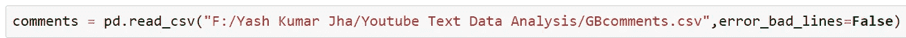

这里我们已经加载了数据集。

加载后，让我们看看它包含什么，看看数据集里面有什么:-

# 查看数据集

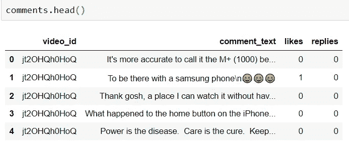

使用查看数据集。head()方法。

现在，我们必须基于数据集中给出的 comment_text 特征来执行情感分析。为了进行情感分析，我们必须安装一个名为“textblob”的软件包。要加载它，我们可以使用 anaconda 提示符(看起来像命令提示符)或者使用 jupyter 笔记本本身。因为我是用 Jupyter Notebook 加载的，所以让我向你展示如何在 Jupyter 环境中加载 textblob。

# 安装 TextBlob 库

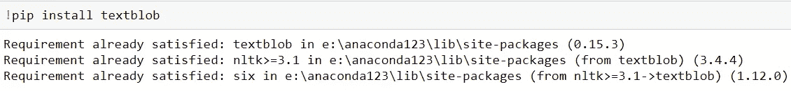

因为它已经在我的情况下下载，所以它显示要求已经得到满足。

现在加载后，我们必须像这样导入它:-

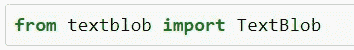

导入 TextBlob

在这之后，我们将试着检查这个陈述是否是一个肯定的陈述，为此我们将检查任何一个句子的极性。极性简单地定义了表述的方向，即:如果句子确定正面情绪，则极性值将大于 0 且小于或等于 1，如果句子确定负面情绪，则极性值将小于 0 且大于或等于-1。并且如果该陈述确定中性情绪，则极性的值将在-1 和 1 之间。我再告诉你一件事，极性的值位于[-1，1]的范围内，其中 1 表示肯定的说法，-1 表示否定的说法。

# 本项目的主要任务

现在，让我告诉你，我们在这里的任务是:—

1.  对 YouTube 评论进行情感分析。
2.  对肯定句进行探索性数据分析
3.  对否定句进行探索性数据分析。

# 清理数据集

## 检查缺少的值

至此，我们已经加载了数据集和所有库。现在，我们来看看数据集中是否有丢失的值。我们可以用这段代码做同样的事情

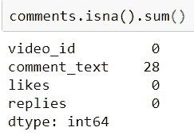

## 从数据集中移除缺失值

这表明我们在列 comment_text 中缺少 28 个值。因此，我们将使用下面的代码简单地删除这 28 个值

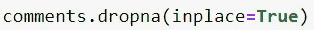

现在，随着丢失的值被删除，让我们再次检查它是否反映在原始数据集中。

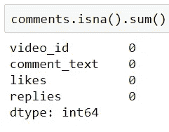

现在不存在缺失值。

## 将句子的所有情感存储到变量中

这里我们没有丢失值。因此，我们将简单地开始检查“comment_text”列中每个语句的极性，并使用以下代码将极性值存储在一个列表中

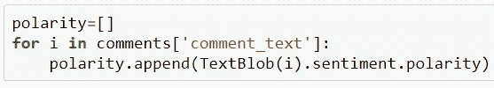

我们将极性值存储在名为 polarity 的列表中。

现在，我们可以在数据集中添加一个新列，将其命名为 polarity，并使用以下代码添加存储在名为 polarity 的列表中的所有值

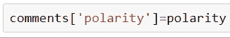

# 更新注释数据集

这将在数据集注释中创建一个名为“polarity”的新列。现在我们可以使用。head()命令，查看是否所有极性值都已上传。

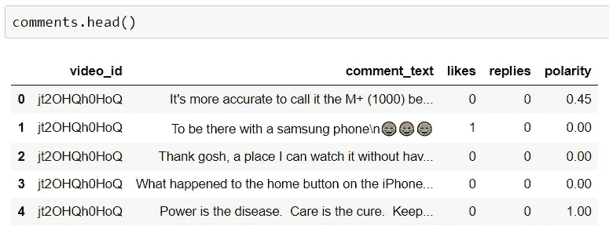

这里我们可以看到数据集中的极性值已经更新，列名为 polarity。

到现在为止，我们已经分析了句子的情感。所以我们执行情感分析的第一个任务已经完成了。现在，我们必须着眼于下一个任务，即:对否定句和肯定句进行探索性数据分析。我们先来看关于肯定句的探索性数据分析。

# 探究肯定句

首先，我们将创建一个名为 comments_positive 的数据帧，并使用下面几行代码将所有肯定句数据存储在其中

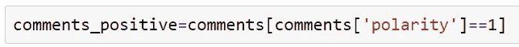

将所有的正面句子数据加载到评论正面数据帧中

现在，我们将使用以下代码检查 comments_positive 数据集中的行和列

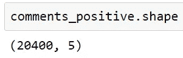

并了解有 20400 行和 5 列，现在让我们使用。head()命令:-

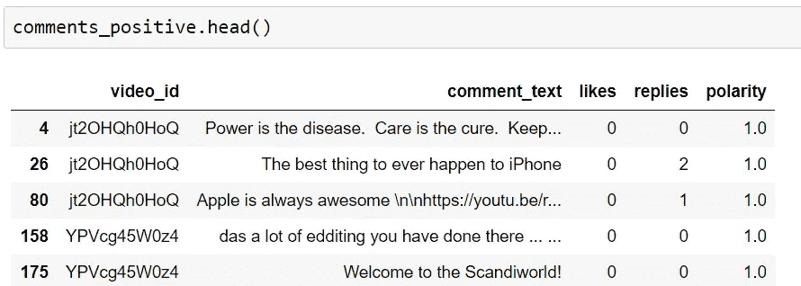

这里你可以看到所有极性= 1 的句子

现在，我们将使用“云”这个词来形象化地描述这一点。词云简单来说就是一种用于表示文本数据的数据可视化技术，从中我们可以知道，如果词的大小越大，就意味着它的使用频率越高，使用次数越多。单词的大小表明它的频率或重要性。我们可以简单地理解为，它是一个工具，告诉我们的话在一些巨大的数据块中有多重要。单词越大，单词越重要。

# 安装单词云

我们可以使用下面的代码来安装 wordcloud

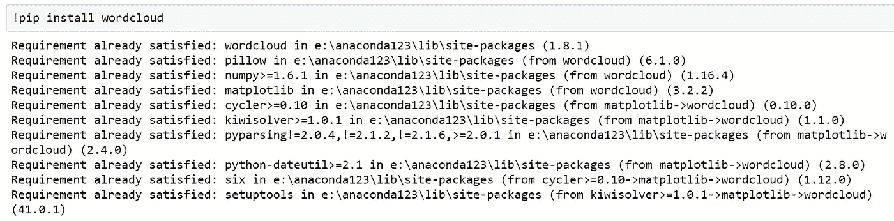

因为它已经安装在我的电脑上，它显示的要求已经得到满足。

安装后，我们只需导入单词云和停用词，其中停用词是在任何语言中简单使用的词，如:“the”、“is”、“and”等。这些是停用词的例子，它们在我们的句子中没有任何情感，所以我们必须在制作词云时将它们从我们的句子中移除。停用词用于删除不重要的词，这样我们就可以主要关注重要和有用的词。

下面是我们如何导入单词云和停用词:-

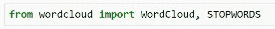

导入必要的库后，我们将使用以下代码为停用词赋值

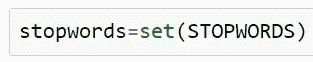

这将采取独特的话，对我们来说不重要。

这将提取对我们不重要的唯一单词，这就是为什么我们在这里设置只提取唯一单词，并将其赋给名为 stopwords 的变量。

在此之后，我将 comment_text 中的所有句子放入一个变量中，并使用以下代码将其命名为 total_comments

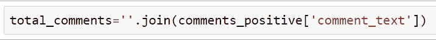

这段代码将存储单独存储在列 comment_text 中的所有句子。

在这之后，我们将使用下面的代码行组成单词云

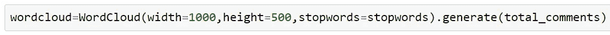

这里，我们将宽度设置为 1000，高度设置为 500，我们将把停用字词参数指定为对我们不重要的字词，并且我们已经将它们存储在名为停用字词的变量中。

# 使用 WordCloud 可视化肯定句

现在，我们将简单地用下面几行代码展示单词云

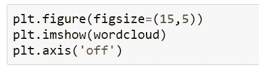

生成这个词云的代码。

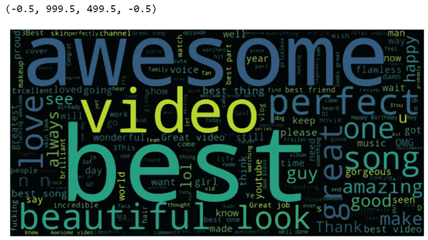

这是为肯定句形成的词云

现在，同样地，我们必须做同样的事情来分析否定句。

# 研究否定句

现在，我们将所有极性为-1 的句子存储在一个名为 comments_negative 的变量中，代码如下

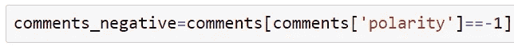

现在，我们将所有的注释合并成一个，命名为 total_comments，使用下面的代码行

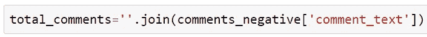

在这之后，我们将使用下面的代码行组成单词云

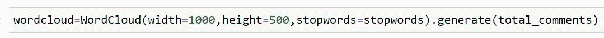

# 使用 WordCloud 可视化否定句

在这之后，我们将简单地用下面几行代码来展示 wordcloud

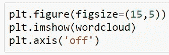

用于生成以下单词云的代码。

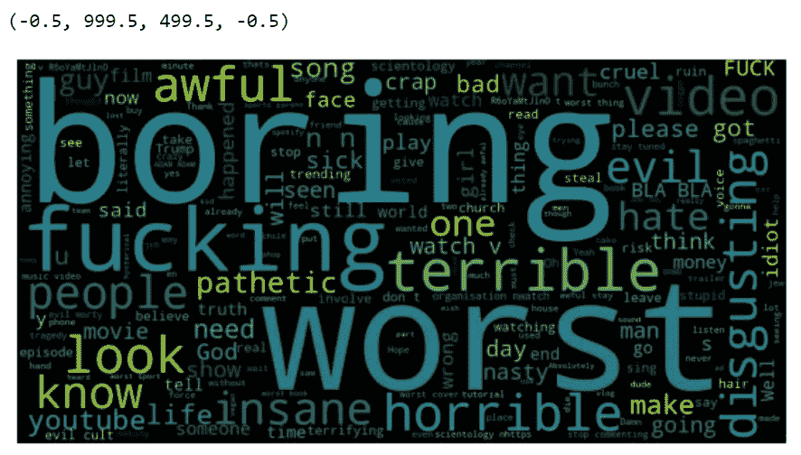

否定句形成的词云。

# 结束语

这就是这个项目，直到那时享受使用 Python 编码和制作项目。如果你在这两者之间进退两难，请告诉我，我一定会调查你的问题。

非常感谢您阅读这篇文章。

你可以从 GitHub 上查看它的源代码，点击这里。