# 短信聊天机器人

> 原文：<https://medium.com/analytics-vidhya/text-messaging-chat-bot-10483c28f9aa?source=collection_archive---------0----------------------->

使用 Twilio 作为文本消息通道的 Azure Bot 框架聊天机器人

# 如何构建一个对话式人工智能机器人来重新安排约会

# 先决条件

*   Azure 帐户
*   下载 Bot frame composer
*   安装地点—[https://docs.microsoft.com/en-us/composer/introduction?tabs=v2x](https://docs.microsoft.com/en-us/composer/introduction?tabs=v2x)
*   获取最新版本
*   需要一些 Azure 信用
*   创建资源组
*   需要路易斯
*   现在它正在建造它

# 体系结构

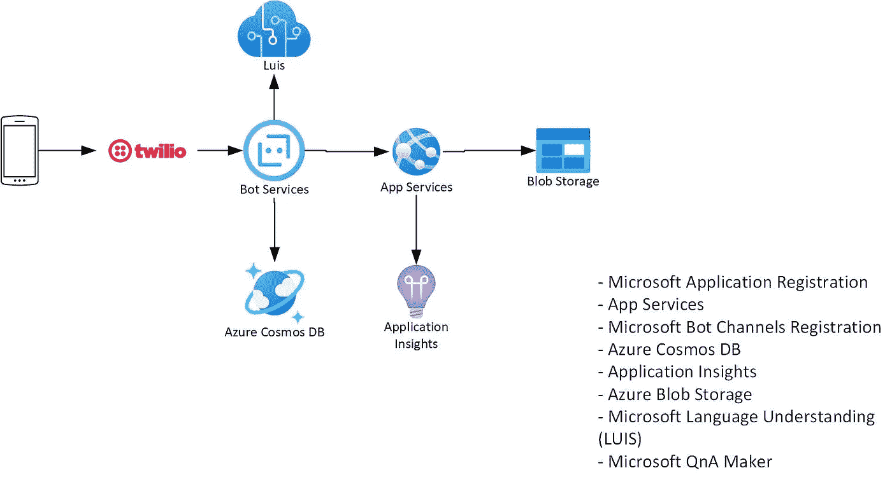

# 密码

*   创建资源组
*   为 LUIS 创建新资源
*   我们需要这个给机器人
*   一旦你创造了认知服务，你就很棒
*   现在打开机器人作曲家

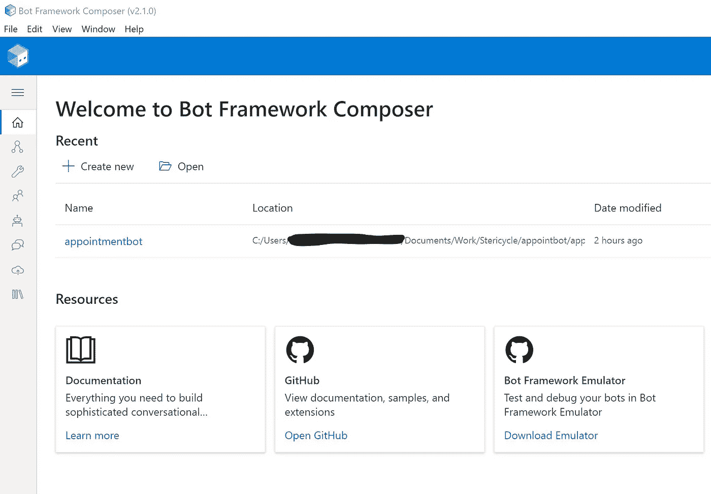

*   现在选择基于语言的机器人

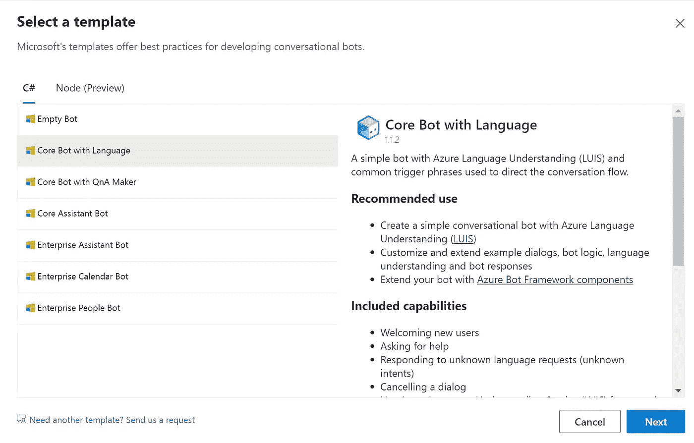

*   现在为机器人创建一个名为

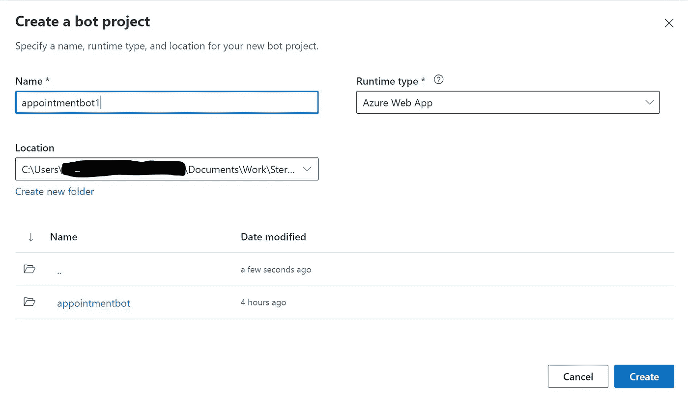

*   确保 bot Lanugage 理解调度程序设置为默认。

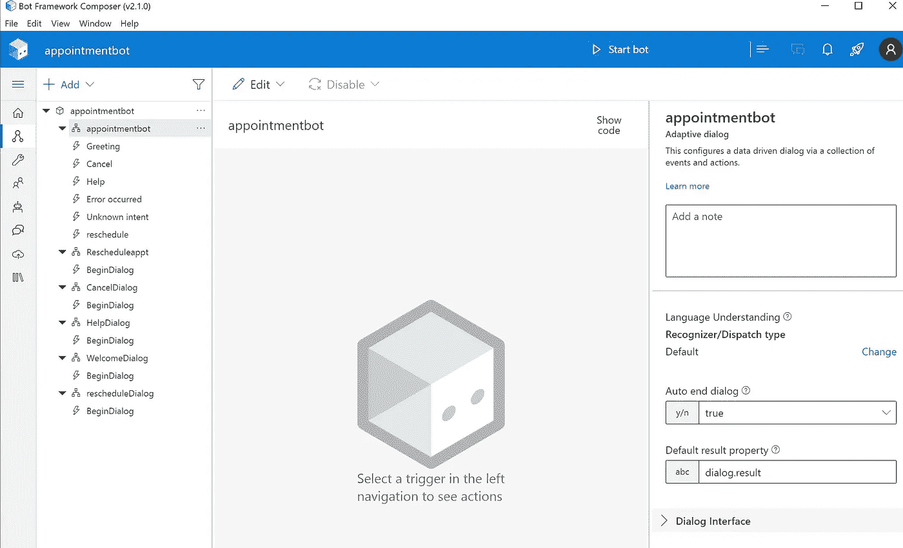

*   如果没有，将 lui 连接到上面创建的资源
*   我们不需要创建任何路易斯项目
*   如果 LUIS 没有刷新，请保存并关闭，然后重新打开 bot composer 和项目
*   现在我们需要在主约会机器人中创建一个触发器

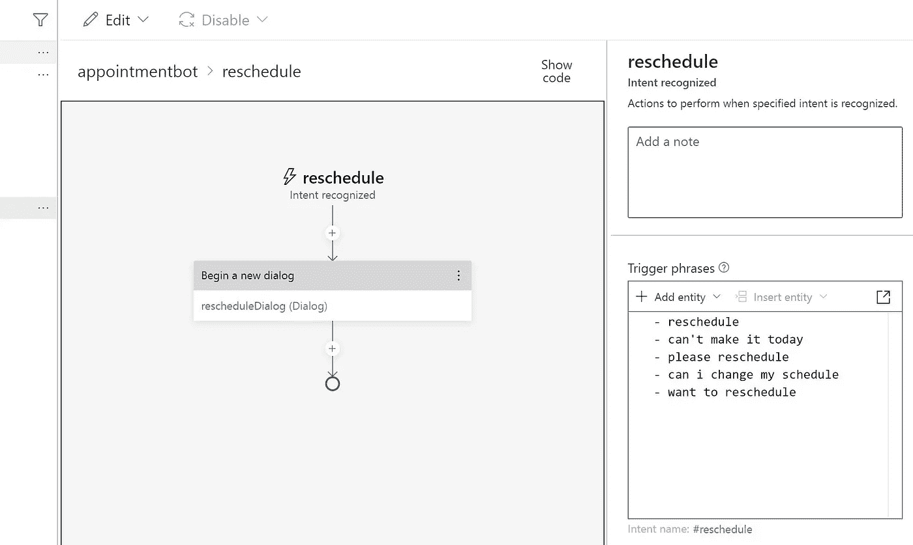

*   对于触发短语

```
- reschedule
- can't make it today
- please reschedule
- can i change my schedule
- want to reschedule
```

*   我们仍然没有创建对话框
*   接下来是创建一个名为“重新安排对话”的新对话
*   这是用于重新计划的对话框

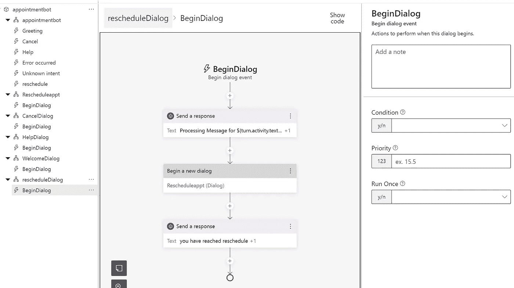

*   一旦 reschdule 被触发，我们需要创建一个新的对话框来处理输入
*   创建新的诊断日志

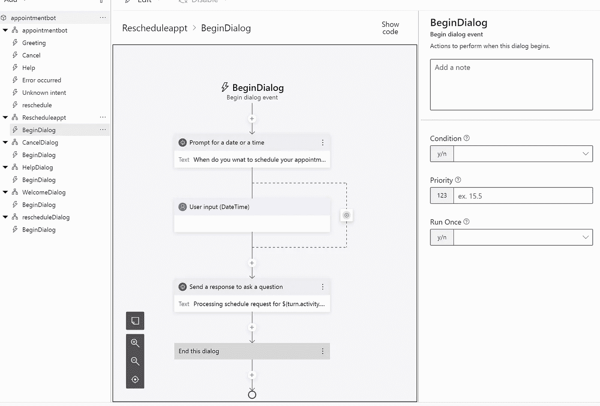

*   一旦我们收集了要处理的数据，上述对话框将关闭对话
*   现在启动机器人


*   现在让我们在网络聊天中测试这个机器人

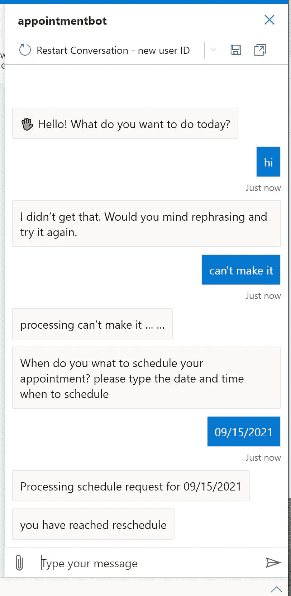

*   如上图，用户输入日期，我们可以进一步处理。
*   创建发布配置文件

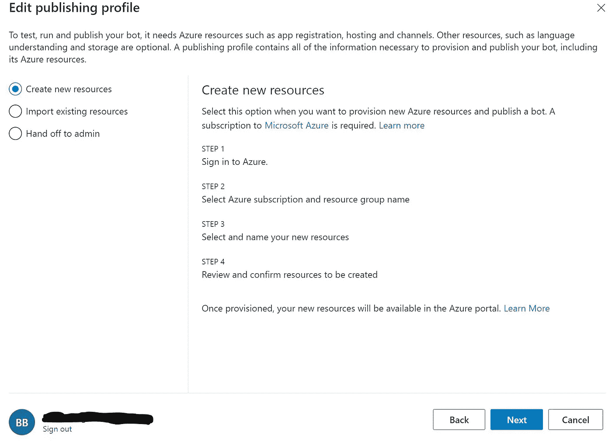

*   选择选项 1

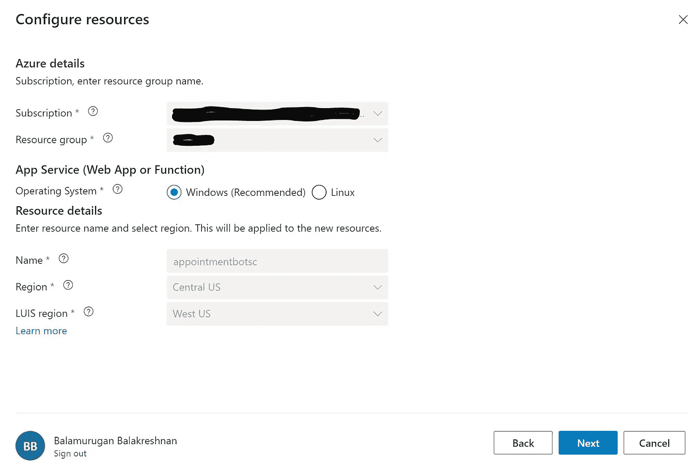

*   单击下一步并取消选择 QNA 制造商
*   保留剩余选项
*   单击创建，等待配置文件创建
*   您需要获得发布许可

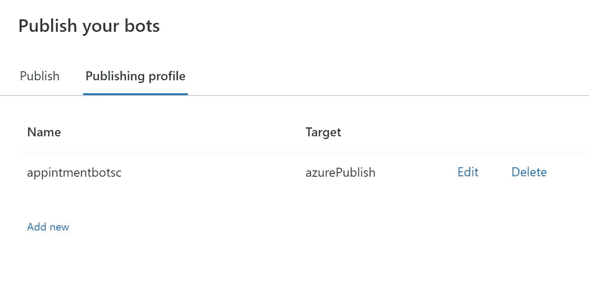

*   去发布

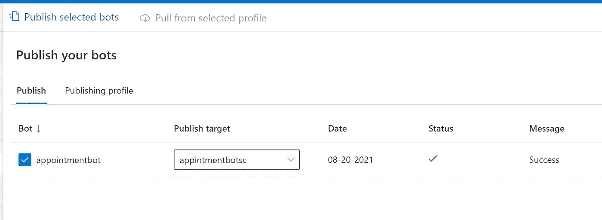

*   选择应用程序，并在配置文件下拉列表中单击新创建的应用程序
*   使服从
*   现在登录 www.twilio.com[的](http://www.twilio.com/)
*   创建一个免费帐户
*   花 1 美元买一个电话号码

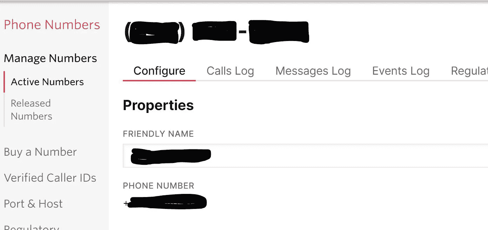

*   设置消息传递 API

```
[https://sms.botframework.com/api/sms](https://sms.botframework.com/api/sms)
```

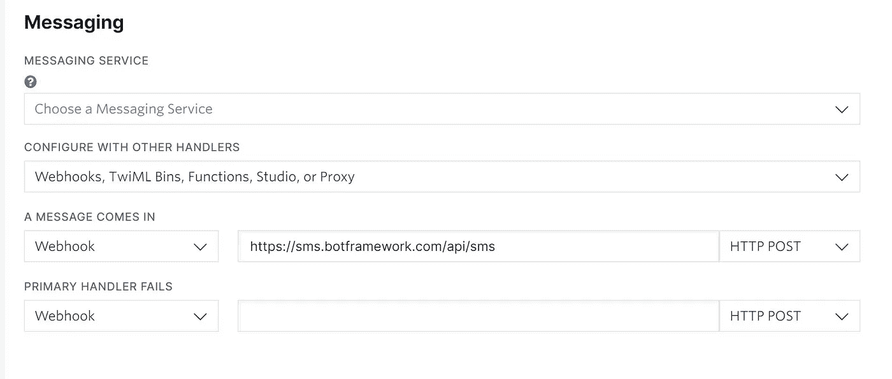

*   现在发送一条短信到用信息创建的号码

```
can't make it
```

*   应该得到一个请求日期和时间的响应
*   用一句话键入日期和时间
*   现在你应该会看到一些回应

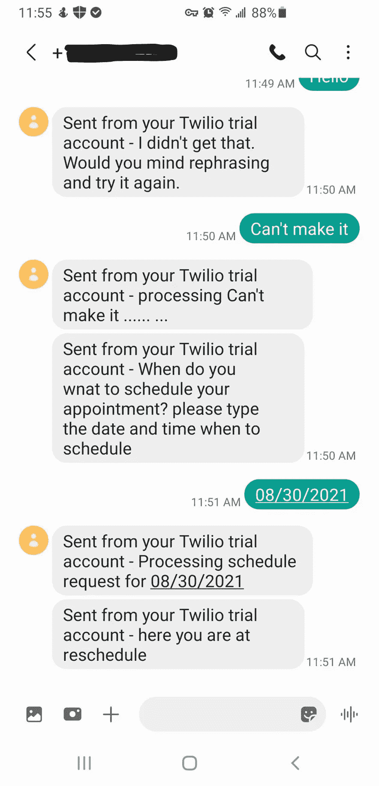

*   完成的

原文—【github.com】samples 2021/appt bot . MD at main balakreshnan/samples 2021