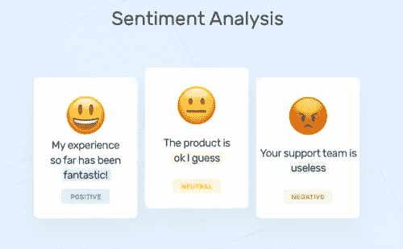
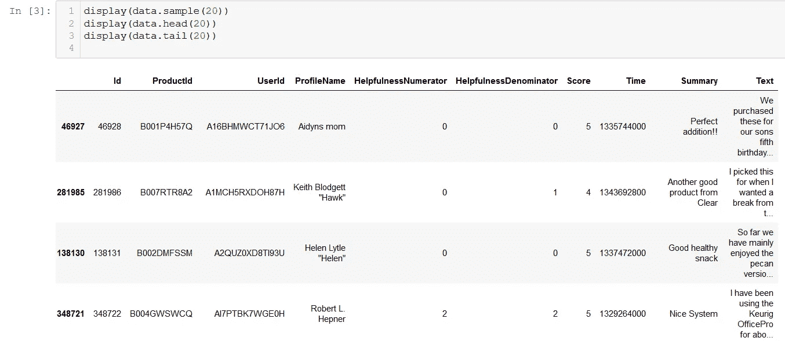
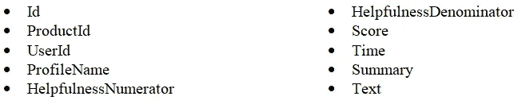
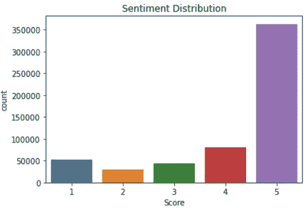
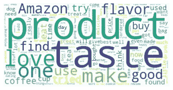
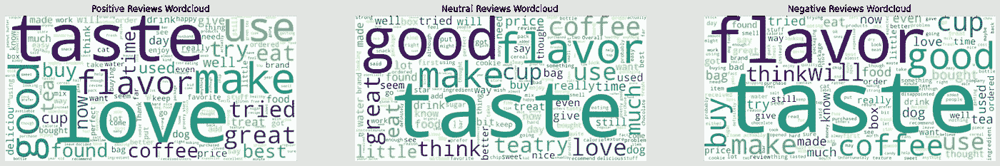
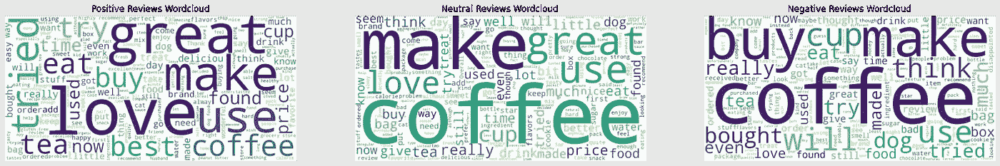
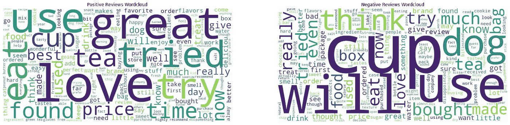
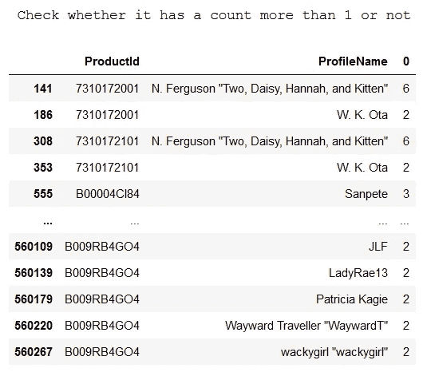

# 文本处理和分类介绍(第 1 部分—情感分析)

> 原文：<https://medium.com/analytics-vidhya/text-processing-and-classification-intro-part-1-sentiment-analysis-7e22a83e1c4?source=collection_archive---------1----------------------->



[https://vital flux . com/情操-分析-机器-学习-技巧/](https://vitalflux.com/sentiment-analysis-machine-learning-techniques/)

> 如何操作文本数据以获得更多洞察力？如何通过点评了解目前的市场情绪？

对于像我这样没有技术背景的初级数据科学家来说，处理文本数据一直是一个障碍。早年，我们不知道如何将文本用作机器学习模型的输入。我们中的一些人可能已经有了将文本数据中的每个单词转换成数字的想法，但不太确定如何将每个文本转换成特定的数字。这是众多可用方法中的一种。

借此机会，我想分享一下我学习文字处理 3 周左右的经验。我把我的作品分成两部分。这部分会讲我们如何分析文本数据来做情感分析。在我学习情感分析的整个过程中，我都会参考这个[链接](https://towardsdatascience.com/a-beginners-guide-to-sentiment-analysis-in-python-95e354ea84f6)。

> 如果你想直接看到文本分类过程，这里有一个链接我写作的第二部分:
> [https://sea-Remus . medium . com/text-processing-and-class ification-intro-part-2-text-class ification-9dc 58782 ACB 6](https://sea-remus.medium.com/text-processing-and-classification-intro-part-2-text-classification-9dc58782acb6)

在我们开始之前，我们应该导入所有必要的包

```
import pandas as pd
import numpy as np
import sqlite3
import matplotlib.pyplot as plt
import seaborn as sns
```

# 要使用的文本数据

我们将用来学习如何进行文本处理和分类的文本数据将是[亚马逊美食评论](https://www.kaggle.com/snap/amazon-fine-food-reviews?select=Reviews.csv)上的文本数据。首先，我们从。链接上提供的 sqlite 文件或阅读提供的 csv 文件。

```
con = sqlite3.connect('database.sqlite')
data = pd.read_sql_query('select * from Reviews', con)
con.close()
```



对数据的一瞥

我们的数据包含以下 10 列:



在开始之前，我们清理数据，以便我们可以评估以后使用哪些列。我们试图用。isnull()和一个自定义函数。

```
#check for missing values
print(data.isnull().sum())
print('\n\n\n')def checkweirddataandnull(name):
    print('='*30)
    print('Column name: '+name)
    if data[name].dtypes == 'O':
        display(data[(data[name] == 'nan')|(data[name] == 'NaN')|
                     (data[name] == 'N/A')|(data[name] == '0')|
                     (data[name] == '')|(data[name] == '-1')|
                     (data[name] == 'null')|(data[name] == 'Null')|
                     (data[name] == 'NA')|(data[name] == 'na')|
                     (data[name] == 'none')|(data[name] == 'unknown')])
    else:
        display(data[data[name] < 0])for i in data.columns:
    checkweirddataandnull(i)
```

通过上面的代码，我们可以看到我们的数据包含了多少缺失值。原来我们的数据在 ProfileName 和 Summary 列上有几个缺失值。我们通过将 ProfileName 中缺少的值假定为“匿名”并将 Summary 中缺少的值假定为“无摘要”来处理这个问题。

# 解读数据

我们将评估“文本”栏，因为它包含了评论。我们将首先关注“分数”栏，因为它反映了我们客户的情绪。



“分数”计数图

解读上面的图表，我们可以看到我们客户的情绪趋于积极。顾客留下的评论大多评分在 4 分以上。这表明市场是满意的。从这里，我们想生成一个词云，以更好地了解哪些词经常被用来描述我们的产品。为了生成一个好的词云，我们需要首先清理我们的文本数据，这样经常说的不相关的词就不会被包括在内(例如，连词等。).

```
#See what is the most used words from our data
from wordcloud import WordCloud,STOPWORDS
stpwrd = set(STOPWORDS)
stpwrd.update(['br','href']) #this is to handle should there be any HTML tags
text = ' '.join(i for i in data.Text) #this is to combine all text into one huge string.
wordcloud = WordCloud(stopwords = stpwrd).generate(text)plt.imshow(wordcloud, interpolation = 'bilinear')
plt.axis('off')
plt.show()
```



所有评论的文字云

我们可以看到，评论中使用的几个常用词是“爱”和“好”。这意味着单词 cloud 与之前显示的“分数”计数图具有相同的指示。假设我们的客户不是在讽刺我们，我们的大多数评论都是正面的。:)

让我们尝试绘制积极、中性和消极情绪的词云，但添加额外的停用词，如“亚马逊”、“产品”、“一个”和“找到”，因为它经常使用，但感觉对区分情绪没有影响。我们通过查看“分数”栏对评论进行分类，如下所示:

*   积极情绪:5/5 分
*   中性情绪:4/5 分
*   负面情绪:<4 Score

> Assumption:
> 这种分类是在考虑数据集的情况下完成的。我们可以看到，大多数评论是 5/5，一些是 4/5，这意味着可能有客户发现该产品很普通，仅高于平均水平，但给出了 4/5 的评分。我们稍后将检验这一假设的正确性。

## 每种情绪的文字云

```
#we update the stopwords first
stpwrd.update(['Amazon','product','one','find'])#then we draw the wordclouds for each sentiments
postext = ' '.join(i for i in data[data.Sentiments == 1].Text) #this is to combine all text into one huge string.
poswordcloud = WordCloud(width = 1600,height = 800, stopwords = stpwrd, background_color='white', random_state = 42).generate(postext)fig, (ax1, ax2, ax3) = plt.subplots(1,3,figsize = (25,25))
ax1.imshow(poswordcloud, interpolation = 'bilinear')
ax1.axis('off')
ax1.set_title('Positive Reviews Wordcloud')neutext = ' '.join(i for i in data[data.Sentiments == 0].Text) #this is to combine all text into one huge string.
neuwordcloud = WordCloud(width = 1600,height = 800,stopwords = stpwrd, background_color='white', random_state = 42).generate(neutext)ax2.imshow(neuwordcloud, interpolation = 'bilinear')
ax2.axis('off')
ax2.set_title('Neutral Reviews Wordcloud')negtext = ' '.join(i for i in data[data.Sentiments == -1].Text) #this is to combine all text into one huge string.
negwordcloud = WordCloud(width = 1600,height = 800,stopwords = stpwrd, background_color='white', random_state = 42).generate(negtext)ax3.imshow(negwordcloud, interpolation = 'bilinear')
ax3.axis('off')
ax3.set_title('Negative Reviews Wordcloud')plt.show()
```



每个情绪上的文字云

我们很难区分每种情绪，因为“味道”、“风味”和“好”通常用于每种情绪。我们应该用这些词来更新停用词，因为这意味着这些词在区分评论情绪方面是非常多余的。

## 每个观点的文字云(更新)



每个观点的文字云(更新)

我们可以看到，我们可以区分积极情绪和消极情绪，因为在消极情绪上没有“爱”，但我们不能区分积极情绪和中性情绪。这意味着我们之前的假设是错误的。我们应该把我们的情绪重新分类为两种情绪，我们应该用“购买”、“制作”和“咖啡”来更新我们的停用词。

## 重新分类后的词云



关于积极和消极情绪的文字云(重新分类)

在将我们的情绪重新分为两类后，我们现在可以区分评论的正面和负面情绪。有额外的冗余单词，但我们不会再更新停用词，因为这意味着通过查看一堆单词云来手动分类积极和消极情绪。

## 对 ProductId 和 ProfileName 的附加分析

我们计划使用文本数据作为输入来创建分类模型，但也可以从我们的数据中添加其他输入来加强分类模型。在我看来，我们还可以尝试从 ProductId 和 ProfileName 设计新的变量。

```
display(data.ProductId.value_counts())
display(data.ProfileName.value_counts())checkprodcrossname = pd.DataFrame(data.groupby(['ProductId','ProfileName']).size()).reset_index()
display(checkprodcrossname)print('\n\n\n Check whether it has a count more than 1 or not')
display(checkprodcrossname[checkprodcrossname[0] > 1])
```



代码输出的最后一行

我们在这里肯定能看到一些东西:

*   一些产品比其他产品更经常得到评论。
*   一些用户比其他用户写评论的频率更高。
*   一些产品收到了来自同一用户的多条评论。

这意味着我们可以设计一个变量来计算一个产品中的评论数量，用户写评论的频率，以及最终对同一产品写了几篇评论的用户数量。

# 结论

文字云对于理解我们客户的评论/评论有很大的帮助。在这个机会中，我没有分析“摘要”栏，因为一些客户没有留下他们评论的摘要，我认为如果我们只分析“文本”评论会更直接。不过在其他场合，我们可以尝试使用“Summary”作为文本分类输入。

我希望我的写作没有让你感到厌烦，因为我试图只写重要的部分。像往常一样，如果有任何批评和见解，我希望你在下面发表评论，因为这篇文章并不完美，事实上可能有很多我可能忽略的缺陷。

# 下一部分

如前所述，我们继续通过文本分类来预测新评论的情感。我们将在我写作的下一部分涉及这一点，链接如下:
[https://sea-Remus . medium . com/text-processing-and-class ification-intro-part-2-text-class ification-9dc 58782 ACB 6](https://sea-remus.medium.com/text-processing-and-classification-intro-part-2-text-classification-9dc58782acb6)

那里见！；)