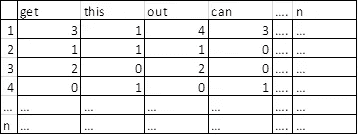
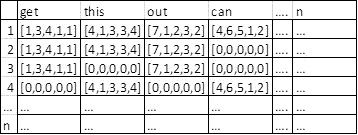

# 文本处理和分类介绍(第二部分——文本分类)

> 原文：<https://medium.com/analytics-vidhya/text-processing-and-classification-intro-part-2-text-classification-9dc58782acb6?source=collection_archive---------2----------------------->


[https://cfml.se/blog/sentiment_classification/](https://cfml.se/blog/sentiment_classification/)

> 我们如何预测新评论的情绪？

在我写作的前一部分，我试图涵盖分析文本数据的步骤。对上一部分执行的分析是描述性的。这一部分将试图解释我们将如何预测新评论的情绪。对于这一部分，我从这篇[中的文章](/analytics-vidhya/nlp-tutorial-for-text-classification-in-python-8f19cd17b49e)中学习了很多。

> 链接上一部分写作:
> [https://sea-Remus . medium . com/text-processing-and-class ification-intro-part-1-sensation-analysis-7e 22a 83 E1 C4](https://sea-remus.medium.com/text-processing-and-classification-intro-part-1-sentiment-analysis-7e22a83e1c4)

# 简要回顾第 1 部分

我们希望使用的数据包含以下各列:


> 我们知道评论的观点实际上是通过“分数”栏分类的(这使得建模实际上是多余的)，但是本文假设我们没有“分数”栏。

通过分析我们的文本数据，我们知道市场上存在两种情绪。我们将这些情绪分为积极情绪和消极情绪。我们将使用停用词来删除多余的词，这些词还包括“br”、“href”、“amazon”、“product”、“one”、“find”、“taste”、“flavor”、“good”、“buy”、“make”和“coffee”，因为通过分析我们发现这些词也是多余的。
根据之前的分析和 EDA，我们最终得出结论，我们不会使用“摘要”栏，因为一些用户没有给出他们评论的摘要。

# 数据预处理

我们将首先导入基本包，并使用以下代码获取数据:

```
#essentials
import pandas as pd
import numpy as np
import sqlite3
import matplotlib.pyplot as plt
import seaborn as sns#obtaining the data
con = sqlite3.connect('database.sqlite')
raw = pd.read_sql_query("select ProductId,ProfileName, HelpfulnessNumerator, HelpfulnessDenominator, Time, Text, case when Score >= 4 then 1 else 0 end Sentiment from Reviews", con)
con.close()
```

在我们开始讨论数据之前，我们将数据分成 3 部分，即训练数据、测试数据和验证数据。目的实际上是区分用于超参数调整的测试数据(如果有)和用于模拟真实世界新数据的测试数据。

```
from sklearn.model_selection import train_test_split
xtrain, xsplit, ytrain, ysplit = train_test_split(raw.drop('Sentiment',axis = 1),
                                                  raw.Sentiment, 
                                                  test_size = 0.3, 
                                                  random_state = 42)
xtest, xval, ytest, yval = train_test_split(xsplit,ysplit,
                                            test_size = 0.5,
                                            random_state = 42)
```

我们还将定义一个标记化函数。我们将在删除冗余单词(停用词)后对文本进行分词，并在分词后对文本进行分词。

> 所以对于那些在阅读这篇文章时对文本处理一无所知的人来说:
> 
> 自然语言处理中的记号化，基本上就是**把句子(单词序列)拆分成单词(或记号)**。实际上，我们可以通过使用内置的 Python 字符串方法来实现这一点。split()或通过使用 NLTK 包中的 word_tokenize()来实现。
> 
> 词汇化是一个获取词根的过程。词干化的一种替代方法是词干化，即只对单词进行词干化。两者的想法都是缩短单词，这样如果我们发现两个或更多的单词有相似的意思，我们会认为它们是同一个东西。例如，我们有一个单词列表，如['播放'，'播放'，'已播放']。当被词干化或被列化时，我们将获得['play '，' play '，' play']。在某些情况下，词干化比变元化更好，而在其他情况下，情况正好相反。可以把这看作是数字数据的规范化和标准化。

```
def tokenize(txt):
    import re
    from wordcloud import STOPWORDS
    import nltk
    from nltk.tokenize import word_tokenize
    from nltk.stem.wordnet import WordNetLemmatizer
    stpwrd = set(STOPWORDS)
    #we then add frequent irrelevant words discovered before
    stpwrd.update(['br','href','amazon','product','one',
                   'find','taste','flavor','good','buy',
                   'make','coffee'])
    removeapos = txt.lower().replace("'",'') #remove any apostrophe
    text = re.sub(r"[^a-zA-Z0-9\s]"," ", removeapos) #sub weird char to space
    words = word_tokenize(text)
    lemma = [WordNetLemmatizer().lemmatize(w) for w in words if w not in
             stpwrd]
    return lemma
```

在定义了记号化函数之后，我们定义一个函数来处理丢失的值和设计新的变量。

```
def preprocess_engineer(data,train = True):
    #this is to handle missing values before using the data
    data['ProfileName'] = data['ProfileName'].apply(lambda x: 'Anonymous' if 
                                                (x == 'nan')|(x == 'NaN')|
                                                (x == 'N/A')|(x == '0')|
                                                (x == '')|(x == '-1')|
                                                (x == 'null')|(x == 'Null')|
                                                (x == 'NA')|(x == 'na')|
                                                (x == 'none')|(x == 'unknown')
                                                else x)

   #this is to simulate that after data train we would 
   #face a number of new  reviews if train == True:
        countprof = data.ProfileName.value_counts().reset_index()
        countprof.columns = ['ProfileName','ProfReviewCount']

        countprod = data.ProductId.value_counts().reset_index()
        countprod.columns = ['ProductId','ProdReviewCount']

        countspam = data.groupby(['ProductId',
                                  'ProfileName']).size().reset_index()
        countspam.columns = ['ProductId','ProfileName','SpamReviewCount']

        engineered = pd.merge(
                        pd.merge(
                         pd.merge(data,countprof,how='left',on='ProfileName'),
                            countprod,how = 'left', on = 'ProductId'),
                        countspam, how = 'left',on =['ProductId',
                                                     'ProfileName'])
        return engineered      
    if train == False:
        #this is from train
        countproftrain = xtrain.ProfileName.value_counts().reset_index()
        countproftrain.columns = ['ProfileName','ProfReviewCounttrain']

        countprodtrain = xtrain.ProductId.value_counts().reset_index()
        countprodtrain.columns = ['ProductId','ProdReviewCounttrain']

        countspamtrain = xtrain.groupby(['ProductId',
                                         'ProfileName']).size().reset_index()
        countspamtrain.columns = ['ProductId',
                                  'ProfileName',
                                  'SpamReviewCounttrain'] #this is from the newly introduced data
        countprof = data.ProfileName.value_counts().reset_index()
        countprof.columns = ['ProfileName','ProfReviewCountadd']

        countprod = data.ProductId.value_counts().reset_index()
        countprod.columns = ['ProductId','ProdReviewCountadd']

        countspam = data.groupby(['ProductId',
                                  'ProfileName']).size().reset_index()
        countspam.columns = ['ProductId','ProfileName','SpamReviewCountadd']

        #this is to add newly introduced data with train
        #ProfileName
        countproffinal = countprof.merge(countproftrain,
                                         how = 'left',
                                         on ='ProfileName')
        countproffinal.fillna(0,inplace = True)
        countproffinal['ProfReviewCount'] = countproffinal.ProfReviewCounttrain + countproffinal.ProfReviewCountadd
        countproffinal.drop(['ProfReviewCounttrain',
                             'ProfReviewCountadd'],
                             axis = 1,inplace = True)

        #ProductId
        countprodfinal = countprod.merge(countprodtrain,
                                         how = 'left',
                                         on = 'ProductId')
        countprodfinal.fillna(0,inplace = True)
        countprodfinal['ProdReviewCount'] = countprodfinal.ProdReviewCounttrain + countprodfinal.ProdReviewCountadd
        countprodfinal.drop(['ProdReviewCounttrain',
                             'ProdReviewCountadd'],
                             axis = 1,inplace = True)

        #SpamReviewCount
        countspamfinal = countspam.merge(countspamtrain,how = 'left',on = ['ProductId','ProfileName'])
        countspamfinal.fillna(0,inplace = True)
        countspamfinal['SpamReviewCount'] = countspamfinal.SpamReviewCounttrain + countspamfinal.SpamReviewCountadd
        countspamfinal.drop(['SpamReviewCounttrain',
                             'SpamReviewCountadd'],
                             axis = 1,inplace = True)

        engineered = pd.merge(
                        pd.merge(
                            pd.merge(data,countproffinal,
                                     how='left',on='ProfileName'),
                                 countprodfinal,
                                 how = 'left', 
                                 on = 'ProductId'),
                             countspamfinal, 
                             how = 'left',
                             on = ['ProductId','ProfileName'])
        return engineered
```

总结一下上面的函数，基本思想是填充 ProfileName 列中缺少的值，并创建新的变量，这些变量表示某个客户的评论数、某个产品收到的评论数以及同一客户对某个产品的多次评论数。

创建完函数后，我们现在应用函数。

```
xtrainpreprocessed = preprocess_engineer(xtrain,train = True)
xtestpreprocessed = preprocess_engineer(xtest,train = False)
xvalpreprocessed = preprocess_engineer(xval,train = False)
```

> 注意，我们没有使用 tokenize。我稍后会谈到它。

## 作为模型输入的文本数据

在开始建模之前，我们必须将文本数据转换成数字数据。到目前为止，我学到了两种基本的方法，第一种是**单词包(BOW)** ，第二种是**单词嵌入(Word2Vec，W2V)** 。我不打算深入研究这些理论和它是如何工作的，相反，我只想告诉你它是做什么的，因为这篇文章只是一个介绍。

*   基本上，BOW 试图将文本数据中的单词转换成数字，以表示该单词在数据中出现的频率。单词出现的频率可以由单词的计数(CountVectorizer)或单词的权重(TF-IDF)来表示。你可以试着谷歌一下，以便更好地理解它们。
*   Word2Vec 是弓的替代品。Word2Vec，就像它的名字一样，试图将数据中的单词转换成向量。Word2Vec 使用神经网络来产生代表我们原始单词的向量。有两种方法可以做到这一点，第一种是 CBOW(连续单词包)和 Skip-gram。


[https://www . researchgate . net/figure/CBOW-and-Skip-gram-models-architecture-6 _ fig 1 _ 332543231](https://www.researchgate.net/figure/CBOW-and-Skip-gram-models-architecture-6_fig1_332543231)

比方说我们有这样一句话:

> 我要去购物

简单解释一下这个，
CBOW 试图通过查看周围的其他单词来预测一个单词(例如:output = " gonna "，input = ["I'm "，" go "，" shopping"])。
Skip-gram 试图预测某个单词周围的其他单词(例如:input = " gonna "，output = ["I'm "，" go "，" shopping"])

我们将使用 Word2Vec 将文本数据转换成数字数据，因为单词袋方法的一个缺点是它经常遇到维数问题。



虚拟数据框架(带有计数矢量器的单词包)

想象我们有一个如上的数据帧。数据中存在的字数成为数据框架中的列数。上面的数据框架假设您使用 CountVectorizer 作为您的单词包方法，因此您可以看到，对于数据的第一行(第一个文本数据)，有 3 个“get”单词、1 个“this”单词、4 个“out”单词和 3 个“can”单词。现在，你可以想象如果我们使用单词袋方法，输入会有多大。使用 Word2Vec，我们可以通过计算文本数据中单词向量的平均值来处理这个问题。



虚拟数据帧(用 Word2Vec 嵌入单词)

上面假想的数据帧显示了 Word2Vec 的输出。零向量意味着该单词没有出现在文本数据上(例如，第三个文本数据没有“this”和“can”)。通常对每个数据点的向量求平均值。平均后，列数不再等于字数。相反，列的数量将等于向量的大小。

## 将文本转换为数字

理解了这些简短的概念，我们现在将一次编写几个代码。

```
#function to average
def AverageVectors(wordvectmod,oritokenizedtxt):
    todict = dict(zip(wordvectmod.wv.index_to_key,
                      wordvectmod.wv.vectors))
    #if a text is empty we should return a vector of zeros
    #with the same dimensionality as all the other vectors
    dim = len(next(iter(todict.values())))
    return np.array([np.mean([todict[w] for w in words if w in todict]
                              or 
                             [np.zeros(dim)],axis = 0)
                     for words in oritokenizedtxt
                    ])w2v = Word2Vec(xtrainpreprocessed.Text.apply(tokenize),
                 sg = 0,
                 hs = 1,
                 seed = 42,
                 vector_size = 128)
#convert to vect average
xtrainvect = AverageVectors(w2v,xtrainpreprocessed.Text.apply(tokenize))
xtestvect = AverageVectors(w2v,xtestpreprocessed.Text.apply(tokenize))
xvalvect = AverageVectors(w2v,xvalpreprocessed.Text.apply(tokenize))
```

我在上面的代码中所做的是创建一个函数，该函数将接受我们创建的 Word2Vec 模型，然后对每个数据点的单词向量进行平均。之后，我们将函数应用于我们拥有的文本数据。
在对 Word2Vec 的向量进行平均后，我们将它们转换为 dataframe，然后添加其他可能有助于检测客户情绪的特征。

```
#add the remaining features
def vecttodata(aftervec,beforevec):
    df = pd.DataFrame(aftervec)
    df['HelpfulnessNumerator'] = beforevec.reset_index(drop=True)['HelpfulnessNumerator']
    df['HelpfulnessDenominator'] = beforevec.reset_index(drop=True)['HelpfulnessNumerator']
    df['Time'] = beforevec.reset_index(drop=True)['Time']
    df['ProfReviewCount'] = beforevec.reset_index(drop=True)['ProfReviewCount']
    df['ProdReviewCount'] = beforevec.reset_index(drop=True)['ProdReviewCount']
    df['SpamReviewCount'] = beforevec.reset_index(drop=True)['SpamReviewCount'] 

    return df

xtraindf = vecttodata(xtrainvect,xtrainpreprocessed)
xtestdf = vecttodata(xtestvect,xtestpreprocessed)
xvaldf = vecttodata(xvalvect,xvalpreprocessed)
```

# 训练分类模型

> 借此机会，我想使用 XGBoost 分类器来构建分类模型。培训时间比较长，大概花了一个小时才把培训流程做完。存在同质性(每个属性/特征具有彼此相似的性质，如文本、图像、视频等。等等)和异构(每个属性/特征对于一个和另一个具有不同的性质，就像年龄与收入、混合数据集等。etc)数据。我尝试使用 XGBoost，因为它适用于异构数据，但是如果读者想尝试仅使用文本数据作为输入来构建分类模型，我推荐使用神经网络，因为它可能快得多，并且更适合同构数据集。

在前面的部分中，您还可以看到正面情绪和负面情绪的数量不平衡，因此为了处理这种不平衡，我们可以执行数据上采样或计算训练数据的样本权重。我选择后者。以下是我编写的用于构建和训练情感分类模型的代码。

```
rom xgboost import XGBClassifier
from sklearn.utils.class_weight import compute_sample_weightsample_weights = compute_sample_weight(
    class_weight='balanced',
    y=ytrain
)xgb = XGBClassifier(booster = 'gbtree',
                    objective = 'binary:logistic',
                    eval_metric='auc',
                    seed = 42, use_label_encoder = False,
                    num_parallel_tree = 10,
                    n_estimators = 50,
                    verbosity = 2)
xgb.fit(xtraindf,ytrain,sample_weight = sample_weights)
pred = xgb.predict(xtestdf)
from sklearn.metrics import confusion_matrix,classification_report
print(classification_report(pred,ytest, target_names = ['Negative','Positive']))
```


测试数据分类报告

# 最终检验和结论

我们可以说，该模型在测试数据上表现良好，但我们可以通过执行超参数调整、设置概率截止值等来进一步改善它。我们对验证数据运行该模型，以再次测试它在未知数据上的表现。


验证数据分类报告

您可以看到分类报告与测试数据的分类报告没有任何不同。

这篇文章虽然远非完美，但它旨在给出一个粗略的分步过程，说明当我们想要操作文本数据时应该做什么。有很多文本操作方法，我自己还没有完全理解，也没有尝试去学习，但是我希望我可以与其他 NLP 初学者分享这些小知识。像往常一样，我希望你们能在评论区给我留下任何关于我的方法的建议。如果你们觉得这篇文章有用，请鼓掌。:)

下次见！