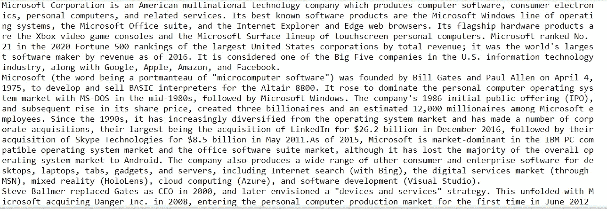
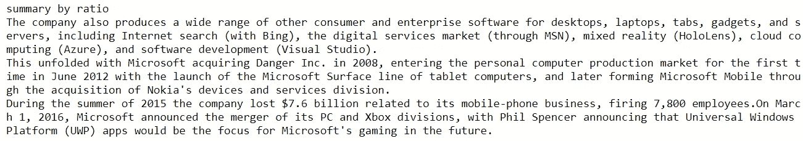
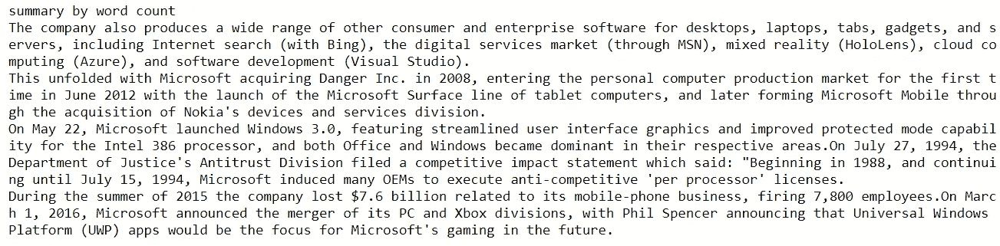

# 基于自然语言处理的维基百科网页文本摘要

> 原文：<https://medium.com/analytics-vidhya/text-summarization-on-wikipedia-38b80d0060b3?source=collection_archive---------3----------------------->

本文涵盖了使用 python 在 Wikipedia 页面上实现提取和抽象文本摘要的实践。

## 为什么是文本摘要？


格伦·凯莉在 Unsplash 上拍摄的照片

随着数字内容的不断增长，在今天的自动化世界中，如果我们不用阅读大量的新闻文章、报纸或电子书形式的文本数据，而只需几个有意义的句子就可以获取所有内容，那该有多酷？

这就是文本摘要发挥作用的地方！让我们在下面深入了解一下。

## 文本摘要:

> 文本摘要是 NLP 中使用的一种技术，用于从文本资源(如文章、书籍、研究论文甚至网页)中创建简短的有意义的文本集合，称为摘要。

## 文本摘要技术的类型:

基于其创建的文本摘要的方式可以分为两种类型，

1.  **抽取摘要:**在抽取摘要中，从整个文本数据中选择最重要的句子，并作为摘要一起列出。
2.  **抽象概括:**抽象概括方法比抽取概括更复杂。这里，摘要者首先理解文档的主要概念，然后生成原始文档中没有的新句子。

## 摘录摘要:

让我们来看看一些常用的摘要技术。

## 文本排名算法:

通过首先将文本数据分成句子并创建相似性矩阵来执行文本排名算法。相似度矩阵包含句子之间的相似度，然后转换成以句子为顶点、相似度得分为边的图，用于句子排名计算。并将排名靠前的句子列为摘要。

现在让我们看看如何使用 Python 执行文本排名算法。

```
# Importing genism package and summarizer
import gensim
from gensim.summarization.summarizer import summarize
from gensim.summarization import keywordsimport wikipedia
```

现在让我们获取与“微软”相关的维基百科内容

```
# Get wiki content.
wikisearch = wikipedia.page("Microsoft")
wikicontent = wikisearch.content
print(wikicontent)
```



现在让我们使用 TextRank 算法通过创建一个为其原始内容的 0.1%的摘要来进行总结。

```
# Summary by 0.1% of the original content
summary_ratio = summarize(wikicontent, ratio = 0.01)
print("summary by ratio")
print(summary_ratio)
```



我们按字数总结一下。这里我们使用了 200 个单词来创建摘要。

```
#summary by count of words
summary_wordcount = summarize(wikicontent, word_count = 200)
print("summary by word count")
print(summary_wordcount) 
```



现在让我们尝试另一个叫做 LSA(潜在语义分析)的抽象概括器

## LSA(潜在语义分析):

LSA 方法通过诸如一起使用的单词以及在不同的句子中看到哪些常见单词的信息来提取语义重要的句子。句子中大量的常用词表明句子在语义上是相关的。这些语义上有意义的句子然后被列在一起作为摘要。

现在让我们在上面的代码中实现 LSA。

```
# importing the summarizer
from sumy.summarizers.lsa import LsaSummarizer# creating the LSA summarizer with summary of 5 sentences
lsa_summarizer=LsaSummarizer()
lsa_summary= lsa_summarizer(my_parser.document,5)
for sentence in lsa_summary:
  print(sentence)
```


虽然上述抽象的摘要更容易实现，并且有助于突出长文本文档中的关键句子，但是如果没有足够的上下文，这些摘要中的一些可能更难理解。

在这种情况下，在生成有意义的和简明的摘要时要考虑文档的上下文，我们可以采用抽象的摘要方法。

## 抽象概括:

在摘要中，最能描述整个文档的新句子被列为摘要。

## 在本文中，我们将讨论用 cnn 新闻数据预先训练的**巴特变形金刚**。\

## **巴特变形金刚:**

> BART( **双向和自回归变换器**)使用标准的 seq2seq 机器翻译架构，带有双向编码器(类似于 BERT)和从左到右解码器(类似于 GPT)。预训练任务包括随机改变原始句子的顺序和一个新颖的填充方案，其中文本的跨度用单个掩码标记代替。

在 BART 中，输入文本首先通过*双向编码器*，即类似 BERT 的编码器。然后从左到右和从右到左查看文本，后续输出用于*自回归解码器*，该解码器基于编码器输入*和*到目前为止预测的输出令牌来预测输出。

更多关于 BART 的细节可以在[这里](https://huggingface.co/transformers/model_doc/bart.html#transformers.BartForConditionalGeneration)找到。

为了实现上面数据中的 BART，我们先安装 [**拥抱脸变形金刚**](https://huggingface.co/transformers/pretrained_models.html) 。这个库运行在 Pytorch 和 TensorFlow 之上，可用于各种语言任务，如摘要、问题回答等。

```
# importing BART
from transformers import BartForConditionalGeneration, BartTokenizer, BartConfig
```

现在，让我们加载 BART 模型和记号赋予器，

```
# Loading the model and tokenizer for bart-large-cnn
tokenizer=BartTokenizer.from_pretrained('facebook/bart-large-cnn')
model=BartForConditionalGeneration.from_pretrained('facebook/bart-large-cnn')
```

现在让我们将输入文本数据提供给 tokenizer.batch_encode_plus()方法，并生成摘要 id。

```
inputs = tokenizer.batch_encode_plus([wikicontent],return_tensors='pt',truncation=True)
summary_ids = model.generate(inputs['input_ids'], early_stopping=True)
```

现在让我们解码摘要 id 并打印摘要输出。

```
# Decoding and printing the summary
bart_summary = tokenizer.decode(summary_ids[0], skip_special_tokens=True)
print(bart_summary)
```

摘要输出如下所示，

```
Microsoft was founded by Bill Gates and Paul Allen on April 4, 1975, to develop and sell BASIC interpreters for the Altair 8800\. It rose to dominate the personal computer operating system market with MS-DOS in the mid-1980s, followed by Microsoft Windows. The company's 1986 initial public offering (IPO) created three billionaires and an estimated 12,000 millionaires among Microsoft employees. In 2018 Microsoft reclaimed its position as the most valuable publicly traded company in the world. As of 2020, Microsoft has the third-highest global brand valuation.
```

简短、精确，看起来比以前的总结好得多，对吗？请让我知道你的评论和反馈。

**注:**你可以在这个 [GitHub Repo](https://github.com/sangee1301/Text-Summarization/blob/main/Text_Summarization.ipynb) 里找到完整的代码。

## 参考资料:

1.  与 BART. [相关的新冠肺炎出版物摘要](http://cs230.stanford.edu/projects_spring_2020/reports/38866168.pdf)
2.  BERT:用于语言理解的深度双向转换器的预训练。[https://arxiv.org/pdf/1810.04805.pdf](https://arxiv.org/pdf/1810.04805.pdf)
3.  [https://hugging face . co/transformers/model _ doc/Bart . html # transformers。bartforconditional generation](https://huggingface.co/transformers/model_doc/bart.html#transformers.BartForConditionalGeneration)