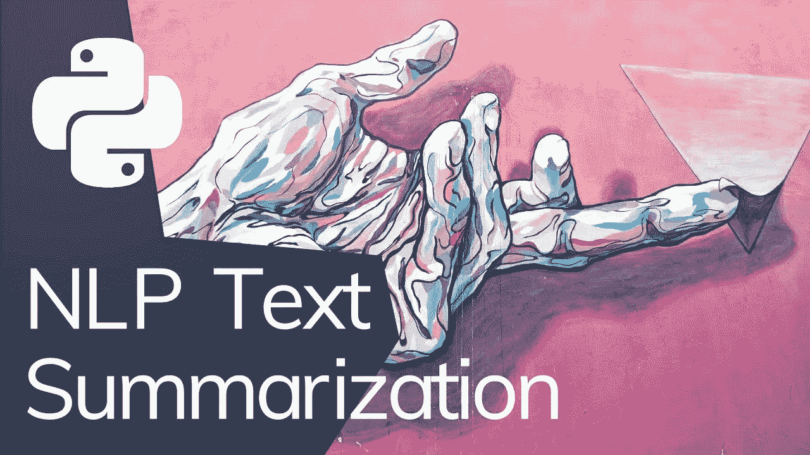

# 使用 BERT、GPT2、XLNet 的文本摘要

> 原文：<https://medium.com/analytics-vidhya/text-summarization-using-bert-gpt2-xlnet-5ee80608e961?source=collection_archive---------0----------------------->



来源— [Pinterest](https://www.google.com/url?sa=i&url=https%3A%2F%2Fwww.pinterest.com%2Fpin%2F439734351123449679%2F&psig=AOvVaw1K0hXUNK6yL4034AmBfo8x&ust=1618419832420000&source=images&cd=vfe&ved=0CAMQjB1qFwoTCLi3qoLa--8CFQAAAAAdAAAAABAD)

一种人工智能无疑使机器对人类智能的极端模拟合理化，这些机器被编程为像人类一样思考并模仿他们的行为。人工智能的一个子集是 [**自然语言处理**](https://en.wikipedia.org/wiki/Natural_language_processing) **、**，它涉及计算机和人类语言之间的交互，特别是如何编程计算机来处理和分析大量自然语言数据。

## **自然语言处理**无处不在即使我们没有意识到！无论是伟大的语法纠正你的语法错误，并告诉你你的文本听起来如何，还是 Gmail 自动预测下一个可能的单词序列，以更专业的方式更快地撰写你的邮件，自然语言处理随时准备帮助你！

我们每天都在使用**自然语言应用**或者从中受益。以下是一些应用最广泛的 NLP 应用示例:

1.  **机器翻译** —机器翻译，有时简称为 MT，是**计算语言学**的一个子领域，研究使用软件将文本或语音从一种语言翻译成另一种语言。——*维基百科。谷歌的语言翻译器就是一个很好的例子，它使用神经机器翻译将一种语言的文本翻译成每一种可能的语言！*
2.  **文本摘要**—文本摘要是**通过计算缩短一组数据，以创建代表原始内容中最重要或最相关信息的子集(摘要)**的过程。——*维基百科*
3.  **情感分析** —情感分析是使用自然语言处理、文本分析、计算语言学和生物统计学来系统地**识别、提取、量化和研究**情感状态和主观信息。——*维基百科*
4.  **文本分类**—文本分类是**为自由文本文档分配预定义类别的任务**。它可以提供文档集合的概念性视图，在现实世界中有重要的应用。——*Scholarpedia。*文本分类有助于将预定义的类别分配给文档，以帮助您找到所需的信息或简化某些活动。例如，文本分类的一个应用是**邮件中的垃圾邮件过滤**。
5.  **问答** —问答是信息检索**和自然语言处理**领域内的一门计算机科学学科，它涉及建立系统**自动回答人类用自然语言提出的问题**。——*维基百科。得益于 Siri、OK Google、聊天框和虚拟助手等应用程序，问答变得越来越受欢迎。*

# 这个博客将关注-

1.  **文本摘要** —类型
2.  使用**最先进的预训练模型(BERT、GPT2、XLNET)** 对文本及其各自的**实现进行总结。**

# 所以拿起你的咖啡，切换到 Google Colab，将运行时类型设置为 GPU 加速器，让我们开始吧！

> 注意——在继续这篇博客之前，我想建议读者对预训练模型的架构有一个很好的理解——BERT、GPT2 和 XLNET。

在我看来，在研究数学直觉以及模型架构时，最好的参考点是—

1.  [**伯特**](https://towardsdatascience.com/bert-explained-state-of-the-art-language-model-for-nlp-f8b21a9b6270)
2.  [**GPT-2**](https://jalammar.github.io/illustrated-gpt2/)
3.  [**XLN**](https://towardsdatascience.com/xlnet-a-clever-language-modeling-solution-ab41e87798b0) **等**

(你必须对变形金刚架构有相当的了解，才能掌握这些模型！需要的话参考我关于 [**变形金刚**](/analytics-vidhya/transformers-lets-dive-deeeep-7784bdb20807) 的博客！)

## 什么是文本摘要？

如前所述，

文本摘要是通过计算缩短一组数据，以创建代表原始内容中最重要或最相关信息的子集(摘要)的过程。——*维基百科*

为了更好地理解它，让我们看看不同类型的文本摘要-

文本摘要方法可以分为两大类:**提取**和**抽象方法。**

**摘录文本摘要**

**传统的**方法，主要目的是识别文本中的重要句子并将其添加到摘要中。注意，获得的摘要包含来自原始文本数据的**精确句子。**

**抽象文本摘要**

**先进的**方法，用一种新的方式来识别重要的部分、解释上下文和再现文本。这确保了核心信息通过尽可能短的文本来传达。注意，这里的句子，概括起来，**是由模型生成的，而不仅仅是从原始文本数据中提取的。**

在下一节中，我将和自然语言生成的三只野兽——BERT、GPT-2 和 XLNET 讨论文本摘要。我将浏览代码，并为那些想获得这个博客代码的人提供我的 Colab 笔记本的链接。

那么，让我们开始吧！

# 使用 BERT 进行文本摘要

伯特(双向转换器)是一种转换器，用于克服 RNN 和其他神经网络作为长期依赖的局限性。这是一个预先训练好的模型，自然是双向的。这个预先训练好的模型可以被调整以容易地执行指定的 NLP 任务，在我们的例子中是**总结**。

**安装变压器(2.2.0)和汇总用 Bert**:

```
!pip install transformers==2.2.0!pip install bert-extractive-summarizer
```

接下来，**安装 spaCy (spaCy 是一个高级自然语言处理的开源软件库**，用编程语言 Python 和 Cython 编写。)

```
!pip install spacy==2.0.12
```

不要担心，这些安装可能需要几分钟时间。😅

**导入库**

安装完上述包后，导入 summarizer。

```
from summarizer import Summarizer,TransformerSummarizer
```

考虑下面的文章“身体”，它必须进行总结。

```
body = '''
       Scientists say they have discovered a new species of orangutans on Indonesia’s island of Sumatra.
The population differs in several ways from the two existing orangutan species found in Sumatra and the neighboring island of Borneo.
The orangutans were found inside North Sumatra’s Batang Toru forest, the science publication Current Biology reported.
Researchers named the new species the Tapanuli orangutan. They say the animals are considered a new species because of genetic, skeletal and tooth differences.
Michael Kruetzen is a geneticist with the University of Zurich who has studied the orangutans for several years. He said he was excited to be part of the unusual discovery of a new great ape in the present day. He noted that most great apes are currently considered endangered or severely endangered.
Gorillas, chimpanzees and bonobos also belong to the great ape species.
Orangutan – which means person of the forest in the Indonesian and Malay languages - is the world’s biggest tree-living mammal. The orange-haired animals can move easily among the trees because their arms are longer than their legs. They live more lonely lives than other great apes, spending a lot of time sleeping and eating fruit in the forest.
The new study said fewer than 800 of the newly-described orangutans exist. Their low numbers make the group the most endangered of all the great ape species.
They live within an area covering about 1,000 square kilometers. The population is considered highly vulnerable. That is because the environment which they depend on is greatly threatened by development.
Researchers say if steps are not taken quickly to reduce the current and future threats, the new species could become extinct “within our lifetime.”
Research into the new species began in 2013, when an orangutan protection group in Sumatra found an injured orangutan in an area far away from the other species. The adult male orangutan had been beaten by local villagers and died of his injuries. The complete skull was examined by researchers.
Among the physical differences of the new species are a notably smaller head and frizzier hair. The Tapanuli orangutans also have a different diet and are found only in higher forest areas.
There is no unified international system for recognizing new species. But to be considered, discovery claims at least require publication in a major scientific publication.
Russell Mittermeier is head of the primate specialist group at the International Union for the Conservation of Nature. He called the finding a “remarkable discovery.” He said it puts responsibility on the Indonesian government to help the species survive.
Matthew Nowak is one of the writers of the study. He told the Associated Press that there are three groups of the Tapanuli orangutans that are separated by non-protected land.He said forest land needs to connect the separated groups.
In addition, the writers of the study are recommending that plans for a hydropower center in the area be stopped by the government.
It also recommended that remaining forest in the Sumatran area where the orangutans live be protected.
I’m Bryan Lynn.

        '''
```

加载 Bert 摘要生成器模型并打印摘要。

```
bert_model = Summarizer()
bert_summary = ''.join(bert_model(body, min_length=60))
print(bert_summary)
```

结果-

```
100%|██████████| 434/434 [00:00<00:00, 108604.97B/s]
100%|██████████| 1344997306/1344997306 [00:22<00:00, 59156793.99B/s]
100%|██████████| 231508/231508 [00:00<00:00, 17530509.67B/s]Scientists say they have discovered a new species of orangutans on Indonesia’s island of Sumatra. They say the animals are considered a new species because of genetic, skeletal and tooth differences. He said he was excited to be part of the unusual discovery of a new great ape in the present day. He noted that most great apes are currently considered endangered or severely endangered. Orangutan – which means person of the forest in the Indonesian and Malay languages - is the world’s biggest tree-living mammal. It also recommended that remaining forest in the Sumatran area where the orangutans live be protected.
```

## 很酷，不是吗？😎

现在，让我们用 **GPT-2 做同样的事情。**

# GPT 2 文本摘要

让我们来探索另一只**野兽**的威力吧——**生成式预训变形金刚 2(约有 10 亿个参数)**只能想象最近的 **GPT3 拥有 1750 亿个参数的威力！它可以写从软件代码到令人兴奋的故事！**

让我们加载模型，并获得生成的摘要！

```
GPT2_model = TransformerSummarizer(transformer_type="GPT2",transformer_model_key="gpt2-medium")
full = ''.join(GPT2_model(body, min_length=60))
print(full)
```

结果如下-

```
100%|██████████| 718/718 [00:00<00:00, 175250.83B/s]
100%|██████████| 1520013706/1520013706 [00:26<00:00, 56809199.94B/s]
100%|██████████| 1042301/1042301 [00:00<00:00, 31741055.05B/s]
100%|██████████| 456318/456318 [00:00<00:00, 19174069.19B/s]Scientists say they have discovered a new species of orangutans on Indonesia’s island of Sumatra. The orangutans were found inside North Sumatra’s Batang Toru forest, the science publication Current Biology reported. The new study said fewer than 800 of the newly-described orangutans exist. They live within an area covering about 1,000 square kilometers. That is because the environment which they depend on is greatly threatened by development. He told the Associated Press that there are three groups of the Tapanuli orangutans that are separated by non-protected land.
```

哇！似乎这个家伙比伯特更聪明！看看它生成的这样一个**有见地的总结！😛**

现在，让我们进入最后一个模型，**XLNet！**

# 使用 XLNet 的文本摘要

**XLNet** 对于语言生成来说特别有趣，因为它是以类似于 GPT 模型家族的**回归方式预先训练的。**让我们看看 XLNet 是如何总结我们的文字的！

让我们加载模型并打印出它生成的摘要！

```
model = TransformerSummarizer(transformer_type="XLNet",transformer_model_key="xlnet-base-cased")
full = ''.join(model(body, min_length=60))
print(full)
```

结果如下-

```
100%|██████████| 760/760 [00:00<00:00, 255565.71B/s]
100%|██████████| 467042463/467042463 [00:08<00:00, 55288530.16B/s]
100%|██████████| 798011/798011 [00:00<00:00, 25629820.12B/s]Scientists say they have discovered a new species of orangutans on Indonesia’s island of Sumatra. They say the animals are considered a new species because of genetic, skeletal and tooth differences. Their low numbers make the group the most endangered of all the great ape species. Researchers say if steps are not taken quickly to reduce the current and future threats, the new species could become extinct “within our lifetime.” The Tapanuli orangutans also have a different diet and are found only in higher forest areas. It also recommended that remaining forest in the Sumatran area where the orangutans live be protected.
```

## 厉害！貌似这个总结是一个人写的！

希望您在观察这些自然语言生成和文本摘要的主要参与者的卓越能力时感到有趣！

## 同时，您可以浏览代码，自己调整几个参数，并观察生成的结果！

**从[**这里**](https://colab.research.google.com/drive/1pr3DQ75Mf6nJVXn9nSD3ClkTH1vtHsNn?usp=sharing) 下载**代码或者简单地**运行**和**微调**你的。🧐

希望你喜欢阅读这个博客！

机器学习快乐！

***如果你是数据科学和机器学习的初学者，并对数据科学/ML-AI、向数据科学的职业过渡指导、面试/简历准备有一些具体的疑问，甚至想在你的 D-Day 之前获得模拟面试，请随时拨打*** [***这里***](https://topmate.io/sukannya) ***预约 1:1。我很乐意帮忙！***

下次见！🤗

> [领英](https://www.linkedin.com/in/sukannya/)