# 文本到数字矢量转换技术

> 原文：<https://medium.com/analytics-vidhya/text-to-numerical-vector-conversion-techniques-f2b97ab9b895?source=collection_archive---------5----------------------->

在这个现代计算的时代，今天有海量的数据可用，并且通过各种方式每秒钟都在增加，如“脸书评论”、“推特上的推文”、“WhatsApp 聊天”、“电子邮件”、“博客”、“谷歌搜索”以及你能想到的许多其他方式。

在机器学习中，数据起着至关重要的作用。我们需要在大量数据的基础上训练一个模型，然后对看不见的数据进行评估。

[图像来源](https://www.thetalkingmachines.com/sites/default/files/styles/widescreen_large/public/2019-05/34_binary_space_data.jpg?itok=fYxXjksG)

# 目录

1.  [先决条件](#9389)
2.  [不同形式的数据](#5ba2)
3.  [不同类型的数据](#26bc)
4.  [需要将数据转换为数字数据/矢量](#a3d9)
5.  [将数据转换为数值数据/向量的嵌入技术](#96f0)
    一.[文字包(BoWs)](#0fb4)
    二、[词频-倒排文档频率(TF-IDF)](#c411)
    iii。 [Word2Vec](#e207)
    iv。 [Doc2Vec](#3771)
6.  [总结](#bb44)
7.  [参考文献](#376d)

# 先决条件

1.  基础数学
2.  机器学习中特征的基础知识。

# 不同形式的数据

数据可以以任何形式存在。、文本、音频、视频和图像。

[图像来源](https://techblogwriter.co.uk/wp-content/uploads/2016/01/text-video-audio-and-images..png)

# 不同类型的数据

上述任何形式的数据都可以大致分为四种主要类型，任何机器学习模型都可以依赖这四种类型。这些类型是:

1.  **数值数据**
2.  **分类数据**
3.  **时间序列数据**
4.  **文本数据。**

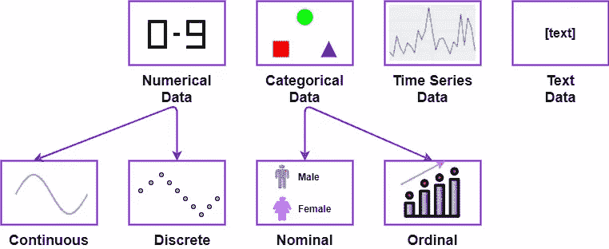

广泛的数据类别

让我简单介绍一下这些数据类型:

1.  **数字数据**或**定量数据**:任何形式的可测量数据，如你的身高、体重或手机价格。
    一、**连续**:可以取身高、体重、温度等范围内任意值的数值型数据。
    二。**离散**:只能取不同值的数字数据，如员工/学生人数、售出单位等。
2.  **分类数据**:可以统计的任何种类，如性别、城市、州、国家等。
    一、**名义上的**:可计数但不可排序的分类数据，如性别、发色、手机品牌等。
    二。**序数**:可以计数也可以排序的分类数据，比如 IMDB 电影评分(1-10)、酒店星级等。
3.  **时间序列数据**:由特定时间点索引的数据点组成的任何数据，如股票价格、[心电图](https://en.wikipedia.org/wiki/Electrocardiography)、天气状况等。
4.  **文本数据**:文本数据是简单的单词、句子或段落，可以提供一些见解，如产品评论、脸书评论等。

# 需要将数据转换为数字数据/矢量

许多机器模型要求数据以数字格式呈现。

你想知道吗？"*为什么我们需要在将任何数据输入到机器学习模型之前将其转换为数字数据？*

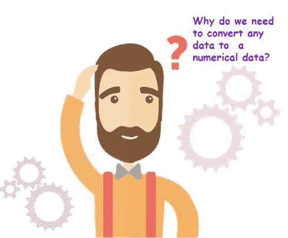

嗯，机器学习模型包括在引擎盖下执行各种数学运算。就像人类需要氧气，数学需要数字。

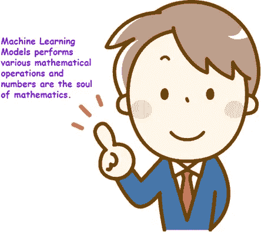

数字数据已经有数字，不需要任何转换。
在本文中，我们将主要关注将文本数据转换成数字向量。

## **嵌入**

文本数据转换成矢量的过程称为**嵌入**。

在我们研究将文本转换成数字向量的各种技术之前，让我们先了解一些术语:

1.  [**矢量**](#347d)
2.  [**文件**](#54ce)
3.  [**文集**](#95cf)
4.  [**令牌**](#f45f)
5.  [**词汇**](#9dc1)

## 矢量

在物理学中，矢量是一个有大小和方向的实体。例如，汽车的速度。

在计算机科学中，向量只不过是一个或多个数字的集合。向量中的每个数字代表向量在特定维度上的大小。
例如，三维空间中的向量可以由三个数字表示为 v = [2，1，3]:

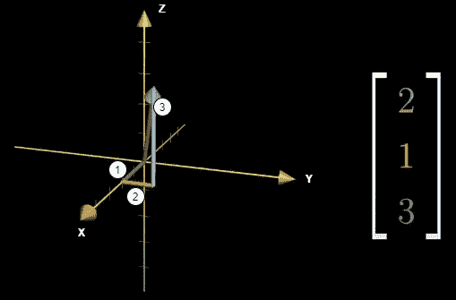

## 文件

文档是代表特定事实或实体的句子的集合。文档的例子包括产品评论、博客、推文或软件生成的日志文件。

## 文集

语料库是文档的集合。语料库中的文档是相互关联的。例如，语料库可以包括一个月内给定产品的所有评论、IMDB 平台中所有电影的评论或者脸书用户的所有脸书评论。

仅供参考:语料库的复数形式称为**语料库**。

## 代币

标记是自然语言的组成部分。它指的是文本被分成的单元。获得令牌的过程称为**令牌化**。

有不同类型的标记化:

1.  **单词标记化**:根据文本中的单词分割文本的标记化。
2.  **字符标记化**:根据文本中的字符分割文本的标记化。
    在本文中，我们不会深入探讨字符标记化的细节。
3.  **n-gram 记号化**:记号化是通过基于文本中的 n 个连续单词来分割文本来完成的。

## 词汇

词汇表是语料库中所有独特单词/标记的集合。

让我们看下图来理解上述术语:

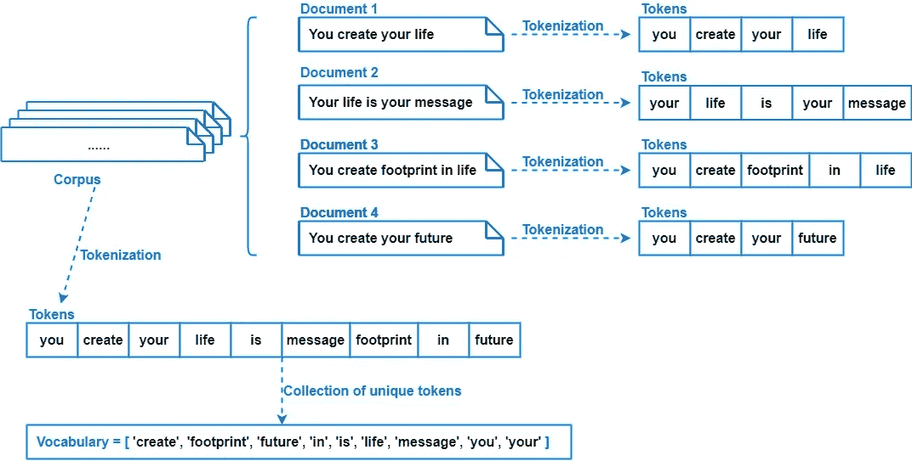

文档、语料库、标记和词汇

**请注意，我们将使用上述文档的示例来理解不同的文本嵌入技术。**

# 将数据转换成数字数据/向量的嵌入技术

让我们看看如何将文本转换成数字向量。我们将讨论一些将文本转换成数字向量的标准技术。

以下是一些文本嵌入技术:

1.  [**包字(弓)**](#0fb4) **一、单克弓
    二。双克弓
    三世。三克弓
    四。n 字弓**
2.  [**词频-倒排文档频率(TF-IDF)**](#c411)
3.  [**word 2 vec**](#e207) **一、** [**平均 Word2Vec**](#f1d9) **二。**[**TF-IDF word 2 vec**](#a9e1)
4.  [**Doc2Vec**](#3771)

# 单词袋(蝴蝶结)

单词袋模型，简称 BoW，是一种非常简单而灵活的将文本表示为数字向量的技术。
这涉及到两件事:

1.  已知单词的词汇表。
2.  已知单词存在的度量。

想象一个袋子，里面有 9 个不同的球，每个球都被标记为词汇表中的独特单词。正如我们前面看到的，对于我们的语料库，词汇表中有一组 9 个独特的单词。

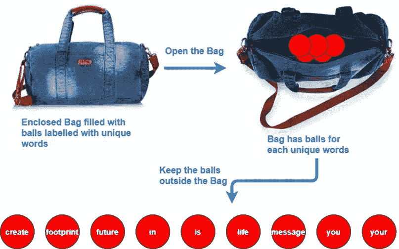

弓概念的插图

这 9 个独特的球代表了可以表示数字向量的所有维度。

要将文档表示为一个向量，我们需要根据词汇表标记文档中每个单词的出现次数(频率),如下所示:

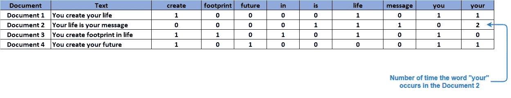

BoWs 表为所有四个文件

从上表中，我们可以通过将数字集合(按行)写成:
文档 1 的向量:[1，0，0，0，0，1，0，1，1，1]
文档 2 的向量:[0，0，0，0，1，1，1，0，2]
文档 3 的向量:[1，1，0，1，0，1，0]
文档 4 的向量:[1，0，1，0，0，0，0，0，0

## 二进制单词包

除了使用出现次数，我们还可以使用 1 或 0 来表示该单词是否出现在文档中。
如果我们使用 1 或 0 来检查单词是否出现，BoWs 的这种实现被称为**二进制单词包**。

## 一袋 n-克

一袋 n-grams 是一袋单词的延伸。在 n-gram BoWs 中，我们将 n 个连续的单词作为令牌。我们在上面的例子中看到的是单克弓。

1.  **单克或 1 克弓**:令牌由单个单词组成。我们上面讨论的例子是单字弓。
2.  **双克或双克弓**:代币由两个连续的单词组成。例如，对于文档 1(你创造了你的生活)，令牌将是{“你创造了”，“创造了你的”，“你的生活”}。
    类似地，语料库将包含具有不同的两个连续单词的记号。
3.  **三克或三克弓**:代币由三个连续的单词组成。
    同样，这个概念可以扩展到生成 n-grams 弓。

让我们看看使用二元弓的数字向量:

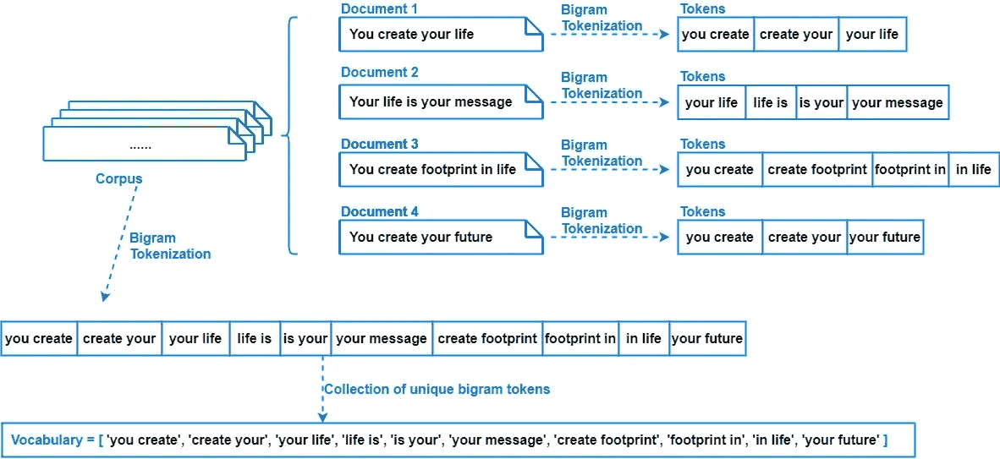

二元语法标记化

为了将文本表示为向量，我们可以将两个连续单词的出现次数写在相应的标记上:

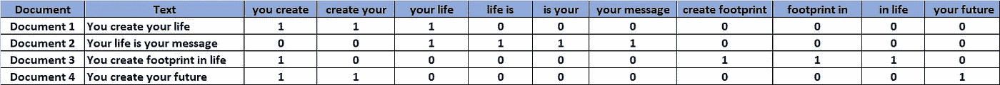

基于上表，我们可以通过将数字集合(按行)写成如下形式将文档表示为向量:
文档 1 的向量:[1，1，1，0，0，0，0，0，0，0]
文档 2 的向量:[0，0，1，1，1，1，1，0，0]
文档 3 的向量:[1，0，0，0，0，0，0，0，1，1，0]
文档 4 的向量:[1，1

同样，我们可以做三元弓和二元弓。

一袋 n-grams 可能比一袋 unigrams 信息量更大，因为它们捕捉了每个单词周围的更多上下文(例如，“创造你的生活”比“生活”信息量更大)。

BoWs 可用于**分类**和**文本**数据。

## 使用词汇袋的缺点

1.  BoWs 依赖于字数统计，并且丢弃了文档的语义。
2.  词汇表的大小会随着新文档的加入而增加。
3.  对于一个文档来说，向量将包含太多的零，导致矩阵稀疏。因此，它用更少的信息消耗更多的内存。
4.  不保留关于文档语法或文本中单词顺序的信息。

# 术语频率-逆文档频率(TF-IDF)

TF-IDF 是 Term Frequency-Inverse Document Frequency 的缩写，在 [Wikipedia](https://en.wikipedia.org/wiki/Tf%E2%80%93idf) 中定义为“旨在反映一个词对集合或语料库中的文档有多重要的数字统计”。

这是另一种将文本转换成数字向量的技术。

在我们了解 TF-IDF 如何工作之前，让我们先分别了解一下 TF 和 IDF 这两个单独的术语。

## 术语频率(TF)

单词的词频是单词在文档中的频率的度量。
TF 由下式定义:

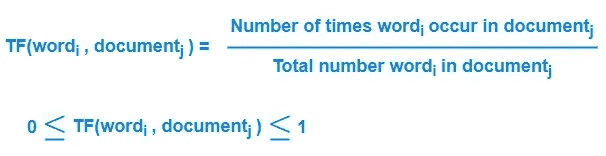

词频公式

由于词频介于 0 和 1 之间，因此可以解释为概率。
因此，TF 也可以定义为:
i .在文档中找到一个单词的概率。
二。单词在文档中出现的频率。

## 反向文档频率(IDF)

IDF 是衡量一个词有多重要的指标。
IDF 由以下公式定义:

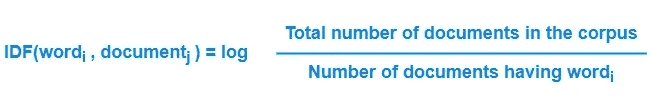

逆文档频率公式

由于对数函数是[单调递增函数](https://en.wikipedia.org/wiki/Monotonic_function)，所以单词的 IDF 值与具有给定单词的文档数量成反比。
因此，如果一个词在语料库中出现的频率越低，它的 IDF 值就越大。在 BoWs 中，我们通过用单词出现的次数填充维度来创建向量。
在 TF-IDF 中，我们通过将单词的术语频率和逆文档频率相乘来创建向量。请参见下表中使用 TF-IDF 值的单词:

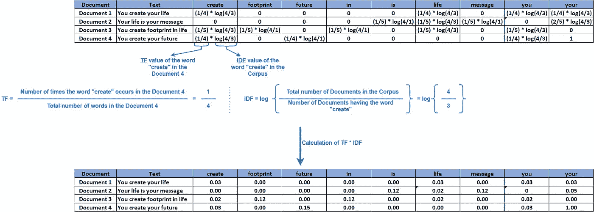

TF-IDF 计算

从上表中，我们可以通过将单词的 TF-IDF 值(按行)写成如下来将文档表示为向量:
文档 1 的向量:[0.03，0.00，0.00，0.00，0.00，0.03，0.00，0.03，0.03]
文档 2 的向量:[0.00，0.00，0.00，0.00，0.00，0.12，0.02，0

在 TF-IDF 中，对文档中频繁出现的词以及语料库中罕见的词给予更多的重视。
我们甚至可以仅使用逆文档频率单独生成取决于问题的向量。

## TF-IDF 的优势

它包含了更重要的单词和不太重要的单词的信息。

## TF-IDF 的缺点

像 BoWs 一样，TFIDF 不考虑语义。

# Word2Vec

Word2Vec 或 **Word to Vector** ，也表示为 **W2V** ，是一种最先进的(SOTA)技术，通过考虑单词的语义来将单词转换为向量，不同于 BoWs 和 TF-IDF。

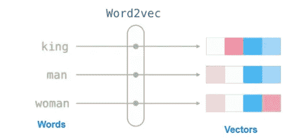

Word2Vec 模型:输入和输出

Work2Vec 使用神经网络模型从大型文本语料库中学习单词关联。
我们不会详细讨论 Word2Vec 是如何实现的，因为它需要一套不同于深度学习的高级概念，并且会偏离本文的意图。
为了简单起见，我们将它视为本文的黑盒。

使用 Word2Vec，一个单词被转换成一个数字密集向量(不是在 BoW 和 TF-IDF 中检索的稀疏向量), d 维通常为 50、100、200、300 等。
如果两个词语义相似，那么这些词的向量在几何上更接近。例如，如果我们有三个词:美味、可口和棒球。在 Word2Vec 转换之后，单词的向量即、“好吃”和“好吃”在 d 维空间会比较近，而“棒球”这个词的向量会比较远。

## Word2Vec 要点

如果两个单词语义相似，那么它们的向量会更接近。
W2V 保留/满足国王::王后、男人::女人、国家::首都等词之间的关系。

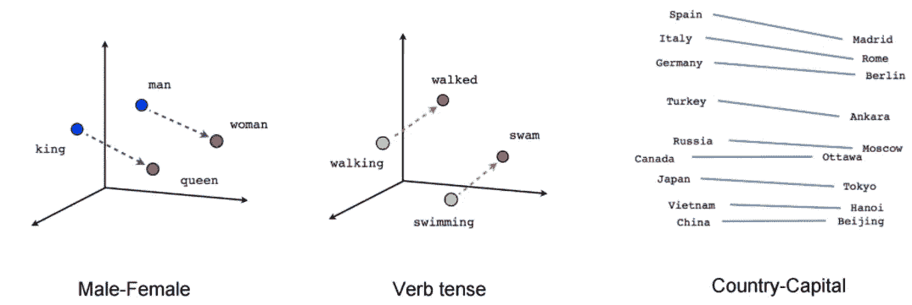

Word2Vec 中的语义关系

我们可以直接使用任何预先训练好的 Word2Vec 模型。例如，我们可以使用谷歌在谷歌新闻数据上训练的 Word2Vec 模型，该模型包含 1000 亿个单词的 300 维向量。
预先训练好的模型无非是一个包含记号及其相关词向量的文件。

正如我们看到的，Word2Vec 将单词转换成向量，而不是将文档(句子)转换成向量。文档是单词/句子的集合。我们需要将文档转换成向量。
我们可以通过两种方式将文档转换为矢量:

1.  **平均 Word2Vec** :
    在平均 Word2Vec 中，我们取文档中所有单词的平均 Word2Vec 值来得到文档的向量。
    利用 Word2Vec 概念构建文本向量是一种简单的方法。平均 Word2Vec 工作得相当好，但并不完美。
2.  **TF-IDF Word2Vec**:
    TF-IDF 加权 word 2 vec 是基于 TF-IDF 值的单词的加权平均值。

平均加权 Word2Vec 和 TF-IDF 加权 Word2Vec 的公式如下:

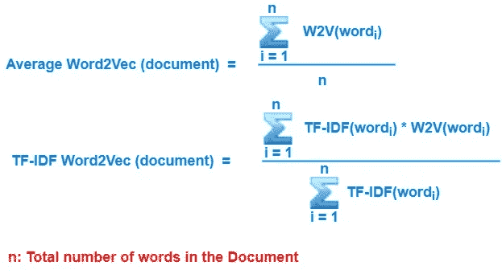

平均 Word2Vec 和 TF-IDF Word2Vec 的公式

## 平均 Word2Vec 的缺点

由于我们的目的是将文本转换成数字向量，对 Word2Vec 的单词进行平均是捕捉句子信息的一种非常幼稚的方法。

TF-IDF 加权 Word2Vec 优于简单平均 Word2Vec，因为它根据单词的重要性进行加权。

尽管如此，这两种技术并不是将文本转换成向量的最佳方式，因为当我们平均时，我们固有地丢失了信息。

# Doc2Vec

我们大概可以根据它的名字猜出这个技术。Doc2Vec 代表**文档到矢量**。
这种技术不是为每个单词创建一个向量，然后取平均值来找到文本的向量表示，而是为每个文档或文本集合创建一个向量。

目标和 Word2Vec 一样。
正如 Word2Vec 预训练模型一样，我们也有在维基百科或谷歌新闻等非常大的文本语料库上训练的预训练 Doc2Vec 模型。

Doc2Vec 模型的美妙之处在于它减少了 Word2Vec 模型中的整合步骤。
我们可以直接将文档传递给 Doc2Vec 模型，并获得它的向量表示。

这是一个比 Word2Vec 更容易用于机器学习的过程。

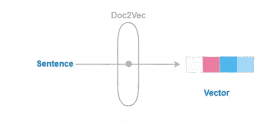

Doc2Vec 模型:输入和输出

# 摘要

这些是将文本转换成数字向量的一些基本技术，可以用作机器学习中的特征化技术。

人们还可以探索一些高级嵌入技术，如[通用语句编码器](https://arxiv.org/abs/1803.11175)、[神经网络中的嵌入层](https://keras.io/api/layers/core_layers/embedding/)、 [BERT](https://arxiv.org/abs/1810.04805) 等。

让我总结一下通过思维导图学到的不同技巧:

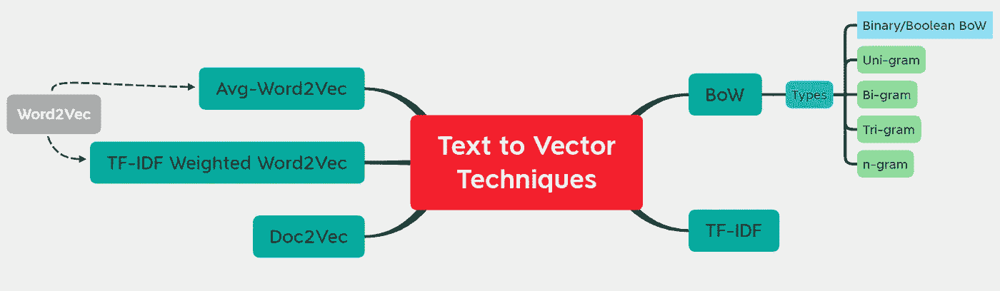

本文中涉及的不同嵌入技术的思维导图

# 参考

*   https://algorithm ia . com/blog/the-importance-of-machine-learning-data
*   [https://www . analyticsvidhya . com/blog/2020/02/quick-introduction-bag-of-words-bow-TF-IDF](https://www.analyticsvidhya.com/blog/2020/02/quick-introduction-bag-of-words-bow-tf-idf/)
*   [https://en.wikipedia.org/wiki/Word2vec](https://en.wikipedia.org/wiki/Word2vec)
*   [维基百科](https://en.wikipedia.org/wiki/Main_Page)