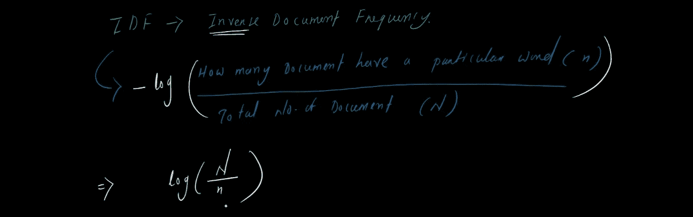
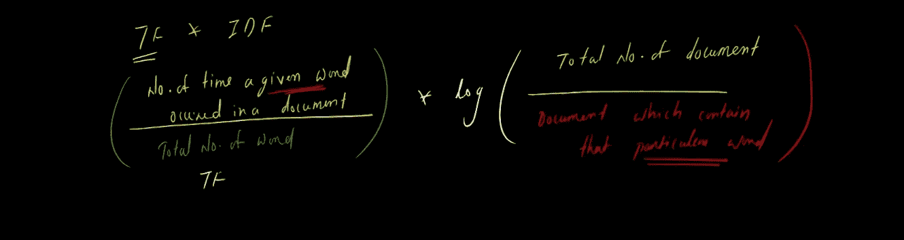

# TF-IDF(术语频率-逆文档频率)

> 原文：<https://medium.com/analytics-vidhya/tf-idf-term-frequency-inverse-document-frequency-985e39c03c?source=collection_archive---------19----------------------->

在机器学习中，我们希望将文本转换为向量，以便我们可以进行一些机器学习建模和分析。在这篇博客中，我将尝试快速解释 TFIDF。看一些句子

在这里，我回顾了一本数据科学书籍。现在让我们给一些名字，以便在未来我们可以顺利工作。

让我们称每个句子为“一个**文档**”——D1、D2、D3、D4，让我们将整个文档命名为“**文集**

现在我们有了自己的术语。让我们深入了解 **TF-IDF**

让我拿一些**自定义**文档和单词来更好地理解

自定义语料库

## 现在让我们来理解一下 **TF** 是什么意思

**TF** —代表词频，意思是**它将统计一个词在给定文档**中的出现频率，公式为

现在让我们举一个**的例子**:

假设我想知道文档 1 中的**术语(**假设 **w1)频率**(**D1**)。 ***TF(w1，D1)？？？？***

让我们统计一下 **w1** 在 **D1 出现的次数:**那就是 **3**

**D1** 的总字数:即 **6**

所以 TF(w1，D1) = 0.5

现在出现了一些问题，比如 TF 的范围应该是多少？

*   就拿 **D1** 来说，D1 有多少个单词:答案是 **6**
*   在 D1，单词的数量可以大于 6 吗？答案是**否**
*   所以假设**如果 w1 在 D1 出现 6 次**，那么: **TF** 将是 **6/6 =1**
*   **一个单词(w1)在文档中出现的最小时间(假设是 D1)** ？:答案是 **0**
*   所以**如果 w1 在 D1 出现 0 次，那么:TF** 将是 **0/6 = 0**
*   所以我们可以说**的词频范围在 0 到 1** 之间

## 现在让我们来看一下 **IDF —(逆文档频率)**

IDF 说:我将**统计给定单词在语料库中的频率**

什么是**公式:**

如果你仔细看的话，我把大写字母 N 作为分子，N 作为分母，去掉了-ve 符号。

**为什么要登录 IDF？**

*   这个**背后没有固定的理论，这是一个 hack，把**除法后的数字**正常化(这个情况下我可能是错的(只是一个想法))**
*   假设我们有一个 10，000 大小的语料库(documents ),在 10，000 个文档中，只有 5 个包含特定的单词。
*   现在，如果我们应用 IDF 公式而不使用 log，那么它将是

IDF =(10000)/5 = 2000**(不记日志)**

*   如果你看这个数字，它是一个很大的数字，记住我们可能有 100 万个文档，那么这个数字就太大了。
*   现在，如果我们应用 log : log(2000) = 3.30(近似值)，这是一个很小的数字

这只是一个例子，要理解为什么要登录 IDF。

***IDF 的射程是多少？***

为了回答这个问题，我们将使用 IDF 的定义/公式

*日志(包含该特定单词文档总数)*

*   我们总共有多少个文档(在我们自定义语料库中) :答案 **4**
*   那么一个给定单词可以在多少个文档中出现:回答 **4**
*   现在让我们应用公式

从上面的计算可以清楚地看出 **IDF 值应该大于或等于零**

现在我们有了 **TF 和 IDF，**让我们把它们混合起来，

*   *TF 和 IDF 将计算特定的单词，这意味着我们在 TF 中使用 w1，在 IDF 中也将使用 w1。*

现在让我们用我们的自定义语料库举一个**例子**

我们想在我们的**自定义语料库**中找出 **D1** 中 **w1** 的 **TFIDF**

因为 w1 非常频繁，所以其结果为零

*   *TFIDF 赋予生僻字更重要的意义*
*   *TFIDF 给予非常频繁的单词不太重要的地位*
*   *TFIDF 产生稀疏矢量*
*   *TFIDF 不会考虑语义*

谢谢你