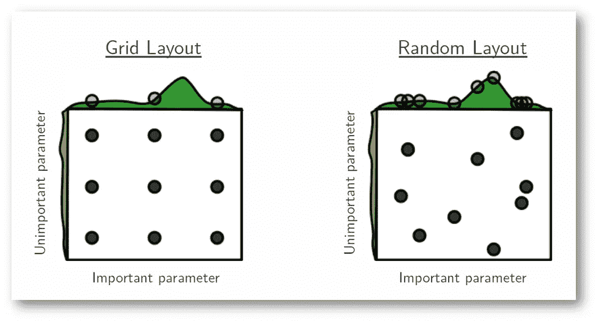
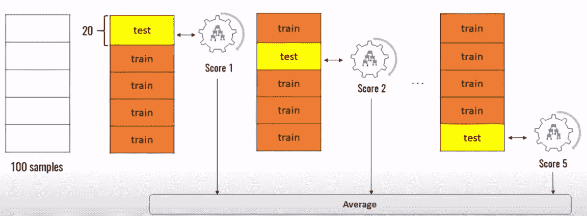

# 数据科学中最被低估的两种技术——网格搜索 CV，随机搜索 CV？

> 原文：<https://medium.com/analytics-vidhya/the-2-most-underrated-techniques-in-data-science-grid-search-cv-randomized-search-cv-c3a68cfb43c?source=collection_archive---------15----------------------->

机器学习中的任何模型都应该在部署模型之前进行训练和测试。最简单的方法是传统的“Train_Test_split”方法。它训练一部分数据，比如 70%或 80%，它将测试剩余的数据。由于并非所有数据都经过训练和测试，因此数据中可能会遗漏一些特征。

我们可以使用 K 折叠交叉验证，确保所有数据都经过训练和测试。但是这是一个手动的方法，你可以在编码的时候使用一些循环来执行这个技术。

**有没有不使用手动方法和 for 循环来训练和测试整个数据的技术？**

由[迪帕克·塞纳帕蒂](https://medium.com/u/f1af9f487c25?source=post_page-----c3a68cfb43c--------------------------------)在[媒体](https://medium.com/u/504c7870fdb6?source=post_page-----c3a68cfb43c--------------------------------)上拍摄的照片

答案是肯定的，网格搜索 cv 和随机搜索 cv 在一行中做的完全一样。但是这两种技术之间有一个小的区别，这种区别使它们以自己的方式有效。如上图所说，grid layout 在选择最佳模型时会考虑每一个参数。随机布局随机考虑参数。

让我们了解这是如何工作的，这两种技术不仅用于训练和测试整个数据，而且还选择最佳模型和最佳超参数的准确性。

假设如果你想从许多不同的模型和不同的超参数中选择最佳模型、最佳超参数，那么如果我们使用网格搜索 CV，将会有更多的迭代次数。所以这里为了减少迭代次数，可以使用随机搜索 CV 与随机组合的参数。这实际上减少了计算成本和训练时间。

现在，我们已经了解了这两种方法的重要性。是时候了解这些方法如何准确地训练和测试全部数据，而其他技术却无法做到这一点了

youtube 上 codebasics 的照片

假设有 100 个样本，如上图所示。网格搜索 CV 将整个数据集分成 n 个不同的部分，在上图中 n=5。它将有 x 个不同的分割，存储在 cv 中，在上图中 cv=5。

因此，在第一次分割中，测试数据的第一部分并训练剩余部分，在第二次分割中，测试第二部分并训练剩余数据，同样地，训练并测试数据的所有部分。最后，考虑所有输出的平均值，以找到模型的最佳精度。

**何时使用哪种手法？**

现在我们已经了解了这两种技术的工作原理和效率，我们应该知道什么时候使用哪种技术。这个问题的答案很简单，当模型和超参数的数量更多时，使用随机搜索 CV 减少迭代次数，使用网格搜索 CV 选择最佳模型和最佳超参数即可。

**结论:**

单独的网格搜索 CV 可能有一些缺点，但是如果我们以一种好的方式使用它，一起使用这两种技术不会有任何问题。网格搜索 CV 是最被低估的技术，因为它可以找到具有最佳精度的最佳模型和最佳参数，但它被低估了，因为它没有给出模型之间差异的确定性。