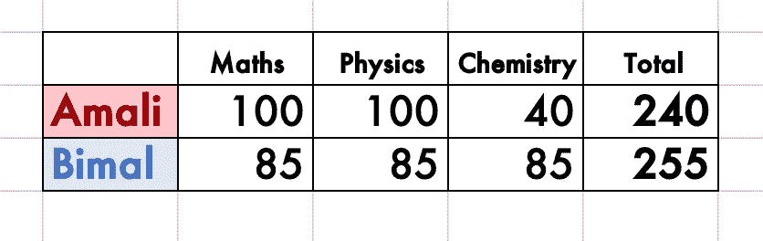
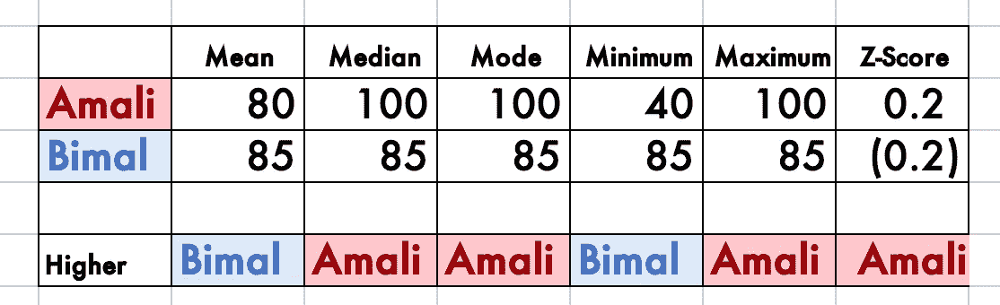

# 统计学的 4 个问题

> 原文：<https://medium.com/analytics-vidhya/the-4-questions-of-statistics-c274002831e3?source=collection_archive---------18----------------------->

## 以及如何不作弊

统计学是用数据回答问题的艺术；“艺术”，因为统计学既涉及创造性，又涉及主观性。

统计学的所有应用都是回答四个问题的过程。本文讨论了这些问题以及如何回答它们。

# **问题 1:** 问题是什么？

我提到过，“统计学是用数据回答问题的艺术”。因此，第一个问题是:“问题是什么？”或者“你想用数据回答的问题是什么？”

让我们考虑一个例子。假设 Amali 和 Bimal 参加了 A. Level 考试，并且刚刚收到了他们的成绩。现在，假设某个假设的大学想从他们中选一个作为他们的学位项目，并决定选谁。

因此，问题 1 的答案是“谁更适合被大学录取？”

# **问题 2:** 什么数据可以帮助我们回答这个问题？

我们假设大学会完全根据他们的 A. Level 成绩来选择 Amali 或者 Bimal。在实践中，大学可能会考虑许多其他因素，但为了简单起见，让我们假设他们只考虑 A. Level 成绩。

更合适的候选人和不太合适的候选人的 A. Level 成绩有什么不同？

以下是候选标准的列表(非详尽):

*   更高的总分
*   更高的平均分(如果 Amali 和 Bimal 参加的科目数量相同，则相当于“总分”)。
*   较高的中间分数
*   较高的模式标记
*   较高的最低分数
*   较高的最大标记
*   z 值越高

以上都是合理的，有微妙的不同，都是问题 2 的可能答案。没有明显的“正确答案”——这就是为什么统计数据往往是主观的。

# **问题 3:** 数据是什么？

在我们的例子中，问题 3 的答案是 Amali 和 Bimal 的实际结果。假设它们如下:

# 问题 4:我们原来问题的答案是什么？

“大学录取谁更合适”的答案取决于我们如何回答问题 3。

*   Bimal ←更高的总分
*   Bimal ←较高的平均分数(如果 Amali 和 Bimal 参加的科目数量相同，则相当于“总分”)。
*   Amali ←较高的中值分数
*   Amali ←较高的模式标记
*   Bimal ←较高的最低标记
*   Amali ←较高的最大标记
*   Amali ←较高的 z 分数(假设 Amali 和 Bimal 是唯一的候选人)

# 如何作弊

诚实的统计学家依次回答问题 1 到 4。不诚实的统计学家以相反的顺序回答问题。

举个例子，假设 Chamal(不诚实的统计学家)是 Bimal 的大哥，想要博弈系统，让后者考上大学。

于是，Chamal 从回答问题 4 开始:“谁是更适合大学录取的人选？比马尔"

接下来，查马尔回答问题 3。一个极度不诚实的统计学家可以篡改源数据，但让我们假设查马尔没有那么不诚实。或者换句话说，Amali 和 Bimal 的结果确实是真实的结果。

然后，Chamal 问自己，“根据给定的结果，问题 2 的答案是什么，可以给出问题 4 的正确答案？”

Chamal 可以选择“总分”、“平均值”或“最低分”中的任何一个作为他选择的标准。

# 如何不作弊

为了确保没有作弊，我们必须确保问题 1 到 4 是按照这个顺序回答的。

具体来说，我们必须在回答 3 和 4 之前回答问题 1 和 2。特别是，我们必须经常问问题 2 是什么时候问的，我们是否在问题 3 之前回答了它。

很多时候，情况恰恰相反。