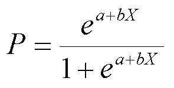
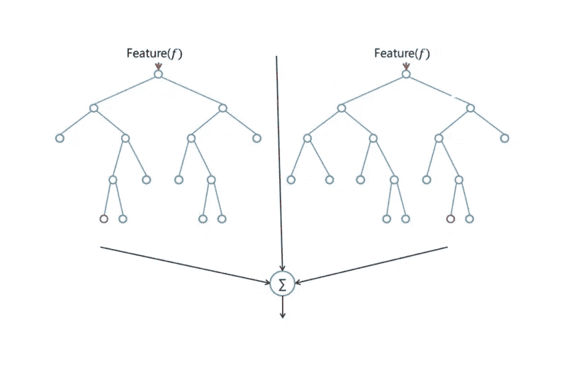
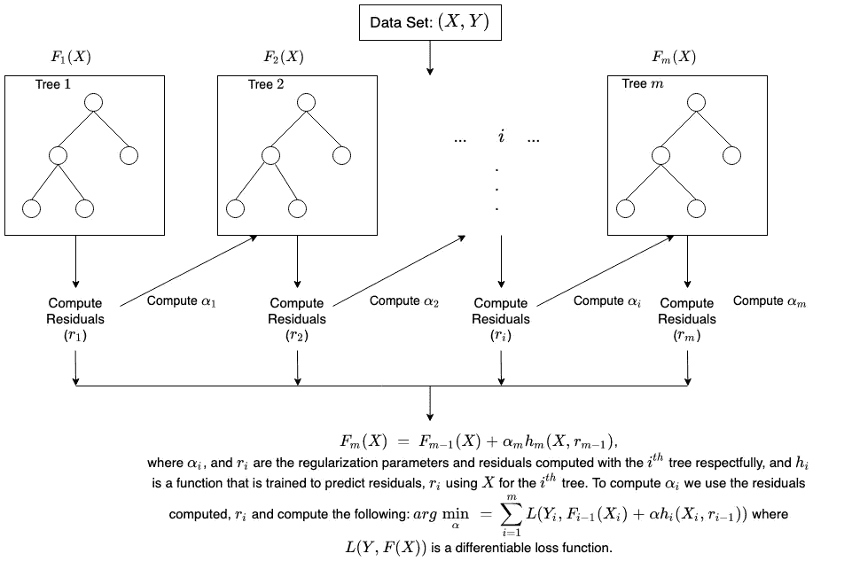

# 你需要知道的 5 ML 算法！

> 原文：<https://medium.com/analytics-vidhya/the-5-ml-algorithms-you-need-to-know-6cf883b9fc79?source=collection_archive---------15----------------------->

你需要知道的 5 种算法，或者更准确地说，今天最常用的 5 种机器学习算法！

这只是对算法的一个简单介绍，如果想更详细地了解每一个算法，我推荐谷歌学者，并看看一些备受尊敬的研究论文！

## 线性回归

最佳拟合线，绝对是任何预测或相关性练习所必须具备的。线性回归是一种用于模拟观察变量之间关系的技术。如上所述，线性回归用于两个主要应用:

*   相关性:显然有些应用程序比其他应用程序更适合数据。线性回归可用于分析变量之间的相关性，并改进统计模型以纳入更多的输入。这种类型的应用在科学试验中是常见的，例如在试验研究中新药对患者的效果。
*   预测:在对变量进行一系列观察后，回归分析给出了变量之间关系的统计模型。该模型可用于生成预测:给定两个变量 x *x* 和 *y* ，该模型可预测给定 *x* 的未来观测值 *y* 的值。这种想法被用于预测无数情况下的变量，例如政治选举的结果、股票市场的行为或职业运动员的表现。

## 逻辑回归

逻辑回归类似于线性回归，但用于模拟离散数量的结果的概率，通常为两个。虽然这听起来比线性回归困难得多，但实际上只多了一步。

首先，使用类似于线性回归最佳拟合直线方程的方程来计算分数

额外的步骤是输入您之前在下面的 sigmoid 函数中计算的分数，以便您获得一个概率作为回报。这个概率可以转换成二进制输出，1 或 0。

逻辑回归

为了找到初始方程的权重来计算分数，使用了像梯度下降或最大似然这样的方法。由于这超出了本文的范围，我就不多赘述了，但是现在您已经知道它是如何工作的了！

## 随机森林

随机森林建立多个决策树，并将它们合并在一起，以获得更准确和稳定的预测。这是一种监督学习算法

随机森林的一个大优势是它可以用于分类和回归问题，这形成了当前机器学习系统的大多数。

有两棵树的随机森林

随机森林与许多其他 bagging 分类器具有基本相同的参数。然而，没有必要将决策树与 bagging 分类器结合起来，因为您可以很容易地使用随机森林的“分类器类”。使用随机森林，您还可以通过使用算法的回归器来处理回归任务。

随机森林增加了模型的随机性，同时增加了树的生长。它不是在分割节点时搜索最重要的特征，而是在随机的特征子集中搜索最佳特征。这导致了广泛的多样性，通常会产生更好的模型。因此，在随机森林中，分裂节点的算法只考虑特征的随机子集。

## 支持向量机

SVM，或支持向量机，是一种监督机器学习算法，用于许多分类和回归问题。它仍然是最常用的稳健预测方法之一，可以应用于许多涉及分类的情况。

支持向量机的工作原理是找到一条称为“超平面”的最佳分隔线，以准确区分一个分类问题中的两个或更多不同类别。目标是通过用 SVM 算法训练可线性分离的数据来找到最佳的超平面分离。

更正式地说，该算法(SVM)创建了一个高维空间的超平面(如果不是线性可分的)，这将有助于分类、离群点检测、回归等等。通过使超平面具有到最近的训练数据点的最大距离来实现良好的类别分离。

## XGBoost

XGBoost 是梯度提升树算法的一个流行且高效的开源实现。梯度推进是一种监督学习算法，它试图通过组合一组更简单、更弱的模型的估计来准确预测目标变量。

当使用梯度推进进行回归时，弱学习器是回归树，每个回归树将输入数据点映射到它的一个包含连续分数的叶子。XGBoost 最小化了一个正则化(L1 和 L2)目标函数，该函数结合了一个凸损失函数(基于预测和目标输出之间的差异)和一个模型复杂性惩罚项(换句话说，回归树函数)。训练迭代进行，添加预测先前树的残差或误差的新树，然后与先前的树组合以进行最终预测。它被称为梯度推进，因为它使用梯度下降算法来最小化添加新模型时的损失。

下面是渐变树增强工作原理的简要说明。(摘自 aws)

你同意这些是顶级的 5 ML 算法吗？让我知道任何其他的…