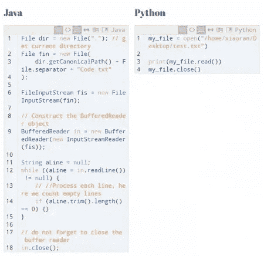

# 学习 Python 的优势

> 原文：<https://medium.com/analytics-vidhya/the-advantages-of-learning-python-4401a185c053?source=collection_archive---------10----------------------->

来源:Pense em TI

Python 是一种非常通用的高级编程语言。由荷兰数学家吉多·范·罗苏姆开发，这种语言现在是社区开发模型的一部分，由非营利组织 Python 软件基金会管理。它支持面向对象和结构化编程。

该语言于 20 世纪 90 年代初推出，近年来名声越来越大，成为程序员中最受欢迎的语言之一，尤其是其与数据、大数据和人工智能的功能。

使用 Python，您可以访问为开发项目和实现复杂应用程序提供功能的本地库。这项技术存在于 Instagram、网飞、Spotify、Reddit、脸书、谷歌和许多其他网站的代码中。

这是 Python 之前的你

# 学习 Python 的理由

从现在开始我会说服你学习 Python。为此，我将向您展示 Python 的最大优势，以及为什么它是近年来发展最快的语言之一。

1.  用 Python 编程的最大优势之一是你可以轻松地学习这门语言。您可以将编程逻辑直接应用到代码中，这也是美国主要大学投资 Python 编程教学的原因之一。
2.  市场上的开发者不多，知道 python 是决胜局，毕竟这些知识是公司很看重的。**与众不同，学习 Python。**
3.  与其他编程标准相比，Python 需要更少的代码来完成基本任务，而**比 Java 少 3 到 5 倍，比 C++代码少 5 到 10 倍。**所以编码越少，出错几率越小，尤其是对于刚入门的人。
4.  Python 是**跨平台**。有几个运行 Python 的系统，有些是本地的，有些需要安装。Windows、MacOs、Linux 发行版、Solaris、Unix 甚至 FreeBSD 都是可以运行 Python 程序的系统。

Java 和 Python 的比较。来源: [Python 脚本](https://python-scripts.com/)

它在**数据科学**中也被广泛使用，所以让我给你介绍一些它在数据科学家中如此流行的原因。

## 用于数据科学的 Python

这是一个有争议的主题，其他编程语言也可以用于同样的目的。因此，数据科学家可以自由选择他喜欢的那个。

1.  Python 是程序员和项目中使用最多的语言之一，这使得它成为一门拥有庞大社区的语言。这个社区可以帮助你找到编码的解决方案，甚至帮助你从分析中得到答案。
2.  Python 在数据科学家中最受欢迎的原因之一是提供了大量的库，如 Pandas、NumPy、SymPy 等。都致力于算法开发、数据收集和分析。
3.  Python 也可以用于**脚本和自动化。**一个 python 脚本可以自动完成不同的任务，节省时间，节省能量，甚至在某些情况下节省金钱。

# 去哪里学 Python？

既然知道了 Python 的一些优点，那学习一下基础怎么样？

把它付诸实践，假以时日，你甚至能自动完成工作中那些无聊的任务，如果它能给你带来一份更好的工作，那就不足为奇了。

以下是一些推荐给你学习 python 的课程:

[计算机科学和使用 Python 编程简介](http://Introduction to Computer Science and Programming Using Python)

[欢迎来到姜戈](https://www.youtube.com/user/henriquebastosnet/featured)

你在追踪蟒蛇。来源: [XKCD](https://xkcd.com/353/)

如果你想了解更多关于 python 的知识，去[Python.org](https://www.python.org/)看看文档，在那里你会找到关于这种语言的一切。

在 [LinkedIn](https://www.linkedin.com/in/jo%C3%A3ogustavoborgesesouza-2901/) 上关注我，关注我的 [GitHub](https://github.com/JoaoGustavo29/Portfolio_DataScience) ，在那里你可以找到一些项目，别忘了在 [Medium](https://joaogustavo-borges2901.medium.com/) 上关注我，阅读接下来的文章。