# 正则化技术的影响

> 原文：<https://medium.com/analytics-vidhya/the-affect-of-regularization-techniques-1592760ced8b?source=collection_archive---------5----------------------->

什么是正规化？

正则化是将系数正则化或缩小到零的过程。

为什么重要？

正则化旨在防止机器学习模型的过度拟合。它提高了模型效率，并有助于模型概括输入数据。

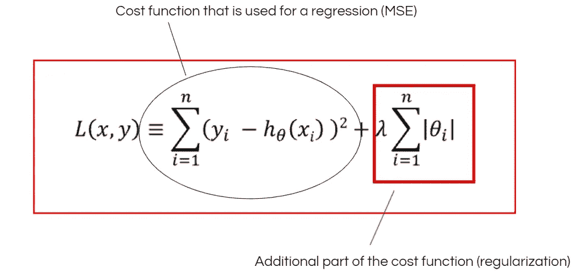

正则化用它自己的权重惩罚模型。它迫使模型在保持良好性能的同时减轻重量

大多数已知的正则化技术是套索&脊正则化技术。

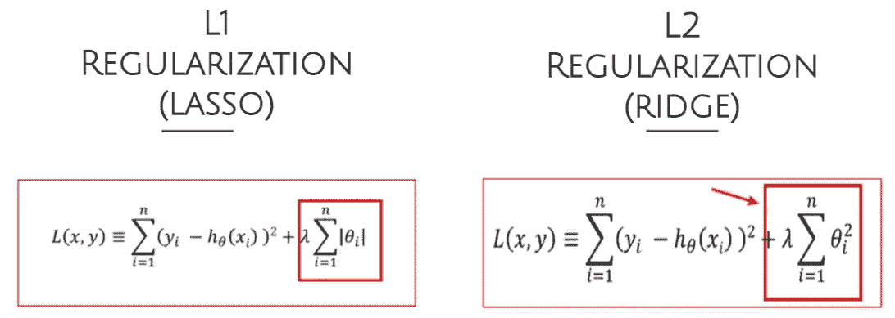

实验

在这一部分中，我使用一个样本数据集(房地产估价数据集)创建了三个模型，一个没有正则化，一个有 lasso，一个有 ridge。

样本数据集是从 UCI 机器学习库中检索的

数据集功能

这些输入如下

X1 =交易日期(例如，2013.250=2013 年 3 月，2013.500=2013 年 6 月等等。)

X2 =房龄(单位:年)

X3 =到最近的捷运站的距离(单位:米)

X4 =步行生活圈便利店数量(整数)

X5 =地理坐标，纬度。(单位:度)

X6 =地理坐标，经度。(单位:度)

输出如下所示

Y=单位面积房价(10000 新台币/坪，其中坪为当地单位，1 坪= 3.3 平方米)

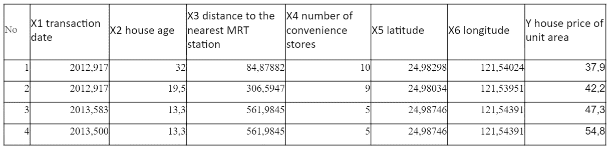

输入数据集的示例视图

实验细节

*   用于研究的数据集有 414 行，分为训练集(80%)和测试集(20%)。
*   对于研究期间创建的所有模型，使用线性回归方法实施。
*   在训练阶段之前，对数据集应用最小最大缩放。
*   在真实场景中，准确性无疑是非常重要的。
*   但本研究主要关注准确性得分的差异。
*   选择均方误差作为代价函数。
*   选择 R2 分数作为准确度函数。
*   研究的目标是比较不同正则化方法在每种方法的最佳情况下的模型效率。

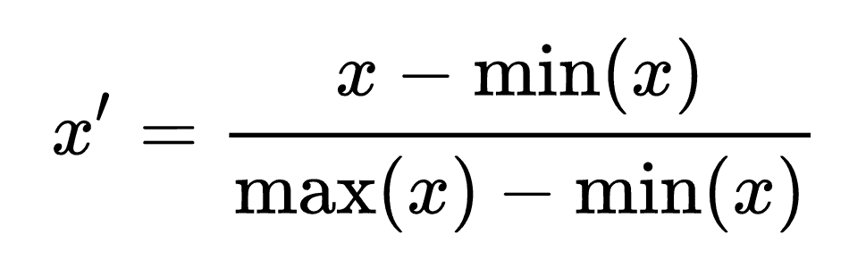

最小最大缩放

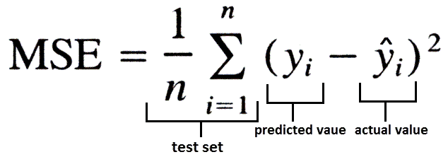

均方误差

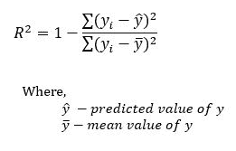

R2 分数

实验结果

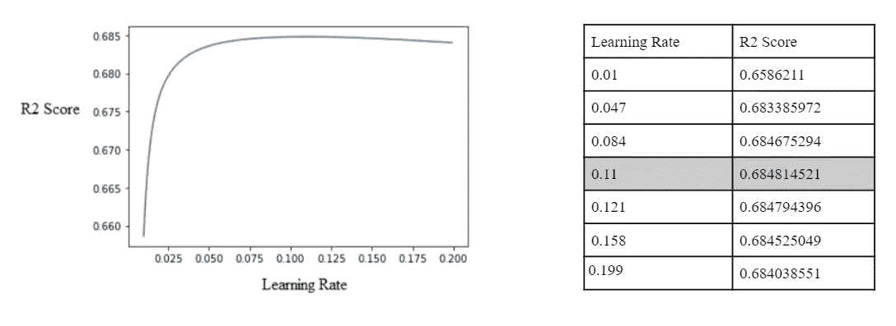

没有正则化技术的模型

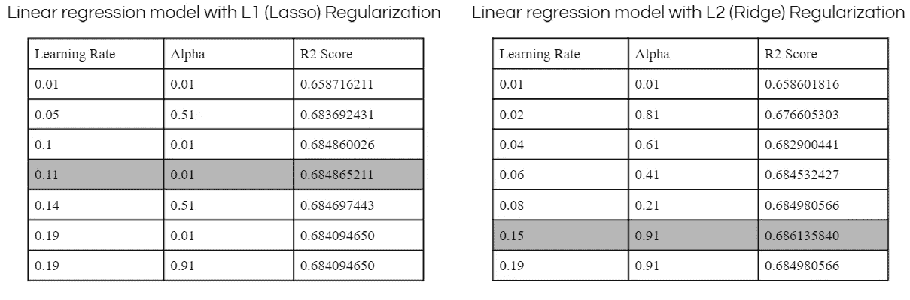

使用正则化技术的模型

方法

在这一部分，我尝试自己创建类似的正则化公式。

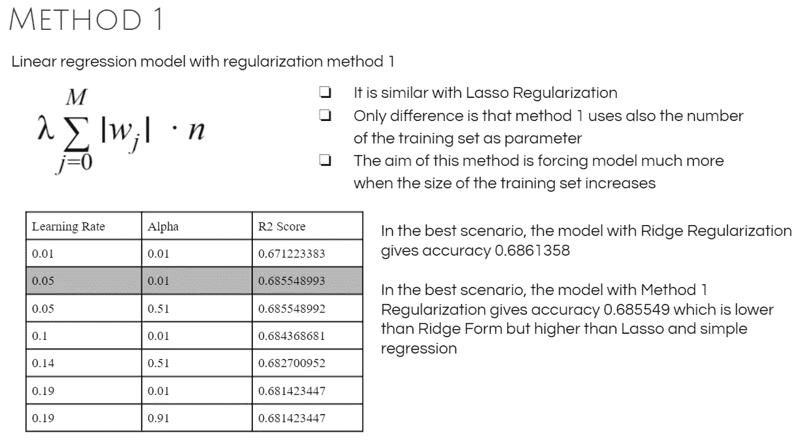

方法 1

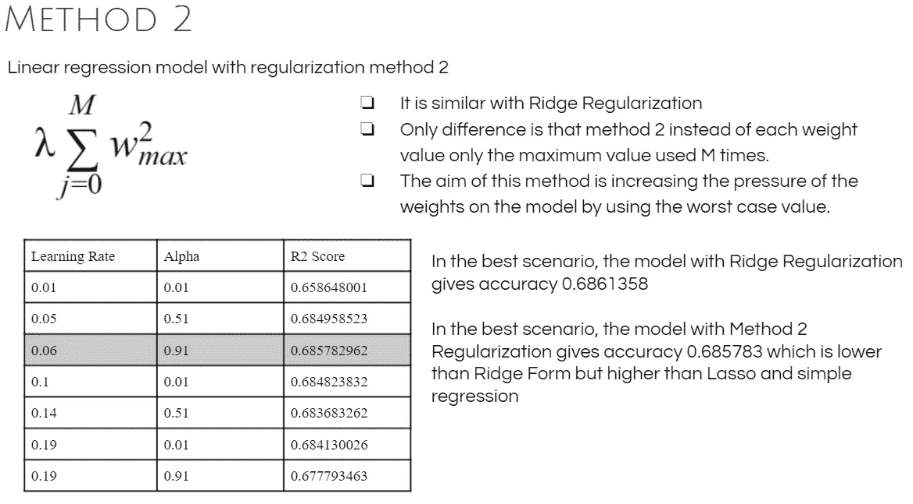

方法 2

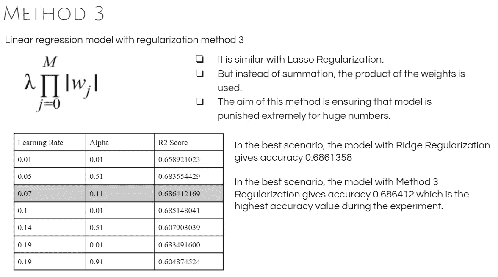

方法 3

决赛成绩

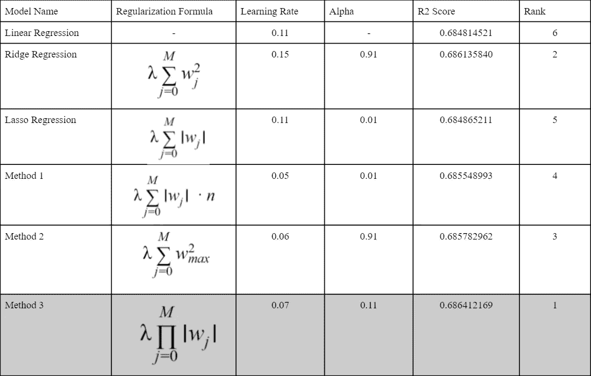

实验和方法部分的结果表

结论

*   特别是在训练不平衡或训练规模不够大的模型中，过拟合是一个常见的问题。
*   克服这个问题的解决方案之一是使用正则化方法。
*   因此，尽管该模型保持其准确性，但它也试图减轻权重，以防止有偏差的进展。
*   研究的主要目的是通过比较现有方法和从现有备选方案中提取的新方法，对新的正则化方法有新的想法。
*   该研究还表明，对于给定的环境(数据集、用例等),使用不同的正则化替代方案可以提高模型效率。).

参考

*   陈，钟，海金，s(2002)。正则化理论的不同方面。神经计算，14(12)，2791–2846。
*   t .波焦、托雷、v .和 c .科赫(1987 年)。计算视觉和正则化理论。计算机视觉阅读，638–643。
*   UCI 机器学习知识库:房地产估价数据集数据集。(未注明)。2021 年 6 月 9 日检索，来自[https://archive . ics . UCI . edu/ml/datasets/Real+estate+evaluation+data+set](https://archive.ics.uci.edu/ml/datasets/Real+estate+valuation+data+set)