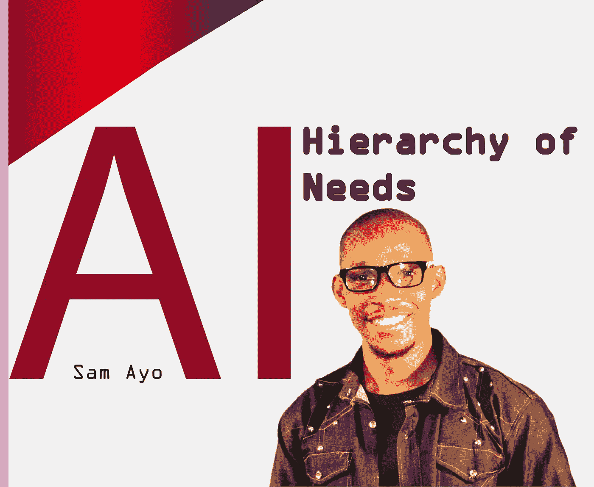
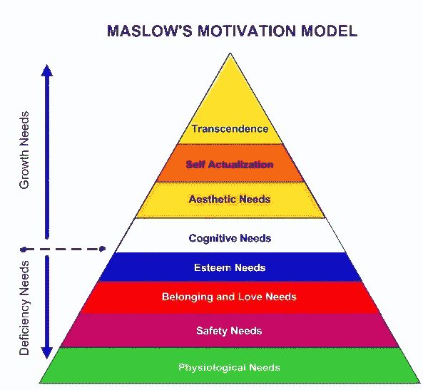
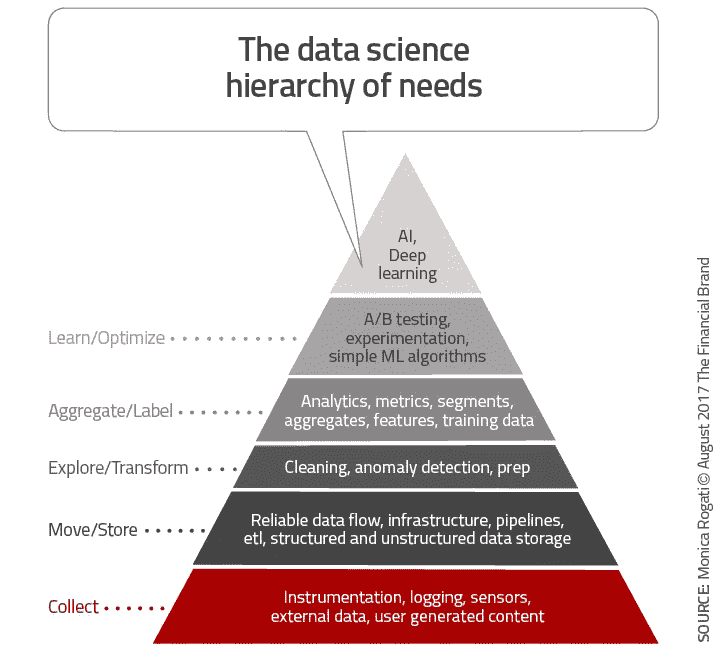

# 人工智能的需求层次

> 原文：<https://medium.com/analytics-vidhya/the-ai-hierarchy-of-needs-6d76aa6c5555?source=collection_archive---------3----------------------->

在亚伯拉罕·马斯洛 1943 年发表在《心理学》上的论文中，他提出了马斯洛的需求层次，这是他在《心理评论》杂志上发表的“人类动机理论”中的一个观点。

亚伯拉罕·马斯洛的需求层次理论用于研究人类在行为动机中的内在参与。马斯洛使用了“生理”、“安全”、“归属和爱”、“社会需求”或“尊重”以及“自我实现”等术语来描述人类动机的一般运行模式。马斯洛的需求层次通常被描绘成金字塔的形状，最大、最基本的需求在底部，自我实现和超越的需求在顶部。换句话说，这个想法是，个人最基本的需求必须得到满足，才能有动力去实现更高层次的需求。

类似地，人工智能的高价值应用建立在能力的层次结构上。

从金融科技初创公司到电子商务巨头，再到国际公共机构，团队都在狂热地研究他们的人工智能战略。这一切都归结为一个重要的高风险问题:“我们如何利用人工智能和机器学习来改善我们的工作？”

正如快速发展的技术通常的情况一样，人工智能激发了我们处理和联系商业决策的方式的巨大变化。

很多时候，公司还没有为人工智能驱动的运营做好准备。或许他们雇佣了第一个数据科学家，但结果并不理想，或许数据素养并不是他们文化的核心。

许多组织都在努力寻找成为数据驱动型组织的方法。这导致他们的数据科学之旅在某个时间点停滞不前。有时这很大程度上是因为他们没有建立必要的基础设施(并从中受益)来开始数据驱动的操作，更不用说机器学习了。

这个百万美元的问题是，像谷歌、苹果、亚马逊和脸书这样的 FAANG 公司是如何将自己转变为数据驱动型企业的？

作为一个数据科学/AI 极客，是时候开始敲钟了。真的，如果你在自己的领域分享这么多令人兴奋的事情，就很难成为一个扫兴的人。

确切地说，你如何告诉公司他们还没有为人工智能做好准备，而不显得(或成为)精英主义者——一个自称的看门人？

**人工智能需求层次**

为了清楚地解释这个 let，用人工智能驱动的等价替换每个需求。

把人工智能想象成马斯洛需求金字塔的顶端。从字面上看，你可以看到你首先需要食物，水和住所，这是数据扫盲，收集和基础设施。

**数据收集**

数据收集是金字塔的基础，是你确定你需要什么数据和什么数据可用的阶段。如果目标是一个面向用户的产品，如果是一个传感器，什么数据通过，如何通过？

你需要什么数据，有什么可用的？如果是面向用户的产品，所有相关的交互都被记录了吗？如果是传感器，什么数据通过，何时通过，如何通过？如何轻松地记录尚未被检测的交互？毕竟，正确的数据集使得机器学习的最新进展成为可能。

最终，没有数据，任何机器学习或人工智能解决方案都无法学习或预测结果，对吗？

**数据流(移动和存储)**

数据是如何在系统中流动的？是否建立了可靠的 ETL(提取、转换和加载)流程？数据存储在哪里，访问和分析数据的难易程度如何？

这些为数据湖和数据工程过程提供了技术获取动力。

你应该真正知道 ***可靠的数据流是用数据做任何事情的关键。***

**探索与改造**

接下来是对这些数据的探索和转换。这包括臭名昭著的“数据清理”和 EDA 过程，这是数据科学中被严重低估的一面，也是我的最爱。然而，我必须服从另一篇文章。

在这一点上，你发现你丢失了很多数据，你的传感器可能不可靠，你的事件可能由于版本变化而被丢弃，然后你回到确保金字塔的底部在前进之前是牢固的。

**分析和商业智能(聚合/标签)**

在清理和 EDA 流程之后，您可以开始设计传统意义上的业务分析或智能(BI)，这可能包括定义关键指标，以确定季节性如何影响产品销售和运营，根据人口因素和其他因素跟踪和整体细分用户。

然而，由于目标是将人工智能集成到业务流程中，您现在正在构建稍后将被认为是合并到您的机器学习模型中的功能。

所以，已经可以看到，到了这个阶段，你知道你想要预测什么。

在这个阶段你应该确定什么？

1.你想预测和自动化什么

2.机器需要学习的训练数据

3.机器学习模型中包含的功能

4.如何创建机器将学习的标签(自动或人工准备)

**学习优化**

数据收集—检查！

数据已被移动并存储在湖中—检查！

数据分析和探索—检查！

训练数据—检查！

当然，我们现在可以进行机器学习，对吗？

是的，也许，如果你试图在内部预测客户流失。

不，如果最终结果是面向客户的话。

必须首先建立 A/B 测试或实验框架。为了避免灾难，部署必须逐步进行，并在影响到每个人之前，对收集和分析的更改效果进行粗略估计。这也是建立一个非常简单的基线的恰当时机。

此时，您可以部署一个非常简单的 ML 算法(如逻辑回归或分类)，然后考虑您的结果可能会受到新信号和功能的影响。在这个阶段花一些时间是值得的，即使作为数据科学家，进入金字塔的下一级可能会非常令人兴奋。

**艾**

人工智能的宣传目前正处于高潮，组织试图插入任何肮脏的&充满缺失值的数据，并期望随时可用的工具神奇地处理它。

也许有一天机器智能会成为现实；但是现在值得为你的人工智能需求金字塔建立一个坚实的基础。

现在，在完成金字塔底部的步骤后，你就在顶部了，你可以为“数据驱动型组织”这一术语而自豪。

ETL 嗡嗡作响。

数据得到组织和清理

分析和仪表板正在测量正确的东西。

你可以每天做实验。你准备好了！