# 2019 年亚马逊股票 vs Twitter

> 原文：<https://medium.com/analytics-vidhya/the-amazon-stock-vs-twitter-in-2019-931c88831fc1?source=collection_archive---------13----------------------->


在 [Unsplash](https://unsplash.com?utm_source=medium&utm_medium=referral) 上由 [Austin Distel](https://unsplash.com/@austindistel?utm_source=medium&utm_medium=referral) 拍摄的照片

作为一名金融学毕业生和数据科学的在校生，我决定看看金融学中一个并不超级著名的领域，叫做“行为金融学”。
这个领域试图理解和解释为什么投资者会根据不同的情况做出不同的行为。这一领域的主要目标是表明，基于金融个体从理性角度作出决策这一事实的金融标准理论不是我们所能看到的。

我将重点讨论的假设是对投资者情绪的“大众行为效应”。投资者受大众影响吗？他们都在做同样的决定吗？来自一些“大众媒体”的影响能改变投资者的行为吗？

我决定用我的分析来看待这些问题。为此，我选择 Twitter 来反映投资者的想法。通过推文，你可以了解人们对某个主题或他们的生活的感受和体验。
机器学习和数据科学使得从统计和数学理论中创建的众多算法成为可能。

我将首先介绍我选择的数据和我选择的从推文中获得感觉的方法。然后，我会分析数据，输出里面的内容，最后做情感分析。

# **数据**

我决定获得我自己的数据来创建我自己的分析，并且可以自由地用正确的信息查看我想要的东西。我的分析旨在了解亚马逊在 Twitter 上的财务情绪。我所说的金融情绪是指对亚马逊股票价值的感觉。为此，我用关键词“$AMZN”取消了 2019 年全年的推文，这就像一只股票的标签。

我每月都这样做，以获得更小的文件，这导致了 2019 年 1 月导入的代码示例。

```
import pandas as pd
import jsonjan2019 = pd.DataFrame([json.loads(line) for line in open(r'../Amazon Tweets/AMZNjan2019.json', 'r')])jan2019.head(5)
```

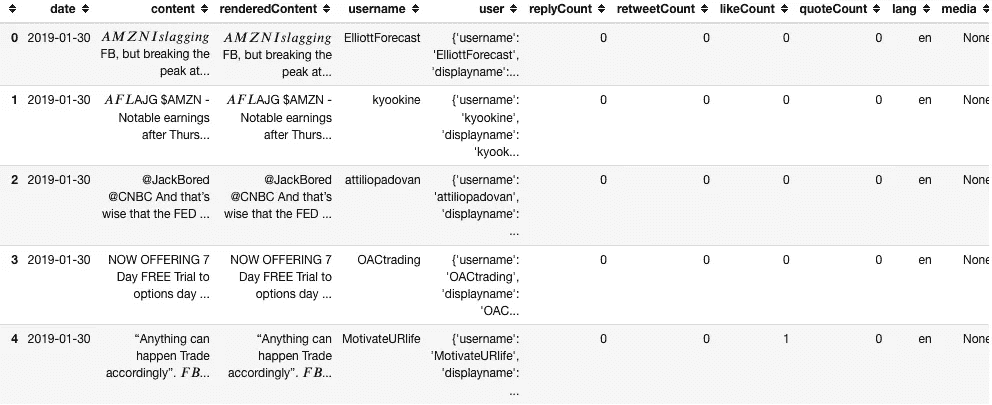

表 1

每个数据框架都有许多无用的分析栏，我都删除了，比如“id”，与推文相关的不同链接……我还决定将每个月合并成一个大的数据框架，以便能够以最佳方式进行分析。我得到了 2019 年 **185 303 条推文的数量**。

我得到的数据的一个特点是，来自每条 tweet 的用户信息存储在主数据帧的一个列中(列“user”)。然后我根据这些信息创建了另外 12 个表格，这些信息将在后面进行分析。

# **方法**

我想做一个情感分析，这是一个确定一篇文章是积极、消极还是中性的过程，它使用自然语言处理和机器学习来识别句子的极性。

由于我的语料库是基于金融推文的，使用从远离金融词汇的文本创建的 NLP 模型会是一个问题。然后，我寻找一个将从大型金融语料库中构建的模型，我找到了 **FinBERT** 。

[](/prosus-ai-tech-blog/finbert-financial-sentiment-analysis-with-bert-b277a3607101) [## 芬伯特:用伯特进行金融情绪分析

### 祖尔库夫·根茨·多乌·坦·阿拉桑

medium.com](/prosus-ai-tech-blog/finbert-financial-sentiment-analysis-with-bert-b277a3607101) 

**FinBERT** 是一个用于金融情绪分析的预训练模型，由名为 BERT 的语言表示模型创建。BERT 允许对预训练模型进行微调和训练。FinBERT 背后的团队使用了 BERT 预训练模型，并在金融语料库上对其进行了训练: [Reuters TRC2](https://trec.nist.gov/data/reuters/reuters.html) 。

*现在让我们来看看推文并进行分析…*

# **2019 年 I - Amazon 推文**

正如我之前所说，我只看$AMZN 的推文，以保持与我想做的事情相关。如果我们注意每天的推文数量，我们就会得到这个结果。

```
import plotly.express as pxAMZN2019_tweets = AMZN2019.groupby(['date', 'month']['username'].count().reset_index()
AMZN2019_tweets.columns = ["Date", "Month", "Number"]fig = px.bar(AMZN2019_tweets, x="Date", y="Number", color="Month", title="Tweets on AMZN per day in 2019", facet_col="Month", color_discrete_sequence=px.colors.qualitative.Antique)
fig.update_xaxes(matches=None)
fig.update_layout(showlegend=False, plot_bgcolor='white', yaxis=dict(title=''), margin=dict(autoexpand=False, l=100, r=20, t=110,))
fig.update(layout=dict(title=dict(x=0.5)))
fig.update_xaxes(visible=False)
fig.show()
```

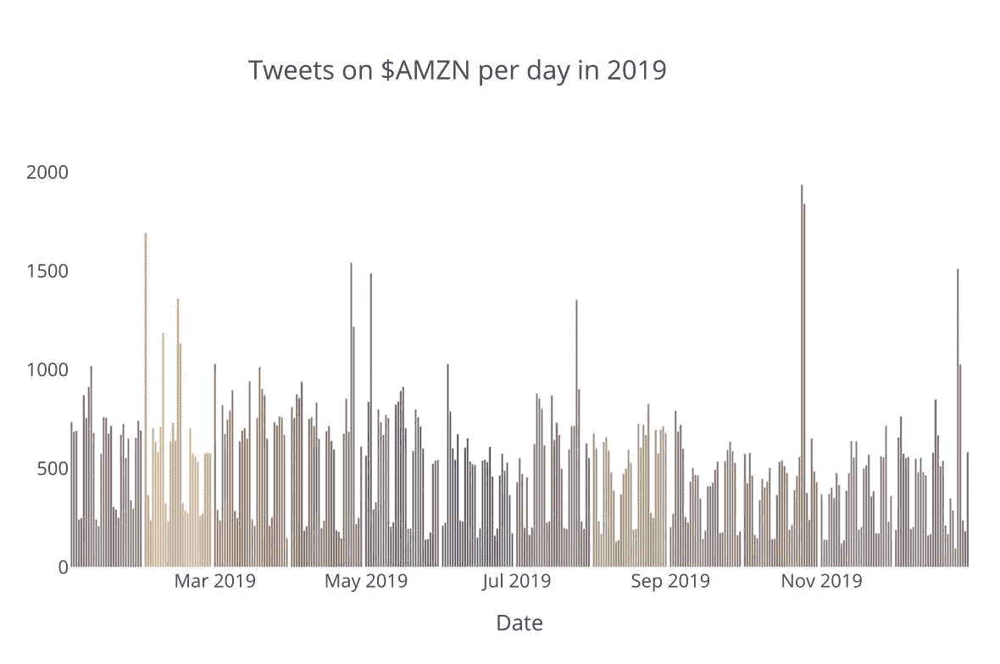

图 1

我们可以看到每个月的趋势，推特最少的一天是周末，因为证券交易所关门了。然而，有些日子明显不同于其他拥有超过 1500 条推文的日子。

如果我们查看第十大推文日，我们会发现:

```
#A Dataframe sorting days by tweets
Ten_mosttweetsdays = pd.DataFrame(AMZN2019_most_tweets.head(10))
Ten_mosttweetsdays.sort_values(by="Number", inplace=True, ascending=True)
```

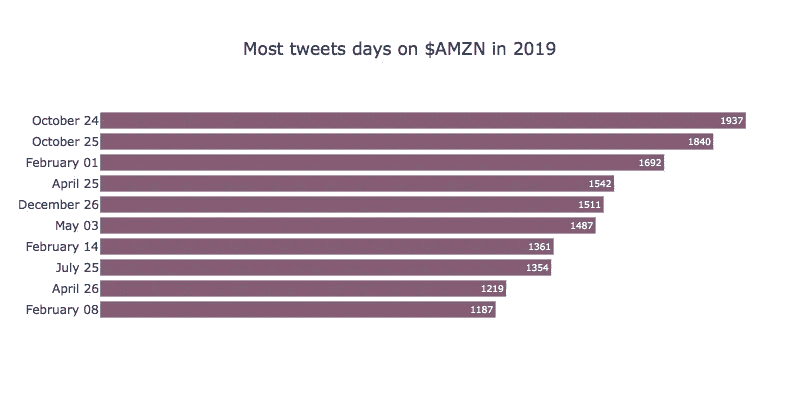

图 2

2019 年$AMZN 上推文最多的一天是 10 月 24 日。很容易理解为什么。那天，亚马逊召开了一次电话会议，讨论其 2019 年第三季度的财务业绩(来源 1:*press.aboutamazon.com*和*纽约时报*)。第二个是第二天。推文最多的第三天(2 月 1 日)也可以通过公告来解释。事实上，就在前一天，1 月 31 日，亚马逊公布了第四季度销售额的增长(来源:【press.aboutamazon.com】T21)。

**现在我们来看看谁发推文？**

如果我们关注一年中推文的点赞数量，我们会得到下面的数据帧，显示“ *fillbeforeshill* ”是第一名。

```
AMZN2019_rt = pd.DataFrame(AMZN2019[["username", "retweetCount", "likeCount"]])
AMZN2019_rt.sort_values(by="likeCount", inplace=True, ascending=False)
AMZN2019_rt[:10]
```

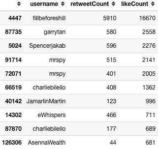

表 2

他的推文并不是真正的金融推文，这可以解释为什么它有这么多喜欢。

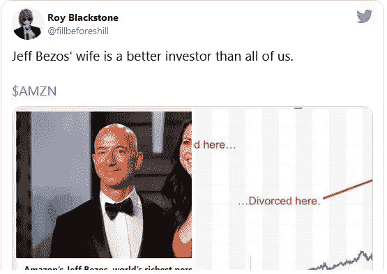

在这一年中，在推特上发布了大约$AMZN 的最受关注的用户中，“*fillbeforeshill”*不存在，这是有意义的，因为谁主宰了前 10 名的排名，媒体。

为了进行这个排名，我不得不使用关于用户名的信息，正如我在开始的数据演示中所说的。

```
userframes = [userJan, userFeb, userMar, userApr, userMay, userJun, userJul, userAug, userSept, userOct, userNov, userDec]AMZN2019_user = pd.concat(userframes)
AMZN2019_user.reset_index(inplace=True)
AMZN2019_user.drop(columns=['index'], inplace=True)
AMZN2019_user.sort_values(by=['followersCount'], inplace=True, ascending=True)
```

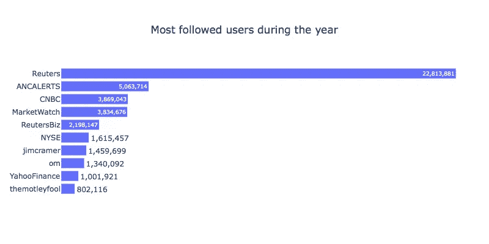

图 3

路透社以 22，813，881 的关注者排名第一，接下来是所有媒体，除了 Jim Cramer 和@OM。

在我其余的分析中，我必须只关注英语推文，所以我查看了语料库中使用的语言。我做了一个数据图表，按照一整年使用的语言来统计推文。

```
tweetsperlang = pd.DataFrame(AMZN2019['lang'].value_counts())
tweetsperlang.reset_index(inplace=True)
tweetsperlang.columns = ["Language", "Number"]
tweetsperlang.loc[len(tweetsperlang.index)] = ['other', tweetsperlang.iloc[6:37, 1].sum()]
tweetsperlang.drop(tweetsperlang.loc[6:37].index, inplace=True)
```

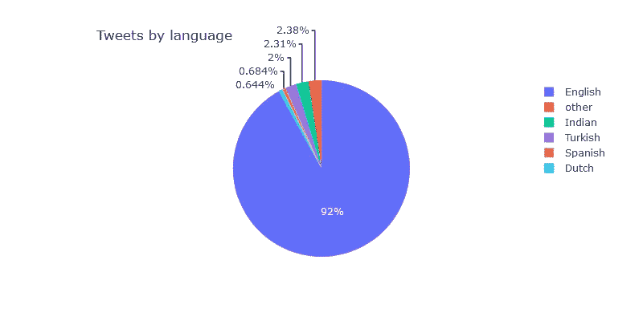

图 4

我们注意到，在整个一年中，英语是关于这个主题使用最多的语言。

# **II -推文中有什么**

首先让我们使用著名的库[**【NLTK】**](https://www.nltk.org/)**来看看他们自己的推文。这个库用于处理人类语言数据。它允许文本处理，如分类、标记化、词干化…
开始，我必须清除 tweets 中的特殊字符、链接、表情符号等，所以我使用了带有库 *"re"* 的**正则表达式** (regex)来为所有的语料库做这件事。我创建了一个应用于“内容”列的函数，并使用了它。**

```
import re
import nltk
nltk.download('stopwords')
nltk.download('punkt')
from nltk.corpus import stopwords
from nltk import word_tokenize
stop = stopwords.words('english')def cleaning_tweets(text):
   text = str(text)
   text = text.lower()
   text = re.sub(r'http\S+', ' ', text)
   text = re.sub(r'\b[a-zA-Z]\b', ' ', text)
   text = re.sub(r'\d+', ' ', text)
   text = re.sub(r'[^a-zA-Z0-9]+', ' ', text)
   text = re.sub(r'\s+', ' ', text) text = text.split() return textAMZN2019_eng["content_modified"] = AMZN2019_eng['content'].apply(lambda x: cleaning_tweets(x))AMZN2019_eng["content_modified"] = AMZN2019_eng["content_modified"].apply(lambda x: ' '.join([word for word in x if word not in (stop)]))
```

**为了展示它的输出，我们来看一条推文，看看有什么不同:**

> **原推文:“孟被捕 Vs 法治$ QQQ $ AAPL $ AMZN[https://t.co/AnCqdd8cuq](https://t.co/AnCqdd8cuq)”**
> 
> **已清理的推文:“孟被捕 vs 法治 qqq aapl amzn”**

**既然我们有了合适的 tweets，我们就能够用 NLTK 对其进行标记，并从中获取统计数据。单词标记化是将句子拆分成单词的任务。
我用它来**统计整个推特语料库中的每个单词**并找出最常见的。**

```
tweets =  AMZN2019_eng['content_modified'].str.lower()
word_counts = Counter(word_tokenize('\n'.join(tweets)))amzn_freq = pd.DataFrame.from_dict(word_counts, orient='index').reset_index()
amzn_freq.columns=["Word", "Frequency"]
amzn_freq.sort_values(by=['Frequency'], inplace=True, ascending=True)
```

**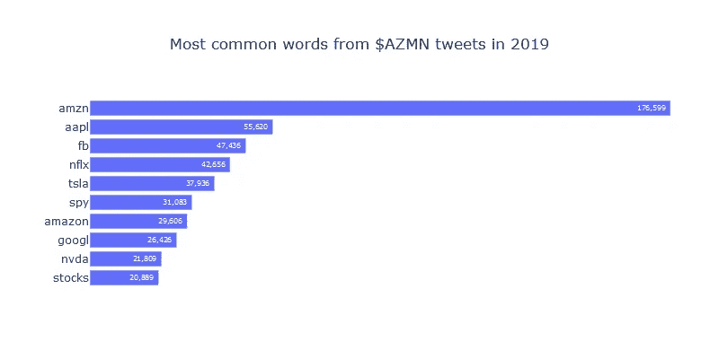**

**图 5**

**由于输出导致许多股票指数，我决定删除主要的，并创建一个新结果的单词云。**

```
from wordcloud import ImageColorGeneratorwc = WordCloud(mask=mask,max_words=2000, color_func=image_colours, background_color='white')
wc.generate_from_frequencies(word_counts)
wc.to_image()
```

****

**词云 1**

**金融的词汇是清晰而明显的。重要词汇可以是现货，如**【买入】****【期权】**或**【看涨】**。**

**我对这一年中发推特的所有用户的**描述**做了同样的处理，我得到了这个词云:**

**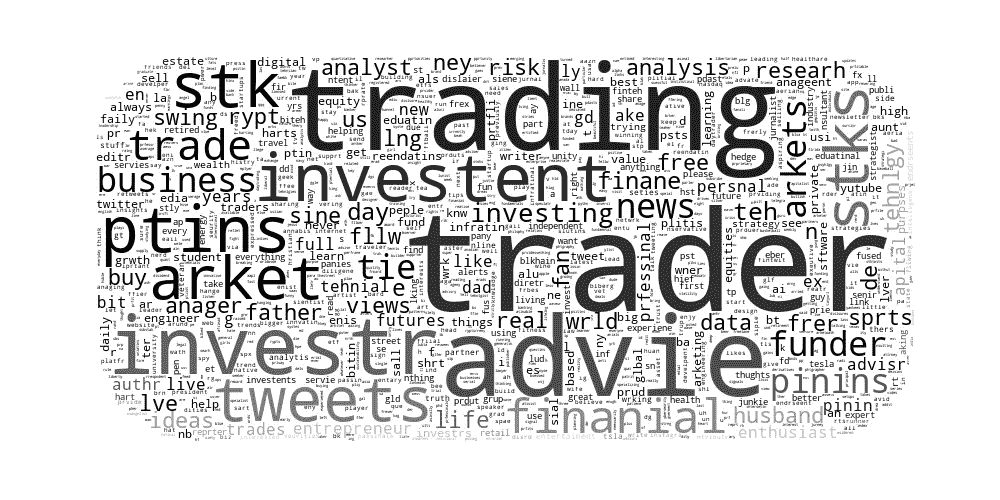**

**词云 2**

**在 Twitter 对所有在 2019 年期间发布关于 AMZN 的用户的描述中，最常见的词是单词**“Trader”**。这意味着，即使你可以在 Twitter 上随心所欲地描述自己，这个词出现频率最高也意味着推文关注的是金融市场，而不是其他事情。我们也能发现像“顾问”、“投资者”、“资助者”、“投资”这样的词…**

# **情绪分析和市场**

**我分析的目标是，一方面比较 twitter 上对$AMZN 的感觉，另一方面比较市场的演变。
正如我在开头介绍的，我使用 FinBERT 对推文进行分类，并得到一个标签(正面、负面或中性)。为了使用这个模型，我使用了 HuggingFace 的 [**变形金刚**](https://huggingface.co/transformers/) 库。该库允许使用预训练的模型来完成不同的 NLP 任务，如分类、文本生成……正如 HuggingFace 在其平台上所说，它由两个最受欢迎的深度学习库支持， [PyTorch](https://pytorch.org/) 和 [TensorFlow](https://www.tensorflow.org/) ，允许用一个训练你的模型，然后用另一个加载它进行推理。**

**在我的作品中，我使用了我之前介绍过的“普罗苏赛/芬伯特”模型，可以在 HuggingFace.co 上找到。为了设置它，我使用了 AutoTokenizer 和库中的 AutoModelForSequenceClassification。有了这些类，就可以用他构建的权重和配置来建立模型。由于表格的大小，我在每个月都应用了分类器。**

```
from transformers import AutoTokenizer, AutoModelForSequenceClassification
from transformers import pipelinemodel_name = "ProsusAI/finbert"
model = AutoModelForSequenceClassification.from_pretrained(model_name)
tokenizer = AutoTokenizer.from_pretrained(model_name)
classifier = pipeline('sentiment-analysis', model=model, tokenizer=tokenizer)aprSentiment = (aprSentiment.assign(sentiment = lambda x: x['content_modified'].apply(lambda s: classifier(s))).assign(label = lambda x: x['sentiment'].apply(lambda s: (s[0]['label'])),score = lambda x: x['sentiment'].apply(lambda s: (s[0]['score']))))
```

**以下是四月份的一个示例:**

**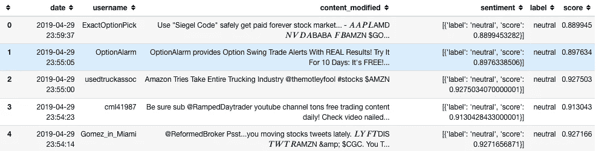**

**表 3**

**分类器给出标签和与该标签相关联的分数。分数意味着分类器对于给定标签的确定性水平。**

**由于中性情绪主导了一年和每个月，我决定只保留积极和消极的情绪。重要的是要记住，中性情绪比其他情绪更频繁，因为许多推文只是广告、价格信息等，并没有给出任何关于美元 AMZN 的真实情绪。**

**在查看每个月的情绪之前，我们先用库 *yfinance* (来自雅虎财经)*观察一下股票的收盘价格演变。***

```
import yfinance as yfamzn_df = yf.download('AMZN',start='2019-01-01',
                      end='2019-12-31',progress=False)
```

**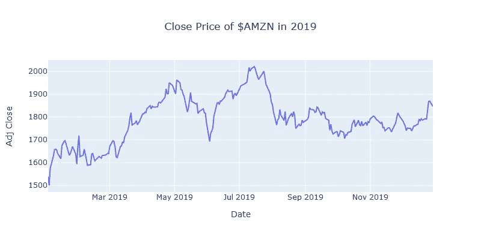**

**图 6**

**股票价格全面上涨，从一月份的 1539 美元涨到年底的 1846 美元。有趣的是观察每月的百分比变化，并将其与之前获得的情绪进行比较。**

**月度百分比变化图如下所示:**

**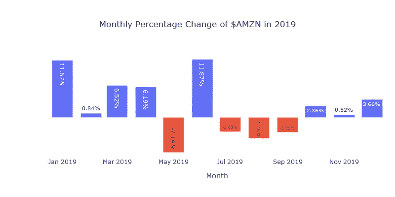**

**图 7**

**整个数据集中的每月情绪是:**

**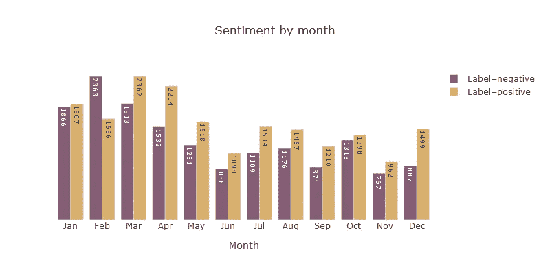**

**图 8**

**正如我们所观察到的，大多数月份在推特上被贴上了积极情绪多于消极情绪的标签。这可以通过亚马逊在 2019 年全年增长 20%的事实来理解。该公司每个季度的业绩都非常好。**

**为了完成我的分析，我决定看看数据集中最有影响力的 Twitter 账户的情绪。我让从*美国消费者新闻与商业频道*到*的 20 名用户面对全国*，观察他们在推特上的情绪。显然，结果导致情绪数据减少，因为$AMZN 推文是特定的。**

```
top20 = AMZNsent.loc[AMZNsent['username'].isin(["CNBC", "Reuters", "ANCALERTS", "MarketWatch", "ReuterBiz", "NYSE", "jimcramer", "om", "YahooFinance", "themotleyfool", "TheStreet", "Stocktwits", "Varneyco","CBOE", "Nasdaq","CNBCnow", "ReutersIndia", "cvpayne", "ValaAshar", "FaceTheNation"])]AMZNsent_b = top20.groupby(['month', 'label', 'month_digit'])['username'].count().reset_index()
AMZNsent_b.columns = ["Month", "Label", 'Month_digit', 'Number']
AMZNsent_b.sort_values(by=['Month_digit'], inplace=True)
```

**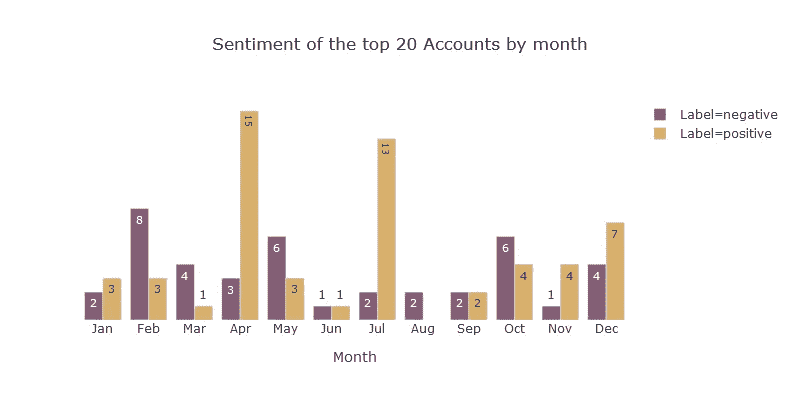**

**图 9**

**有些月份在积极和消极之间有真正的差别。以 4 月份为例，看起来这个月，前 20 名确实看好 AMZN。这个月股票上涨了 6.19%。相反，在 2019 年 7 月，前 20 名也非常乐观，而股票下跌了 2.88%。**

**让我们来看看这几个月前 20 名的推文的一些例子，以了解这一趋势(只有积极的推文)。**

**对于**四月**:**

> ***“方股票自 12 月以来获利 6000 亿美元，‘涨停’两说，专家(via @ trading nation)$ FB $ AMZN $ NFLX $ GOOGL”***
> 
> ******the street:***“Amazon $ AMZN 感觉国际增长不错”***

***七月**:*****

> ********路透社:***“@ Reuters biz 亚马逊运营费用激增 21%第二季度投入 8 亿美元一日送达计划$AMZN”*****
> 
> ********TheStreet:*** “这个称呼似乎让投资者安心。盘后股价下跌约 0.5%。美元锌"*****

# *******结论*******

*****这个项目试图将股票市场和投资者联系起来。显然很难清楚地看到情绪对市场的影响，特别是我使用的数据，因为它只是市场的一小部分，AMZN。每个投资者都不会用 twitter 账户谈论股票，他们也不会在推文中用$AMZN 来谈论股票，所以很明显，我创建的数据集只是开始查看，并不真的期望高质量的分析会带来很好的结果。然而，我能够观察到一些好的东西，如用户描述中最常用的词和推文中最常用的词，这在很大程度上反映了金融市场和这一年中发推的人(“交易员”、“投资者”、“顾问”…)。用一个训练有素的模型来观察金融句子的情感也是一件有趣的事情。这导致观察到整个一年中占主导地位的积极情绪，以及一些消极方面，特别是来自一年中最受关注的客户。*****

*****将 Twitter 或 Reddit 数据与 NLP 模型或其他行为金融学的机器学习算法结合使用，试图了解投资者如何做出决策，这可能会有很多有趣的分析。*****

*****整个分析可在 [GitHub](https://github.com/npogeant/amzn2019) 上获得。*****

*****感谢你阅读这篇文章，希望你喜欢！*****