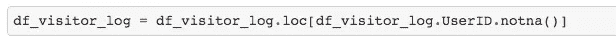
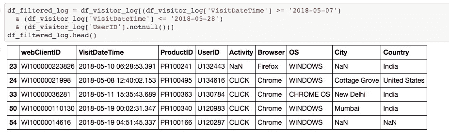

# 数据工程和 ETL 的艺术

> 原文：<https://medium.com/analytics-vidhya/the-art-of-data-engineering-and-etl-3cf9e1c3f6a2?source=collection_archive---------10----------------------->

数据工程是迈向数据科学最关键的第一步。它结合了数据收集和分析部分。你所有的假设和隐藏的趋势都被数据验证了。这很像**与数据对话并得到你的答案**。例如，你问你的糖尿病数据集，“嘿，这种疾病更可能影响男性还是女性？”，而你的好哥们数据总会有答案给你。**总**。

但是，为了让数据成为你的分析伙伴，你需要培养你的数据集，让它成长。通常情况下，需要对数据集执行大量转换。数据插补、识别和纠正异常值、特征工程等等。所有这些收集、清理和转换数据集的过程被称为数据工程，***2021 年的一项需求技能*** 。基本上，在将数据集交给机器学习算法之前，你所做的一切都属于数据工程。

> 最近参加了 2021 年 6 月 Analytics Vidhya 主办的市场特征输入 ETL 大赛。

问题陈述非常简单，可以在电子商务应用程序上生成用户跟踪的输入数据集。提供了两个数据集，包括用户数据集和*用户访问日志数据集*。作为一名数据工程师，我们需要一个新的数据集，其中包含每个用户的一些预定义信息，如他最近的活动、查看的产品、使用的操作系统等。

**用户**

**用户访问日志**

> 预期输入要素数据集

**那么让我们开始…**

好的，从第一眼看，似乎在访问日志中有一行缺少 userID。我的第一个猜测是验证 webClientID，因为它是用户的会话，所以如果某个特定 webClientID 的某些记录中缺少 UserID，UserID 中的 NaN 可以替换为同一组中另一个记录的实际 UserID。基本上，过滤掉缺少 UserID 的行，并研究这些 webClientIDs，看其中是否有 UserID。

*显然，不存在缺少 UserID 的 webClientID。所以我们可以安全地删除缺少 UserID 的行。*

第二步，让我们检查各个列中的数据字符串，如 activity、ProductID 和 OS。我注意到，这些栏目中的情况不一致。例如，OS 包含两个值， *chrome* 和 *CHROME，*或 Activity 两者都有， *click* 和 *CLICK* 。这些列中的数据遵循相同的大小写是至关重要的。

保持各列中案例的一致性

第三步，**总是将数据集中的日期/时间列转换为 python datetime 实例。**所以让我们将 VisitDateTime 转换为 python 日期。现在，该列中有两种日期格式，UNIX 格式和 UTC 格式。这些需要保持一致。

> 根据问题陈述，“在当前情况下，您应该在 2018 年 5 月 28 日生成输入要素集。所以，访客表是从 2018 年 5 月 7 日到 2018 年 5 月 27 日。”

过滤 5 月 7 日至 5 月 28 日之间的数据

让我们开始创建我们的最终数据集。

最后一步，对于数据集中的每个用户，让我们计算所有这些必需的特征！！

*让我一步一步地向你介绍这个练习的核心。*

1.  根据用户标识过滤掉用户日志
2.  对于 NaN 活动，使用“页面加载”进行估算，或根据本栏的模式进行“点击”。出于演示目的，我硬编码为“页面加载”。
3.  要估算缺失 ProductID 中的值，请使用 value_counts()来确定值的频率，并使用具有最多计数的 ProductID。
4.  对于缺少的 VisitDateTime，再次使用用户使用 value_counts()访问最多的日期
5.  过滤掉 7 天的日志，获得唯一日期的长度(不是时间)
6.  过滤掉 15 天的日志并获得唯一产品 ID 的长度
7.  要确定用户年份，请计算注册日期和 5 月 28 日之间的差异。
8.  要获得 15 天内查看次数最多的产品，请使用 15 天过滤日志中 ProductID 上的 value_counts()并获得最高频率的 ProductID
9.  对于最活跃的操作系统，在日志中对操作系统使用 value_counts()并获取频率最高的操作系统
10.  要获得最近查看的产品，请使用活动页面加载过滤日志，按 VisitDateTime 排序，并选择出现的第一个 ProductID。
11.  最后，要计算最近 7 天的页面加载和点击，请分别过滤最近 7 天的活动页面加载和点击日志。

这段代码帮助我在比赛中达到了 **93%的准确率**！！！耶！！

总之，您需要向您的合作伙伴(数据)提出正确的问题，以发掘其潜力。这种艺术是一名优秀数据工程师的突出特征。在这个数据集中仍有许多数据工程可以完成，例如用户查看的产品类型，他是在晚上还是白天更活跃，使用移动设备还是桌面设备，哪个国家的电子商务应用程序产生的业务最多，等等……你能在多大程度上利用你的数据取决于你。你对你的数据精心呵护，让它不断增长，它给你带来的故事就越多。**通过数据工程，努力成为一名数据说书人！**

在这里查看我的完整实现

[https://github . com/harnoor 96/DS-and-ML/blob/master/Marketing % 20 features % 20 ETL % 20-Analytics % 20 vid hya % 20(202021 年 6 月)/market place _ Feature _ table . ipynb](https://github.com/harnoor96/DS-and-ML/blob/master/Marketing%20Features%20ETL%20-Analytics%20Vidhya%20(June%202021)/Marketplace_Feature_Table.ipynb)

现在，为了将来的工作，可以使用类和方法以 OOPS 格式编写代码。此外，可以取消日期的硬编码。

*那都是乡亲们！*