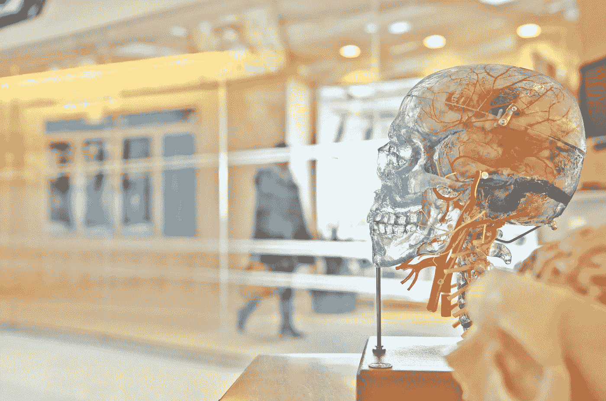

# 学习的艺术—介绍机器学习#1

> 原文：<https://medium.com/analytics-vidhya/the-art-of-learning-introducing-machine-learning-1-ea572c160856?source=collection_archive---------11----------------------->

## 学习本身的研究

欢迎来到学习的艺术系列。这是一个非技术性系列，重点是提供对机器学习的概念性理解。这个系列强调了机器学习是如何简单地学习的。

[杰西·奥里科在 Unsplash 上拍摄的照片](https://unsplash.com/photos/rmWtVQN5RzU)

# 介绍