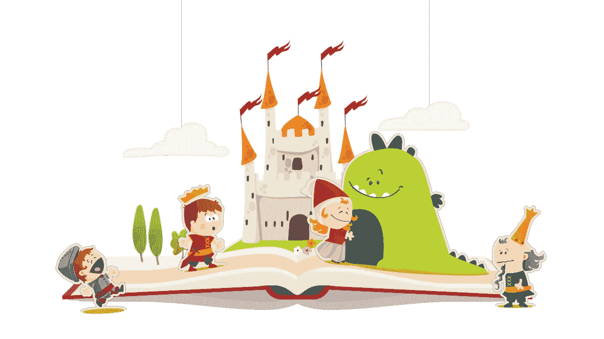
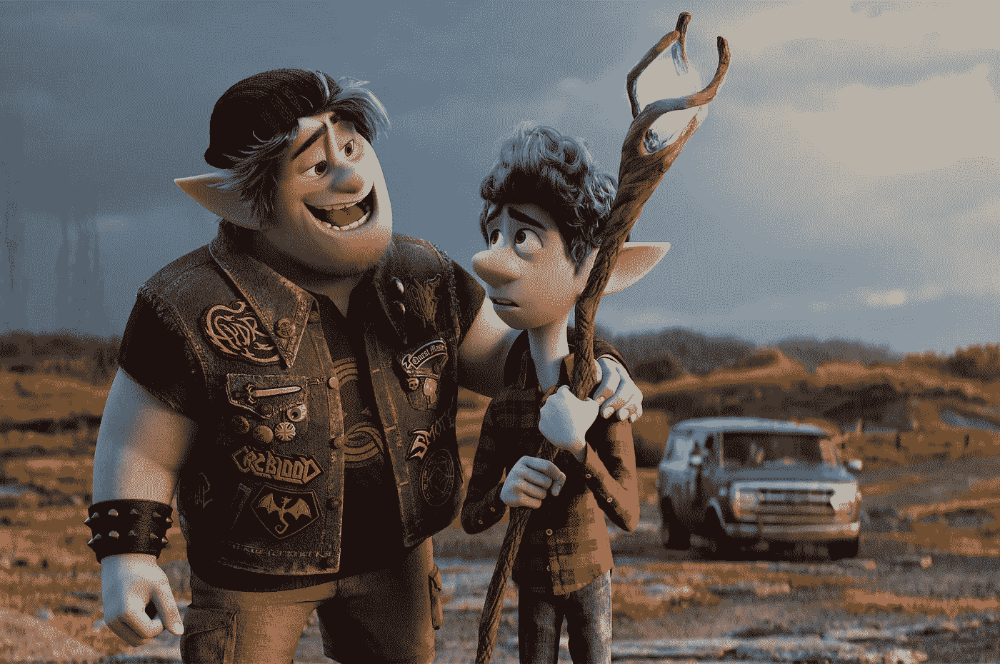
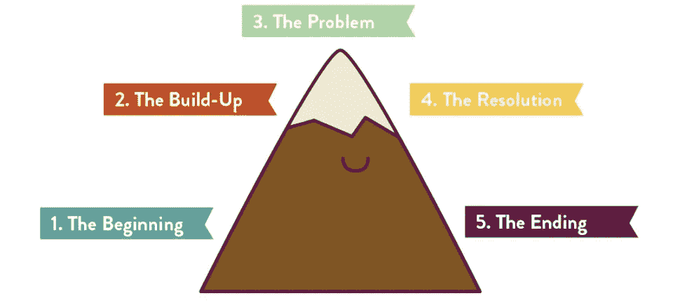
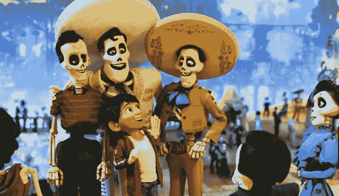

# 用数据讲述视觉故事的艺术

> 原文：<https://medium.com/analytics-vidhya/the-art-of-visual-storytelling-with-data-95b51398c298?source=collection_archive---------10----------------------->

图片鸣谢:[https://www . source con . com/the-power-and-importance-of-storying-in-recruiting/](https://www.sourcecon.com/the-power-and-importance-of-storytelling-in-recruitment/)

很久很久以前，在一个很远很远的地方，有很多人不了解的神奇物品，叫做 ***【数据】*** 。在同一片遥远的土地上，住着一个名叫“S ***toryteller*** 的少年，他在青春中展露，他在秘密地揭开“数据”背后的神奇奥秘。

在我一次访问这片神奇的土地时，我得到了一个难得的机会和这个“讲故事”的男孩聊一会儿。我将与你分享他在“用数据讲视觉故事”上告诉我的那些顶级魔法秘密。不信任我？这是他给我讲故事的照片。(偷拍)。

讲故事的男孩告诉我这个故事。我穿着红色的衣服

他在说…

“讲故事”，我们已经知道了几代人。我妈给我讲故事，她妈给她讲故事等等。所以讲故事是我们所有人都能够做到的。但是*用数据讲述视觉故事*是我们需要熟悉的。数据是下一个燃料，用数据讲故事已经成为现代艺术的方式！！我们必须想象我们自己的蒙娜丽莎！！！

讲故事可以是一个迷因，一部纪录片，一个抖音视频，一个信息图，一个完整的网站，一个 Instagram 故事或任何其他东西。应该重点关注的主要是**目标受众**、故事的**流程**以及**在故事内部对可视化技术**的高效运用。我将视觉故事的精髓总结为以下 5 个神奇的部分。

1.  少说话，多视觉效果，关注上下文

图片致谢:[如何利用视觉叙事营销赢得更多线索(optinmonster.com)](https://optinmonster.com/visual-storytelling-marketing/)

让视觉代表你说话。作为一个有数据的讲故事者，你首先应该做的是，很好地理解你的背景和你的听众。想象你自己在观众中，从观众的角度看你自己的视觉效果，你自己的故事。背景是“你将在哪里落地这个故事”。你选择的字体、颜色、是否使用 3D 可视化、高亮、视觉交互性和所有其他方法都应该取决于上下文。一个错误的视觉很容易迷惑观众。这会在他们的脑海中建立一个完全不同的故事。

**2。探索和总结你的数据**

图片来源:[328 Christopher Columbus Explorer 插图&剪贴画-iStock(istockphoto.com)](https://www.istockphoto.com/illustrations/christopher-columbus-explorer)

一个讲故事的人应该对要可视化的数据有一个正确的理解。总结和探索这些数据将有助于更好地理解如何在故事流程中将视觉效果放置在正确的位置。它将帮助讲故事的人从数据中提取最重要的见解，以便向观众突出显示。故事有两种。基于作者和基于观众。在现代社会，许多人不会关注作者的故事。每个人都想成为自己故事中的英雄！所以请记住以最简单的方式给观众最好的东西。

**3。使用相关、适当的图表和视觉材料**

图片来源:[数据工作室仪表盘 Kickass 服务。100%个性化。(kpis.studio)](https://kpis.studio/)

如果你喜欢用数据讲故事，这是你应该有信心掌握的最重要的技能之一。选择合适的图表和与你的数据相匹配的可视化将有助于一个可视化的故事讲述者吸引更多的观众。它将以一种非常简单的方式传达最重要的见解。除了我们日常使用的普通图表类型，还有许多其他类型的可视化，我们可以使用它们来有效地突出我们的数据故事。始终专注于保持你的视觉效果简单和更有趣！

参考:[如何为您的数据选择最佳图表类型—拍卖](https://venngage.com/blog/how-to-choose-the-best-charts-for-your-infographic/?utm_source=Youtube&utm_content=youtube113)

**4。保持故事的连贯性**

图片来源:[故事山——儿童识字和瑜伽——流动和成长儿童瑜伽](https://flowandgrowkidsyoga.com/blogs/news/story-mountain-writing-yoga)

一个讲故事的人不应该通过复制数据来想象同一个故事。一个故事要精心策划，精心组织。它应该专注于传达其数据背后的故事，开头可爱，中间可爱，结尾可爱。我个人的建议是一开始就把重点放在比较有趣的部分。这会让观众对你的故事更感兴趣，更专注。那些见解，文字，解释，你觉得无聊但很重要的东西，放在故事线中间。恰当地使用形象化和使用形象化的隐喻在这个阶段会有很大的帮助，让观众更加活跃和被吸引。一部分一部分地构建故事，用一些令人惊讶的东西来结束你的故事，一些观众可以带回家的东西！

**5。给观众一个惊喜，完成你的故事**

图片来源:【harpersbazaar.com 35 部最佳剧情转折电影——结局出人意料的电影

不说一个故事就等于没有完成你的故事！！！一个强有力的结尾就像一个魔术，会让观众“哦！哇！!"。在讲故事的最后，总结你想与观众分享的最重要的信息。给观众带些东西回家。如果你在推销某种产品、建议等，它可能是一个信息、一堂课、一个报价或折扣。给他们一些东西来记住这个故事。 ***“你的观众记住你的故事”*** 是一个讲故事的人能获得的主要成就之一。“所以这里有些东西你可以带回家”他说…

永恒幸福的一份

喜欢这篇文章吗？

在 LinkedIn 上找到我: [Kanishka Randunu | LinkedIn](https://www.linkedin.com/in/kanishkarandunu/)