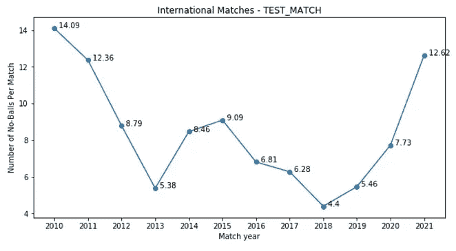
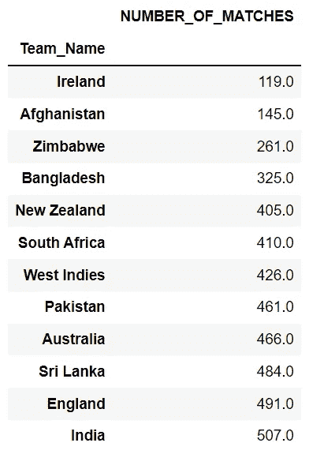
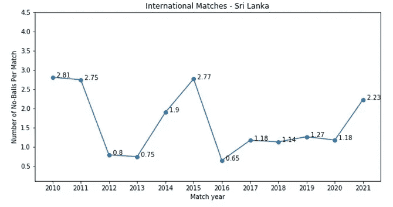

# 板球无球赛案例——数据科学(上)

> 原文：<https://medium.com/analytics-vidhya/the-casebook-of-no-balls-in-cricket-data-science-part-1-37e9c1a67653?source=collection_archive---------8----------------------->

本指南适用于任何对板球或数据科学/分析感兴趣的人。如果你对这两个话题都感兴趣，那么你和我一样，也有同样的苦恼。或者你像我一样生活在印度；很有可能你不喜欢板球。尽管如此，你还是要读完它。

Alessandro Bogliari 在 [Unsplash](https://unsplash.com/s/photos/cricket?utm_source=unsplash&utm_medium=referral&utm_content=creditCopyText) 上的照片

许多像我和我一样的人目睹了越来越多的**无球和掉接球(下一篇文章)。**

一些值得注意的问题:

**到底是我们的想象还是真的发生了？**

**这是一种重复出现的现象，还是我们之前没有注意到的现象，还是一个特例？**

**哪种赛制(ODI、T20、测试赛)或联赛(BBL、IPL、PSL、CPL)受其影响最大/最小？**

**哪些国家受此影响最大/最小？**

> **游戏的不同利益相关者对此可能会有不同的反应，我不是来伤害任何人的感情的。尽管如此，作为一名数据科学爱好者，我的目标是用数据揭示那些用其他方式看不到的事实。**

# 数据

这里使用的数据集类似于我在**[***Kaggle***](https://www.kaggle.com/raghuvansht/cricket-scorecard-and-commentary-dataset)**(下载并上传投票)*上发布的一个。唯一的区别是覆盖的匹配的数量。Kaggle 上的数据集涵盖了 1400 多个匹配，而我的涵盖了 4000 多个匹配。***

*** [## 板球记分卡和评论数据集

### 2017 年 ODI、Test、T20、IPL、BBL、PSL 的比赛记分卡和解说数据。

www.kaggle.com](https://www.kaggle.com/raghuvansht/cricket-scorecard-and-commentary-dataset) 

**理解数据**
"**INTERNATIONAL _ Match . CSV**"每场比赛包含一行，并且包含每场比赛的表面数据，即**球队名称、每支球队的唯一 ID、场地、场地唯一 ID、比赛日期、比赛结果**以及最重要的"**比赛编号**"。该编号与记分卡文件和注释文件相匹配。

“**击球**文件夹包含击球记分卡 CSV 文件。击球文件夹中每个文件的名称都命名为“ **XX_ *击球* SCORECARD.csv** ”，其中“ **XX** ”为“**比赛号**”。
“**BOWLING**”文件夹包含 bowling scorecard CSV 文件。Bowling 文件夹中每个文件的名称都命名为“**XX _*Bowling*score card . CSV**”，其中“ **XX** ”是“**比赛号**”。

“**解说 _ *国际 _* 比赛**”文件夹包含逐球解说 CSV 文件。解说文件夹中每个文件的名称都命名为“ **XX_COMMENTARY.csv** ”，其中“ **XX** ”为“**匹配号**”。

让我们通过一个例子来理解这个结构:
中的一行"**国际 *MATCH.csv*** *"文件包含的比赛编号为"***12345***文件夹中的该击球记分卡 csv 文件将被命名为"****1235 保龄球记分卡 csv 文件将在"* ***保龄球*** *"文件夹中命名为"* ***12345_* 保龄球*记分卡. csv*** *"，而解说 CSV 文件将在"解说 _* INTL_ *比赛"中命名为"*****

****该数据集涵盖了不同国际赛事和联赛的不同年份:****

******国际比赛(测试赛，ODI 和 T20 国际)**:‘2010’到‘2021’。这些比赛涵盖了部分球队**、【新西兰】、【澳大利亚】、【印度】、【南非】、【阿富汗】、【孟加拉国】、【斯里兰卡】、【西印度群岛】、【巴基斯坦】、【英格兰】、**和**、【爱尔兰】、**。****

****印度超级联赛(IPL):‘2010’到‘2021’****

******大痛击联盟(BBL): '** 2011/12 '至' 2020/21 '****

******巴超联赛(PSL)**:‘2015/16’至‘2021’****

****加勒比超级联赛(CPL):‘2013’到‘2020’****

****数据集最后一次更新是在 IST 时间 8 月 4 日 7:03。不包括 CPL 2021 的数据。****

> ****我使用了每场比赛的无球数作为可视化的默认图表。****

## ******2010-2021 年国际板球无球数******

****************

****2010 年至 2021 年每场比赛无球数的数据和可视化****

****在上面的可视化中，数据仅来自**测试、ODI 和 T20 国际比赛。**当我第一次看到图表时，除了预期的结果，如 2020 年和 2021 年的高数字，我还目睹了意外的结果，如 2010 年和 2011 年的高数字。****

********

****每场比赛无球数的百分比变化——Raghuvansh tah LAN****

****最初，我怀疑有相当数量的无球被投球，我可以证实这一点，但我怀疑是因为 2018 年和 2019 年的无球被投球的数量较少。从 2019 年到 2020 年，无球人数增加了 **49%** ，从 2020 年到 2021 年增加了 66%。与 2019 年至 2021 年 147%的增幅相比，这些数字并不那么令人震惊。一个可能的原因是新冠肺炎，那里的保龄球员失去了联系，但自从板球恢复以来已经过去了很长时间。****

****另一件要注意的事情是 2010 年每场比赛意外的无球数，也许这个数字在 2009 年会更多，但这个数据是不可用的。也许更多的数据会是有益的。在此之前，这一高数字的原因仍不得而知。****

************************

****分别可视化 T20I、ODI 和测试比赛——Raghuvansh tah LAN****

****当比较 ODI，Test 和 T20 比赛中每场比赛的无球数时，我发现了一些有趣的事情。ODI 和测试赛的折线图在结构上是相似的，类似于使用所有国际比赛数据的折线图。T20 比赛的线图不同，因为它在 2019 年和 2021 年的每场比赛中没有出现巨大的无球数峰值。这可能是由于较短的格式和较低的分数，这是受无球和自由击球的影响。****

## ****比较团队——找出受影响最小和最大的团队****

********

****一个队参加的比赛次数——Raghuvansh tah LAN****

****我使用的数据集有 12 支球队的数据，但为了限制图表的数量，我选择了 2010 年至 2021 年间参加国际比赛次数最多的 8 支球队。这导致了球队的选择**、【纽西兰】、【澳洲】、【印度】、【南非】、【斯里兰卡】、【西印度群岛】、【巴基斯坦】和【英国】。**一个值得注意的事实是，在过去十年里，印度比新西兰多打了大约 100 场比赛。为了使所有图表相互比较，y 轴保持不变。****

********

****过去十年每场比赛的无球数— Raghuvansh Tahlan****

******一个球队每场比赛的无球数是 2010-2021 年该队无球数和比赛数的** **除。******

****英格兰人数最少，紧随其后的是新西兰。与此同时，西印度群岛的得分最高，与倒数第二名的巴基斯坦队差距显著。****

****************

****英格兰的图表看起来像是任何球队的梦想图表，这些球队在 2018 年都是低值和最小值。2018 年到 2019 年数值有一个突增，但数值也在正常范围内。****

****************************************

****印度、巴基斯坦和斯里兰卡的值在接近的范围内，这也描绘在他们各自的图表中。三支球队的图表都类似于一个“ **W** ”。开始和结束时的峰值以及其间的高值。三支队伍一个值得注意的共同事实是，他们都来自次大陆，地理位置接近。****

********

****所有的图表看起来都不同，但是一个共同的特征可能与许多团队相关联。几乎所有的图表都有一年在十年的中间，这有一个来自其相邻年份的特别高的值。从 2013 年到 2017 年的 5 年，2015 年有 3 个团队有那个高值，2016 年有 3 个团队有那个高值。这不是很有希望，但更深入的研究可能会产生好的结果。****

****本系列的这一部分到此结束，但这并不是结束。在接下来的部分，我们将比较这些图表和这些年来每个队的胜率。我们还将关注不同的保龄球员，以及他们如何在国际和国内层面上为这些价值观做出贡献。我们也没有机会根据每场比赛的无球数来分析不同的联赛(IPL，BBL，PSL 和 CPL)及其球队。****

****另一篇文章将很快介绍本系列文章的 Python 逻辑和代码，特别是针对数据科学爱好者和程序员。****

****我希望你们都喜欢这篇文章。在 [***LinkedIn***](https://www.linkedin.com/in/raghuvansh-tahlan/) 上联系我。****

**** [## raghuvansh tah LAN-Guru Gobind Singh Indraprastha 大学-新德里，德里，印度| LinkedIn

### 我在北印度工程学院学习 B. Tech(计算机科学工程)

www.linkedin.com](https://www.linkedin.com/in/raghuvansh-tahlan/)*******