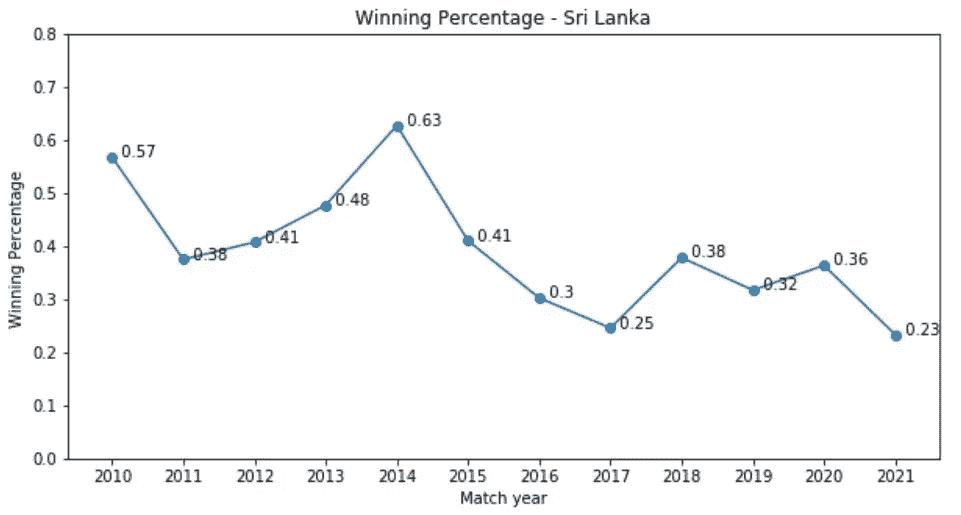
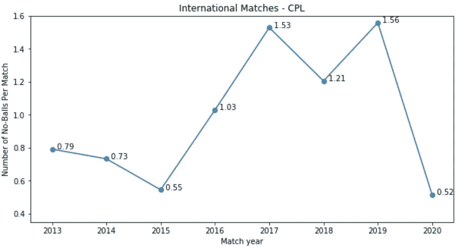

# 板球无球赛案例——数据科学(下)

> 原文：<https://medium.com/analytics-vidhya/the-casebook-of-no-balls-in-cricket-data-science-part-2-a880e53f5122?source=collection_archive---------5----------------------->

在本系列文章的第 1 部分中，我们从问几个问题开始，到最后，我们已经有了一些问题的答案，但是还有一些问题。所以在这篇文章中，我们从我们离开的地方开始分析这些年来无球对球队胜率的**影响，各种联赛的无球分析和球队的球员分析。**

# 概述

**2010-2021 年国际板球无球数**

最初，我们只是怀疑无球人数有所增加，但数据证实了我们的假设。从 2019 年到 2020 年，无球人数增加了 **49%** ，从 2020 年到 2021 年增加了 66%。与 2019 年至 2021 年 147%的增幅相比，这些数字并不那么令人震惊。有趣的是，我们发现 2010 年每场比赛都有令人惊讶的无球数，也许这个数字在 2009 年会更多，但是这个数据是不可获得的。

所有国际格式都受到同等影响吗？

我们发现，比赛的最短形式，即 **T20** 国际比赛，受影响最小，从 2019 年(0.79)到 2021 年(0.86)，无球数仅增加 **9%。与其他格式(即 Test Cricket 和 ODI)相比，这个数字似乎更有趣。 **ODI 和**国际测试赛的无球赛分别增加了 **120%** 和 **131%** 。这种行为可以归因于较短的格式和较低的得分，这是受无球和自由击球的影响。**

**基于过去十年无球数的球队表现**

一支球队每场比赛的无球数是 2010 年至 2021 年该队无球数与比赛场次的除法。

英格兰人数最少，紧随其后的是新西兰。与此同时，西印度群岛的得分最高，与倒数第二名的巴基斯坦队差距显著。

所有团队的图表看起来都不同，但是一个共同的特征可能与许多团队相关联。几乎所有的图表都有一年在十年的中间，这有一个来自其相邻年份的异常高的值。从 2013 年到 2017 年这五年，2015 年有 3 个团队增值，2016 年有 3 个团队增值。

总结结束

## **寻找受影响最小和最大的团队**

大多数团队都受到这种现象的影响，但有些团队受到的影响比其他团队更大。为了比较各组，我们找到“**PERCENTAGE _ INCREASE _ 2019 _ max(2020，2021)”、**2019 年的**值与 2020 年和 2021 年每场比赛无球数的两个值的**最大值之间的百分比增量。****

结果相当令人震惊，更令人惊讶的是受影响最小和最大的团队之间的差异。受影响最小的车队**英格兰**的增幅仅为 **18%** (从 1.18 到 1.40) **，**而受影响最大的车队**印度**的增幅高达 **823%** (从 0.48 到 4.40) **。**这种意想不到的显著差异也是因为，2019 年印度的数值是英格兰的一半，2021 年印度的数值是英格兰的三倍。

## **每场比赛无球数对胜率的影响**

[*皮尔逊相关系数*](https://en.wikipedia.org/wiki/Pearson_correlation_coefficient) 可以作为一个起点指标，如果它显示出潜力，像因果分析这样的进一步研究就值得一试。看一下各队的胜率就能知道他们的总体表现。仔细查看斯里兰卡和西印度群岛的海图，并评论你的发现。

左英格兰、中印度和右新西兰的胜率

巴基斯坦和南非的胜率

左斯里兰卡和右西印度群岛的胜率

皮尔逊相关值将始终保持在-1 和 1 之间。接近 0 的值，无论是正数还是负数，都表示两个变量互不影响。

负相关或逆相关是指两个变量的值通常以彼此相反的方向移动，就像一个增加，另一个减少，反之亦然。

正相关是两个变量之间的关系，其中两个变量一前一后移动，也就是说，在同一个方向上。当一个变量随着另一个变量的减少而减少，或者一个变量增加而另一个变量进一步增加时，正相关存在。

胜率和无球之间的关系

英国、新西兰、巴基斯坦和南非的皮尔逊相关值相对较小，而澳大利亚、印度、斯里兰卡和西印度群岛的皮尔逊相关值相对较高。人们可以进一步深入分析，但也有可能是巧合。

## 比较 IPL、BBL、CPL 和 PSL

左 BBL 和右 CPL |照片由 Raghuvansh Tahlan 拍摄

左 IPL 和右 PSL | Raghuvansh Tahlan 摄影

初看起来，PSL 这些年一直很稳定，CPL 是最不稳定的。我们可以分析每一个联赛，但现在是我们探索球员的时候了。我们从国际比赛的球员开始，即 ODI，T20 和测试赛。由于我们不能只比较数字，我们将使用一个 KPI，称为**每场投球无球数**或**每场比赛无球数**，类似于我们用来比较不同球队的 KPI。

****每投球无球数被定义为无球数除以投球手/运动员投球数。****

****每场比赛的无球数定义为投球手/球员投球的无球数除以比赛次数。****

## ****每次投球的最大无球数****

**简单地比较数值可能会产生误导，因为不是每个人都参加了相同数量的比赛。因此，首先，我们将所有 824 名玩家分为四类**‘Q1’，‘Q2’，‘Q3’，‘Q4’，**，每类由 206 名玩家组成，这取决于投球的数量。为了简单起见，我选择了四个类别；这可以通过选择更低或更高。**

********

**左为 Q1，右为 Q2**

**分类为**、【Q1】、**、【Q2】、**的玩家不一定是保龄球手；他们可以是击球手或兼职者。评论他们是不公平的；这就是我的感觉。****

********

**左 Q3 和右 Q4 | Raghuvansh 拍摄的照片**

**“Q3”和“Q4”的玩家是保龄球手。尽管如此，他们中的大多数已经停止比赛，这表明要么现在的保龄球手不打那么多无球(分子)，要么他们打了很多比赛，所以投球的数量更高(分母)。一项年度分析可能有助于找出答案。**

## **每次投球的最小无球数**

**无球数不能少于 0，所以从所有投了 0 个无球的球员开始，找出投了最多球的球员。**

********

**左 Q1 和右 Q2 —最少| Raghuvansh 摄影**

**不出所料，来自 Q1 和 Q2 的玩家主要是兼职玩家。尽管如此，还是要为他们欢呼，因为他们没有打出一个无球赛。**

********

**左 Q3 和右 Q4 最小| Raghuvansh 拍摄**

**这才是真正的交易——那些投了很多球却没有投出一个无球的球员。站在领奖台上的选手是穆罕默德·哈菲兹。在他投出的 10410 个球中，他没有投出一个无球。他代表巴基斯坦，这支球队多年来培养出了优秀的步行者，如**舒艾卜·阿赫塔尔、瓦卡尔·尤尼斯、瓦西姆·阿克兰**等。尽管如此，这一壮举也是值得骄傲的。我还想提一下，这个分析只是一个表面的，应该做更多的调查才能得出什么结论。**

**这种分析可能是一个永无止境的过程，使用不同的 KPI，使用更短或更长的时间框架或不同的联盟，但那是以后的事了。我想现在就结束这个系列(也许以后)，或者转移到可视化的技术方面。我想感谢所有一直在阅读和支持我的人。**

**我希望你们都喜欢这篇文章。在 [***LinkedIn***](https://www.linkedin.com/in/raghuvansh-tahlan/) 上随时联系我。**

** [## raghuvansh tah LAN-Guru Gobind Singh Indraprastha 英国英格兰考文垂大学|…

### 我正在攻读华威大学的数据分析硕士学位。我已经完成了计算机科学工程…

www.linkedin.com](https://www.linkedin.com/in/raghuvansh-tahlan/)**