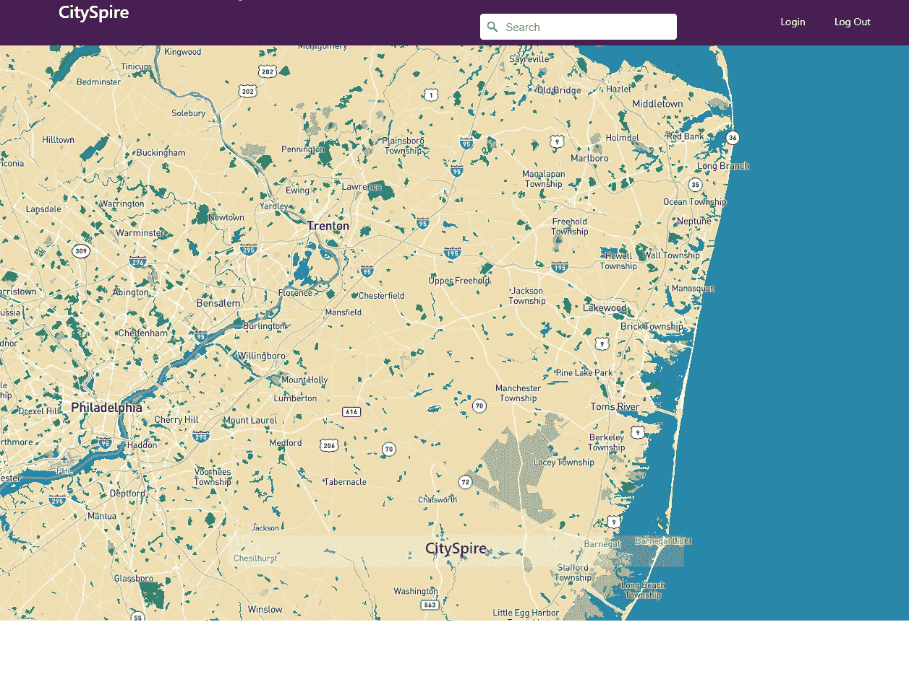

# 城市塔尖体验

> 原文：<https://medium.com/analytics-vidhya/the-cityspire-experience-588ec2198d9d?source=collection_archive---------18----------------------->

## 起跑线



我在高中选修的一门课之外唯一的编程经验是在 Lambda 学校的时候。Lambda School 是一个数据科学/编码训练营，在那里他们模拟行业中的真实工作环境，为你从事软件工程职业做准备。当我在 Lambda 学校的时候，我们被指示创建一个应用程序，一旦用户输入了城市的位置，这个应用程序就会将城市的度量返回给用户。我们的目标是为用户创建一站式资源，以接收最准确的城市信息。这就是 CitySpire 的用武之地；我们的应用程序将返回未来 12 个月的预计租金、该地区的犯罪率(分为暴力犯罪和财产犯罪)、该地区的步行指数、人口规模以及该地区与全国平均水平相比的生活成本。我对此有很多担忧，因为我们有很多方法可以应对这一挑战，而且在处理这一问题时，很多事情都可能出错。其中一个问题是决定我将使用什么样的模型进行预测。最终，我选择使用 FBprophet 库中的 Prophet 模型进行预训练，而不是从头开始训练模型。这样做的好处是 Prophet 已经根据季节变化进行了调整，并且对 NaN 值非常稳健。

## 挑战

我和我的团队面临的挑战之一是找到我们可以使用的数据。我和我的团队遇到的一些数据集有很多有用的信息，但我们没有办法将它们索引到我们所有的其他数据集。出现这种情况的原因之一是因为数据集缺少一个我们可以用来关联其他数据集的特征。我们克服这个问题的一个方法就是简单地找到另一个数据集。有一些我们能够使用，因为我们能够对其执行一些特征工程，以便我们在所有数据集之间有匹配的特征。

[](https://github.com/Lambda-School-Labs/cityspire-b-ds/tree/main/data/raw) [## lambda-学校-实验室/城市塔-b-ds

### 这是 City Spire b .-Lambda-School-Labs/City Spire-b-ds 的数据科学库

github.com](https://github.com/Lambda-School-Labs/cityspire-b-ds/tree/main/data/raw) 

我们面临的另一个挑战是利用 FBProphet 库中的 Prophet 模型。作为一个团队，我们决定使用 Pipenv 作为我们的环境变量，因为每个人都熟悉它，并且它可以很容易地在每个人的本地机器上复制。然而问题是 FBProphet 库无论如何都不是 pip 友好的。因为我决定在我们的项目中使用 Prophet 模型，所以我必须做出选择。要么我想办法让 Prophet 在我这边本地工作并创建一个临时缺口，要么我必须从头开始训练一个新模型并完全放弃 Prophet 模型。这两种方法各有利弊。如果我要从头开始训练一个模型，我将不得不缩小和清理我们的数据集，甚至更简单，因为我们在模型应该处理的数据上有相当大量的 NaN 值。这样做的好处是，它允许我的团队中的每个人都可以利用该模型，而不用担心丢失特定库中的包。

[](https://facebook.github.io/prophet/docs/installation.html) [## 装置

### Prophet 有两个实现:R 和 Python。请注意 Python 包的名称略有不同。先知是一个…

facebook.github.io](https://facebook.github.io/prophet/docs/installation.html) 

而不是通过进一步清理我们的数据集来丢失宝贵的信息。我选择使用 stop gap 方法，因为它在技术上可以使我们的应用程序更快，因为结果已经预先生成，我们所要做的就是创建一个方法来从我们的数据库中提取数据。为了实现这一点，我必须使用以下代码行来 Conda 安装 FBProphet 包，而不是 Pip 安装:

```
# Make sure you update all your base packages beforehand first.
conda update --all
conda install -c anaconda ephem
conda install -c conda-forge pystan
conda install -c conda-forge fbprophet
```

停止间隙的实际创建比 3 行代码稍微复杂一些。我必须重新格式化我们的数据集，以便 Prophet 模型能够接收数据来生成预测。然后，我必须将我们的预测与我们的原始数据集合并，这样我们就可以显示当年以及未来 12 个月的租赁价格。整个过程需要大约 5-6 个小时完成，其中大部分时间用于模型接收数据和生成预测。

```
**from** **fbprophet** **import** Prophet
**for** x **in** range(2263):
    df1 = rent3.loc[rent3['index'] == x][['ds', 'yhat']]
    df2 = rent3.loc[rent3['index'] == x][['RegionID', 'RegionName', 'SizeRank', 'MsaName']]
    df1.columns = ['ds','y']
    df1['ds'] = pd.to_datetime(df1['ds'])
    m = Prophet(interval_width=.95)
    m.fit(df1)
    future = m.make_future_dataframe(freq='MS', periods=12)
    forecast = m.predict(future)
    predictions = forecast[['ds', 'yhat']]
    predictions['yhat'] = predictions.yhat.round()
    predictions['RegionID'] = df2['RegionID'].iloc[0]
    predictions['RegionName'] = df2['RegionName'].iloc[0]
    predictions['SizeRank'] = df2['SizeRank'].iloc[0]
    predictions['MsaName'] = df2['MsaName'].iloc[0]
    predictions = predictions[['RegionID', 'RegionName', 'SizeRank', 'MsaName', 'ds', 'yhat']]
    predictions.to_csv('zip_predictions.csv', mode='a', index=**False**)
```

创建停止间隙后，我们只需创建一个方法来获取已经存储在数据库中的信息:

```
def fetch_zip_rent():# List of all months in 2020 and 2021rent_dates = [‘2020–01–01’, ‘2020–02–01’, ‘2020–03–01’, ‘2020–04–01’, ‘2020–05–01’, ‘2020–06–01’, ‘2020–07–01’, ‘2020–08–01’, ‘2020–09–01’, ‘2020–10–01’, ‘2020–11–01’, ‘2020–12–01’, ‘2021–01–01’, ‘2021–02–01’, ‘2021–03–01’, ‘2021–04–01’, ‘2021–05–01’, ‘2021–06–01’, ‘2021–07–01’, ‘2021–08–01’, ‘2021–09–01’, ‘2021–10–01’, ‘2021–11–01’, ‘2021–12–01’]# First attempt to fetch 1 record from fetch_zip_rent table with only ZIPcode valuesSQL = f’’’SELECT “{‘“, “‘.join(rent_dates)}” FROM zip_rent WHERE “RegionName” = ‘{ZIPcode}’;’’’ results = list(conn.execute(SQL)) if len(results) == 1: return {key: value for key, value in list(zip(rent_dates, results[0]))}# Next attempt to fetch 1 record from zip_rent table with only City and State valuesSQL = f’’’SELECT “{‘“, “‘.join(rent_dates)}” FROM zip_rent WHERE “MsaName” = ‘{city+”, “+state}’;’’’ results = list(conn.execute(SQL)) if len(results) == 1: return {key: value for key, value in list(zip(rent_dates, results[0]))}# Finally attempt to fetch 1 record from zip_rent table with City and State and ZIPcode valuesSQL = f’’’SELECT “{‘“, “‘.join(rent_dates)}” FROM zip_rent WHERE “MsaName” = ‘{city+”, “+state}’ AND “RegionName” = ‘{ZIPcode}’’;’’’ if len(results) == 1: return {key: value for key, value in list(zip(rent_dates, results[0]))}# If the above fails then return Nonereturn None
```

## 该产品

我们产品的最终结果是一款满足利益相关者期望的应用。尽管它没有我们想象的那么宏伟。它返回与用户在这类应用程序中想要的相关的所有城市指标。我们的前端和后端 web 开发人员制作了一个令人惊叹的用户界面，其中包括我们应用程序的地图组件以及收藏夹，允许任何用户保存他们感兴趣的特定位置。这使得我们的应用程序为用户提供了更多的视觉效果，同时也为用户提供了记录他们最喜欢的搜索的功能。总的来说，我们的应用功能包括:

租赁价格(当前和未来)

犯罪率(暴力犯罪和财产犯罪)

群体大小

步行能力得分

生活费用

地图

收藏夹选项卡

数据科学 API 演示

截至目前，我们的应用程序是功能性的，它的工作是为任何潜在用户提供美国任何地方最重要的指标。然而，我们的应用程序仍有很大的改进空间。用于生成预测的 Prophet 模型可以进一步优化，以产生更准确的结果。我们还可以实现额外的功能，如空气质量和每个位置的 COVID 病例数。我所看到的实现这些的技术挑战将类似于我们在创建这个应用程序之初所经历的。因此，很难找到合适的数据，清理和设计数据，使其符合我们的模型，并确保您的应用程序有正确的环境变量。我从同事那里得到的一些反馈促使我有了更好的文档。这样，他们就更容易理解我想要达到的目标，这将有助于以后的扩展。这个项目教会了我很多东西，也让我对这个领域有了一个大致的了解。虽然我主要是这项任务的机器学习工程师，但我学到了从头到尾创建一个功能性应用程序的过程。这是一次宝贵的学习经历，我所共事的团队的确非常出色。