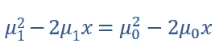

# 经典贝叶斯分类器:连续单变量情况

> 原文：<https://medium.com/analytics-vidhya/the-classical-bayesian-classifier-continuous-uni-variate-case-cfbe902ac828?source=collection_archive---------3----------------------->

当我说经典贝叶斯分类器时，我本质上是在避免众所周知的*朴素贝叶斯的*分类器。两者之间的区别是，天真的版本假设预测的独立性，而另一个没有这样的保留。然而，在单变量的情况下，独立性的讨论是不必要的，因为只有一个预测。

> 单变量情况假设在训练数据集中只有一个预测变量。

考虑数据集，它有一个预测变量“权重”和一个响应变量“响应”。响应变量可以包含值“成人”或“儿童”。另一方面，权重变量是一个连续变量，可以保存(0，∞)范围内的值。

让我们仅模拟 20 个值的权重变量，使其以权重值 46 ( =46)为中心，标准差为 1.5(ω= 1.5)。图 1 中显示了相同的直方图。同样，让我们根据每个权重值为响应变量赋值。完整的表格如表 2 所示。

图 1:权重变量的直方图

表 1:20 个重量值的模拟数据

现在，让我们绘制权重的类别分布图，即绘制所有权重值，其中响应分别等于成人(绿色)和儿童(红色)。这如图 2 所示。

图 2:类级 pdf 和决策边界

蓝色垂直线显示了“儿童”类的平均体重分布。青色垂直线显示“成人”类也是如此。两条钟形曲线代表随机变量权重的类别分布的概率密度函数(pdf)。

对于权重值 45.2(比方说)，我们将绘制一条穿过两个密度函数的垂直线。由于左侧的密度函数在 y 轴上的值大于右侧的值，因此权重值的类将是 Child(红色)。类似地，对于权重值 47，该类将是成人(绿色)。等等！不应该有一个重量值来划分两个领地(红色和绿色)吗？

> X 轴上划分两个区域(在二元分类中)的值称为贝叶斯决策边界。

决策边界在图 2 中显示为橙色垂直线。与边界必须至少是一条线的信念相反，边界实际上是一维环境中的一个点(一个值)。显示橙色垂直线而不是点只是为了引起注意。

> 我们如何在一个预测器和两个响应类设置中获得这个决策边界？

让我们将这个分类问题的结果表示为 Y。不用说，在二进制分类设置中，Y 可以取值 0 & 1(儿童或成人)。我们的分类器解决的问题是关于为给定的数据实例找到 Y 的值，即分类器的任务是从以 X=x 为条件的 Y 的分布中找到密度值，这既不直观也不实际。连续预测器的贝叶斯定理来了，它表明 f(y|x)可以用 f(x|y)来解释。图 3 显示了连续变量背景下的贝叶斯定理。

图 3:连续预测值 X 的贝叶斯定理

这里分母中的 f(x)是 x 和 f(x)>0 的边际密度。

从图 3 中，为了获得决策边界，我们需要求解以下方程:

图 4:获得决策边界需要解决的等式

图 4 中的分母将被抵消，并且如果所有类(0 & 1)中的数据点的数量相同，则任一侧的两个边缘密度的乘法将变得没有意义。因此，剩下的等式如图 5 所示。

图 5:获得决策边界的最终等式

正态分布函数的数学表达式如图 6 所示。k 是响应等级，sigma 代表标准偏差。

图 6:正常功能

由于图 5 中的等式是 X 对 Y 的条件分布，因此，我们可以把图 6 中的 f(x)放到图 5 中。此外，如果我们假设两个响应类(0 和 1)共享相同的方差，那么从图 7 到图 9 给出了最终的等式和进一步的简化。

图 7:将图 6 中的 f(x)放到图 5 中的等式

取图 7 中等式两边的对数，我们得到:

图 8:简化图 7 中的等式

在进一步简化图 8 中的等式时，

图 9:简化图 8 中的等式

当预测器连续时，单变量系统中的贝叶斯决策边界如图 10 所示。因此，决策边界是单个平均值的平均值，在图 2 中显示为橙色垂直线。

图 10:贝叶斯决策边界

> 为什么贝叶斯分类器被认为是一个高不可攀的黄金标准？

有各种原因解释了为什么贝叶斯分类器是不可实现的:

(1)由于 X 是一个连续的随机变量，理论上有无限个可能的值，所以在给定 X 的无限个可能性的情况下，寻找响应的条件分布是不可能的。

(2)我们假设 X 取自每一类内的高斯(正态)分布。做出这样的假设是没有根据的。即使我们的假设是正确的，那么**估计**均值、先验和标准差仍然存在。是的，估计！因为我们一般掌握的数据只是来自无限总体的样本；所以我们最多只能估计一下。

呼吁:如果你喜欢这篇文章，不要犹豫，请鼓掌并进一步分享。机器学习快乐！！！