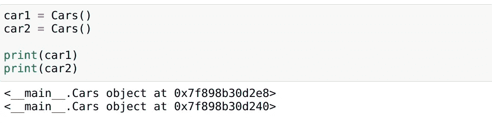
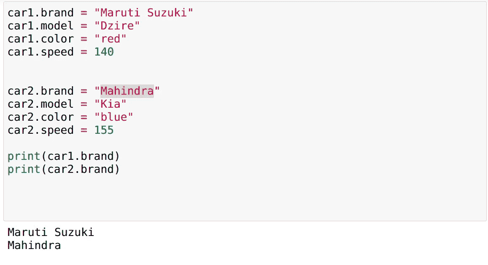
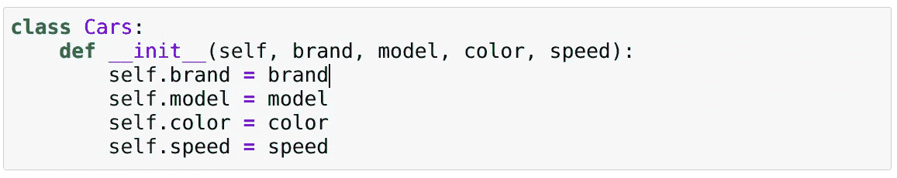
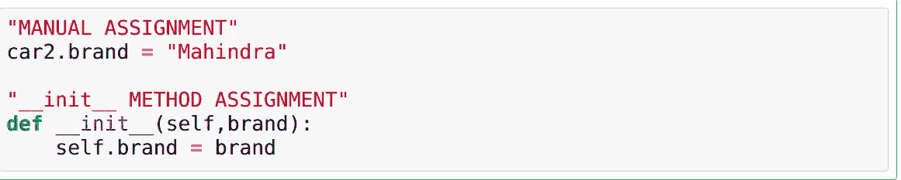
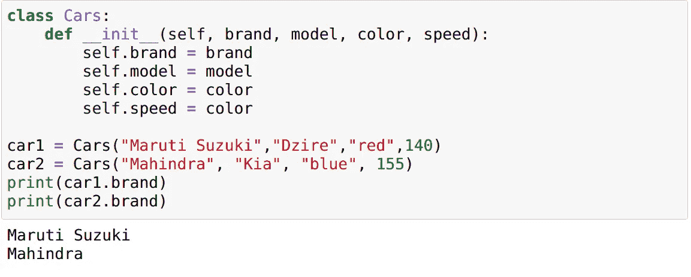
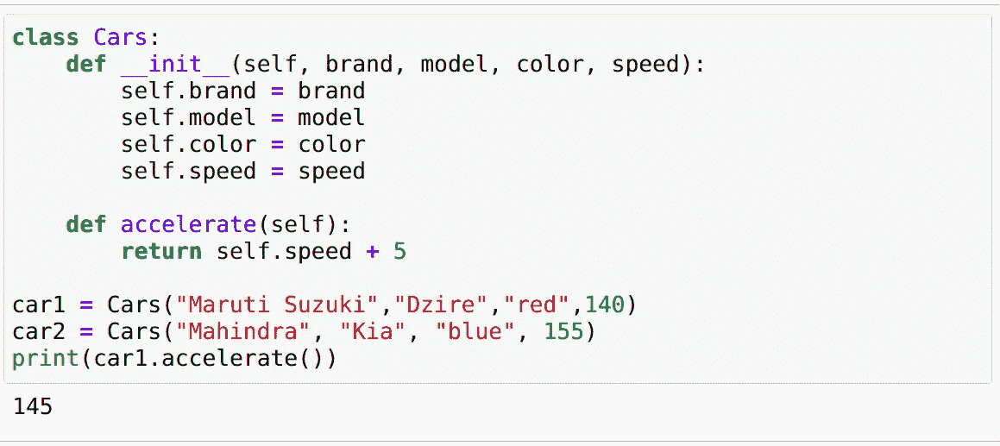

# 自我的概念，关键词，你必须明白

> 原文：<https://medium.com/analytics-vidhya/the-concept-of-self-keyword-you-must-understand-8f83e28cc015?source=collection_archive---------11----------------------->

克里斯里德在 [Unsplash](https://unsplash.com?utm_source=medium&utm_medium=referral) 上的照片

欢迎来到我的第一个博客，在这里我们可以了解这个 self 关键字，以及它在处理类和对象时的确切目的。

我已经可以听到你问我，你写一整个博客只是为了解释 python 中的这个关键字，但是认真地相信我，当我真正理解这个自我关键字的意思时，我几乎热泪盈眶，不，我甚至没有夸大其词。好了，说够了。让我们得到它。

> 在我们进入什么是 self 关键字之前，我们首先应该理解什么是类，什么是方法。

首先，经典的定义，我们在开始学习任何编程语言的时候都学过，到现在我们都很难理解

## **1。类别**

一个类就像一个对象构造器或者一个创建对象的“蓝图”

好了，首先什么是对象，让我们通俗易懂。你认为现实世界中的对象也是编程世界中的对象。我们一会儿会回来上课。

**2。对象**

例如，让我们举一个我们在所有教科书中遇到的最常见的例子，**汽车例子**，
汽车是现实世界中的一个物体，当然，是的。
是**一辆车**一个**物体**在**编程** **世界**绝对**是的**。答对了。！

**3。属性/特性**

a)那么现在让我们以**现实世界**中**汽车**的**属性**为例:**品牌、颜色、型号**

b)现在让我们在**编程世界**中获取汽车的**属性**，具体来说它们被称为属性，例如:**品牌、颜色、型号、速度**，简单吧？

**4。功能/方法**

a)现在是**现实世界**中汽车的**功能**，例如:**加速，刹车**

b)现在**功能**在**编程世界**更具体地说，这些是被称为**方法**的功能，例如:**加速、制动**

***现在按照定义“你说的类是蓝图是什么意思？”我已经能听到你的问题了。***

> 现在要把所有这些信息，比如它们的属性、方法(功能)组织起来，我们需要一种格式，对吗？没错，这就是这些类派上用场的地方。我们可以把一个类作为一种格式，这样就可以重用了。

数据、函数可以归入一类。现在让我们编码来更好地理解这些

在 python 中，我们如下声明一个类:

**定义一个类**

类是创建实例的蓝图。这个实例将是唯一的变量和数据定义，它将是唯一的每个实例。让我们声明 Car 类的一个实例，并试着打印出来:

**为类创建实例**

正如您在上面的图像中看到的，这些实例是唯一的，并且引用了不同的内存地址。

现在，让我们通过执行以下操作，向这些实例变量手动添加一些属性:

**为这些实例赋值(手动)**

为类的两个实例分配和打印品牌，但是您可以看到这需要大量的代码，并且很容易出错，因为它们是手动完成的。

因此，为了自动完成这项工作，我们在类内部创建了一个名为 __init__ method 的方法。这个方法自己设置变量。如果你来自其他语言，这可以被认为是一个构造函数，所以这是一个初始化的方法，我们将对它进行编码以更好地理解它。

**__init__ 方法**

现在 __init__ 方法是用于初始化实例和属性的方法。

现在“SELF”关键字作为类的实例传递，当在类中声明方法时，它应该作为第一个参数给出。

我所说的“自我”作为一个类的实例被传递是什么意思:

**手动 vs __init__**

其中 self 关键字成为我们要传递的实例，左边的 brand 是属性，右边的 brand 是我们要赋给属性的值。我们使用的 self 关键字名称可以替换为任何名称，但是，最好遵守约定。

我们现在给这些创建的实例赋值，并把它们叫做。

**初始化数值**

确保按顺序传递这些值。这里我们不传递实例，因为它是自动传递的。

现在让我们在这个类中创建一个 accelerate()方法来为我们的 car 类添加功能。

**方法**

我已经创建了一个简单的 accelerate 方法，它将速度加 5 到实际速度。我们调用方法并打印出来。

**随便一个信息:**

*   Python 或任何其他面向对象编程语言使用这些概念的目的不仅仅是因为它减少了代码行数，还因为它用于内存管理目的。默认情况下，python 在内存管理方面做得很好，但是，我们仍然可以使用它们。

**注意** : *无论何时声明从实例中获取值的方法，都要确保传递 self 关键字。*

**钥匙拿走:**

*   类是创建对象的蓝图。
*   对象的属性和方法是在类下定义的。
*   一个类可以有几个唯一的实例。
*   Self 关键字用于引用类的实例。
*   __init__ 方法是初始值设定项方法。
*   __init__ 方法不需要显式调用，因为它是构造函数/初始值设定项方法。
*   不要用其他任何东西重命名 self 关键字，严格遵守约定。
*   在初始化任何方法时，都必须传递 self 关键字。

是的，我们已经到了博客的结尾，希望这能帮助你理解类、方法、实例的概念，以及最重要的“自我”关键词。

我很乐意收到您的反馈，如果您有任何疑问，请在评论区告诉我，我会尽力回答。

**你绝对应该看看的视频或文章:**

[https://www.youtube.com/results?search_query=corey+schafer](https://www.youtube.com/results?search_query=corey+schafer)

[https://www.youtube.com/results?search_query=sentdex](https://www.youtube.com/results?search_query=sentdex)

**快乐编码！！**