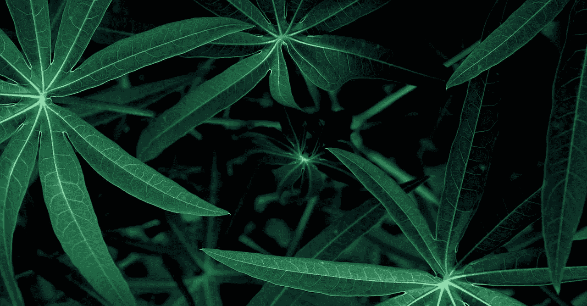
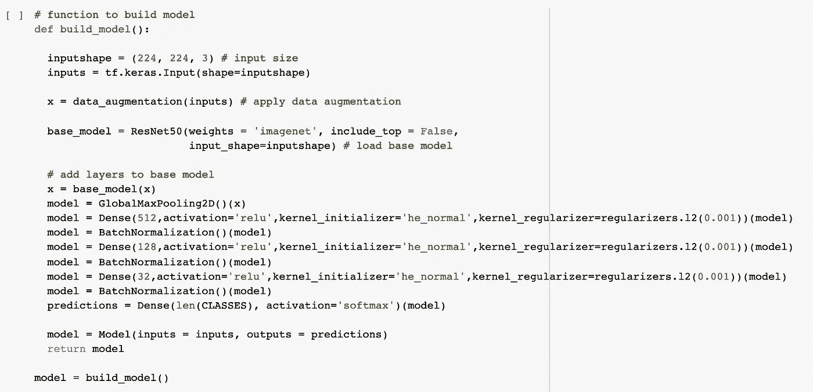
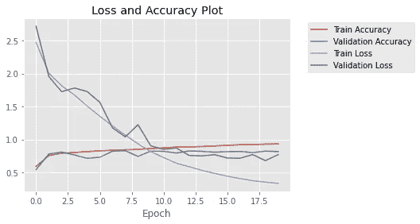
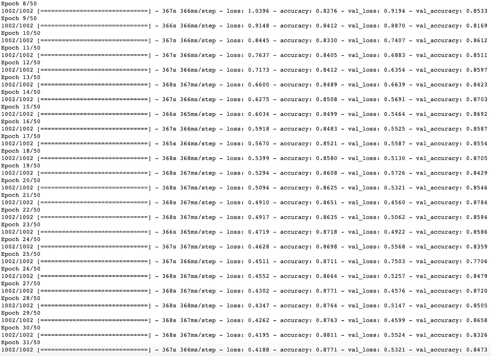
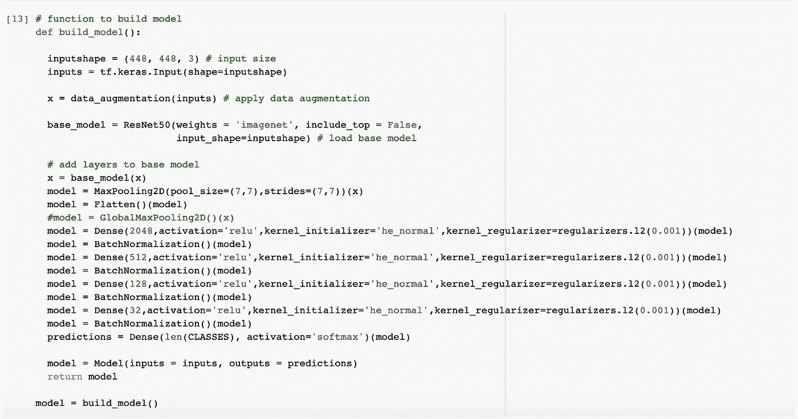
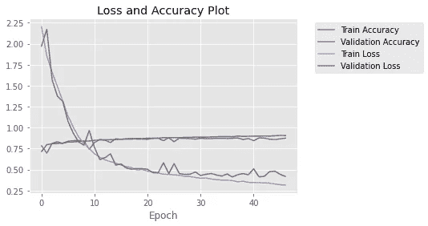

# 利用卷积神经网络对木薯叶部病害进行分类的结论

> 原文：<https://medium.com/analytics-vidhya/the-conclusion-to-classifying-cassava-leaf-diseases-using-convolutional-neural-networks-4dc6e5c7b5a0?source=collection_archive---------18----------------------->

数据扩充、提高图像分辨率和模型集成如何能够显著提高测试精度。

[https://www . ka ggle . com/c/cassava-leaf-disease-class ification](https://www.kaggle.com/c/cassava-leaf-disease-classification)

# 回顾以前的工作

在过去的几周里，Ethan Huang 和我一直在努力建立一个卷积神经网络，使非洲的自给农民能够更容易和有效地诊断他们的木薯作物，并确定采取什么行动最合适，以阻止疾病在他们的植物中传播，并最大限度地提高产量。目前，许多农场所有者的唯一选择是让当地农业专家亲自来检查他们的作物，但这一过程非常耗时、劳动强度大、资源效率低，因此开发一种让他们更快、更可靠地获得准确结果的方法是非常有价值的。理想的解决方案是创建一个模型，木薯农民可以简单地上传一张照片，并在几秒钟内报告预测的情况。我们在制作这样一个利用深度学习技术的解决方案的尝试已经在我们之前的两篇博客文章([初始文章](/mlearning-ai/cassava-leaf-disease-classification-using-convolutional-neural-networks-48fdc32cec1d) & [中途文章](/analytics-vidhya/developing-a-deep-learning-pipeline-for-classifying-cassava-leaf-diseases-a11528dac392))中详细记录和解释了，但是，为了提供我们目前所处位置的高层次概述，我将在这里重申。

在我们最后一次更新时，我们得到了一个测试准确率为 81.3%的模型。

中途模型测试准确度分数

这是通过使用 ResNet50 作为基础模型，并在最终的“软最大化”输出图层之前在其顶部添加三个完全连接的密集图层来实现的，该图层将提供木薯细菌性疫病(CBB)、木薯褐条病(CBSD)、木薯绿斑驳(CGM)、木薯花叶病(CMD)和健康这五个类别的预测置信度。Global max pooling 用于立即将基本模型的卷积层输出转换为可以馈入我们大脑密集层的形式，这导致我们的特征维度从 2048 下降到 32，在发送到 5 维输出层之前，每层减少 4 倍。这可以在下面的代码中看到:

中途模型架构

我们很快就选定了这个相当简单的架构，并决定将大部分精力用于调整决定训练过程的超参数，而不是那些决定模型复杂性的超参数。为此，我们主要关注学习率、批量大小和正则化。通过模型实验和测试许多不同的超参数配置，我们能够确定，对于我们的问题，最佳值集似乎是学习率为 0.0001，批量大小为 16，L2 正则化值为 0.001。此外，我们使用 Adam 作为优化器来编译我们的模型，由于其健壮和自适应的特性，我们特意添加了正常的内核初始化器，因为我们在每层之间使用了 ReLU 激活，并且还实现了批量规范化以帮助减少过度拟合，并使输入到每个完全连接层的值标准化。所有这些方法都在验证准确性和损失度量方面产生了有希望的训练行为和强大的性能结果。

各时期的关键培训和验证指标(中间模型)

也就是说，我们仍然在处理一些过度拟合问题(从上面的图中可以看出)，并且需要考虑一些其他技术，这些技术可以将我们的模型提高到竞争中顶级模型的大约 90%的测试准确度阈值。为了实现这一飞跃，我们决定进一步探索三项最终技术:数据扩充、更高分辨率的图像和模型集成。我们怀疑数据扩充将导致更多样化的训练集并允许更好的泛化，简单地使用更高分辨率的图像将提高模型学习更精细细节之间关系的能力，最后，我们可以通过将多个模型集成在一起来提高我们的性能。(请注意，测试图像大小的影响需要我们升级到 [Google Colab Pro](https://colab.research.google.com/signup) ，以便获得更多的计算能力和存储来训练这些模型。)我们在这三方面的努力和结果将在下面详细讨论。

# 数据扩充

虽然我们以前的模型在测试数据上产生了稳定的准确性，但是来自训练过程的结果显示训练数据仍然有点过度拟合。正如你在下面看到的，在最后一个时期，训练准确率超过了 86%,而验证准确率达到了 80%,从未达到 85%。此外，虽然训练损失继续逐渐变小(到第 20 个纪元时低至 0.51)，但验证损失一直较高，并表现出较高的可变性。

我们中途模型的训练结果

如果我们为模型训练更多的时期，我们可能会看到验证损失和验证准确性分别保持在 0.6 和 0.82 左右，而训练指标将继续稳步提高。可以肯定的是，训练和验证结果之间的差异不一定表明跨 20 个时期的巨大过度拟合问题，因为训练指标和验证指标是相对可比较的，但我们希望我们的模型在训练数据上的学习行为能够更好地概括。这就是数据增强的用武之地。

数据扩充是修改输入数据的各种属性的过程，目的是模拟输入空间的固有可变性。例如，假设我们所有的训练图像都将植物精确地放置在中心。我们的模型将很快开始学习强烈依赖于图像中心位置的行为。这是不可取的，因为我们的分类器应该不知道植物相对于图像帧的位置——在这个特定的例子中，模型可能难以对偏离中心的植物进行分类。再举一个例子，如果所有的训练图像都是用产生相对明亮的图像的同一台相机拍摄的，我们会希望防止我们的模型将该特定相机的图像固有的亮度与植物患病的概率相关联，因为我们希望我们的模型被装备成对从任何相机拍摄的图像进行分类。底线是，我们希望将多样性或“噪声”引入我们的输入空间，以便可以将数据的学习特征推广到可能由各种条件(不同颜色、对比度、方向等)产生的图像。).

为了做到这一点，我们定义了一个随机改变图像亮度、色调、饱和度和对比度的函数。正如我们在上一段中提到的，我们希望引入足够的噪声来模拟输入空间中可能存在的自然变化(所有木薯叶植物图像的集合，而不仅仅是提供给我们的图像)。然而，引入过多的噪声可能会导致转换后的图像不再像典型的木薯叶植物，因此我们需要小心不要过度增加数据。

数据扩充功能

我们还在先前模型中的随机水平和垂直翻转的基础上，引入了在任一方向上 45 度的随机旋转因子(-0.125 对应于-0.125*2pi 弧度，即 45 度)。(注意，为了完成翻转和旋转的任务，我们需要利用 TF . keras . layers . experimental . preparation 而不是 tf.image 类，这允许我们将这些层嵌入到模型的实际架构中，就在输入层的下面。)

与每个转换相关联的超参数表明我们希望这种变化有多剧烈，并且可以像学习速率、批量大小、正则化等一样进行调整。对于那些可能对这些转换在数据清理管道中的应用感兴趣的人来说，本文末尾提供了一个到我们代码的链接。

使用 tf.keras.layers.experimental .预处理实现随机翻转和旋转

正如我们将在下一节中看到的，引入数据扩充提高了我们模型的泛化能力，并有助于整体准确性的提高。

# 下采样方法

由于我们的计算能力有限，我们不得不使用尺寸缩小为 128x128 的图像来进行大部分的初始参数实验，但是，由于这些疾病主要是基于其更精细的特征来区分的，并且从更高分辨率的图像分析中受益匪浅，我们意识到，为了从我们的模型框架中获得最大的准确性，我们需要能够处理更大尺寸的图像。这导致我们都购买了谷歌 Colab Pro，这使我们能够访问更多的 GPU 和 RAM。配备了分析更高分辨率图像和有效优化更复杂模型所必需的工具，我们开始探索我们的相同架构在 448x448 图像上能做得多好。改进是非常显著的，我们很快就开始看到 80 年代中期的验证准确性分数，而无需做任何额外的工作，除了等待模型训练的时间更长。

更高分辨率图像的训练数据

然而，我们开始注意到的一件事是，当在更长数量的时期内训练时，我们的验证准确性将在时期 10 左右变得相当高，然后简单地在训练的剩余部分中搅动，在增加准确性和降低验证损失分数方面仅获得非常边际的收益。这促使我们思考我们认为是什么导致了早期停滞，因为我们知道在较大的图像上应该可以获得更高的精度，我们得出的结论是，我们的模型可能没有足够的能力来适当地捕捉和表示要素之间的所有关系，尤其是在包含完全连接的图层的模型的后期阶段。经过更仔细的检查，我们发现，现在我们使用的是 448x448 的图像，ResNet 基本模型的输出由 2048 个通道组成，每个通道包含一个 14x14 的特征图。以前，我们使用全局最大池的要素地图只有 3x3，因此当我们转换到密集图层时不会丢失太多信息，但我们现在忽略了更多数据，并可能不必要地限制了我们模型的容量。为了解决这一问题，我们选择使用最大池化 2D 层，池大小为 7x7，跨度为 7x7，以在每个通道的功能图的每个象限中获得最大的节点值。我们现在有 2048 个具有 2x2 特征图的通道，我们需要将这些通道馈入完全连接的层，因此，为了以允许更多信息从基本模型传输到头部的方式完成此操作，我们随后展平了最大池 2D 层，以获得 8192 (2048 x 2 x 2)个神经元，这些神经元可以用作头部层的输入。添加一个有 2048 个节点的密集层，这样我们现在将每个后续层的维度减少 4 倍，直到最终的输出层。

处理更高分辨率图像的模型头部架构

这种从卷积基础层到完全连接的头层的转换过程使模型能够保留更多相关的信息，并由于可训练参数的增加而使其具有更大的容量。(此外，在进行最后的长时间训练运行时，我们实施了一个提前停止回调，以 10 的耐心监视验证损失，并将“恢复最佳权重”设置为 true，以确保我们保存了产生最低验证损失的模型参数。)在这种新架构下，我们的模型仅由一个 ResNet50 基座和我们添加的头部组成，能够实现约 87.8%的测试精度，这是我们迄今为止最高的测试精度。这是一个非常有希望的结果，但现在是时候看看我们是否可以通过集合我们最好的模型做得更好。

我们最好的单一模型分数

# 集成和 CropNet

群体智慧最早是由詹姆斯·苏洛维耶茨基(James Surowiecki)在他 2004 年的著作中推广的，指的是一个事实，即大群体往往比小群体更聪明，即使小群体是“精英”。对于神经网络来说，这通常也是正确的——取许多好模型的平均结果通常会比一个伟大模型的单独结果产生更好的结果。

集成背后的主要动机是多个模型的平均结果比单个结果具有更低的方差。由于训练神经网络的方式是一个随机过程，在一组特定测试数据上表现良好的模型不能保证在其他数据上也同样成功。因此，在其他条件相同的情况下，方差低的模型总是比方差高的模型更受青睐，因为我们希望模型能够对总体数据产生一致的结果。

总的来说，希望组成合奏的每个模型都有不同的优点和缺点。理想情况下，我们会喜欢集成大量具有不同基础和架构的模型，以充分利用群体决策的优势。然而，由于我们有限的计算能力和内存，我们决定选择一个简单的集合，包括上图中的最佳模型和一个非常相似的模型，该模型使用全局平均池对基础模型中的数据进行下采样，而不是最大池和展平。

因为我们的模型已经下载了，所以过程非常简单。对于每幅图像，每个模型以概率向量的形式进行单独的预测(因为我们的最终输出是“软最大化的”)。例如，模型 1 可能输出(0.2，0.3，0.2，0.1，0.2)，分别对应于类别 1-5，这意味着它认为第二类最有可能，而模型 2 可能输出(0.35，0.1，0.15，0.25，0.15)，这意味着它认为第一类最有可能。那么，它们的平均预测值将是(0.275，0.2，0.175，0.175，0.175)，这意味着这两个模型将共同预测类别 1。不失一般性，我们选择在输出对应于最高概率的类之前对概率向量求和。

软投票集合的实现

上述方法被称为软投票。我们也可以选择使用硬投票，它只是选择最有信心的模型的预测。在上面的例子中，这也将产生类 1，因为 0.35 是任一向量的最大分量。

这两个模型一起能够达到约 88.1%的创纪录的高测试精度。虽然这只是对单个最佳模型的适度改进，但使用两个模型而不是一个模型会使我们的结果不太容易受到任何特定模型固有的可变性的影响。正因为如此，如果组合的产品能够提高精度(或者根本没有提高，因为可变性的减少本身就是一种提高)，那么组合几乎总是值得的。

集合模型的测试准确度分数

在本节中，我们还想对一个名为“CropNet”的预训练模型做一个简短的说明，该模型专门设计用于木薯叶分类。在研究比赛中一些顶级选手的模型时，我们意识到将 TensorFlow Hub 的这一强大模型包含在一个集合中通常会产生最高的整体测试精度。

虽然我们考虑过将 CropNet 添加到我们现有的集合中，但这些博客的目的是从头到尾说明设计神经网络的过程，因此即使包含 CropNet 可能会提高我们模型的整体性能，但包含可以简单地从 TensorFlow 下载的预训练模型也不合适。也就是说，我们确实测试了 CropNet 在没有任何附加层或数据清理的情况下单独运行的情况。

CropNet 测试准确度

我们发现 CropNet 本身能够达到 88.8%的准确率，这也许并不令人惊讶，因为该模型是为此目的专门训练的。

# 总结和最终绩效

在添加了数据扩充、修改了下采样方法并实现了集成之后，我们能够将模型的测试精度从 81.3%提高到 88.1%。概括地说，数据扩充将噪声引入了我们的输入空间，这提高了我们的模型概括训练数据的学习特征的能力。下图显示了训练指标的改进如何反映在验证损失的减少和验证准确性的增加上，仅在不到 50 个时期，而我们以前模型的验证指标在第 20 个时期之前就开始停滞不前了。

集合中两个模型之一的关键训练和验证指标

增加输入图像的大小对于提高模型的能力至关重要，为模型提供更高分辨率的数据也允许它开发更精细视觉细节之间关系的表示。加上数据扩充，增加的复杂性使我们的模型能够在最初的 15-20 个时期之外继续学习数据的有意义的特征。最后，整合我们的两个最佳模型使我们的整体模型变得更少，并提供了最终的准确性提升。

虽然仍有很大的改进空间，但我们相信，我们制作的最终模型将能够对那些目前正在努力应对木薯作物被疾病摧毁的毁灭性影响的人们的生活产生积极的影响。如果我们有更多的时间和计算资源，我们想要更深入探索的一个领域是集成，因为仅仅以一种相当简单的方式实现它就能够产生边际改进，并且似乎有理由相信开发一个更复杂的集成结构会导致更好的性能。然而，鉴于我们已经能够实现的结果，我们对我们的模型在真实世界条件下的表现能力充满信心，并希望继续参与挑战我们应用深度学习技能组合来解决刚刚得到应有关注的问题的项目。

# 结束语

这个项目是一个巨大的机会，可以探索我们在课堂上学习的深度学习技术如何应用于一个非常紧迫的现实世界问题，它让我们能够应对在实际对非玩具数据集进行数据分析时出现的所有技术复杂性和困难。从探索新的数据格式(如 TFRecords ),到以适当的方式清理和组织输入要素及其相应的标签，再到使用迁移学习、超参数调整和数据扩充来实际构建模型，这种体验让我们深入了解了数据科学领域。令人难以置信的是，我们看到了数据分析中如此前沿和技术驱动的进步如何帮助解决世界上以前被忽视的问题，它灌输了一种深刻的乐观情绪，即数据驱动的未来将使我们能够改善全球许多人的生活。我们期待着摆在我们面前的机会，为那些被忽视太久或直到最近才被概念化的问题提供解决方案，但即使是像这样一个相对简单的分类问题，也确实凸显了这样一个事实，即深度学习的范围令人难以置信地广阔，并且每天都在继续增长。能够成为这一技术革命的一小部分是如此令人兴奋，我们非常幸运能够为这些进步做出积极的贡献。为更光明、更数据驱动的未来干杯！

这个项目的代码可以在我们的 [GitHub 库](https://github.com/ethan21814/Tensorflow-Bros)中找到。

关于作者:Ethan Huang 和我(Griffin McCauley)都是布朗大学应用数学专业的大三学生。此外，我是男子大学越野队和田径队的成员，也是经济系的助教，伊森是 NFL 平台 Starting Eleven 的主席和学术导师。

鸣谢:该项目基于木薯叶疾病分类 Kaggle 竞赛([https://www . ka ggle . com/c/Cassava-Leaf-Disease-Classification](https://www.kaggle.com/c/cassava-leaf-disease-classification))，是数据科学倡议硕士项目中布朗大学数据 2040 课程(数据科学中的深度学习和特殊主题)的一部分。

参考资料:

 [## 喀拉斯端到端木薯病害分类

### 使用 Kaggle 笔记本探索和运行机器学习代码|使用木薯叶疾病分类的数据

www.kaggle.com](https://www.kaggle.com/junyingsg/end-to-end-cassava-disease-classification-in-keras)  [## 木薯叶病害分类

### 识别木薯叶图像上出现的疾病类型

www.kaggle.com](https://www.kaggle.com/c/cassava-leaf-disease-classification/discussion/209546)  [## 谷歌联合实验室

### 编辑描述

colab.research.google.com](https://colab.research.google.com/github/tensorflow/docs/blob/master/site/en/tutorials/images/transfer_learning_with_hub.ipynb)