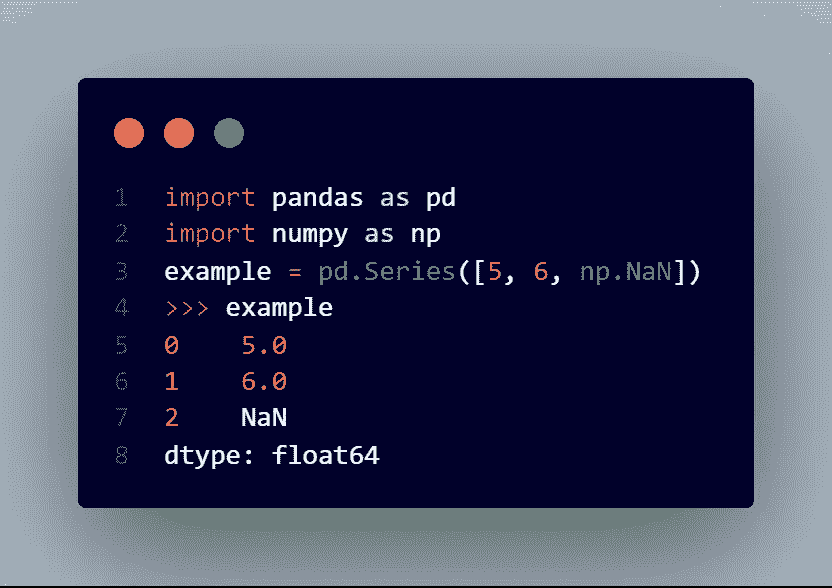
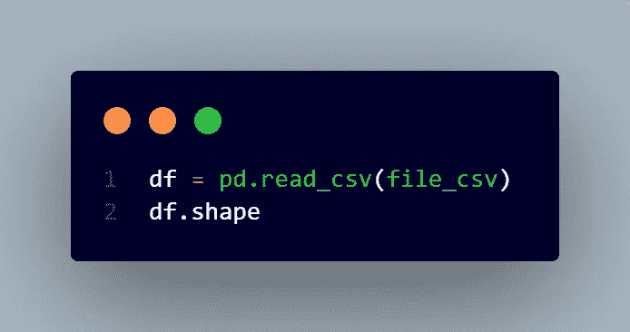
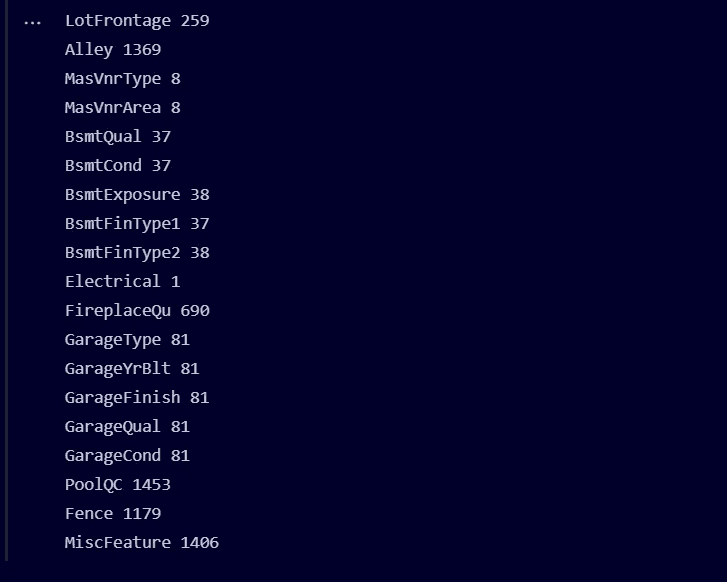
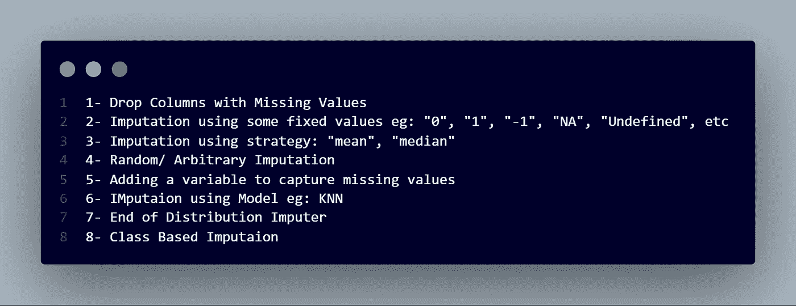
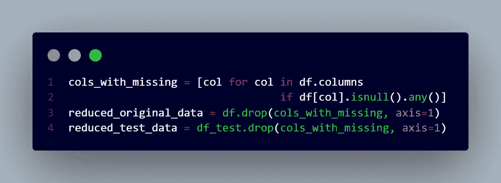
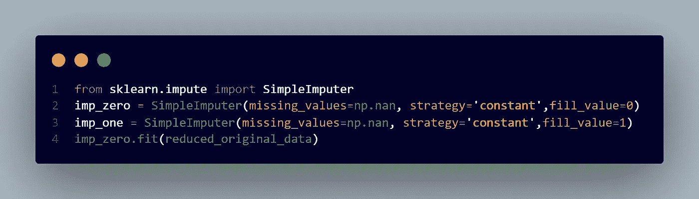
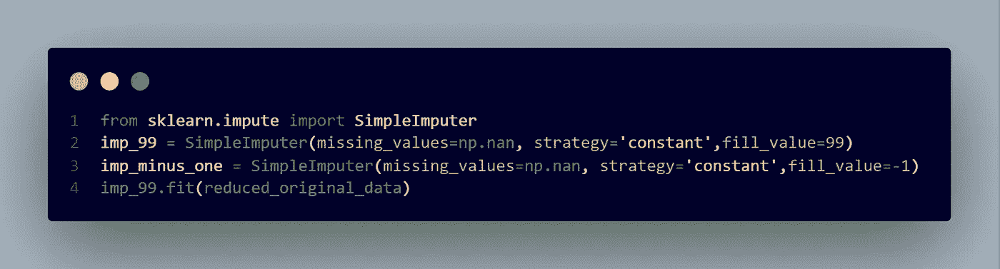
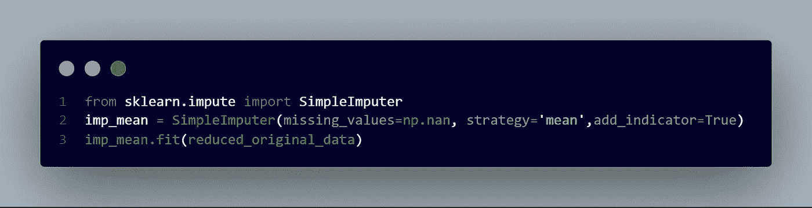
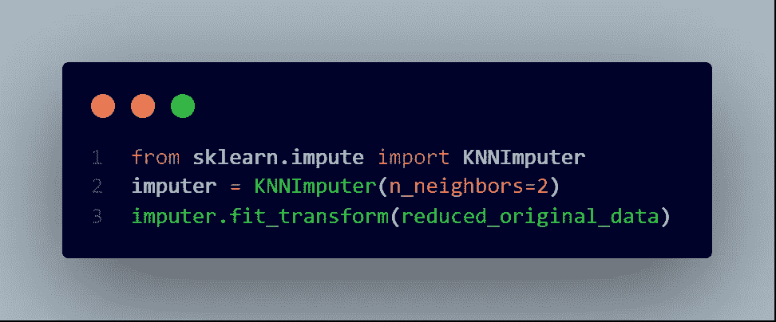
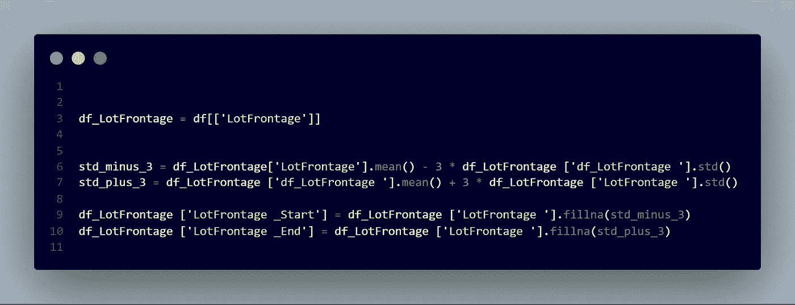

# 奇怪的归罪案例

> 原文：<https://medium.com/analytics-vidhya/the-curious-case-of-imputation-a1edb7d5bc44?source=collection_archive---------0----------------------->

如何处理缺失值？


如何以正确的方式处理缺失的值？

> 在统计学中，**插补**是用替代值替换缺失数据的过程

S 假设你正在做一个项目，你的任务是做一些数据分析或一些很酷的数据科学的东西，你想给你周围的每个人留下“你的数据技能&洞察力有多棒”的印象。


现在，通过某种方式，数据已经存在于您的系统中，为了简单起见，假设它是一个 Excel/CSV 数据集，您打开数据集并开始查看数据，以证明您对自己出色的数据技能的看法，却发现有些数据丢失了……！！！

> 有意思，我现在做什么？数据怎么会丢失呢？谁该受到责备？如何处理这些缺失的值？全部删除？填满它们，但是用什么填满呢？我的数据技能降低这么快就完成了吗…..？想想…想想…？


> 好吧，首先，数据丢失可能是由于以下原因:

1.  数据肯定已经损坏或更改。
2.  人为错误
3.  技术/小工具错误
4.  数据收集等过程中未发现任何数据

> 既然我知道数据可能会丢失以及丢失背后的一些原因，**我如何检查丢失的值数据？**

在 Python 中，NA/ NaN 代表的不是数字，是表示数据中缺失值的常用方法之一。

如果值为 NA。NA 值，如 None 或 np。NaN，映射到真实值。其他一切都映射到错误的值。



```
example.isna()0    False
1    False
2     True
dtype: bool
```

> 还有， **pd。DataFrame.isna** < —检测缺失值

说得够多了，让我们动手做一个数据集，然后马上探索它。

# 问题描述:#房价-高级回归技术

*预测销售价格并实践特征工程、RFs 和梯度推进

*让购房者描述他们梦想中的房子，他们可能不会从地下室天花板的高度或靠近东西向铁路开始。但是这个游乐场竞赛的数据集证明，影响价格谈判的远不止卧室的数量或白色尖桩栅栏。

*有 79 个解释变量描述了(几乎)爱荷华州埃姆斯住宅的各个方面，这个比赛要求你预测每栋房子的最终价格。

数据集链接:[https://www . ka ggle . com/c/house-prices-advanced-regression-techniques/data](https://www.kaggle.com/c/house-prices-advanced-regression-techniques/data)

加载库和数据集



# 检查列中是否有任何缺失值



此外，识别缺失值的第二种方法是:


如果您试图使用带有缺失值的数据来构建模型，大多数库(包括 scikit-learn)都会给出一个错误。所以你需要从下面的策略中选择一个。



## 1-删除缺少值的列



# 优点:

易于实施

# 缺点:

数据丢失。这在数据科学中从来都不是好的选择。这一切都是为了改善数据，并对数据有深刻的见解。

如果这些列有有用的信息(在没有丢失的地方)，当删除该列时，您的模型将失去对这些信息的访问


## 2-使用一些固定值进行插补，例如:“0”、“1”、“1”、“NA”、“未定义”等



## 优点:

易于实施

## 缺点:

如果要用值填充缺失值，则需要领域知识。可以让分配去折腾。也就是说会弄糟它。


## 3-使用策略的插补:“平均值”、“中间值”、“最频繁”(模式)


## 优点:

用 scikit-learn 很容易实现。根据您的用例，最常用的策略都是现成的。

## 缺点:

如果您需要更多的技术来适应您的用例。

## 4-随机/任意插补



## 优点:

用 scikit-learn 很容易实现。根据您的用例，最常用的策略都是现成的。

## 缺点:

它可以对变量分布做可怕的事情，因为它改变了均值、方差和协方差。

## 5-添加变量以捕获缺失值

**add _ indicator**bool，default=False

如果为真，`[**MissingIndicator**](https://scikit-learn.org/stable/modules/generated/sklearn.impute.MissingIndicator.html#sklearn.impute.MissingIndicator)`转换将叠加到估算器转换的输出上。这允许预测性估计者考虑缺失，尽管有插补。如果某个功能在“适应/训练”时没有缺失值，即使在“变换/测试”时有缺失值，该功能也不会出现在缺失指示器上。



## 6-使用模型估算，例如:KNN

使用 k 近邻填充缺失值的插补。

使用在训练集中找到的`n_neighbors`最近邻的平均值估算每个样本的缺失值。如果两个样本都不缺少的特征是接近的，则这两个样本是接近的。

**n_neighbors** *int，默认=5*

用于插补的相邻样本数。

**权重** *{ '统一'，'距离' }或可调用，默认= '统一'*

预测中使用的权函数。可能的值:

*   “统一”:统一重量。每个邻域中所有点的权重相等。
*   '距离' :按距离的倒数对点进行加权。在这种情况下，查询点的较近的邻居将比较远的邻居具有更大的影响。
*   callable:一个用户定义的函数，它接受一个距离数组，并返回一个包含权重的相同形状的数组。

**公制** *{'nan_euclidean'}或可调用，默认='nan_euclidean'*

搜索邻居的距离度量。可能的值:

*   “南欧几里得”
*   可调用:符合`_pairwise_callable(X, Y, metric, **kwds)`定义的自定义函数。该函数接受两个数组 X 和 Y，以及`kwds`中的一个`missing_values`关键字，并返回一个标量距离值。



## 7-分配结束估算器



## 基于 8 类的插补

假设你正在解决一个二元分类任务，这是积极和消极的类。

因此，您可以采用正类的平均值(即 mean_pos_class)和负类的平均值(即 mean_neg_class ),并使用此变量来填充缺失值，而不是简单的平均值、中值、众数或常量值。


# 结论:

没有任何策略总是有效的，所以只要编码实验&多做实验。

根据您的用例、数据分布和业务需求，尝试不同的策略并使用适合您需求的策略。


> ***参考文献:***
> 
> [https://pandas . pydata . org/pandas-docs/stable/reference/API/pandas。DataFrame.isna.html](https://pandas.pydata.org/pandas-docs/stable/reference/api/pandas.DataFrame.isna.html)
> 
> [https://sci kit-learn . org/stable/modules/generated/sk learn . impute . knnimputer . html？highlight = inputr % 20k nn # sk learn . input . knnimputer](https://scikit-learn.org/stable/modules/generated/sklearn.impute.KNNImputer.html?highlight=imputer%20knn#sklearn.impute.KNNImputer)
> 
> [https://sci kit-learn . org/stable/modules/generated/sk learn . impute . simple imputr . html # sk learn . impute . simple imputr](https://scikit-learn.org/stable/modules/generated/sklearn.impute.SimpleImputer.html#sklearn.impute.SimpleImputer)