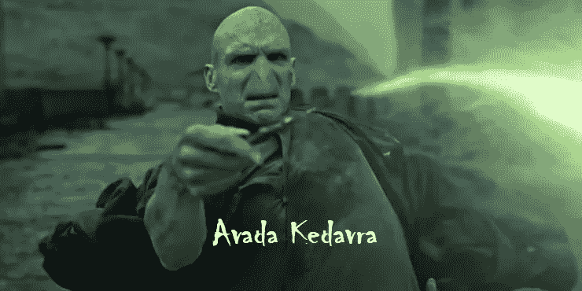
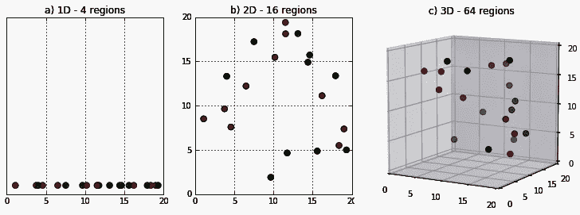
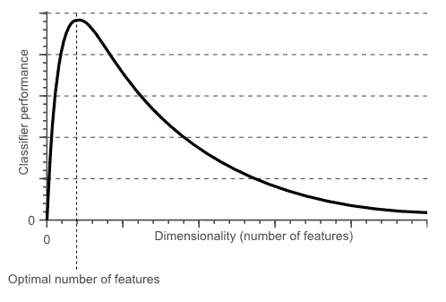
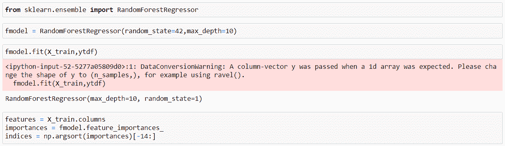
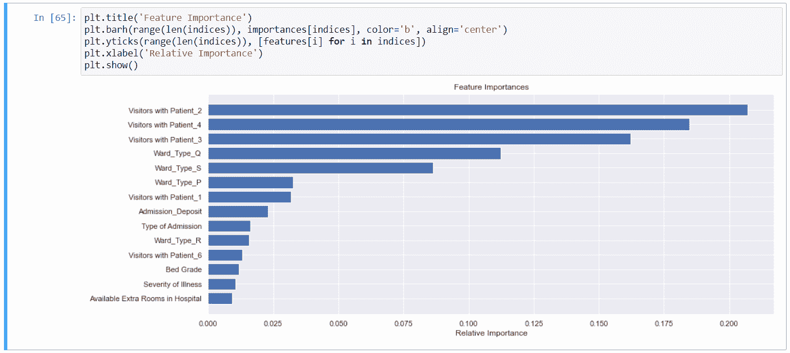
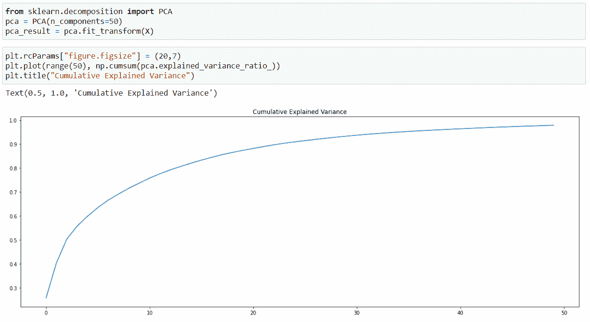
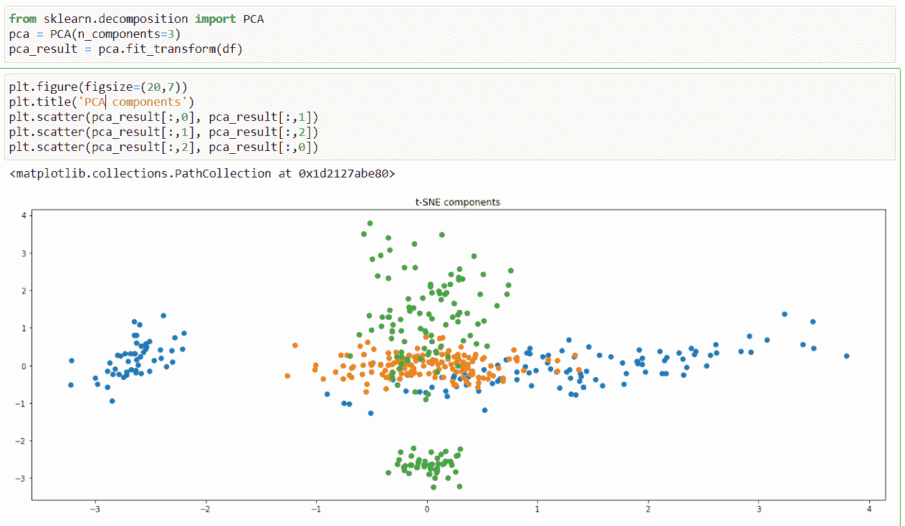
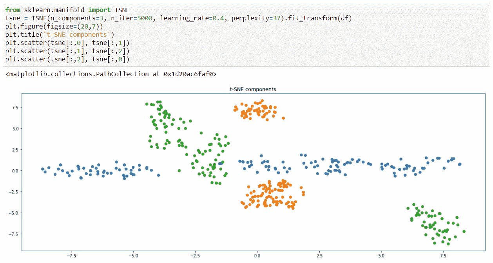

# 维数灾难及其解决方法

> 原文：<https://medium.com/analytics-vidhya/the-curse-of-dimensionality-and-its-cure-f9891ab72e5c?source=collection_archive---------1----------------------->



Avada Kedavra (又名杀戮诅咒)可能是所有诅咒中最致命的，但是在这个**麻瓜世界**，我们不得不应对比这更糟糕的事情。

**维度的诅咒**

有一种特殊的麻瓜也被称为数据科学家，他们在日常工作中不得不处理这个诅咒。

```
(Okay, so enough with the harry potter references and let's get right into business.)
```

**维数灾难**是当我们处理大量具有多种特征的数据时出现的一个问题，或者我们可以说它是高维数据。数据的维度意味着数据集中的特征或列的数量。

我们在处理高维数据时面临的问题是，在分析和可视化数据的同时识别有意义的模式变得非常具有挑战性，并且它还降低了机器学习模型的准确性，同时降低了计算速度，即随着维度的增加，训练模型将变得更慢。

随着维数的增加，多重共线性出现的机会也越来越多。



假设我们在一个维度上有 4 个数据点(数据集中只有一个特征)。因此，它可以很容易地用一条线来表示，维度空间等于 4。

现在，如果我们再添加一个特性，那么这将导致维度空间增加到 4*4 =16。同样，如果我们再添加一个特征，维度空间将增加到 4*4*4 = 64，以此类推(4 个维度(4*4*4*4=256)等等。).所以随着维度的不断增加，维度空间呈指数增长。

**休斯现象**

这种现象表明“在训练样本数量固定的情况下，分类器或回归器的平均(预期)预测能力首先随着所用维度或特征数量的增加而增加，但超过某个维度后，它开始恶化，而不是稳步提高”。



因此，随着维数的增加，计算观察值之间的距离也变得非常麻烦，因此，所有依赖于计算观察值之间的距离的机器学习算法发现处理高维数据非常麻烦，例如像 KNN、K-Means 等分割和聚类算法。

正如我们现在所知道的，高维数据是造成维数灾难的原因，但是为什么我们的数据中会有如此巨大的维数呢？

*   通常，在数据收集或提取阶段，我们从所有可能的地方收集数据并进行组合，这导致我们的数据集中有大量的要素。因此，为了解决现实世界的业务问题，我们通常需要大量的信息，因此数据中存在更多的特征。
*   我们的数据集中通常也有分类特征，但许多机器学习模型并不适合分类数据。因此，我们所做的是使用特征编码技术(将分类变量转换为数字特征)，如一键编码，这为每个类别创建了许多虚拟变量，即增加了维数。

*我们知道* ***阿瓦达*** **凯达弗拉** *是一个瞬间杀死的诅咒，唯一能把你从诅咒中解救出来的是复活石，所以在麻瓜世界里，数据科学家也想出了一个治愈维度诅咒的方法。*

(好吧，我保证，这是本文中最后一次提到哈利波特)

**治愈**


**降维**

降维是将数据从高维空间转换到低维空间，以便低维表示保留原始数据的一些有意义的属性，理想情况下接近其自然维度，或者简单地说，这意味着**降低我们数据集的维度**。([维基百科](https://www.google.com/url?sa=t&rct=j&q=&esrc=s&source=web&cd=&cad=rja&uact=8&ved=2ahUKEwiJgdGD0JjwAhULzDgGHV_ZAkcQFjAAegQIBBAD&url=https%3A%2F%2Fen.wikipedia.org%2Fwiki%2FDimensionality_reduction&usg=AOvVaw3LPYfrqd7rNyW_pqgFqj31)参考)

降维的优势:

1.  它减少了数据集的维度，因此减少了存储空间。
2.  它减少了计算时间，因为更少的维数意味着需要更少的计算，这意味着算法比以前训练得更快。
3.  多重共线性减少。
4.  模型的准确性也可能提高。
5.  它有助于更容易地可视化数据并在我们的数据集中识别有意义的模式，因为在 1 维、2 维或 3 维空间中可视化比在更多维度中更容易。

降维分为两种，**特征选择**和**特征提取**。

现在，让我们简要探讨一些降维技术。

首先，特征选择是只选择重要的特征或从数据集中剔除不太有用的特征。

一些特征选择方法是

*   **删除那些具有大量缺失值**(超过 50–60%)的特征，因为它将没有足够的信息提供给我们。我们可以设置一个特定的阈值，如果丢失的值超过这个阈值，那么我们将删除所有这些特征。
*   **去除相关性高的特征。**两个变量之间的高度相关性意味着两者都携带相似的信息，放弃其中任何一个都不会对我们的结果产生太大影响。我们可以使用 pandas 的 corr()函数找到我们的数据帧的相关性。我们可以设置一个阈值，如果相关系数超过这个阈值，我们就可以放弃它。
*   **使用随机福里斯特的特征选择** —随机福里斯特具有提供特征重要性度量的内置特征，但在此之前，我们需要将我们的数据转换成数字形式，因为随机福里斯特只接受数字输入。(注意——删除 ID 变量和目标变量)



我们将从 scikit-learn 库中导入 Random Forrest 回归器。然后，我们将数据框放入模型中。然后，在“feature_importances_”属性的帮助下，我们可以找到特性的重要性，并将它们绘制出来以便可视化。



现在，我们绘制了所有特性中最重要的 15 个特性。

然后，我们可以删除那些不太重要的特征。

(*注意——在进行特征选择时，请牢记领域知识，因为这些技术容易丢失信息。*)

现在我们将研究一些**特征提取**方法

**1。PCA —主成分分析**

PCA 是一种**线性降维算法**，它帮助我们从现有的一大组变量中提取一组新的变量，这些变量被称为**主成分**。

以这样的方式提取主成分:第一个主成分解释数据集中的最大方差，然后第二个主成分试图解释数据集中的剩余方差，并且与第一个主成分不相关，然后第三个主成分试图解释前两个主成分没有解释的方差，依此类推。

所以基本上，主成分分析所做的是，找到原始变量的最佳线性组合，使新变量的方差或分布最大。



上面的曲线量化了总方差的多少包含在前 N 个分量中。上面，我们可以看到，数字的前 10 个组成部分包含了大约 75%的总方差，而我们需要大约 20-25 个组成部分来描述接近 90%的方差。

为了观察组件的分布，让我们使用 sklearn 库中的 iris 数据集。然后，我们将从 sklearn 库中导入 PCA，让我们选择 3 个组件，然后拟合和转换数据集。之后，我们将使用 matplotlib 的散点图绘制组件。



**2。** **(t-SNE) t 分布随机邻居嵌入**

它是一种用于探索高维数据的**非线性降维算法**。它根据数据点与特征的相似性来发现数据中的模式。点的相似性被计算为点 A 选择点 B 作为其邻居的条件概率。

然后，它试图最小化高维空间和低维空间中这些条件概率之间的差异，以便在低维空间中完美地表示数据点。

现在，为了可视化组件，让我们从 sklearn 库中导入 TSNE 并拟合数据。与其他方法相比，TSNE 有其自身的优势，其中超参数是最重要的方法之一。我们可以对其进行微调，以获得最大收益。



正如我们可以观察到的，t-SNE 输出提供了比 PCA 和其他线性降维模型更好的结果。这是因为线性方法(如经典缩放)不擅长模拟弯曲流形。

降维的一些缺点是，它可能会导致一些数据丢失，有时结果并不总是可视化的最佳结果，这使得很难解释。

我们已经讨论了维数灾难的概念和一些降维方法。

感谢阅读，继续学习。

如果你觉得这篇文章很有帮助，那么请在 LinkedIn 上关注我。

**埃文斯科**