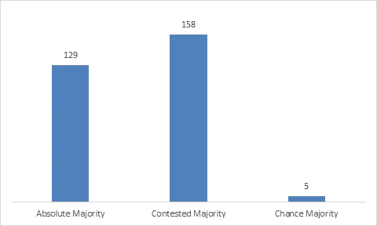
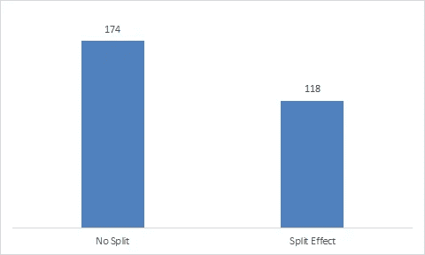
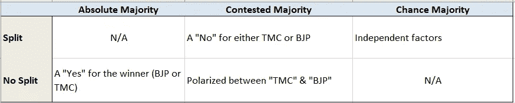

# 2021 年西孟加拉邦选举的数据和真相

> 原文：<https://medium.com/analytics-vidhya/the-data-and-the-truth-about-west-bengal-elections-2021-b7f9eb4ff8e1?source=collection_archive---------6----------------------->

西孟加拉邦选举是两次全民公决的故事。全民公决是一种投票，你可以投票赞成或反对一项决定。英国退出欧盟就是一个例子——英国人在两个选项中选一个:“留”或“留”。

在印度，大选绝对不是公民投票。然而，为了更好地理解西孟加拉邦的选举结果，你需要从全民公决的角度来看待它。

请这样想:有两次公投在进行。投票给一个-取消你投票给另一个的资格。所以投票者不得不下意识地从两者中选择一个，然后决定赞成还是反对。

那么，公投是什么？很简单:

1.  BJP(是/否)
2.  TMC(是/否)

因此，BJP 选民可能是两者之一:BJP 是，或者 TMC 不是。这同样适用于 TMC 选民。如果你看看投票份额，86%的选票投给了 BJP 或 TMC。他们赢得了 292 个选区席位中的 290 个。因此，公平地说，只有一小部分选民投票支持第三种选择。在所有其他政党获得的 14%选票中，相当一部分是“BJP:不”或“TMC:不”。

# 理解公民投票:

是否有可能了解个别公民投票的结果？理解，同样有助于消除对未来的疑虑。比如:

*   BJP 在西孟加拉邦的居住状况如何？
*   左派和国会的路走到尽头了吗？

我也会尝试一下，但不幸的是，尽管大量使用了数据，我还是需要做一些假设。每当假设起作用时:就有一个误差范围。

# 我的方法:

为了更好地理解选举，我收集了所有政党的选区数据。它不是现成的&所以我不得不建立一个刮刀，刮去选举委员会的网站。

数据来源:[https://docs . Google . com/spreadsheets/d/1Yc-zldbubwbsmcoulr 8g 7 wvgkszqgjp 3 bw 8 xrkj 8 PRC/edit？usp =共享](https://docs.google.com/spreadsheets/d/1Yc-ZLdbuBwBSMcOULr8G7wvgKSzqGJP3BW8xRkj8Prc/edit?usp=sharing)

为了分析数据，我将考虑以下参数:

1.  获胜候选人的投票百分比:

*   大于 50%**绝对多数**
*   40%-50%**有争议的多数**
*   <40%: **机会多数**

2.分裂因素:第二名和第三名的候选人一起赢得的份额比获胜者多吗？

*   是:**拆分**
*   否:**无分割**

首先，让我们来看看主要类型:

在大多数席位中，要么是绝对多数，要么是有争议的多数。

现在让我们来看一下分割因子:

在 40%的席位中，投票分裂有助于决定获胜者。

然而，当我们把这两个因素放在一起时，真正的真相就出现了。这就是公民投票的故事。在下面的表格中，我尝试描述了每个场景:

有三种情况可以解释公投的结果

# 分析

1.  **无分裂的绝对多数:**

在这里，全民公决的结果是要么支持 TMC 要么支持 BJP。共有 129 个这样的座位。 **TMC 赢得了其中的 111 项。BJP 赢得了其中的 18 项。**可以得出结论，在这些席位中，各自的政党都根深蒂固，只有一些激烈的事情会改变这一平衡。

**以 BJP 为例，**毫不奇怪，18 个席位中有 9 个来自北孟加拉邦(Alipurduar，Coochbehar &大吉岭)。

**就 TMC 而言，**111 个席位中有 51 个来自加尔各答及邻近的南 24 区和北 24 区。

实际上，这些数字可以被认为是双方各自的最坏情况。这也反映了一个事实，尽管加尔各答和邻近地区完全在 TMC 的控制之下:BJP 确实有一个最糟糕的情况，这是他们在 2016 年选举中获胜的 6 倍。

## 2.有争议的多数，但没有分裂

这一类我们有 45 个座位。TMC 赢得了 31 项，BJP 赢得了 14 项。在席位问题上，两党的票数出现了两极分化。这些座位是最不可预测的。

也很难理解这些席位的公投结果如何。

为了获得更好的视角，我们来看看这 45 个席位的 2016 年表现。2016 年，TMC 赢得了这 45 个席位中的 33 个(比 2021 年多两个)。2016 年，BJP 没有赢得任何席位。

在 2016 年 TMC 赢得的 33 个席位中，他们在 2021 年输给了 BJP 6 个席位。其中 5 家公司的利润率超过了 5%。这一次，亏损幅度从 4%到 12%不等。因此，我们可以说，这些席位的主要任务是:**没有 TMC**

另外 8 个席位也是如此，这些席位在 2016 年属于左翼或国会，但在 2021 年被 BJP 赢得。

在该类别中，TMC 从左&丛获得 4 个席位。就这 4 个席位而言，授权是明确的:**没有 BJP**

现在是最大的一块，TMC 在 2016 年和 2021 年赢得的 27 个席位。在这些座位上，只有一个问题:TMC(是/否)。BJP 紧随其后的事实表明，反对 TMC 的呼声越来越高，并以 BJP 选票的形式得到巩固。

总之这个细分市场才是 TMC 最应该担心的。除了 4 个席位之外，针对他们的反现任正在上升，BJP 巩固这一地位的能力应该是一个值得关注的问题。

**3。有争议的多数与分裂**

这个类别有 113 个座位。TMC 获得 68 票，BJP 获得 44 票，RSMP 获得 1 个席位(俗称 ISF)。

并非所有这些席位都是双向竞争的。在 5 个席位中，第二名是 CPIM RSMP 公司和独立党。

这些委托基本上是“没有 BJP”或“没有 TMC”的委托。因此，我们可以看到，第三党获得了相当多的席位。在 TMC 赢得的 65 个席位中的 52 个席位中，BJP 位居第二，左翼阵线起到了分裂 TMC 的作用。在剩下的 13 个席位中，是由 RSMP 公司完成的。在这 65 个席位中，选民们太热衷于将 BJP 扫地出门。这不是一个有利于 TMC 的命令，而是一个“没有 BJP”的命令

同样的逻辑也适用于 BJP 击败 TMC 的 42 个席位。左翼阵线在 30 个席位中扮演了“第三人”的角色；其余 12 家公司。这个命令很明确**“没有 TMC”。**

**一点关于反在职**

总的来说，反在职似乎只是一个 TMC 问题。然而，BJP 通过挖走 TMC 的候选人，实际上采纳了其中的一部分。在许多情况下，反在任者并不是针对党，而是针对当地的面子。TMC 放过了不少这样的面孔& BJP 欣然接受。

以 Rajib Banerjee(Domjur)、Baishali Dalmiya(Bally)和 Rabindranath Bhattacharya(Singur)为例:他们三人都是叛逃到 BJP 的现任 TMC 候选人。BJP 在同一个选区与他们竞争。他们输了。Rajib 的得票率为 17%，Rabindranath Bhattacharya 的得票率为 12.3%。在达尔米亚的例子中，差距很小(<5%): but from the same constituency the CPIM candidate Dipshita Dhar won 17.5% of the votes (i.e. lost due to the split)

So when BJP, signed up the TMC defectors, they kind of signed up the anti-incumbency too.

After the 2019 poll surprise, TMC did bring about quite a bit of changes. Reshuffling of leaders and letting go of a few, seems strategic in hindsight. They thus did improve a tad-bit on the anti-incumbency factor.

**现在谈论宗教**

BJP 一开始的确雄心勃勃，希望巩固该邦 70%的印度教选票。然而，这种情况并没有持续太久。让 Yogi Adityanath 这样的人参与竞选并没有多大帮助。事实上，Adityanath 的反罗密欧小队等强烈反对孟加拉的敏感性。

因此，他们转而开始攻击 TMC 的腐败和裙带关系。两者都不痛。尤其是，因为 TMC 的许多腐败面孔都在为 BJP 而战。

另一方面，TMC 在巩固穆斯林选票方面做得很好。对即将到来的 NRC & CAA 的恐惧足以让穆斯林一致投票给 TMC。这次选举标志着 INC 在 Maldah 和 Murshidabad 的穆斯林投票银行的结束。即使是 ISF(街区里的新成员):也不能削弱太多。

**内部人员与外部人员**

BJP 的竞选活动中有过多的中央领导，这使得 TMC 很容易强调他们是一股外部力量。甚至连“Jai Shri Ram”的圣歌也被打上了局外人口号的烙印。更令人不安的是，BJP 没有把注意力集中到一张独特的本地面孔上。最终的候选人名单让许多当地工人感到失望。尤其是因为许多人的面孔是他们本来就讨厌的。

第三战场的希望

看着这些数据，我不相信孟加拉出现第三种选择的希望已经破灭。毫无疑问，这将是一段艰难的旅程。由左翼党和 RSMP 党组成的选举前联盟获得 13 个席位，位居第二。在 41 个席位中，他们排名第三，但获得了至少 15%的选票。

如果我们分开来看左前方，他们在 4 个席位中名列第二。在 23 个席位中，他们排名第三，但获得了至少 15%的选票。

如果我们看看这 27 个席位，我们确实看到了一种趋势。一方面，我们有像 Kanti Ganguly、Sujan Chakraborty、医学博士 Salim 和 Ashok Bhattacharya 这样的老兵。另一方面，我们有像 Debdut Ghosh，Pratik Ur Rahman，Dipsita Dhar，Shatarup Ghosh 和 Sayandeep Mitra 这样的名字。换句话说，左翼的年轻一代已经展现出了希望！

2026 年，TMC 将在该州完成 15 年。反在职肯定会增长。Mamata Banerjee 将年过 70，还没有可接受的二线领导(Abhishek Banerjee 甚至在党内也缺乏支持)。

BJP 肯定会巩固他们的地位，然而，“不要 BJP”的情绪将会高涨。莫迪在处理 covid 危机、即将到来的经济厄运方面的失败也让印度人民党的立场变得更弱。

在这种情况下，可能会出现第三种选择。它必须一步一步来。