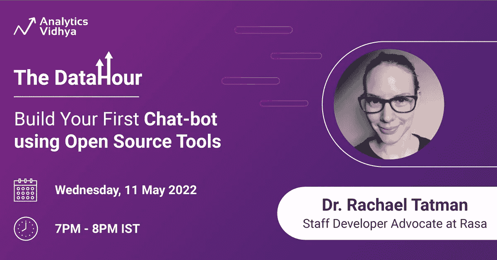

# 数据时间:使用开源工具构建你的第一个聊天机器人

> 原文：<https://medium.com/analytics-vidhya/the-datahour-build-your-first-chatbot-using-open-source-tools-147b8751af63?source=collection_archive---------0----------------------->

> 由 Rasa 的开发人员倡导者 Rachael Tatman 博士主持

亲爱的读者们:

我们旗舰学习系列的最新版本关于数据分析的一切肯定会让你兴奋不已，准备好使用[开源工具](https://www.analyticsvidhya.com/blog/2022/01/overview-of-mlops-with-open-source-tools/)构建你的第一个聊天机器人。[会议](https://datahack.analyticsvidhya.com/contest/datahour-build-your-first-chat-bot-using-open-source-tools/?utm_source=newsletter&utm_medium=medium&utm_campaign=datahour)将由【Rachael Tatman 博士主持，他是 Rasa 的开发人员倡导者，Rasa 是世界领先的对话式人工智能平台，使企业能够通过尖端的开源机器学习实现来改善客户体验。

在这个[讲座](https://datahack.analyticsvidhya.com/contest/datahour-build-your-first-chat-bot-using-open-source-tools/?utm_source=newsletter&utm_medium=medium&utm_campaign=datahour)中，你将被带领进入使用开源平台 Rasa 的迷人旅程，讲座将由**前谷歌人**和**密歇根大学**的讲师 Rachael Tatman 博士主持。该会议面向希望设计聊天机器人来改善其组织的 CX 或简单地获得 Rasa 等开源工具的实践经验的大一新生和专业人士。

# 关于聊天机器人的数据时间

在这个数据小时中，Rachael Tatman 博士将指导你使用一个叫做 Rasa 的开源工具，通过**动手**建立聊天机器人的过程。她将带你了解 Rasa 的基础知识，包括如何将单词翻译成机器学习功能，以及如何选择对话。

我们确信，从这个数据小时开始，你有足够的知识等着你和 Rachael Tatman 博士一起构建你的聊天机器人。她在语言学和 NLP 方面的工作经验使她在创建强大的聊天机器人方面拥有专业知识，这些聊天机器人在多个接触点上催化消费者体验之旅。我们建议您尽快注册，以获得十年一次的机会向如此杰出的人工智能、人工智能和自然语言处理专业人士学习。

# 结论

我们期待着为您提供这个[惊人的机会](https://datahack.analyticsvidhya.com/contest/datahour-build-your-first-chat-bot-using-open-source-tools/?utm_source=newsletter&utm_medium=medium&utm_campaign=datahour)。点击此处标记并预订网上研讨会的座位。如果您正在参加本次会议，并对这个主题有一些初步的问题，请在 editor@analyticsvidhya.com 的[向我们提出，或者您可以在会议期间直接向演讲者提问。](mailto:editor@analyticsvidhya.com)

如果你错过了我们之前举办的“数据时间”系列，去我们的 [YouTube 频道](https://www.youtube.com/playlist?list=PLdKd-j64gDcDv3qhAveXqBQQKbDktkfRX)看看这些录像。注册后，别忘了在 2022 年 5 月 11 日晚上 7:00 收听！