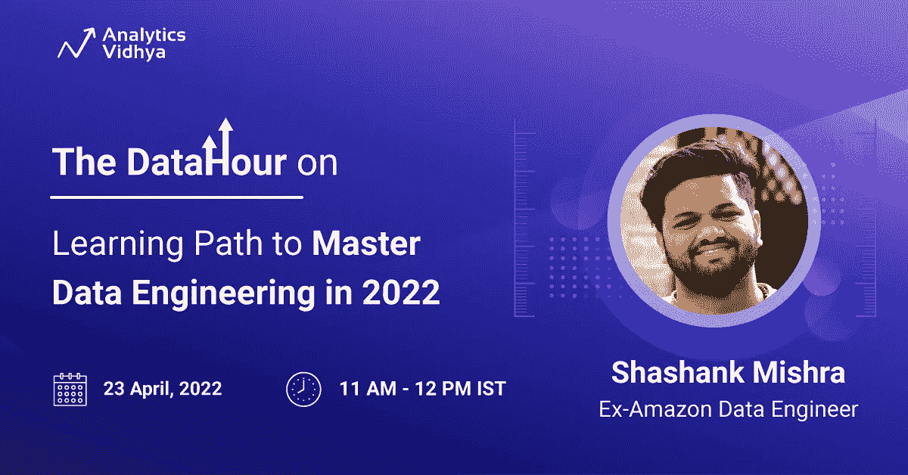

# 数据时间:2022 年掌握数据工程的学习途径

> 原文：<https://medium.com/analytics-vidhya/the-datahour-learning-path-to-master-data-engineering-in-2022-e354b33cc4fa?source=collection_archive---------2----------------------->

## 立即免费注册！

亲爱的读者们:

我们很高兴能在“数据时间”节目中看到新的一集。在本专题讲座中，前亚马逊数据工程师 Shashank Mishra 将带您进行一次学习之旅，“**到 2022 年掌握数据工程”**。众所周知，数据工程是如何形成的，并在数据管理方面发挥着关键作用。我觉得这对渴望在数据工程领域建立职业生涯的新生来说是一个极好的机会。

> [现在就预订座位](https://datahack.analyticsvidhya.com/contest/datahour-learning-path-to-master-data-engineering-in-2022//?utm_source=medium&utm_medium=announcement&utm_campaign=datahour)！🛋️

# 关于数据小时

数据工程从 2019 年开始受到如此多的欢迎，是近年来有志于数据专业人士的最佳职业生涯之一。大数据是一个非常广阔的领域，有多种职位描述，这就是为什么人们对不同的职位描述、他们的角色和职责、技术堆栈以及如何决定哪一个与您相关感到困惑？

在这个数据小时中，Shashank 将分享他 5 年的数据工程经验，并将提供最优秀的**最佳** **路线图，以便在 2022 年**成为一名声音数据工程师。

**先决条件:**对学习数据工程的热情！

# 本次网络研讨会面向谁？

*   希望从事数据工程职业的学生和新生
*   希望转向数据科学职业的工作专业人士
*   希望加快职业发展的数据科学专业人士

# 数据小时的演讲者

**前亚马逊数据工程师沙尚克·米什拉**

Shashank 是一名经验丰富的数据工程师，曾在亚马逊、Paytm 和麦肯锡等服务和产品公司工作过。他解决了不同领域的各种数据之谜，如航空、制药、金融科技、电信和员工服务。他还在设计可扩展和优化的数据管道方面拥有丰富的经验，能够以批处理和实时频率处理数 Pb 的数据。

目前，Shashank 通过他的精彩播客和 Youtube 频道([电子学习桥](https://www.youtube.com/c/LearningBridge))积极地为数据科学和数据工程社区做出贡献

# 结论

我希望你很高兴和我们一起参加这个数据小时会议。Shashank 是一位多产的演讲者，他带来了他在数据工程方面丰富的经验，这是你不想错过的！所以，敬请关注。如果你想读一些关于数据工程的文章。前往我们的[博客](https://www.analyticsvidhya.com/blog/)！

点击此处注册[参加 DataHour 网络研讨会，抓住这个绝佳的机会。如果你正在参加这个会议，并且对这个主题有一些初步的问题，请把它们发送给我们 editor@analyticsvidhya.com，或者你可以在会议期间直接问演讲者。](https://datahack.analyticsvidhya.com/contest/datahour-learning-path-to-master-data-engineering-in-2022//?utm_source=medium&utm_medium=announcement&utm_campaign=datahour)

如果你错过了我们之前举办的“数据时间”系列，去我们的 [YouTube 频道](https://www.youtube.com/playlist?list=PLdKd-j64gDcDv3qhAveXqBQQKbDktkfRX)看看这些录像。

## 连接

如果您在注册时遇到任何困难，或者希望与我们进行会话。然后，在 editor@analyticsvidhya.com 和我们联系

*原载于 2022 年 4 月 14 日 https://www.analyticsvidhya.com***。**