# 数据挖掘中基于距离的算法

> 原文：<https://medium.com/analytics-vidhya/the-distance-based-algorithms-in-data-mining-9752be4ab9d4?source=collection_archive---------1----------------------->

这些算法用于测量每个文本之间的距离并计算分数。


距离度量在机器学习中起着重要的作用

它们为许多流行和有效的机器学习算法提供了基础，如用于监督学习的 KNN(K-最近邻)和用于非监督学习的 K-均值聚类。

必须根据数据类型选择和使用不同的距离度量，因此，了解如何实施和计算一系列不同的流行距离度量以及对结果分数的直觉非常重要。

在这个博客中，我们将发现机器学习中的距离度量。

## **概述:**

1.  距离测量的作用
2.  汉娩距
3.  欧几里得距离
4.  曼哈顿距离(出租车或城市街区)
5.  闵可夫斯基距离
6.  马哈拉诺比斯距离
7.  余弦相似性

# **距离测量的作用**

距离度量在机器学习中起着重要的作用

距离度量是一个客观分数，它概括了问题域中两个对象之间的相对差异。


最常见的是，这两个对象是描述一个主题(比如一个人、一辆车或一栋房子)或一个事件(比如购买、索赔或诊断)的数据行

也许，我们最有可能遇到距离度量的方式是当我们使用特定的机器学习算法时，该算法以距离度量为核心。最著名的算法是 KNN—[K-最近邻算法]

# **KNN**

通过计算训练数据集中新样本集和所有现有样本集之间的距离，对新样本进行分类或回归预测。

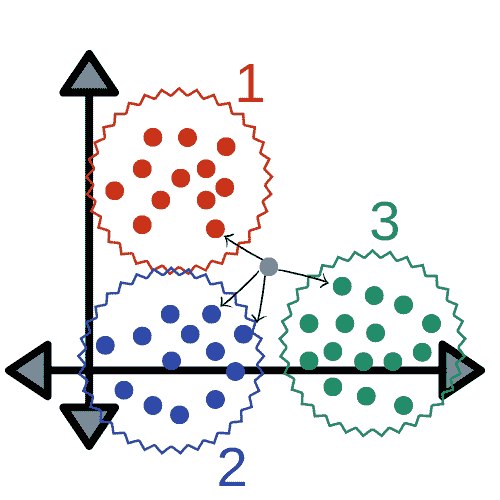

然后选择训练数据集中具有最小距离的 K 个示例，并通过对结果(类别标签的模式或回归的真实值的平均值)进行平均来进行预测

KNN 属于一个更广泛的算法领域，称为基于案例或基于实例的学习，其中大多数以类似的方式使用距离度量。另一种使用距离测量的流行的基于实例的算法是学习矢量量化或 LVQ，该算法也可以被认为是一种神经网络。

接下来，我们有自组织映射算法，即 SOM，这是一种也使用距离度量的算法，可用于监督和非监督学习算法，其核心是 K-means 聚类算法。

在基于实例的学习中，训练样本被逐字存储，并且使用距离函数来确定训练集中的哪个成员最接近未知的测试实例。一旦定位了最近的训练实例，就为测试实例预测其类别。

一些更流行的机器学习算法的核心是使用距离度量

1.  k-最近邻(KNN)
2.  学习矢量量化(LVQ)
3.  自组织映射(SOM)
4.  k 均值聚类

有许多基于核的方法也可以被认为是基于距离的算法。

也许最广为人知的核方法是支持向量机算法(SVM)

> 当计算两个示例或数据行之间的距离时，可能会对示例集的不同列使用不同的数据类型。

示例集可能有实值、布尔值、分类值和序数值。

> 对于每一个可能需要不同的距离测量，这些距离测量被加在一起成为单个距离分数。

数值可能有不同的标度。这可能会极大地影响距离度量的计算，通常在计算距离度量之前对数值进行归一化或标准化是一种好的做法。

回归问题中的数值误差也可以被认为是距离。例如，预期值和预测值之间的误差是一维距离度量，可以对测试集中的所有示例求和或求平均值，以给出数据集中预期结果和预测结果之间的总距离。

误差的计算，例如均方误差或平均绝对误差，可以类似于标准的距离测量。

正如我们所见，距离度量在机器学习中起着重要的作用，

机器学习中最常用的距离度量是

1.  汉娩距
2.  欧几里得距离
3.  曼哈顿距离
4.  闵可夫斯基距离
5.  马哈拉诺比斯

最重要的是知道在从头实现算法时如何计算这些距离度量，以及在使用利用这些距离度量的算法时对计算内容的直觉。

# **海明距离**

汉明距离计算两个二进制向量(也称为二进制串或位串)之间的距离

当我们对数据的分类列进行一次性编码时，我们很可能会遇到二进制字符串。

举个例子，


示例集

在一次热编码之后

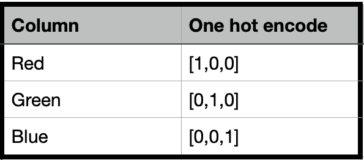

具有独热编码的示例集

红色和绿色之间的距离可以计算为两个位串之间的位差的和或平均数。这是海明距离。

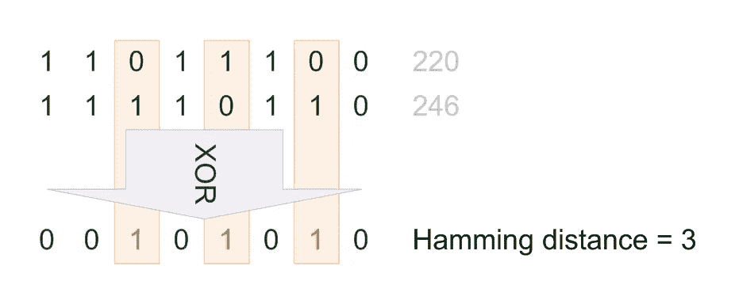

对于一个独热编码的字符串，总结字符串之间的位差总和可能更有意义，它将始终是 0 或 1。

*   汉明距离= I 至 N abs 之和(v1[i] — v2[i])

对于可能具有许多 1 位的位串，更常见的是计算位差的平均数，以给出介于 0(相同)和 1(全部不同)之间的汉明距离分数。

*   汉明距离=(I 与 N 的绝对值之和(v1[I]—v2[I])/N

我们可以用一个计算两个位串之间的汉明距离的例子来证明这一点，如下所示。

```
# calculating hamming distance between bit string
# calculate hamming distance
def hamming_distance(a,b):
    return sum(abs(e1-e2) for e1, e2 in zip(a,b)) / len(a)# define data
row1 = [0,0,0,0,0,1]
row2 = [0,0,0,0,1,0]# calculate distance
dist = hamming_distance(row1, row2)
print(dist)
```

我们可以看到，字符串之间有两个差异，即 6 位差异中的 2 位，其平均值(2/6)约为 1/3 或 0.33。

```
0.33333333333333
```

我们还可以使用 SciPy 中的 hamming()函数执行相同的计算。

```
# calculating hamming distance between bit strings
from scipy.spatial.distance import hamming# define data
row1 = [0, 0, 0, 0, 0, 1]
row2 = [0, 0, 0, 0, 1, 0]# calculate distance
dist = hamming(row1, row2)
print(dist)
```

在这里，我们可以确认我们的例子得到相同的结果，确认我们的手动实现

```
0.33333333333333
```

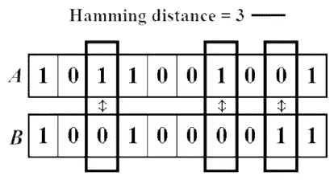

# **欧几里德距离**

欧几里德距离计算两个实值向量之间的距离。

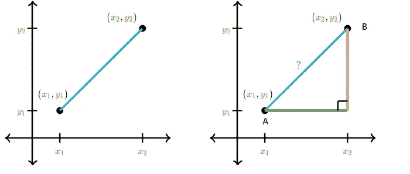

摘自汗学院的距离公式教程

为了计算数据点之间的距离，A 和 B 勾股定理考虑了 x 轴和 y 轴的长度。

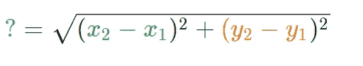

在计算具有数值(如浮点或整数值)的两行数据之间的距离时，您最有可能使用欧几里德距离。

如果列中的值具有不同的刻度，通常在计算欧几里德距离之前对所有列中的数值进行规范化或标准化。否则，具有大值的列将主导距离度量。

欧几里德距离的计算方法是两个向量的平方差之和的平方根。

*   欧几里德距离= sqrt(I 到 N 的和(v1[i] — v2[i]))

如果距离计算要执行数千次或数百万次，为了加速计算，通常要去掉平方根运算。在这种修改之后，得到的分数将具有相同的相对比例，并且仍然可以在机器学习算法中有效地用于寻找最相似的例子。

*   欧几里德距离= I 到 N 的和(v1[i] — v2[i])

这种计算与 L2 向量范数有关，如果加上平方根，则相当于平方和误差和平方和误差的平方根。

我们可以用一个计算两个实值向量之间欧几里德距离的例子来证明这一点，如下所示。

```
# calculating euclidean distance between vectors
from math import sqrt# calculate euclidean distance
def euclidean_distance(a, b):
return sqrt(sum((e1-e2)**2 for e1, e2 in zip(a,b)))# define data
row1 = [10, 20, 15, 10, 5]
row2 = [12, 24, 18, 8, 7]# calculate distance
dist = euclidean_distance(row1, row2)
print(dist)
```

运行该示例会报告两个向量之间的欧几里德距离。

```
6.082762530298219
```

我们也可以使用 SciPy 中的[欧几里德()函数](https://docs.scipy.org/doc/scipy/reference/generated/scipy.spatial.distance.euclidean.html)来执行相同的计算。下面列出了完整的示例。

```
# calculating euclidean distance between vectors
from scipy.spatial.distance import euclidean# define data
row1 = [10, 20, 15, 10, 5]
row2 = [12, 24, 18, 8, 7]# calculate distance
dist = euclidean(row1, row2)
print(dist)
```

运行这个例子，我们可以看到我们得到了相同的结果，证实了我们的手动实现。

```
6.082762530298219
```

# 曼哈顿距离(出租车或城市街区距离)

[曼哈顿距离](https://en.wikipedia.org/wiki/Taxicab_geometry)，也称为出租车距离或城市街区距离，计算两个实值向量之间的距离。

对于在统一网格上描述对象的矢量，比如棋盘或城市街区，它可能更有用。测量值的出租车名称指的是测量值计算结果的直觉:出租车在城市街区之间行驶的最短路径(网格上的坐标)。

对于整数特征空间中的两个向量，计算曼哈顿距离而不是欧几里德距离可能是有意义的。

曼哈顿距离计算为两个向量之间的绝对差之和。

*   Manhattan distance = sum for I to N sum | v1[I]—v2[I]|

曼哈顿距离与 L1 向量范数以及绝对误差和平均绝对误差度量有关。

我们可以用一个计算两个整数向量之间的曼哈顿距离的例子来证明这一点，如下所示。

```
# calculating manhattan distance between vectors
from math import sqrt# calculate manhattan distance
def manhattan_distance(a, b):
return sum(abs(e1-e2) for e1, e2 in zip(a,b))# define data
row1 = [10, 20, 15, 10, 5]
row2 = [12, 24, 18, 8, 7]# calculate distance
dist = manhattan_distance(row1, row2)
print(dist)
```

运行该示例将报告两个向量之间的曼哈顿距离。

```
13
```

我们还可以使用 SciPy 中的 [cityblock()函数](https://docs.scipy.org/doc/scipy/reference/generated/scipy.spatial.distance.cityblock.html)执行相同的计算。下面列出了完整的示例。

```
# calculating manhattan distance between vectors
from scipy.spatial.distance import cityblock# define data
row1 = [10, 20, 15, 10, 5]
row2 = [12, 24, 18, 8, 7]# calculate distance
dist = cityblock(row1, row2)
print(dist)
```

运行这个例子，我们可以看到我们得到了相同的结果，证实了我们的手动实现。

```
13
```

# 闵可夫斯基距离

[闵可夫斯基距离](https://en.wikipedia.org/wiki/Minkowski_distance)计算两个实值向量之间的距离。

它是欧几里德和曼哈顿距离度量的推广，并添加了一个参数，称为“*阶*或“ *p* ”，允许计算不同的距离度量。

闵可夫斯基距离度量的计算如下:

*   欧几里德距离=(I 到 n 的和(abs(v1[i] — v2[i]))^p)^(1/p)

其中“ *p* ”为顺序参数。

当 p 设置为 1 时，计算结果与曼哈顿距离相同。当 p 设置为 2 时，它与欧几里德距离相同。

*   *p=1* :曼哈顿距离。
*   *p=2* :欧氏距离。

中间值提供了两种度量之间的受控平衡。

当实现使用距离度量的机器学习算法时，通常使用 Minkowski 距离，因为它通过可以调整的超参数“ *p* ”来控制用于实值向量的距离度量的类型。

我们可以用下面列出的计算两个实向量之间的闵可夫斯基距离的例子来演示这种计算。

```
# calculating minkowski distance between vectors
from math import sqrt# calculate minkowski distance
def minkowski_distance(a, b, p):
return sum(abs(e1-e2)**p for e1, e2 in zip(a,b))**(1/p)# define data
row1 = [10, 20, 15, 10, 5]
row2 = [12, 24, 18, 8, 7]# calculate distance (p=1)
dist = minkowski_distance(row1, row2, 1)
print(dist)# calculate distance (p=2)
dist = minkowski_distance(row1, row2, 2)
print(dist)
```

运行该示例时，首先计算并打印 Minkowski 距离，将 *p* 设置为 1 以给出曼哈顿距离，然后将 *p* 设置为 2 以给出欧几里得距离，匹配对前面部分的相同数据计算的值。

```
13.0
6.082762530298219
```

我们也可以使用 SciPy 中的 [minkowski_distance()函数](https://docs.scipy.org/doc/scipy/reference/generated/scipy.spatial.minkowski_distance.html)来执行相同的计算。下面列出了完整的示例。

```
# calculating minkowski distance between vectors
from scipy.spatial import minkowski_distance# define data
row1 = [10, 20, 15, 10, 5]
row2 = [12, 24, 18, 8, 7]# calculate distance (p=1)
dist = minkowski_distance(row1, row2, 1)
print(dist)# calculate distance (p=2)
dist = minkowski_distance(row1, row2, 2)
print(dist)
```

运行这个例子，我们可以看到我们得到了相同的结果，证实了我们的手动实现。

```
13.0
6.082762530298219
```

# 马哈拉诺比斯距离

Mahalanobis 距离是一种有效的多元距离度量，用于测量点(向量)和分布之间的距离。这是一个非常有用的度量，在多变量异常检测、高度不平衡数据集的分类和单类分类中有很好的应用。

它在多元异常检测、高度不平衡数据集上的分类和单类分类以及更多未开发的用例中具有出色的应用。

考虑到其极其有用的应用，这一指标很少在 stats 或 ML 工作流中讨论或使用。这篇文章解释了使用马氏距离的原因和时间，然后解释了直觉和有用的数学应用。

马氏距离是一个点和一个分布之间的距离。而不是在两个不同的点之间。它实际上是欧几里得距离的多元等价物

1.  它将列转换成不相关的变量
2.  缩放列，使它们的方差等于 1
3.  最后，它计算欧几里德距离

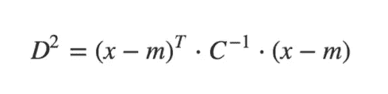

```
where, 
 - D^2 is the square of the Mahalanobis distance. 
 - x is the vector of the observation (row in a dataset), 
 - m is the vector of mean values of independent variables (mean of each column), 
 - C^(-1) is the inverse covariance matrix of independent variables.
```

计算马氏距离

```
import pandas as pd
import scipy as sp
import numpy as np

filepath = 'local/input[.csv](https://raw.githubusercontent.com/selva86/datasets/master/diamonds.csv)'
df = pd.read_csv(filepath).iloc[:, [0,4,6]]
df.head()
```

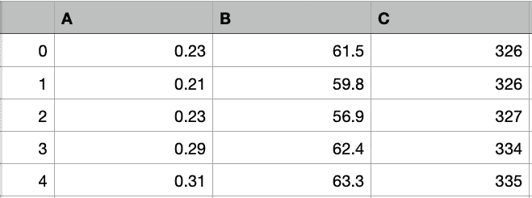

让我们编写计算 Mahalanobis 距离的函数:

```
def mahalanobis(x=None, data=None, cov=None):
    """Compute the Mahalanobis Distance between each row of x and the data  
    x    : vector or matrix of data with, say, p columns.
    data : ndarray of the distribution from which Mahalanobis distance of each observation of x is to be computed.
    cov  : covariance matrix (p x p) of the distribution. If None, will be computed from data.
    """
    x_minus_mu = x - np.mean(data)
    if not cov:
        cov = np.cov(data.values.T)
    inv_covmat = sp.linalg.inv(cov)
    left_term = np.dot(x_minus_mu, inv_covmat)
    mahal = np.dot(left_term, x_minus_mu.T)
    return mahal.diagonal()

df_x = df[['A', 'B', 'C']].head(500)
df_x['maha_dist'] = mahalanobis(x=df_x, data=df[['A', 'B', 'C']])
df_x.head()
```

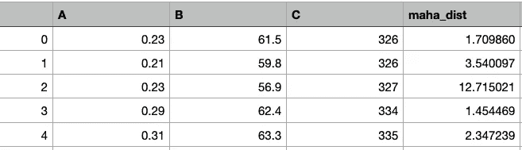

# 余弦距离:

余弦距离度量主要用于发现不同文档之间的相似性。在余弦度量中，我们测量两个文档/向量之间的角度(作为度量收集的不同文档中的术语频率)。当向量之间的大小无关紧要但方向重要时，使用这种特定的度量。

余弦相似性公式可以从点积公式中导出

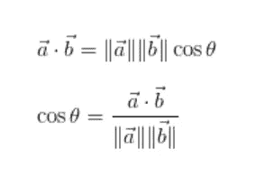

现在，你一定在想，余弦角的哪个值会有助于找出相似点。

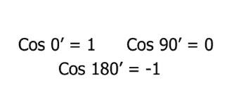

现在我们有了用来衡量相似性的值，我们需要知道 1，0 和-1 分别代表什么。

这里余弦值 1 用于指向相同方向的向量，即在文档/数据点之间存在相似性。正交向量为零，即不相关(发现一些相似性)。指向相反方向的向量的值为-1(无相似性)。

```
sklearn.metrics.pairwise.**cosine_similarity**(*X*, *Y=None*, *dense_output=True*)
```

余弦相似性示例

```
from scipy import spatial

dataSetI = [3, 45, 7, 2]
dataSetII = [2, 54, 13, 15]
result = 1 - spatial.distance.cosine(dataSetI, dataSetII)
```

另一个基于 Numpy 的版本

```
from numpy import dot
from numpy.linalg import norm

cos_sim = dot(a, b)/(norm(a)*norm(b))
```

定义余弦相似度函数

```
import math
def cosine_similarity(v1,v2):
    "compute cosine similarity of v1 to v2: (v1 dot v2)/{||v1||*||v2||)"
    sumxx, sumxy, sumyy = 0, 0, 0
    for i in range(len(v1)):
        x = v1[i]; y = v2[i]
        sumxx += x*x
        sumyy += y*y
        sumxy += x*y
    return sumxy/math.sqrt(sumxx*sumyy)

v1,v2 = [3, 45, 7, 2], [2, 54, 13, 15]
print(cosine_similarity(v1,v2))
```

运行这个例子，我们可以看到我们得到了相同的结果，证实了我们的手动实现。

```
0.972284251712
```

# 进一步阅读

如果您想更深入地了解这个主题，本节提供了更多的资源。

# 书

*   [数据挖掘:实用机器学习工具与技术](https://amzn.to/383LSNQ)，2016 年第 4 版。

# 蜜蜂

*   [距离计算(科学空间距离)](https://docs.scipy.org/doc/scipy/reference/spatial.distance.html)
*   [scipy . spatial . distance . hamming API](https://docs.scipy.org/doc/scipy/reference/generated/scipy.spatial.distance.hamming.html)。
*   [scipy.spatial.distance .欧几里德 API](https://docs.scipy.org/doc/scipy/reference/generated/scipy.spatial.distance.euclidean.html) 。
*   [scipy . spatial . distance . city block API](https://docs.scipy.org/doc/scipy/reference/generated/scipy.spatial.distance.cityblock.html)。
*   [scipy . space . Minkowski _ distance API](https://docs.scipy.org/doc/scipy/reference/generated/scipy.spatial.minkowski_distance.html)。

# 文章

*   [基于实例的学习，维基百科](https://en.wikipedia.org/wiki/Instance-based_learning)。
*   [海明距离，维基](https://en.wikipedia.org/wiki/Hamming_distance)。
*   [欧几里得距离，维基](https://en.wikipedia.org/wiki/Euclidean_distance)。
*   [出租车几何，维基百科](https://en.wikipedia.org/wiki/Taxicab_geometry)。
*   [闵可夫斯基距离，维基](https://en.wikipedia.org/wiki/Minkowski_distance)。

# 摘要

在这篇博文中，你发现了机器学习中的距离度量。

具体来说，您学到了:

*   距离度量在机器学习算法中的作用和重要性。
*   如何实现和计算汉明，欧几里德，曼哈顿距离测量，余弦相似性。
*   如何实现和计算推广欧几里德和曼哈顿距离度量的闵可夫斯基距离。

你有什么问题吗？
在下面的评论里提出你的问题，我会尽力回答。

快乐学习！